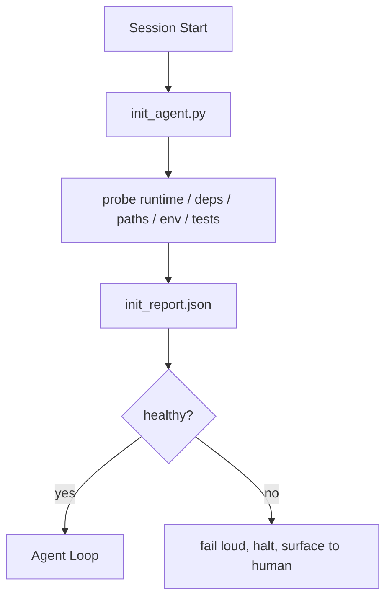

# 智能体初始化脚本

> 每次冷启动的会话都要交税。智能体读取相同的文件、重试相同的探测、重新发现相同的路径。初始化脚本交一次税并将答案写入状态。

**类型：** 构建
**语言：** Python（标准库）
**前置要求：** 第 14 阶段 · 32（最小工作台），第 14 阶段 · 34（仓库记忆）
**所需时间：** 约45分钟

## 学习目标

- 识别智能体不应该每次会话都重做的工作。
- 构建一个确定性初始化脚本，探测运行时、依赖和仓库健康状况。
- 持久化探测结果，使智能体读取它而非重新运行检查。
- 在初始化失败时大声、快速、单一位置地失败。

## 问题所在

打开一次会话。智能体猜测 Python 版本。猜测测试命令。列出仓库根目录五次来找入口点。尝试导入一个未安装的包。询问用户配置文件在哪里。在它做出真正的编辑之前，一万个 token 已经花在了本该是一个脚本就能完成的设置工作上。

修复是一个初始化脚本，在智能体做任何事之前运行，并写入一个 `init_report.json` 供智能体在启动时读取。

## 概念说明



### 初始化脚本探测什么

| 探测 | 为什么重要 |
|------|-----------|
| 运行时版本 | 错误的 Python 或 Node 版本意味着静默的版本错误 bug |
| 依赖可用性 | 缺失的包后续成本是现在捕获的十倍 |
| 测试命令 | 智能体必须知道如何验证；如果命令缺失，工作台就坏了 |
| 仓库路径 | 硬编码路径会漂移；解析一次并固定 |
| 环境变量 | 缺失的 `OPENAI_API_KEY` 是失败面，不是运行时谜团 |
| 状态 + 板子新鲜度 | 崩溃会话的过时状态是隐患 |
| 最近已知正常提交 | 会话结束时交接差异的锚点 |

### 大声失败、快速失败、单一位置失败

探测失败意味着停止并向人类暴露。没有"智能体会搞定"。初始化的全部意义就是在工作台损坏时拒绝启动。

### 幂等

连续运行两次。第二次应该是无操作，除了新的时间戳。幂等性是让你将脚本接入 CI、钩子或任务前斜杠命令的关键。

### 初始化 vs 启动规则

规则（第 14 阶段 · 33）描述行动前什么必须为真。初始化是建立那些规则可以被检查的脚本。没有初始化的规则变成"要小心"。没有规则的初始化变成精美的失败。

## 开始构建

`code/main.py` 实现 `init_agent.py`：

- 五个探测：Python 版本、通过 `importlib.util.find_spec` 列出的依赖、测试命令可解析性、必需环境变量、状态文件新鲜度。
- 每个探测返回 `(name, status, detail)`。
- 脚本写入 `init_report.json`，包含完整探测集，如果任何 block 严重性探测失败则非零退出。

运行方式：

```
python3 code/main.py
```

脚本打印探测表格、写入 `init_report.json`，在正常路径上零退出或在失败探测列表时非零退出。

## 实际生产模式

三种模式将有用的初始化脚本与仪式区分开来。

**最近已知正常提交锚定。** 探测当前提交与上次成功合并时写入的 `LKG` 文件。如果差异超过预算（默认 50 个文件），拒绝启动并要求人类批准新基线。这是 Cloudflare 的 AI Code Review 用于界定审查智能体的方式：每次审查会话锚定在同一最近已知正常上，永不跨会话累积漂移。

**带 TTL 的锁文件。** 首次成功探测通过后写入 `prereqs.lock`。后续运行信任锁 N 小时（默认 24 小时）并跳过昂贵的探测。初始化脚本先读取锁；如果新鲜且依赖清单哈希匹配，则短路。这是 Docker 用于层缓存的相同模式：幂等探测 + 内容哈希 = 跳过。

**热路径中没有网络、没有 LLM、没有意外。** 初始化探测是确定性的管道。调用 LLM 分类失败或访问外部服务检查许可证的探测不是探测；它是工作流。如果探测在干运行中超过三秒，将其视为工作台异味，要么移出初始化要么缓存其结果。

## 使用建议

生产中：

- **Claude Code 钩子。** `pre-task` 钩子调用初始化脚本，如果失败则拒绝启动智能体。
- **GitHub Actions。** `setup-agent` 任务运行初始化脚本；智能体任务依赖于它。
- **Docker 入口点。** 智能体容器在 exec 智能体运行时之前运行初始化脚本；失败时日志暴露。

初始化脚本可移植，因为它不调用特定框架。Bash、Make 或任务文件都可以包装它。

## 交付产物

`outputs/skill-init-script.md` 访谈项目，将其设置工作分类为探测，并输出项目特定的 `init_agent.py` 加在任何智能体步骤前运行的 CI 工作流。

## 练习

1. 添加一个探测，将当前提交与最近已知正常提交对比，如果超过 50 个文件变更则拒绝启动。
2. 让脚本写入 `prereqs.lock` 文件，如果锁超过七天则拒绝启动。
3. 添加 `--fix` 标志，自动安装缺失的开发依赖但未经批准不修改运行时依赖。
4. 将探测从硬编码函数移到 YAML 注册表。论证权衡。
5. 为每个探测添加计时预算。运行超过三秒的探测是工作台异味。

## 关键术语

| 术语 | 常见说法 | 实际含义 |
|------|---------|---------|
| 探测 | "检查" | 返回 `(name, status, detail)` 的确定性函数 |
| 初始化报告 | "设置输出" | 写在状态旁边的 JSON，包含探测结果 |
| 幂等 | "可安全重跑" | 连续两次运行产出除时间戳外相同的报告 |
| 大声失败 | "不要吞掉" | 停止并向人类暴露；无静默回退 |
| 设置税 | "引导成本" | 智能体每次会话花在重新发现显而易见事物上的 token |

## 延伸阅读

- [Anthropic，Effective harnesses for long-running agents](https://www.anthropic.com/engineering/effective-harnesses-for-long-running-agents)
- [GitHub Actions，composite actions for setup](https://docs.github.com/en/actions/sharing-automations/creating-actions/creating-a-composite-action)
- [microservices.io，GenAI dev platform: guardrails](https://microservices.io/post/architecture/2026/03/09/genai-development-platform-part-1-development-guardrails.html) — 预提交 + CI 检查作为初始化
- [Augment Code，How to Build Your AGENTS.md（2026）](https://www.augmentcode.com/guides/how-to-build-agents-md) — 初始化预期
- [Codex Blog，Codex CLI Context Compaction](https://codex.danielvaughan.com/2026/03/31/codex-cli-context-compaction-architecture/) — 会话启动作为压缩感知初始化
- 第 14 阶段 · 33 — 本脚本启用的规则集
- 第 14 阶段 · 34 — 本脚本初始化的状态文件
- 第 14 阶段 · 38 — 初始化脚本供给的验证门
- 第 14 阶段 · 40 — 消费初始化报告最近已知正常的交接
