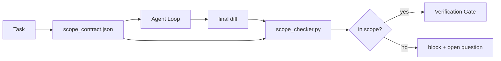

# 范围契约与任务边界

> 模型不知道工作在哪里结束。范围契约是每个任务的文件，说明工作从哪里开始、到哪里结束、以及如果溢出如何回滚。契约将"保持在范围内"从愿望变为检查。

**类型：** 构建
**语言：** Python（标准库）
**前置要求：** 第 14 阶段 · 32（最小工作台），第 14 阶段 · 33（规则即约束）
**所需时间：** 约50分钟

## 学习目标

- 编写一个范围契约，智能体在任务开始时读取，验证器在任务结束时读取。
- 指定允许文件、禁止文件、验收标准、回滚计划和审批边界。
- 实现一个范围检查器，将差异与契约对比并标记违规。
- 使范围蔓延可见、可自动检测、可审查。

## 问题所在

智能体会蔓延。任务是"修复登录 bug"。差异触及了登录路由、邮件助手、数据库驱动、README 和发布脚本。每个修改在当下都有合理理由。合在一起，它们是一个与被审查的变更不同的变更。

范围蔓延是智能体工作中最被低估的失败模式，因为智能体真诚地叙述每一步。修复不是更严格的提示词。修复是磁盘上的契约说明承诺了什么，以及一个将结果与承诺对比的检查。

## 概念说明



### 范围契约包含什么

| 字段 | 用途 |
|------|------|
| `task_id` | 关联到板上的任务 |
| `goal` | 审查者可以验证的一句话 |
| `allowed_files` | 智能体可以写入的 glob |
| `forbidden_files` | 智能体即使意外也不能触碰的 glob |
| `acceptance_criteria` | 证明完成的测试命令或断言行 |
| `rollback_plan` | 操作员在需要停止时可以执行的一段话 |
| `approvals_required` | 范围外需要明确人工签字的操作 |

没有 `forbidden_files` 的契约是不完整的。否定空间是契约的一半。

### Glob，而非原始路径

真实仓库会移动文件。将契约固定到 glob（`app/**/*.py`、`tests/test_signup*.py`），使会话间的重构不会使契约失效。

### 回滚是范围的一部分

列出如何回滚迫使契约作者思考什么可能出问题。无法回滚的契约是不应被批准的契约。

### 范围检查是差异检查

智能体写出差异。检查器读取差异、允许的 glob、禁止的 glob 以及已运行的验收命令列表。每个违规是验证门可以拒绝的带标签发现。

### 两层范围：功能列表与任务契约

范围契约约束一个任务。它不约束项目。智能体可以完美地停留在登录修复的契约内，然后在下一轮决定项目还需要设置页面、暗色模式切换和路由器重写。契约从未被问及哪些工作对项目在范围内，只被问及哪些文件对任务在范围内。

第二层需要自己的原语：一个智能体在会话开始时读取的 `feature_list.json`。它是项目待办列表的机器可读、有序文件。智能体恰好选择一个 `status` 为 `todo` 的功能，将其 `id` 写入活跃范围契约，并被禁止在同一会话中启动第二个功能。"一次一个功能"不再是智能体可以合理化过去的提示词行，而是它从磁盘读取的值和门控强制的检查。

```json
{
  "project": "knowledge-base",
  "active": "import-pdf",
  "features": [
    { "id": "import-pdf",   "status": "in_progress", "goal": "import a PDF into the library",        "done_when": "pytest tests/test_import.py && a sample PDF appears in the library view" },
    { "id": "full-text-search", "status": "todo",     "goal": "search document text and rank hits",   "done_when": "query returns ranked results with snippets" },
    { "id": "cite-answers", "status": "todo",         "goal": "answers carry source citations",        "done_when": "every answer renders at least one clickable citation" }
  ]
}
```

| 字段 | 用途 |
|------|------|
| `active` | 当前会话可以触碰的唯一功能；为空表示选择一个并设置 |
| `features[].id` | 范围契约的 `task_id` 指向的稳定 slug |
| `features[].status` | `todo`、`in_progress`、`done`、`blocked`；同一时间只有一个 `in_progress` |
| `features[].goal` | 审查者可以验证的一句话 |
| `features[].done_when` | 将 `in_progress` 翻转为 `done` 的验收行 |

两条规则使列表承重而非装饰。首先，不变量"最多一个 `in_progress`"本身是启动检查（第 14 阶段 · 33）：如果列表显示两个，会话拒绝启动直到人类解决。其次，功能列表是文件而非聊天消息，因为聊天滚出上下文而文件跨会话和跨智能体持久。交接（第 14 阶段 · 40）将完成功能的状态写回 `done`，使下次会话打开到准确的板子而非重新推导剩余内容。

契约和列表通过最小权限组合，与下文描述的合并相同：任务契约的 `allowed_files` 必须位于活跃功能触及的范围内，绝不在其外。

## 开始构建

`code/main.py` 实现：

- `scope_contract.json` 模式（JSON Schema 子集，glob 数组）。
- 差异解析器，将修改文件列表加运行命令列表转化为 `RunSummary`。
- `scope_check`，返回 `(violations, in_scope, off_scope)` 与契约对比。
- 两次演示运行：一次在范围内，一次蔓延。检查器标记蔓延的精确文件和原因。

运行方式：

```
python3 code/main.py
```

输出：契约、两次运行、每运行的裁定，以及保存的 `scope_report.json`。

## 实际生产模式

实践者运行"specsmaxxing"（调用智能体前在 YAML 中写范围契约）报告，兔子洞率在三周内从 52% 降到 21%，未更换智能体。契约完成了工作，不是模型。三种模式使收益持久。

**违规预算，而非二元失败。** `agent-guardrails`（Claude Code、Cursor、Windsurf、Codex 通过 MCP 使用的开源合并门）为每个任务提供 `violationBudget`：预算内的小范围滑动作为警告浮现；仅当预算超支时合并门才拒绝。与 `violationSeverity: "error" | "warning"` 配对。预算是能发布的门和被团队禁用的门之间的区别。

**按路径家族的严重性不对称。** 对 `docs/**` 的范围外写入通常是 `warn`；对 `scripts/**`、`migrations/**`、`config/prod/**` 的范围外写入始终是 `block`。这种不对称必须存在于契约中而非运行时中，因为它是项目特定的且每任务变化。

**时间和网络预算与文件预算并列。** `time_budget_minutes` 字段约束墙钟时间；运行时在超时后拒绝继续，除非重新审批。`network_egress` 主机名允许列表防止智能体悄悄访问不属于任务的外部 API。这些也是范围维度；文件 glob 是必要的，但不充分。

**多契约合并语义（最小权限）。** 当两个范围契约适用时（例如项目级契约加任务特定契约），合并规则是：**交集** `allowed_files`（两个契约都必须允许该路径）、**并集** `forbidden_files`（任一可以禁止）、`time_budget_minutes` 取最严格的（min）、`approvals_required` 累加。`network_egress` 中 `None` 表示不强制、`[]` 表示全部拒绝、`[...]` 作为允许列表；合并时，`None` 延迟到另一方，两个列表取交集，全部拒绝保持全部拒绝。在契约模式中声明此规则，使合并可机械执行且可审查。

## 使用建议

生产模式：

- **Claude Code 斜杠命令。** `/scope` 命令写入契约并固定为会话上下文。子智能体在行动前读取契约。
- **GitHub PR。** 将契约作为 JSON 文件推送到 PR 正文中或作为签入的构件。CI 针对合并差异运行范围检查器。
- **LangGraph 中断。** 范围违规触发中断；处理器询问人类契约是否需要扩大还是智能体需要退让。

契约随任务迁移。任务关闭时，契约归档在 `outputs/scope/closed/` 下。

## 交付产物

`outputs/skill-scope-contract.md` 为任务描述生成范围契约和一个在 CI 中对每个智能体差异运行的 glob 感知检查器。

## 练习

1. 添加 `network_egress` 字段列出允许的外部主机。拒绝触及其他主机的运行。
2. 扩展检查器使 `docs/**` 软失败，`scripts/**` 硬失败。论证不对称性。
3. 使契约从 `goal` 字段使用静态规则集（无 LLM）推导 `allowed_files`。第一个边缘案例会出什么问题？
4. 添加 `time_budget_minutes`，墙钟超时后拒绝继续。
5. 对同一差异运行两个契约。两者都适用时正确的合并语义是什么？

## 关键术语

| 术语 | 常见说法 | 实际含义 |
|------|---------|---------|
| 范围契约 | "任务简报" | 每任务 JSON，列出允许/禁止文件、验收、回滚 |
| 范围蔓延 | "它也触及了..." | 同一任务中契约外文件被修改 |
| 回滚计划 | "我们可以回退" | 操作员停止运行的一段话手册 |
| 审批边界 | "需要签字" | 契约中列出需要明确人工审批的操作 |
| 差异检查 | "路径审计" | 将修改文件与契约 glob 对比 |

## 延伸阅读

- [LangGraph 人在回路中断](https://langchain-ai.github.io/langgraph/concepts/human_in_the_loop/)
- [OpenAI Agents SDK 工具审批策略](https://platform.openai.com/docs/guides/agents-sdk)
- [logi-cmd/agent-guardrails — 合并门和范围验证](https://github.com/logi-cmd/agent-guardrails) — 违规预算、严重性层级
- [Dev|Journal，Preventing AI Agent Configuration Drift with Agent Contract Testing](https://earezki.com/ai-news/2026-05-05-i-built-a-tiny-ci-tool-to-keep-ai-agent-configs-from-drifting-in-my-repo/) — 无外部依赖的 `--strict` 模式
- [Agentic Coding Is Not a Trap（生产日志）](https://dev.to/jtorchia/agentic-coding-is-not-a-trap-i-answered-the-viral-hn-post-with-my-own-production-logs-33d9) — specsmaxxing 数据：52% → 21%
- [OpenCode 权限 glob](https://opencode.ai/docs/agents/) — 细粒度的每权限范围
- [Knostic，AI Coding Agent Security: Threat Models and Protection Strategies](https://www.knostic.ai/blog/ai-coding-agent-security) — 范围作为最小权限的一部分
- [Augment Code，AI Spec Template](https://www.augmentcode.com/guides/ai-spec-template) — 三层边界系统（必须/询问/绝不）
- 第 14 阶段 · 27 — 与范围锁配对的提示词注入防御
- 第 14 阶段 · 33 — 本契约按任务特化的规则集
- 第 14 阶段 · 38 — 检查器报告的验证门
