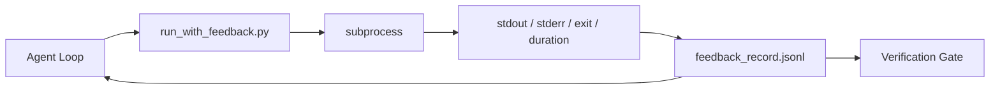

# 运行时反馈循环

> 看不到真实命令输出的智能体在猜测。反馈运行器将 stdout、stderr、退出码和计时捕获为结构化记录，供下一轮读取。然后智能体对事实做出反应，而非对自己预测的事实做出反应。

**类型：** 构建
**语言：** Python（标准库）
**前置要求：** 第 14 阶段 · 32（最小工作台），第 14 阶段 · 35（初始化脚本）
**所需时间：** 约50分钟

## 学习目标

- 区分运行时反馈与可观测性遥测。
- 构建一个包装 shell 命令并持久化结构化记录的反馈运行器。
- 确定性截断大输出，使循环保持在 token 预算内。
- 当反馈缺失时拒绝推进循环。

## 问题所在

智能体说"现在运行测试"。下一条消息说"所有测试通过"。现实是没有测试运行。智能体想象了输出，或者它运行了命令但从未读取结果，或者它读取了结果但静默截断了失败行。

反馈运行器消除这个差距。每条命令经过运行器。每条记录携带命令、捕获的 stdout 和 stderr、退出码、墙钟时长和一行智能体备注。智能体在下一轮读取记录。验证门在任务结束时读取记录。

## 概念说明



### 反馈记录包含什么

| 字段 | 为什么重要 |
|------|-----------|
| `command` | 精确的 argv，无 shell 展开意外 |
| `stdout_tail` | 最后 N 行，确定性截断 |
| `stderr_tail` | 最后 N 行，与 stdout 分离 |
| `exit_code` | 明确的成功信号 |
| `duration_ms` | 暴露慢探测和失控进程 |
| `started_at` | 用于重放的时间戳 |
| `agent_note` | 智能体写的一行关于预期内容的备注 |

### 截断是确定性的

50MB 日志会摧毁循环。运行器用 `...truncated N lines...` 标记截断头和尾，确定性使相同输出始终产出相同记录。不采样；智能体需要看到的部分（最终错误、最终摘要）位于尾部。

### 反馈 vs 遥测

遥测（第 14 阶段 · 23，OTel GenAI 约定）供人类操作员跨时间审查运行。反馈供本次运行的下一轮使用。它们共享字段但存在于不同文件中，有不同的保留策略。

### 没有反馈拒绝推进

如果运行器在捕获退出前出错，记录携带 `exit_code: null` 和 `error: <reason>`。智能体循环必须拒绝在 `null` 退出上声称成功。没有退出，没有进展。

## 开始构建

`code/main.py` 实现：

- `run_with_feedback(command, agent_note)`，包装 `subprocess.run`，捕获 stdout/stderr/exit/duration，确定性截断，追加到 `feedback_record.jsonl`。
- 将 JSONL 流式加载为 Python 列表的小型加载器。
- 演示运行三个命令（成功、失败、慢速）并打印每个命令的最后一条记录。

运行方式：

```
python3 code/main.py
```

输出：三条反馈记录追加到 `feedback_record.jsonl`，每条命令的最后一条内联打印。跨重运行追踪文件以查看循环累积。

## 实际生产模式

三种模式将运行器加固到可发布程度。

**写入时脱敏，而非读取时。** 任何触及 stdout 或 stderr 的记录都可能泄露密钥。运行器在 JSONL 追加前提供脱敏步骤：剥离匹配 `^Bearer `、`password=`、`api[_-]?key=`、`AKIA[0-9A-Z]{16}`（AWS）、`xox[baprs]-`（Slack）的行。读取时脱敏是隐患；磁盘上的文件是攻击者能触及的。按季度根据生产运行时观察到的密钥格式审计脱敏模式。

**轮转策略，而非单一文件。** 将 `feedback_record.jsonl` 限制在每文件 1MB；溢出时轮转到 `.1`、`.2`，丢弃 `.5`。智能体的循环只读取当前文件，因此运行时成本有界。CI 构件存储获得完整的轮转集。没有轮转，文件成为每次加载调用的瓶颈。

**父命令 ID 用于重试链。** 每条记录获得 `command_id`；重试携带 `parent_command_id` 指向上一次尝试。审查者的"失败尝试"列表（第 14 阶段 · 40）和验证门的审计都沿链追踪。没有这个链接，重试看起来像独立成功，审计隐藏了失败历史。

## 使用建议

生产模式：

- **Claude Code Bash 工具。** 该工具已经捕获 stdout、stderr、退出码和时长。本课的运行器是任何智能体产品的框架无关等效。
- **LangGraph 节点。** 将任何 shell 节点包装在运行器中，使记录在图状态之外持久化。
- **CI 日志。** 将 JSONL 导入 CI 构件存储；审查者可以重放任何命令而无需重新运行会话。

运行器是一个薄包装，能存活每次框架迁移，因为它拥有记录的形态。

## 交付产物

`outputs/skill-feedback-runner.md` 生成项目特定的 `run_with_feedback.py`，带正确的截断预算、接入工作台的 JSONL 写入器，以及智能体每轮读取的加载器。

## 练习

1. 为每条记录添加 `cwd` 字段，使同一命令从不同目录运行可区分。
2. 添加 `redaction` 步骤，剥离匹配 `^Bearer ` 或 `password=` 的行。在固定记录上测试。
3. 通过轮转到 `.1`、`.2` 文件将 `feedback_record.jsonl` 总大小限制在 1MB。论证轮转策略。
4. 添加 `parent_command_id` 使重试链可见：哪个命令产出了下一个命令消费的输入。
5. 将 JSONL 导入一个小型 TUI，高亮最新非零退出。TUI 在审查中有用必须展示的八个关键特性。

## 关键术语

| 术语 | 常见说法 | 实际含义 |
|------|---------|---------|
| 反馈记录 | "运行日志" | 带命令、输出、退出码、时长的结构化 JSONL 条目 |
| 尾部截断 | "裁剪日志" | 确定性头+尾捕获，使记录适合 token 预算 |
| null 拒绝 | "缺失数据阻断" | 当 `exit_code` 为 null 时循环不得推进 |
| 智能体备注 | "预期标签" | 智能体在读取结果前写的一行预测 |
| 遥测分离 | "两个日志文件" | 反馈供下一轮使用，遥测供操作员使用 |

## 延伸阅读

- [OpenTelemetry GenAI 语义约定](https://opentelemetry.io/docs/specs/semconv/gen-ai/)
- [Anthropic，Effective harnesses for long-running agents](https://www.anthropic.com/engineering/effective-harnesses-for-long-running-agents)
- [Guardrails AI x MLflow — 确定性安全、PII、质量验证器](https://guardrailsai.com/blog/guardrails-mlflow) — 脱敏模式作为回归测试
- [Aport.io，Best AI Agent Guardrails 2026: Pre-Action Authorization Compared](https://aport.io/blog/best-ai-agent-guardrails-2026-pre-action-authorization-compared/) — 工具前/后捕获
- [Andrii Furmanets，AI Agents in 2026: Practical Architecture for Tools, Memory, Evals, Guardrails](https://andriifurmanets.com/blogs/ai-agents-2026-practical-architecture-tools-memory-evals-guardrails) — 可观测性界面
- 第 14 阶段 · 23 — 遥测侧的 OTel GenAI 约定
- 第 14 阶段 · 24 — 智能体可观测性平台（Langfuse、Phoenix、Opik）
- 第 14 阶段 · 33 — 要求反馈才能声明完成的规则
- 第 14 阶段 · 38 — 读取 JSONL 的验证门
