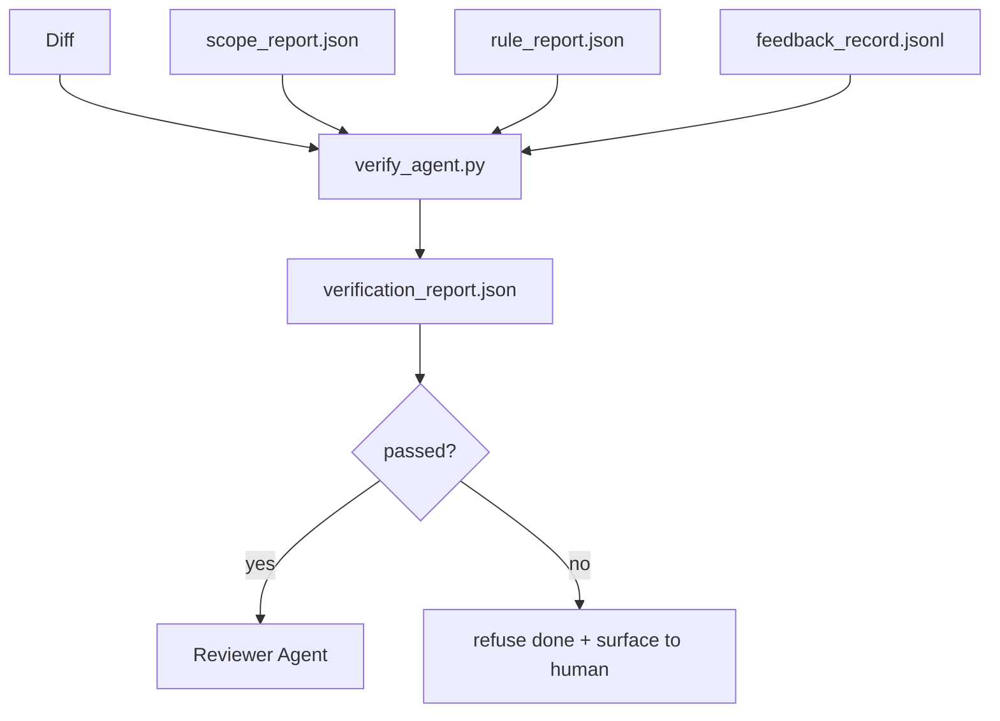

# 验证门

> 智能体不能自己把作业标记为完成。验证门读取范围契约、反馈日志、规则报告和差异，回答一个问题：这个任务真的完成了吗？如果门说不，任务就没有完成，不管聊天怎么说。

**类型：** 构建
**语言：** Python（标准库）
**前置要求：** 第 14 阶段 · 33（规则），第 14 阶段 · 36（范围），第 14 阶段 · 37（反馈）
**所需时间：** 约55分钟

## 学习目标

- 将验证门定义为对工作台构件的确定性函数。
- 将规则报告、范围报告、反馈记录和差异组合为单一裁定。
- 发出 `verification_report.json`，审查者智能体和 CI 都能读取。
- 在任何 block 严重性失败时无条件拒绝推进任务。

## 问题所在

智能体太容易宣布成功。三种失败形态占主导：

- "看起来不错。"模型读了自己的差异并判定它是正确的。
- "测试通过。"说得很有信心。没有测试实际运行的记录。
- "验收达成。"验收标准被宽泛解释为"任何看起来像完成的东西"。

工作台的修复是一个单一验证门，读取智能体已产出的构件并做出判断。门是确定性的。门在版本控制中。门接入 CI。智能体无法贿赂它。

## 概念说明



### 门检查什么

| 检查 | 来源构件 | 严重性 |
|------|---------|--------|
| 所有验收命令已运行 | `feedback_record.jsonl` | block |
| 所有验收命令退出码为零 | `feedback_record.jsonl` | block |
| 范围检查无禁止写入 | `scope_report.json` | block |
| 范围检查无范围外写入 | `scope_report.json` | block 或 warn |
| 所有 block 严重性规则通过 | `rule_report.json` | block |
| 反馈中无 `null` 退出码 | `feedback_record.jsonl` | block |
| 修改文件匹配 `scope.allowed_files` | 两者 | warn |

`warn` 发现标注裁定；`block` 发现阻止 `passed: true`。

### 确定性，非概率性

门必须对相同构件集每次产出相同裁定。没有 LLM 评委。LLM 评委属于审查者侧（第 14 阶段 · 39），目标是定性评估而非状态判定。

### 一份报告，一条路径

门每次任务关闭发出一份 `verification_report.json`，写入 `outputs/verification/<task_id>.json`。CI 消费同一路径。多个不同路径的门会分叉真相来源。

### 无条件拒绝

Block 严重性发现不能被智能体覆盖。它们只能被人类覆盖，带有记录的 `override_reason` 和 `overridden_by` 用户 ID。覆盖是有签名的变更，不是智能体的决定。

## 开始构建

`code/main.py` 实现：

- 每个输入构件的加载器，全部在本地存根以使课程自包含。
- `verify(task_id, artifacts) -> VerdictReport` 纯函数。
- 打印器展示每检查结果和最终通过/失败。
- 三次任务场景演示：干净通过、范围蔓延、缺失验收。

运行方式：

```
python3 code/main.py
```

输出：三份裁定报告，每份保存在脚本旁边。

## 实际生产模式

四种模式将门从"另一个 lint 任务"提升为"决定性边界"。

**纵深防御，而非单一门。** 预提交钩子 → CI 状态检查 → 工具前授权钩子 → 合并前门。每层是确定性的，使一层的失败被下一层捕获。microservices.io 的 2026 年 3 月手册明确：预提交钩子不可绕过，因为与模型侧技能不同，它不依赖智能体遵循指令。验证门位于 CI/合并前层。

**确定性检查为主，模型评委仅用于细微差别。** Anthropic 的 2026 年混合规范配对：可验证奖励（单元测试、模式检查、退出码）回答"代码是否解决了问题？"— LLM 评分标准回答"代码是否可读、安全、符合风格？"门运行第一类；审查者（第 14 阶段 · 39）运行第二类。混合它们会崩塌信号。

**签名覆盖日志，而非 Slack 讨论。** 每次覆盖在 `outputs/verification/overrides.jsonl` 中发出一行：时间戳、发现代码、原因、签名用户、当前 HEAD 提交。运行时拒绝缺少签名的任何覆盖；审计线索是 git 跟踪的。这是覆盖策略和覆盖表演之间的分界线。

**覆盖率下限作为一等检查。** `coverage_report.json` 供给 `coverage_floor`（默认 80%）检查。如果测量覆盖率低于下限或低于上次合并的下限超过 1 个百分点，门失败。没有这个检查，智能体会悄悄删除失败的测试而验证报告保持绿色。

**`--strict` 模式将 warn 提升为 block。** 对于发布分支、发布阻断 PR 或事故后分类，`--strict` 使每个警告成为硬失败。该标志按分支选择性启用；不是全局默认，因为严格一切会腐蚀日常流程。

## 使用建议

生产模式：

- **CI 步骤。** `verify_agent` 任务对智能体的最终构件运行门。合并保护在没有 `passed: true` 时拒绝。
- **交接前钩子。** 智能体运行时在生成交接文档前调用门。没有绿色裁定，没有交接。
- **手动分类。** 当智能体声称成功而人类怀疑时，操作员读取报告。

门是工作台流程中的决定性边界。其他所有界面都在它上游。

## 交付产物

`outputs/skill-verification-gate.md` 将门接入特定项目：哪些验收命令供给它、哪些规则是 block 严重性、哪些范围外写入被容忍、覆盖审计日志如何存储。

## 练习

1. 添加 `coverage_floor` 检查：测试命令必须产出至少 80% 的覆盖率报告。决定哪个构件承载下限。
2. 支持 `--strict` 模式，将每个 `warn` 提升为 `block`。记录 strict 模式是正确默认的场景。
3. 使门除 JSON 外还产出 Markdown 摘要。论证哪些字段属于摘要。
4. 添加 `time_since_last_human_touch` 检查：在人类击键 60 秒内编辑的任何文件免于范围外标记。
5. 在你产品的真实智能体差异上运行门。多少发现是真实的，多少是噪声？门需要在哪里增强？

## 关键术语

| 术语 | 常见说法 | 实际含义 |
|------|---------|---------|
| 验证门 | "阻止事情的检查" | 对工作台构件产出通过/失败裁定的确定性函数 |
| Block 严重性 | "硬失败" | 阻止 `passed: true` 并需要签名覆盖的发现 |
| 覆盖日志 | "为什么我们放行了" | 带原因和用户 ID 的签名条目，由审查审计 |
| 验收命令 | "证明" | 零退出码意味着 `done` 的 shell 命令 |
| 单一报告路径 | "真相来源" | `outputs/verification/<task_id>.json`，CI 和人类都消费 |

## 延伸阅读

- [Anthropic，Harness design for long-running application development](https://www.anthropic.com/engineering/harness-design-long-running-apps)
- [OpenAI Agents SDK 护栏](https://platform.openai.com/docs/guides/agents-sdk/guardrails)
- [microservices.io，GenAI dev platform: guardrails](https://microservices.io/post/architecture/2026/03/09/genai-development-platform-part-1-development-guardrails.html) — 预提交与 CI 之间的纵深防御
- [ICMD，The 2026 Playbook for Agentic AI Ops](https://icmd.app/article/the-2026-playbook-for-agentic-ai-ops-guardrails-costs-and-reliability-at-scale-1776661990431) — 审批门阶梯（草稿 → 审批 → 阈值下自动）
- [Type-Checked Compliance: Deterministic Guardrails（arXiv 2604.01483）](https://arxiv.org/pdf/2604.01483) — Lean 4 作为确定性门控的上限
- [logi-cmd/agent-guardrails — 合并门规范](https://github.com/logi-cmd/agent-guardrails) — 范围 + 变异测试门
- [Guardrails AI x MLflow](https://guardrailsai.com/blog/guardrails-mlflow) — 确定性验证器作为 CI 评分器
- [Akira，Real-Time Guardrails for Agentic Systems](https://www.akira.ai/blog/real-time-guardrails-agentic-systems) — 工具前/后门
- 第 14 阶段 · 27 — 提示词注入防御（门的对抗配对）
- 第 14 阶段 · 36 — 本门强制的范围契约
- 第 14 阶段 · 37 — 本门评分的反馈日志
- 第 14 阶段 · 39 — 门交给的审查者智能体
