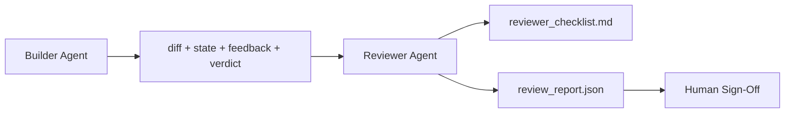

# 审查者智能体：分离构建者与批改者

> 编写代码的智能体不能给它打分。审查者是一个具有不同系统提示词、不同目标、对构建者产出的所有内容只读访问的第二循环。构建者与审查者之间的差距是大多数可靠性的所在。

**类型：** 构建
**语言：** Python（标准库）
**前置要求：** 第 14 阶段 · 38（验证门）
**所需时间：** 约55分钟

## 学习目标

- 说明为什么同一个智能体不能可靠地审查自己的工作。
- 构建一个消费构建者构件并发出结构化审查报告的审查者智能体循环。
- 编写一个评分特定维度而非感觉的审查者评分标准。
- 将审查者接入工作台，使人工审查步骤从真实构件开始。

## 问题所在

你要求智能体修复一个 bug。它编辑了四个文件，运行了测试，报告完成。验证门（第 14 阶段 · 38）确认验收已运行且范围保持。门说 `passed: true`。你合并了。两天后你发现修复解决了 bug 错误的那一半。

验收是必要的，但不是充分的。审查者问验收无法问的问题：这是否解决了正确的问题？它是否在未标记的情况下扩大了范围？它是否记录了本应被质疑的假设？它是否将工作台留在了下次会话可以接续的状态？

## 概念说明



### 审查者评分标准

五个维度，每个从 0 到 2 打分。

| 维度 | 问题 |
|------|------|
| 问题匹配 | 变更是否解决了所述任务，而非附近任务？ |
| 范围纪律 | 编辑是否局限在契约内，还是契约被有意扩大？ |
| 假设 | 所有隐藏假设是否写在可审查的地方？ |
| 验证质量 | 验收命令是否真的证明了目标，还是证明了更弱的版本？ |
| 交接就绪 | 下次会话能否从当前状态干净接续？ |

总分 10 分。低于 7 分是软失败；低于 5 分是硬失败。

### 审查者是独立角色，不是独立模型

你可以用与构建者相同的模型运行审查者。规范是角色分离：不同系统提示词、不同输入、对差异无写入权限。姿态的变化就是信号的变化。

### 审查者不能编辑差异

审查者读取差异、状态、反馈、裁定。它写报告。它不修补差异。如果报告说"修复这个"，下一个构建者轮次做修复；审查者回到审查。混合角色消灭了差距。

### 审查者评分标准 vs 验证门

门（第 14 阶段 · 38）检查确定性事实：验收是否运行、规则是否通过、范围是否保持。审查者做定性判断：这是否是正确的工作、是否有记录、交接是否可用。两者都是必需的。

## 开始构建

`code/main.py` 实现：

- `ReviewerInputs` 数据类，捆绑审查者读取的构件。
- 评分标准评分器，每个维度一个函数。每个函数是确定性的且为课程存根级；真实实现会调用 LLM。
- `review_report.json` 写入器，包含五个分数、总分和裁定（`pass`、`soft_fail`、`hard_fail`）。
- 两个演示案例：一个干净变更和一个"测试正确，问题错误"的变更。

运行方式：

```
python3 code/main.py
```

输出：两份写入磁盘的审查报告和控制台维度分数表。

## 实际生产模式

数据说话：Cloudflare 的 2026 年 4 月 AI Code Review 系统在 30 天内于 5,169 个仓库的 48,095 个合并请求上运行了 131,246 次审查。中位审查在 3 分 39 秒内完成。多达七个专家审查者（安全、性能、代码质量、文档、发布管理、合规、Engineering Codex）在审查协调器下并行运行，协调器负责去重发现和判断严重性。顶级模型专用于协调器；专家在更便宜的层级运行。

四种模式使这在规模上有效。

**专家池，而非一个大审查者。** 带 5 维度评分标准的一个审查者适用于单人仓库。一旦代码库有安全关键、性能关键和文档界面，拆分为带更小提示词的专家。协调器做去重；专家从不运行完整评分标准。模型层级分离自然产出：便宜的专家，昂贵的协调器。

**偏见缓解作为设计要求，而非优化。** LLM 评委展示四种可靠偏见（Adnan Masood，2026 年 4 月）：位置偏见（GPT-4 在 (A,B) vs (B,A) 排序上约 40% 不一致）、冗长偏见（对更长输出约 15% 分数膨胀）、自我偏好（评委偏好来自同模型家族的输出）、权威（评委对引用已知作者过度评分）。缓解措施：评估两种排序且只计一致胜出；使用明确奖励简洁的 1-4 分制；跨模型家族轮换评委；评分前去除作者名。

**校准集，而非感觉。** 10-20 个任务的历史集，带已知正确裁定。每次提示词变更时对它运行审查者。如果与历史记录的一致性低于 80%，评分标准需要在审查者发布前修订。这是每个团队最终重新发现的；不如一开始就做好。

**与门的混合规范。** 验证门（第 14 阶段 · 38）处理确定性检查（验收是否运行、测试是否通过、范围是否保持）。审查者处理语义检查（这是否是正确的工作、假设是否有记录、交接是否可用）。Anthropic 的 2026 年指导明确此分工：不要让审查者重做门已证明的事。

## 使用建议

生产模式：

- **Claude Code 子智能体。** 审查者子智能体在构建者关闭任务后运行。它在 PR 上发布带评分标准分数的评论。
- **OpenAI Agents SDK 交接。** 构建者在任务完成时交给审查者。审查者可以带着发现列表交回或交给人类。
- **双模型配对。** 构建者在更快更便宜的模型上运行。审查者在更强的模型上以更小上下文运行，专注于判断。

审查者是工作台在人类无法自己做每份审查时长出的第二双眼睛。

## 交付产物

`outputs/skill-reviewer-agent.md` 生成项目特定的审查者评分标准、接入构建者构件的审查者智能体存根，以及与验证门的集成，使人工审查从书面报告而非空白页开始。

## 练习

1. 添加一个你的产品领域特定的第六维度。论证为什么它不能被现有五个吸收。
2. 用两个不同系统提示词（简洁、冗长）运行审查者。哪个产出人类更可能阅读的报告？
3. 为每个维度添加 `confidence` 字段。当最低维度置信度低于 0.6 时拒绝发布报告。
4. 构建校准集：10 个带已知正确裁定的历史任务关闭。对它们运行审查者。它在哪里与历史记录不一致？
5. 添加"请求更多证据"功能：审查者可以在评分前要求构建者运行特定测试。正确的退避是什么以防止循环？

## 关键术语

| 术语 | 常见说法 | 实际含义 |
|------|---------|---------|
| 审查者评分标准 | "清单" | 五个维度 0-2 分制，每个维度带一个书面问题 |
| 软失败 | "需要修订" | 总分低于 7；构建者获得需要处理的发现 |
| 硬失败 | "拒绝" | 总分低于 5 或任何维度为 0；停止并向人类暴露 |
| 规则分离 | "不同提示词" | 同一模型可以是两个角色；规范是输入和姿态 |
| 置信度下限 | "不发布低信号报告" | 评分标准不确定时拒绝发出裁定 |

## 延伸阅读

- [OpenAI Agents SDK 交接](https://platform.openai.com/docs/guides/agents-sdk/handoffs)
- [Anthropic Claude Code 子智能体](https://docs.anthropic.com/en/docs/agents-and-tools/claude-code/sub-agents)
- [Cloudflare，Orchestrating AI Code Review at Scale](https://blog.cloudflare.com/ai-code-review/) — 7 专家 + 协调器架构，131k 运行/30 天
- [Agent-as-a-Judge: Evaluating Agents with Agents（OpenReview / ICLR）](https://openreview.net/forum?id=DeVm3YUnpj) — DevAI 基准，366 个层级解决方案需求
- [Adnan Masood，Rubric-Based Evaluations and LLM-as-a-Judge: Methodologies, Biases, Empirical Validation](https://medium.com/@adnanmasood/rubric-based-evals-llm-as-a-judge-methodologies-and-empirical-validation-in-domain-context-71936b989e80) — 四种偏见及缓解
- [MLflow，LLM-as-a-Judge Evaluation](https://mlflow.org/llm-as-a-judge) — 分离构建者/评估者的生产工具
- [LangChain，How to Calibrate LLM-as-a-Judge with Human Corrections](https://www.langchain.com/articles/llm-as-a-judge) — 校准集工作流
- [Evidently AI，LLM-as-a-judge: a complete guide](https://www.evidentlyai.com/llm-guide/llm-as-a-judge)
- [Arize，LLM as a Judge — Primer and Pre-Built Evaluators](https://arize.com/llm-as-a-judge/)
- 第 14 阶段 · 05 — Self-Refine 和 CRITIC（单智能体自我审查基线）
- 第 14 阶段 · 30 — 评估驱动的智能体开发（校准集生成器）
- 第 14 阶段 · 38 — 审查者读取的验证门
- 第 14 阶段 · 40 — 审查者报告供给的交接包
