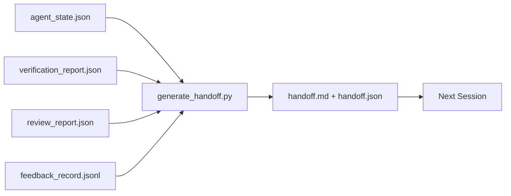

# 多会话交接

> 会话即将结束。工作没有。交接包是将"智能体工作了一小时"转化为"下次会话在第一分钟就高效"的构件。刻意构建它，而非事后补救。

**类型：** 构建
**语言：** Python（标准库）
**前置要求：** 第 14 阶段 · 34（仓库记忆），第 14 阶段 · 38（验证），第 14 阶段 · 39（审查者）
**所需时间：** 约50分钟

## 学习目标

- 识别每个交接包需要的七个字段。
- 从工作台构件自动生成交接，无需手写散文。
- 将大型反馈日志裁剪为交接大小的摘要。
- 使下次会话的第一个动作确定性。

## 问题所在

会话结束。智能体说"很好，我们有进展了"。下次会话打开。下一个智能体问"我们上次停在哪里？"第一个智能体的答案已经消失。下一个智能体重新发现、重新运行相同的命令、重新问人类相同的问题，花三十分钟恢复上一次会话的最后三十秒。

糟糕交接的成本在任务的整个生命周期内每次会话都要付出。修复是在会话结束时自动生成的包：变了什么、为什么、尝试了什么、失败了什么、还剩什么、下次先做什么。

## 概念说明



### 每个交接携带的七个字段

| 字段 | 回答的问题 |
|------|-----------|
| `summary` | 做了什么的一段话 |
| `changed_files` | 一目了然的差异 |
| `commands_run` | 实际执行了什么 |
| `failed_attempts` | 尝试了什么以及为什么没成功 |
| `open_risks` | 什么可能在下次会话咬你，带严重性 |
| `next_action` | 下次会话的第一个具体步骤 |
| `verdict_pointer` | 验证 + 审查报告的路径 |

`next_action` 字段是承重的。一个除了 `next_action` 什么都有的交接是状态报告，不是交接。

### 交接是生成的，不是写的

手写的交接是在困难日子会被跳过的交接。生成器读取工作台构件并发出包。智能体的工作是将工作台留在生成器可以总结的状态，而非写总结。

### 两种形式：人类可读和机器可读

`handoff.md` 是人类读的。`handoff.json` 是下一个智能体加载的。两者来自相同的源构件。如果它们分歧，JSON 胜出。

### 反馈日志裁剪

完整的 `feedback_record.jsonl` 可能有数百条。交接只携带最后 K 条加上每条非零退出的条目。下次会话在需要时加载完整日志，但包保持小巧。

### 留下干净状态

交接描述工作。干净状态使工作可恢复。它们不是一回事。一个完美的 `handoff.md` 在下次会话打开到半应用的差异、智能体忘记的临时文件、游离分支和甚至运行前就报错的测试时毫无价值。下一个智能体则花前十分钟清理上一个的烂摊子而非构建，成本在任务的整个生命周期内每次会话叠加。

所以会话不是在功能工作时结束。它在工作台处于生成器可以总结且下次会话可以信任的状态时结束。清理是自己的阶段，在交接前运行，它是检查而非习惯，因为习惯是困难日子会被跳过的东西。

| 检查 | 干净意味着 | 脏污阻断因为 |
|------|-----------|-------------|
| 工作树 | 每个变更已提交或明确 stash 带备注 | 半应用的差异对下一个智能体看起来像有意的工作 |
| 临时构件 | 没有 `*.tmp`、临时目录、调试打印或注释掉的块残留 | 游离文件污染差异和下一个智能体的心智模型 |
| 测试 | 绿色，或红色带失败原因在 `open_risks` 中 | 静默红色测试是下次会话踩入的陷阱 |
| 功能板 | `feature_list.json` 状态反映现实（第 14 阶段 · 36） | 过时板子送下次会话去做已经完成的工作 |
| 分支 | 在预期分支上，无 detached HEAD，无孤儿分支 | 错误分支意味着下次会话的第一个提交落在错误位置 |

清理阶段发出阻断问题的 `clean_state.json`；空列表是交接生成器写包前断言的前置条件。建在脏树上的交接不是交接，它是转发的混乱。两个构件配对：清理证明工作台安全离开，交接证明下次会话知道从哪里开始。

## 开始构建

`code/main.py` 实现：

- 加载器将状态、裁定、审查和反馈收集到单一 `WorkbenchSnapshot`。
- `generate_handoff(snapshot) -> (markdown, payload)` 函数。
- 过滤器选取最后 K 条反馈条目加所有非零退出。
- 演示运行写入 `handoff.md` 和 `handoff.json` 到脚本旁边。

运行方式：

```
python3 code/main.py
```

输出：打印的交接正文，加上磁盘上的两个文件。

## 实际生产模式

Codex CLI、Claude Code 和 OpenCode 各自发布不同的压缩方案；结构化交接包位于三者之上。

**压缩策略不同；包模式不变。** Codex CLI 的 POST /v1/responses/compact 是服务端不透明 AES 块（OpenAI 模型的快速路径）；回退是本地"交接摘要"作为 `_summary` 用户角色消息追加。Claude Code 在上下文 95% 时运行五阶段渐进压缩。OpenCode 做基于时间戳的消息隐藏加五标题 LLM 摘要。三种不同机制，相同需求：将压缩存活的内容序列化为可移植构件。包就是那个构件。

**新会话交接不是压缩。** 压缩扩展会话；交接干净地关闭一个并启动下一个。Hermes Issue #20372 的框架（2026 年 4 月）是正确的：当就地压缩开始降级时，智能体应写紧凑交接、结束会话，并在新上下文中恢复。包使那个转换廉价。错误是持续压缩直到质量崩塌；修复是预算早期、干净的交接。

**每个分支和主题一个活跃交接。** 多智能体协调在过时交接上比在坏模型输出上更容易崩溃。始终包含 `branch`、`last_known_good_commit` 和 `status` 为 `active | superseded | archived`。过时交接被归档；只有活跃的驱动下次会话。这是交接即笔记和交接即状态之间的区别。

**在上下文 50-75% 时收尾，而非在极限时。** 手写模式手册（CLAUDE.md + HANDOVER.md）报告在 50-75% 上下文预算而非 95% 时结束会话效果最佳。包生成器在压缩产物污染源状态前干净运行。上下文完整时写入廉价；模型已经迷失时昂贵。

## 使用建议

生产模式：

- **会话结束钩子。** 运行时在用户关闭聊天时触发生成器。包进入 `outputs/handoff/<session_id>/`。
- **PR 模板。** 生成器的 markdown 也是 PR 正文。审查者无需打开五个其他文件就能阅读。
- **跨智能体交接。** 用一个产品（Claude Code）构建，用另一个（Codex）继续。包是通用语言。

包小巧、规范且产出廉价。成本节省随每次会话叠加。

## 交付产物

`outputs/skill-handoff-generator.md` 产出针对项目构件路径调整的生成器、运行它的会话结束钩子，以及下一个智能体启动时读取的 `handoff.json` 模式。

## 练习

1. 添加 `assumptions_to_validate` 字段，浮出构建者记录但审查者未评分高于 1 的每个假设。
2. 对失败运行和通过运行不同地裁剪反馈摘要。论证不对称性。
3. 包含"给人类的问题"列表。问题进入包 vs 进入聊天消息的阈值是什么？
4. 使生成器幂等：运行两次产出相同的包。什么需要稳定才能成立？
5. 添加"下次会话前提条件"部分，列出下次会话行动前必须加载的确切构件。

## 关键术语

| 术语 | 常见说法 | 实际含义 |
|------|---------|---------|
| 交接包 | "会话摘要" | 携带七个字段的生成构件，markdown 和 JSON |
| 下一步操作 | "先做什么" | 启动下次会话的一个具体步骤 |
| 反馈裁剪 | "日志摘要" | 最后 K 条记录加每条非零退出 |
| 状态报告 | "我们做了什么" | 缺少 `next_action` 的文档；有用但不是交接 |
| 裁定指针 | "收据" | 验证 + 审查报告的路径，用于可追溯性 |

## 延伸阅读

- [Anthropic，Effective harnesses for long-running agents](https://www.anthropic.com/engineering/effective-harnesses-for-long-running-agents)
- [OpenAI Agents SDK 交接](https://platform.openai.com/docs/guides/agents-sdk/handoffs)
- [Codex Blog，Codex CLI Context Compaction: Architecture, Configuration, Managing Long Sessions](https://codex.danielvaughan.com/2026/03/31/codex-cli-context-compaction-architecture/) — POST /v1/responses/compact 和本地回退
- [Justin3go，Shedding Heavy Memories: Context Compaction in Codex, Claude Code, OpenCode](https://justin3go.com/en/posts/2026/04/09/context-compaction-in-codex-claude-code-and-opencode) — 三厂商压缩对比
- [JD Hodges，Claude Handoff Prompt: How to Keep Context Across Sessions（2026）](https://www.jdhodges.com/blog/ai-session-handoffs-keep-context-across-conversations/) — CLAUDE.md + HANDOVER.md，50-75% 上下文预算
- [Mervin Praison，Managing Handoffs in Multi-Agent Coding Sessions: Fresh Context Without Losing Continuity](https://mer.vin/2026/04/managing-handoffs-in-multi-agent-coding-sessions-fresh-context-without-losing-continuity/) — 分布式系统框架
- [Hermes Issue #20372 — 压缩有风险时自动新会话交接](https://github.com/NousResearch/hermes-agent/issues/20372)
- [Hermes Issue #499 — Context Compaction Quality Overhaul](https://github.com/NousResearch/hermes-agent/issues/499) — Codex CLI 中面向交接的提示词
- [Microsoft Agent Framework，Compaction](https://learn.microsoft.com/en-us/agent-framework/agents/conversations/compaction)
- [OpenCode，Context Management and Compaction](https://deepwiki.com/sst/opencode/2.4-context-management-and-compaction)
- [LangChain，Context Engineering for Agents](https://www.langchain.com/blog/context-engineering-for-agents)
- 第 14 阶段 · 34 — 生成器读取的状态文件
- 第 14 阶段 · 38 — 包指向的验证裁定
- 第 14 阶段 · 39 — 捆绑进包的审查者报告
