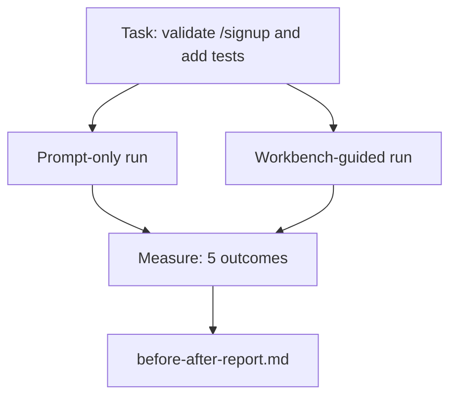

# 真实仓库上的工作台

> 十一课的界面如果经不起真实代码库的检验就毫无价值。本课在一个小型示例应用上运行同一任务两次：纯提示词 vs 工作台引导。数据来说话。

**类型：** 构建
**语言：** Python（标准库）
**前置要求：** 第 14 阶段 · 32 至 14 · 40
**所需时间：** 约60分钟

## 学习目标

- 将七个工程界面整合到一个小型应用上。
- 运行同一任务两次（纯提示词和工作台引导）并测量五个结果。
- 阅读前后报告并决定哪些界面给了最多杠杆。
- 为工作台应对"但我的模型够好了"的反驳辩护。

## 问题所在

在演示任务上的演示说服不了人。工作台的论证是在真实感任务于真实感仓库上以更少失败、更少回滚和下次会话可用的包落地生产时成立的。

本课提供那个真实感仓库并通过两条管道运行同一任务。结果是一份你可以交给怀疑者的前后报告。

## 概念说明



### 示例应用

`sample_app/` 中最小的 FastAPI 风格处理器：

- `app.py` 带 `/signup`（尚无验证）。
- `test_app.py` 带一个正常路径测试。
- `README.md` 和 `scripts/release.sh` 作为禁区诱饵。

### 任务

> 为 `/signup` 添加输入验证：拒绝短于 8 个字符的密码，返回 422 带类型化错误信封。添加一个证明新行为的测试。

### 两条管道

纯提示词：

1. 读 README。
2. 读 `app.py`。
3. 编辑文件。
4. 声称完成。

工作台引导：

1. 运行初始化脚本（第 35 课）。
2. 读范围契约（第 36 课）。
3. 读状态（第 34 课）。
4. 仅编辑允许的文件。
5. 通过反馈运行器运行验收命令（第 37 课）。
6. 运行验证门（第 38 课）。
7. 运行审查者（第 39 课）。
8. 生成交接（第 40 课）。

### 测量的五个结果

| 结果 | 为什么重要 |
|------|-----------|
| `tests_actually_run` | 大多数"测试通过"声明不可验证 |
| `acceptance_met` | 证明目标的测试必须是运行的测试 |
| `files_outside_scope` | 范围蔓延是主导的静默失败 |
| `handoff_quality` | 下次会话为此付出或受益 |
| `reviewer_total` | 门之上的定性判断 |

## 开始构建

`code/main.py` 对同一示例应用装置编排两条管道。两条管道都是脚本化的（循环中无 LLM），使测量可复现。脚本将比较写入 `before-after-report.md` 和 `comparison.json`。

运行方式：

```
python3 code/main.py
```

输出：每管道的结果控制台表格、保存在脚本旁边的 markdown 报告，以及供想要制图者使用的 JSON。

## 实际生产模式

怀疑者的问题是"工作台到底有多大帮助？"2026 年的数据说的比解释多得多。

**同一模型从 Terminal Bench Top-30 到 Top-5。** LangChain 的 *Anatomy of an Agent Harness*（2026 年 4 月）：一个编码智能体仅通过变更运行器就从 Top 30 之外跳到 Terminal Bench 2.0 第五名。同一模型。不同界面。二十五名的差距。

**Vercel 从 80% 到 100% 通过删除工具。** Vercel 报告删除 80% 的智能体工具将成功率从 80% 提升到 100%。更小的工具面、更锐利的范围、更少的失败方式。否定空间获胜。

**Harvey 仅通过运行器 2x 准确率。** 法律智能体仅通过运行器优化就将准确率翻倍以上，未更换模型。

**88% 的企业 AI 智能体项目未能投产。** preprints.org 的 *Harness Engineering for Language Agents* 论文（2026 年 3 月）追踪失败到运行时而非推理：过时状态、脆弱重试、膨胀上下文、从中间错误恢复差。

**长上下文崩塌。** WebAgent 基线 40-50% 成功率在长上下文条件下降到 10% 以下，主要由于无限循环和目标丢失。Ralph Loop 和交接包的存在就是为了吸收这些。

**假阴性仍然存在。** 单步事实任务、一行 lint、格式化器运行、任何模型逐字记忆的东西 — 这些纯提示词运行更快。基准应诚实枚举它们，使工作台不被框架为过度设计。

结论不是"运行器永远赢"。模型确实随时间吸收运行器技巧。结论是今天，承重的工程在七个界面中，数据证明了这一点。

## 使用建议

本课是你引用的案例文件，当：

- 有人问为什么每个 PR 带 `agent-rules.md` 和范围契约。
- 团队想"就这个冲刺"去掉验证门。
- 新智能体产品发布，你需要一个可移植基准判断它是否真的节省时间。

数据比解释传播更远。

## 交付产物

`outputs/skill-workbench-benchmark.md` 是一个可移植评估工具，通过两条管道对项目的示例应用运行任何智能体产品并报告五个结果。

## 练习

1. 添加第六个结果：首次有意义编辑的时间。如何干净地测量它？
2. 在你代码库中真实的第二天任务上运行比较。工作台数据在哪里滑坡？
3. 添加"假阴性"通道：纯提示词更快且工作台开销是真实成本的任务。论证仍然保留工作台。
4. 将脚本化的"智能体"替换为真实 LLM 调用。哪些结果变得更嘈杂？
5. 面向非工程师编写一页摘要。什么经得起删减？

## 关键术语

| 术语 | 常见说法 | 实际含义 |
|------|---------|---------|
| 示例应用 | "演示仓库" | 小但足够真实以覆盖全部七个界面 |
| 管道 | "工作流" | 智能体遵循的界面读取/写入的有序序列 |
| 前后报告 | "数据说话" | 你交给怀疑者的构件 |
| 假阴性 | "工作台过度设计" | 纯提示词更快的任务；诚实枚举有用 |
| 工作台基准 | "可靠性分数" | 在你的代码库上运行比较的可移植工具 |

## 延伸阅读

- [LangChain，The Anatomy of an Agent Harness](https://blog.langchain.com/the-anatomy-of-an-agent-harness/) — Terminal Bench Top-30 到 Top-5 的数据
- [MongoDB，The Agent Harness: Why the LLM Is the Smallest Part of Your Agent System](https://www.mongodb.com/company/blog/technical/agent-harness-why-llm-is-smallest-part-of-your-agent-system) — Vercel + Harvey 数据
- [preprints.org，Harness Engineering for Language Agents](https://www.preprints.org/manuscript/202603.1756) — 88% 企业失败率、运行时根因
- [HN: Improving 15 LLMs at Coding in One Afternoon. Only the Harness Changed](https://news.ycombinator.com/item?id=46988596) — 跨 15 个模型复现
- [Cloudflare，Orchestrating AI Code Review at Scale](https://blog.cloudflare.com/ai-code-review/) — 生产中 131k 次审查/30 天
- [Anthropic，Building Effective Agents](https://www.anthropic.com/research/building-effective-agents)
- 第 14 阶段 · 32 至 14 · 40 — 本课端到端覆盖的界面
- 第 14 阶段 · 19 — SWE-bench、GAIA、AgentBench 作为本课补充的宏观基准
- 第 14 阶段 · 30 — 本工具接入的评估驱动开发
