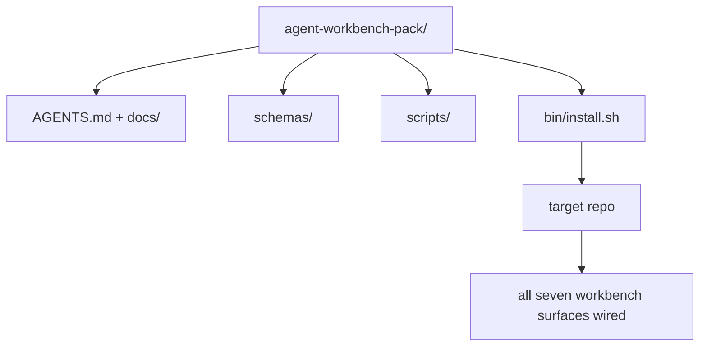

# 综合项目：交付可复用的智能体工作台包

> 迷你系列以一个你可以放入任何仓库的包结束。十一课的界面压缩为一个你可以 `cp -r` 并在第二天早上就有智能体可靠工作的目录。综合项目是本课程所依赖的构件。

**类型：** 构建
**语言：** Python（标准库）
**前置要求：** 第 14 阶段 · 31 至 14 · 41
**所需时间：** 约75分钟

## 学习目标

- 将七个工程界面打包到一个即插即用的目录中。
- 固定模式、脚本和模板，使新仓库获得已知良好的基线。
- 添加一个幂等放置包的单一安装脚本。
- 决定什么留在包中、什么留在外，为每个决定辩护。

## 问题所在

存在于 Google 文档、聊天历史和三个半记忆脚本中的工作台是每个季度都要重建的工作台。解药是版本化的包：一个包含界面、模式、脚本和一键安装器的仓库或目录。

你将在本课结束时在磁盘上交付 `outputs/agent-workbench-pack/` 和一个 `bin/install.sh`，将它放入任何目标仓库。

## 概念说明



### 包布局

```
outputs/agent-workbench-pack/
├── AGENTS.md
├── docs/
│   ├── agent-rules.md
│   ├── reliability-policy.md
│   ├── handoff-protocol.md
│   └── reviewer-rubric.md
├── schemas/
│   ├── agent_state.schema.json
│   ├── task_board.schema.json
│   └── scope_contract.schema.json
├── scripts/
│   ├── init_agent.py
│   ├── run_with_feedback.py
│   ├── verify_agent.py
│   └── generate_handoff.py
├── bin/
│   └── install.sh
└── README.md
```

### 什么留、什么不留

留：

- 界面模式。它们是契约。
- 上述四个脚本。它们是运行时。
- 上述四个文档。它们是规则和评分标准。

不留：

- 项目特定任务。任务属于目标仓库的板子，不在包中。
- 厂商 SDK 调用。包是框架无关的。
- 入职散文。包与团队现有入职并列，不在其中。

### 安装器

简短的 `bin/install.sh`（或 `bin/install.py`）：

1. 拒绝在没有 `--force` 的情况下覆盖现有包。
2. 将包复制到目标仓库。
3. 如果存在 `.github/workflows/` 则接入 CI。
4. 打印下一步：填写板子、设置验收命令、运行初始化脚本。

### 版本控制

包携带 `VERSION` 文件。需要迁移的模式升级和脚本变更升级主版本号。仅文档变更升级补丁号。目标仓库的 `agent_state.json` 记录它基于哪个包版本初始化。

## 开始构建

`code/main.py` 将包组装到课程旁边的 `outputs/agent-workbench-pack/`，用本迷你系列前几课的模式和脚本以及你已编写的文档初始化。

运行方式：

```
python3 code/main.py
```

脚本复制并固定界面、写入 README、打印包树并零退出。重新运行是幂等的。

## 实际生产模式

包只有在经受住分叉、更新和不友好的上游时才有价值。四种模式使这有效。

**`VERSION` 是契约，不是营销。** 主版本升级需要状态迁移。次版本升级需要检查器重新运行。补丁升级仅文档。安装器在每次安装时将 `.workbench-version` 写入目标仓库；`lint_pack.py` 在目标锁与包的 `VERSION` 不一致时拒绝发布。这是 `npm`、`Cargo` 和 `pyproject.toml` 存活 10 年变动的方式；智能体没有改变规则。

**跨工具分发的单一来源。** Nx 发布一个 `nx ai-setup`，从单一配置放置 `AGENTS.md`、`CLAUDE.md`、`.cursor/rules/`、`.github/copilot-instructions.md` 和 MCP 服务器。包应该做同样的事；安装器发出符号链接（`ln -s AGENTS.md CLAUDE.md`），使单一真相来源扇出到每个编码智能体。为支持一个工具而分叉包是失败模式。

**`uninstall.sh` 拒绝非平凡状态。** 卸载包不能删除用户的 `agent_state.json`、`task_board.json` 或 `outputs/`。卸载器移除模式、脚本、文档和 `AGENTS.md`（带 `--keep-agents-md` 选项），如果状态文件有任何未提交变更则拒绝继续。状态属于用户；包不拥有它。

**技能即发布物。SkillKit 风格分发。** 包作为 SkillKit 技能发布：`skillkit install agent-workbench-pack` 从单一来源在 32 个 AI 智能体中放置它。包仓库是真相来源；SkillKit 是分发渠道。厂商锁定崩塌；七个界面保持不变。

## 使用建议

包发布的三个地方：

- **作为放入仓库的目录。** `cp -r outputs/agent-workbench-pack /path/to/repo`。
- **作为公共模板仓库。** 分叉并定制，`VERSION` 控制漂移。
- **作为 SkillKit 技能。** 接入你的智能体产品，一键放置。

包是配方。每次安装是一份。

## 交付产物

`outputs/skill-workbench-pack.md` 生成项目调整的包：规则针对团队历史锐化、范围 glob 匹配仓库、评分标准维度扩展一个领域特定条目。

## 练习

1. 决定哪个可选的第五文档值得提升到规范包中。为删减辩护。
2. 将安装器重写为带 `--dry-run` 标志的 Python。与 bash 比较人体工程学。
3. 添加 `bin/uninstall.sh` 安全移除包，如果状态文件有非平凡历史则拒绝。什么算非平凡？
4. 添加 `lint_pack.py`，当包偏离 `VERSION` 时失败。为包自己的仓库接入 CI。
5. 编写从手工工作台到此包的迁移手册。最小化停机的操作顺序是什么？

## 关键术语

| 术语 | 常见说法 | 实际含义 |
|------|---------|---------|
| 工作台包 | "入门套件" | 携带全部七个界面的版本化目录 |
| 安装器 | "设置脚本" | 幂等放置包的 `bin/install.sh` |
| 包版本 | "VERSION" | 模式/脚本变更主版本升级，仅文档补丁升级 |
| 即插即用包 | "cp -r 即用" | 首日无需每仓库定制即可工作的包 |
| 可分叉模板 | "GitHub 模板" | GitHub"使用此模板"可克隆的公共仓库 |

## 延伸阅读

- 第 14 阶段 · 31 至 14 · 41 — 本包捆绑的每个界面
- [SkillKit](https://github.com/rohitg00/skillkit) — 在 32 个 AI 智能体中安装此技能
- [Nx Blog，Teach Your AI Agent How to Work in a Monorepo](https://nx.dev/blog/nx-ai-agent-skills) — 跨六个工具的单一来源生成器
- [agents.md — 开放规范](https://agents.md/) — 你的包路由器必须实现的
- [HKUDS/OpenHarness](https://github.com/HKUDS/OpenHarness) — 包等效的参考实现
- [andrewgarst/agentic_harness](https://github.com/andrewgarst/agentic_harness) — 带 Redis 和评估套件的参考实现
- [Augment Code，A good AGENTS.md is a model upgrade](https://www.augmentcode.com/blog/how-to-write-good-agents-dot-md-files) — 包文档质量标准
- [Anthropic，Effective harnesses for long-running agents](https://www.anthropic.com/engineering/effective-harnesses-for-long-running-agents)
- [Anthropic，Harness design for long-running application development](https://www.anthropic.com/engineering/harness-design-long-running-apps)
- 第 14 阶段 · 30 — 消费包验证门的评估驱动开发
- 第 14 阶段 · 41 — 本包改进的前后基准
