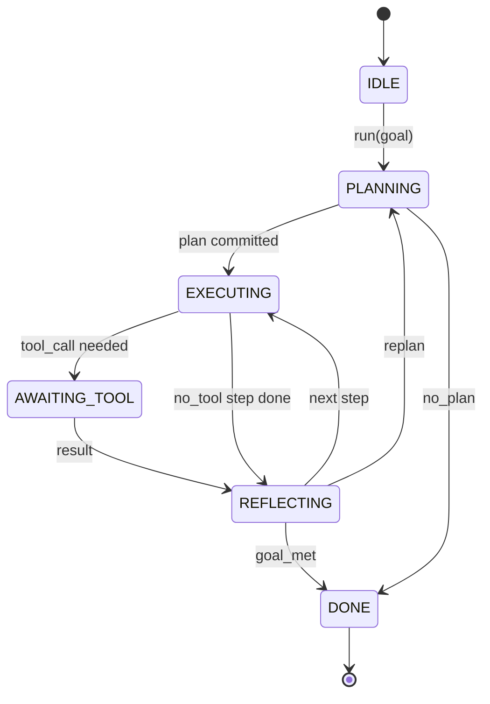

# 智能体框架循环契约

> 框架就是智能体。模型是协处理器。本课固化了你可以接入任何模型的循环契约。

**类型：** 构建
**语言：** Python
**前置要求：** Phase 13 课程 01-07，Phase 14 课程 01
**所需时间：** 约 90 分钟

## 学习目标
- 将智能体框架循环定义为具有显式转移的确定性状态机。
- 实现十个生命周期钩子主题，操作员可以接入策略、遥测和护栏。
- 定义两个拉取点，循环在这些点将控制权交还给调用方，并在收到新输入后恢复。
- 强制执行每会话预算（轮次、工具调用、挂钟时间），且在超限时不泄露部分状态。
- 发射包含十一种事件类型的类型化事件流，使下游 UI 和追踪器无需直接检查循环即可订阅。

## 框架说明

一个无人值守运行四十轮的编码智能体不是聊天循环。它是一个状态机，其节点可被操作员拦截，其边可被操作员审计。一旦你将契约写下来，替换模型、工具或策略就不再是重构，而是一次注册调用。

本课构建这个契约。我们定义六个状态、十个钩子主题、两个拉取点、十一种事件类型和一个预算信封。框架中的其他一切（工具注册表、JSON-RPC 传输、调度器、规划器）都接入这个形态。

## 状态定义

循环有六个状态。五个是活跃状态。一个是终止状态。



`IDLE` 是唯一合法的入口。`DONE` 是唯一合法的出口。`AWAITING_TOOL` 是唯一产生拉取点的状态。其他所有转移都是内部的。

状态机是确定性的。给定相同的事件日志，框架会重新进入相同的状态。这个特性让你可以在调试时重放会话，而无需重新调用模型。

## 钩子主题

钩子是操作员切入循环的接口。框架触发十个主题。每个主题接受任意数量的订阅者。订阅者按注册顺序触发。订阅者可以修改有效载荷、抛出异常以中止当前轮次，或返回哨兵值以跳过下一步。

```text
before_plan         after_plan
before_tool_call    after_tool_call
before_step         after_step
on_error
on_pause
on_budget_exceeded
on_complete
```

这个形态反映了 Claude Code、Cursor 和 OpenCode 在 2025 年中期趋于一致的设计。名称是功能性的，而非品牌化的。拦截 `rm -rf` 的钩子放在 `before_tool_call` 中。发送 OpenTelemetry span 的钩子放在 `after_step` 中。恢复暂停会话的钩子放在 `on_pause` 中。

## 拉取点

循环在两个点交出控制权。第一次在 `AWAITING_TOOL`，当它没有工具结果就无法继续时。第二次在 `on_pause`，当预算耗尽或钩子明确请求人工审查时。

拉取点不是异常，而是一种返回。调用方检查框架状态，获取框架请求的内容，然后调用 `resume(payload)`。框架从停止的地方继续。这与 Python 生成器的形态相同。拉取点上的传输方式由你选择。在 TUI 中是按键。在 MCP 上是 `tools/call`。在队列上是任务轮询。

## 事件流

循环在契约的特定节点向类型化流追加事件。该流是仅追加的，订阅者可以从任意偏移量重放。实现的十一种事件类型为：

- `session.start` — 当 `run(goal)` 被调用时触发一次
- `plan.draft` — 当规划器返回草稿计划时触发
- `plan.commit` — 当草稿被提交为活动计划后触发
- `step.start` — 在每个执行步骤开始时触发
- `step.end` — 在每个执行步骤结束时触发
- `tool.call` — 当需要工具的步骤将控制权交给调用方时触发
- `tool.result` — 恢复时携带工具结果触发
- `tool.error` — 恢复时携带错误或钩子中止调用时触发
- `budget.warn` — 当达到预算限制时触发
- `session.pause` — 当循环因暂停（预算或钩子）交出控制权时触发
- `session.complete` — 当循环到达 `DONE` 时触发一次

事件不会重复钩子的有效载荷。钩子是命令式的（修改、中止）。事件是观察性的（记录、发送）。将它们视为正交的。

## 预算信封

一个会话携带三个限制。轮次计数、工具调用计数、挂钟秒数。每轮轮次加一。每次工具调用工具调用数加一。每次状态转移时检查挂钟时间。当任一限制达到时，循环触发 `on_budget_exceeded`，发射 `budget.warn`，然后在下一个拉取点以预算超限原因转移到 `IDLE`。

预算不是终止开关，而是一种交出。调用方决定是扩展预算并恢复，还是关闭会话。

## 本课不做什么

本课不调用模型。不注册真实工具。不实现传输层。那些是接下来的四节课。本课把契约定下来，让后续四节课可以直接接入而无需重写。

`main.py` 中的确定性规划器是一个替身。它返回一个硬编码的三步计划，其中两步需要工具结果。重点是循环，不是计划。

## 代码阅读指南

`HarnessLoop` 是主类。它持有状态、触发钩子、发射事件。`Budget` 跟踪限制。`Event` 是流上的类型化信封。`HookRegistry` 是派发表。`_transition` 是唯一改变状态的函数，因此状态机不变量集中在一个地方。

从头到尾阅读 `main.py`。然后阅读 `code/tests/test_loop.py`。测试固定了每次转移和每次钩子触发顺序。

## 进阶拓展

在生产环境中构建框架最难的部分不是状态机，而是让契约可强制执行。契约必须在规划器热重载后存活。必须在工具返回畸形 JSON 后存活。必须在钩子在四十轮会话进行到三分之二时在 `before_tool_call` 中抛出异常后存活。本课的测试覆盖了这些失败模式。运行它们。破坏它们。增加用例。

下一课增加工具注册表。之后是 JSON-RPC 传输。之后是调度器。到第二十四课时，本文件中的循环将使用真实计划、真实工具和强制执行的真实预算来运行。
