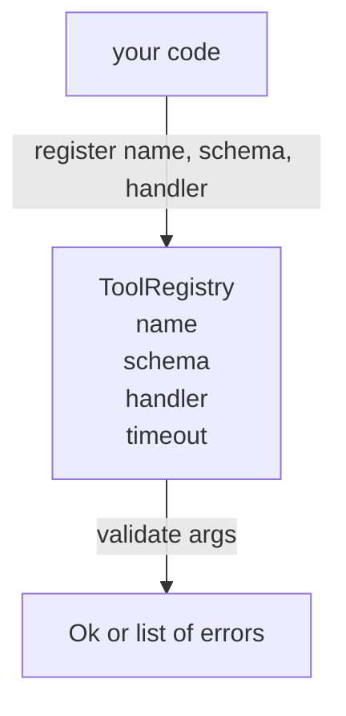

# 工具注册表与 Schema 验证

> 智能体无法验证的工具就是智能体无法调用的工具。先构建注册表和 schema 检查器，再构建工具。

**类型：** 构建
**语言：** Python
**前置要求：** Phase 13 课程 01-07，Phase 14 课程 01
**所需时间：** 约 90 分钟

## 学习目标
- 维护一个类型化的工具名称 -> schema -> 处理器注册表，调度器可以查询一次后信任。
- 实现 JSON Schema 2020-12 子集，覆盖 90% 工具调用实际使用的关键字。
- 返回精确的 json-pointer 格式错误路径，使模型可以在一次往返中自行修正。
- 拒绝重复注册（除非显式覆盖），因为静默覆盖是生产工具目录漂移的根源。
- 保持验证器纯净（无 I/O、无时间依赖、无全局变量），使其可以在重放日志上重新运行。

## 为什么注册表先于工具

2026 年的编码智能体注册的工具比模型单次上下文窗口能容纳的还多。一个非平凡的框架会注册两百个工具，在任何给定轮次中暴露十到四十个。注册表是"存在哪些工具"、"参数是什么形状"、"调用哪个处理器"这三个问题的真实来源。一旦这三个答案被固定，框架的其余部分就不必再猜测。

我们要避免的错误是在没有 schema 的情况下发布处理器，或者在没有验证的情况下发布 schema。两者都很常见。两者都会把下一层（第二十三课的调度器）变成猜测游戏，唯一的失败模式是处理器抛出的堆栈跟踪。

## 工具记录长什么样

```text
ToolRecord
  name        : str          (unique, lowercase alphanumeric and underscore segments separated by dots, e.g., snake_case.segment.case)
  description : str          (one line, shown to the model)
  schema      : dict         (JSON Schema 2020-12 subset)
  handler     : Callable     (async or sync, returns Any)
  idempotent  : bool         (dispatcher uses this for retry decisions)
  timeout_ms  : int          (override per-tool dispatcher default)
```

schema 是验证器唯一接触的字段。处理器对它来说是不透明的。我们有意将它们分开。schema 是数据。处理器是代码。混合它们会诱使你把验证逻辑放在处理器内部，这正是我们要阻止的 bug。

## JSON Schema 2020-12 子集

完整的 2020-12 规范是一篇论文。我们只需要八个关键字。

```text
type           string / number / integer / boolean / object / array / null
properties     map of property name -> schema
required       list of property names
enum           list of allowed primitive values
minLength      integer, applies to strings
maxLength      integer, applies to strings
pattern        ECMA-262-compatible regex, applies to strings
items          schema applied to every array element
```

这足以覆盖工具 API 实际需要的内容。我们没有添加的关键字（oneOf、anyOf、allOf、$ref、条件表达式）在生产 schema 中是有效的，但会把验证器变成带循环的树遍历器。我们构建的是注册表，不是 JSON Schema 引擎。

## json pointer 错误路径

当验证失败时，验证器返回错误列表。每个错误携带一个指向输入的 json-pointer 路径。指针是一个以斜杠开头的属性名和数组索引序列。

```text
{"a": {"b": [1, 2, "x"]}}
                    ^
                    /a/b/2
```

模型读取错误路径比读取句子更好。如果 schema 要求 `args.user.email` 而模型传了一个整数，错误应该是 `/user/email` 和 `expected_type: string`。模型在下一次调用中就能修正，无需一轮自然语言。

## 注册与覆盖

`register(name, schema, handler, **opts)` 默认拒绝重复注册。调用方必须传 `override=True` 才能替换。这是运维卫生。代码库的两个部分静默注册同一个工具名称，这类 bug 在生产中要花一周才能找到。

注册表暴露三个读取方法。`get(name)` 返回记录或抛出异常。`validate(name, args)` 返回 `Ok` 或错误列表。`names()` 按注册顺序返回工具名称。

## 验证器是什么、不是什么

它是一次对 schema 树的单遍递归遍历。它是纯净的。它不调用处理器。它不做强制类型转换（字符串 `"42"` 不会通过 number schema）。它不静默截断。

它不是安全边界。恶意处理器在验证通过后仍然可以行为不端。第二十三课的调度器添加超时和沙箱层。注册表添加形状约束。

## 架构



## 代码阅读指南

`code/main.py` 定义了 `ToolRegistry`、`ToolRecord`、`ValidationError` 和八个验证函数。验证器按 `schema["type"]` 分派（或将带 `enum` 的 schema 视为无类型枚举检查）。每个类型验证器返回空列表或 `ValidationError` 列表。顶层遍历器在下降时拼接错误并前置路径段。

`code/tests/test_registry.py` 覆盖了注册、覆盖、验证成功、带路径的验证失败，以及子集中的每个关键字。

## 进阶拓展

本课落地后你会想要的两个扩展：针对本地 definitions 块的 `$ref` 解析，以及用于严格形状约束的 `additionalProperties: false`。两者都很小。两者在工具目录超过五十个工具时都很常见。我们将它们排除在本课之外以保持文件可在一次阅读内完成。

下一课（第二十二课）构建将此注册表暴露给模型客户端的 JSON-RPC stdio 传输。再下一课（第二十三课）将两者包装在带有超时和重试的调度器后面。
