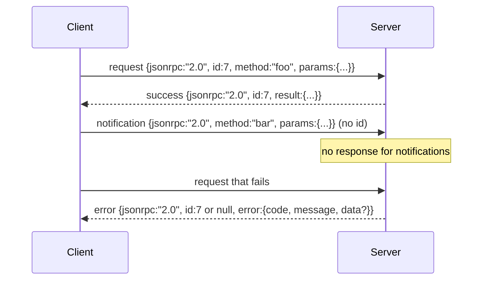

# JSON-RPC 2.0 over 换行分隔的 Stdio

> 模型客户端与工具服务器之间的传输层是 JSON-RPC over stdio。亲手实现一次，你就能理解每个帧层在为什么买单。

**类型：** 构建
**语言：** Python
**前置要求：** Phase 13 课程 01-07，Phase 14 课程 01
**所需时间：** 约 90 分钟

## 学习目标
- 使用换行分隔 JSON over stdin 和 stdout 来说 JSON-RPC 2.0。
- 映射五个标准错误码（-32700、-32600、-32601、-32602、-32603）并以正确的语义暴露它们。
- 区分请求、响应、通知和批处理，无需发明新的信封键。
- 处理每行的解析错误而不污染流的其余部分。
- 使用 `io.BytesIO` 构建自终止演示，使课程无需生成子进程即可运行。

## 为什么 JSON-RPC 仍是通用语言

2026 年的编码智能体在一次会话中可能与十二个工具服务器通信。每个服务器是独立的进程或远程端点。线路格式自 2013 年以来没有变化。JSON-RPC 2.0 是两页规范。它之所以存活，是因为替代方案（gRPC、每次调用 HTTP、自定义二进制）都施加了 JSON-RPC 不需要的权衡：它们要么选择流式传输，要么选择批处理，要么选择传输耦合。JSON-RPC 在 stdio、socket、websocket 和 HTTP 上是对称的，如果双方都遵守规范，客户端可以驱动它从未见过的服务器。

本课构建 stdio 变体。换行分隔 JSON。每个请求一行。每个响应一行。传输边界是 `\n`。

## 线路形态

存在四种信封形态。两种由客户端发出。两种由服务器发出。



通知没有 `id`。服务器不能对其响应。如果服务器对通知返回响应，客户端无法将其关联到调用点。这一规则使帧处理的数学保持简单。

批处理是请求或通知的 JSON 数组。服务器以响应数组回复，顺序任意，每个非通知条目对应一个响应。如果批处理中的每个条目都是通知，服务器不返回任何内容。

## 五个错误码

```text
-32700  Parse error      JSON could not be parsed
-32600  Invalid Request  Envelope shape is wrong
-32601  Method not found
-32602  Invalid params
-32603  Internal error
```

-32000 到 -32099 之间的错误码保留给服务器自定义错误。其他都是应用自定义的。本课只使用这五个。如果你的处理器抛出异常，传输层将其包装为 -32603，异常类名放在 `data.exception` 中。

解析错误有一条特殊规则。响应中的 `id` 为 `null`，因为请求从未解析到足以提取 id 的程度。

## 换行帧和 BytesIO 演示

传输层每次读取一行。一行是直到并包含 `\n` 的字节。如果一行无法解析，传输层写入一个 `id: null` 的 -32700 响应并继续。流不会被污染。下一行会被全新解析。

在本课中，我们用 `io.BytesIO` 对包装 stdin 和 stdout。服务器读取请求直到 EOF，为每个请求写入响应，然后返回。客户端读回响应。没有进程生成。没有超时。传输行为与真实的子进程管道相同，因为 Python 的 `io` 接口呈现相同的 `.readline()` 和 `.write()` 契约。

## 方法分派

传输层不知道存在哪些方法。它交给框架提供的可调用 `handler(method, params)`。处理器返回结果或抛出异常。三个异常类暴露特定错误码。

```text
MethodNotFound -> -32601
InvalidParams  -> -32602
Anything else  -> -32603 with exception name in data
```

传输层永远不会看到工具注册表。注册表在处理器后面。这就是我们想要的分层。传输层说 JSON-RPC。注册表说工具形状。调度器（第二十三课）将它们缝合在一起。

## 错误时的流行为

```text
client writes              server reads             server writes
---------------            -----------              -------------
{...valid request...}      parses ok                {...response, id matches...}
{...broken json...         parse fails              {id:null, error: -32700}
{...valid request...}      parses ok                {...response, id matches...}
{...missing method...}     invalid envelope         {id:X, error: -32600}
```

一行损坏的 JSON 不会停止循环。缺少 `method` 字段不会停止循环。处理器异常不会停止循环。传输层持续读取直到 EOF。

## 通知与非对称流

通知是即发即忘的。框架使用通知来传递进度事件、取消信号和日志行。通知是长时间运行的工具可以流式传输状态更新而无需为每个更新往返的方式。

本课实现了一个出站通知辅助函数 `write_notification`。服务器在请求处理期间使用它来发射进度。演示展示了这个模式：请求进来，处理器发射两条进度通知，然后写入最终响应。

## 代码阅读指南

`code/main.py` 定义了 `StdioTransport`、解析辅助函数（`parse_request`）、三个写入辅助函数（`write_response`、`write_error`、`write_notification`）以及分派循环 `serve`。错误码常量在模块作用域。

`code/tests/test_transport.py` 覆盖了五个错误码、通知（不写响应）、批处理（数组进数组出，通知跳过）、损坏 JSON（解析错误后继续），以及处理器在调用中途写入通知的非对称流。

## 进阶拓展

这个传输层足以支撑后续课程。生产传输层会增加三样东西。一个在转发中存活的关联 id 字段（你的 `id` 已经是这个，但在网状拓扑中你还需要一个外部追踪 id）。一个取消通道（类似 `$/cancelRequest` 的通知，携带正在处理的调用的 id）。以及一个内容类型协商握手，使同一个 socket 可以同时说 JSON-RPC 和 Streamable HTTP。这些都不改变线路格式，它们添加的是元数据。
