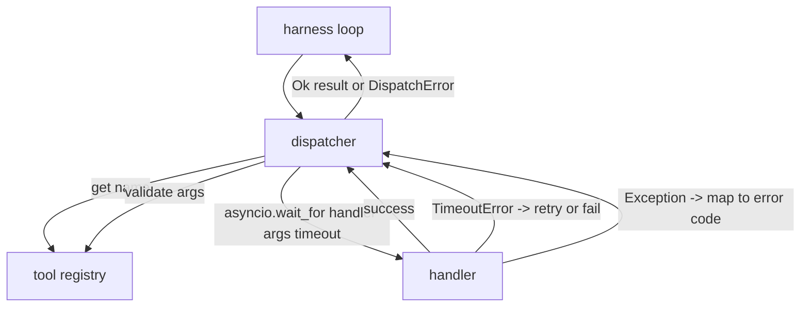
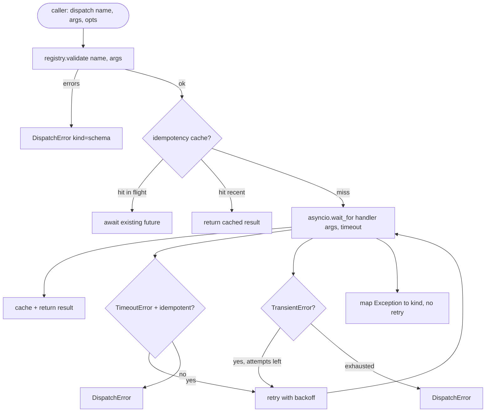

# 函数调用调度器

> 调度器是框架为 schema 所做的每一个承诺买单的地方。超时、重试、去重、错误映射。全在一个接口上。

**类型：** 构建
**语言：** Python
**前置要求：** Phase 13 课程 01-07，Phase 14 课程 01
**所需时间：** 约 90 分钟

## 学习目标
- 为工具处理器包装逐次调用超时，返回类型化错误而非挂起循环。
- 应用带抖动的指数退避重试，并设置最大尝试次数。
- 在幂等键上对重试去重，避免与慢速原始调用竞争的重试重复执行。
- 将处理器异常和传输故障映射到框架循环已理解的单一错误信封。
- 用并发限制约束并行分派，使四十个工具调用的扇出不会耗尽事件循环。

## 调度器的位置

位于框架循环（第二十课）和工具注册表（第二十一课）之间。传输层（第二十二课）馈入循环。循环将工具调用交给调度器。调度器调用注册表，运行处理器，返回结果或 JSON-RPC 格式的错误信封。



调度器是唯一知道定时器、重试和幂等性的层。循环不知道。注册表不知道。处理器不知道。这种隔离正是重点。

## 超时

每个工具有默认超时。注册表记录携带 `timeout_ms`。当框架传入逐次调用覆盖时，调度器会覆盖它。我们使用 `asyncio.wait_for`。超时时，处理器任务被取消，调度器返回 `DispatchError(kind="timeout")`。

对于非幂等工具，超时默认不是可重试错误。一个超时的 `db.write` 可能已经提交也可能没有。重试会重复写入。调度器遵守注册表记录中的 `idempotent` 标志。幂等工具会重试。非幂等工具不会。

## 指数退避重试

重试策略最多三次尝试。退避是带抖动的指数退避。

```text
attempt 1  -> delay 0
attempt 2  -> delay 0.1s * (1 + random[0..0.5])
attempt 3  -> delay 0.4s * (1 + random[0..0.5])
```

只有 `timeout` 和 `transient` 错误会重试。`schema` 错误、`not_found` 或 `internal` 错误不会重试。schema 错误是确定性的。重试不会改变结果，只会消耗预算。

重试循环遵守框架的预算。如果调用方的预算中剩余工具调用次数为零，调度器在第一次尝试时就快速失败并返回 `kind="budget_exceeded"`。

## 幂等键去重

当原始调用仍在进行时触发的重试是一个真实的生产 bug。第一次调用在 4.9 秒时挂起（刚好低于超时）。重试在 5 秒时触发。现在两个请求竞争同一个后端。如果工具是 `payments.charge`，你就收了两次费。

调度器接受可选的 `idempotency_key`。如果调用到达时相同的键正在处理中，调度器等待正在处理的 future 并返回其结果。缓存保留键六十秒以吸收延迟的重试。

键由调用方负责。框架从规划器派生它：`f"{step_id}:{tool_name}:{hash(args)}"`。调度器不发明键，因为仅从参数派生键会使两个语义不同的调用看起来相同。

## 错误信封

失败的分派返回单一形状。

```text
DispatchError
  kind        : "timeout" | "transient" | "schema" | "not_found" | "internal" | "budget_exceeded"
  message     : str
  attempts    : int
  jsonrpc_code: int   (one of -32601, -32602, -32603)
```

框架循环将 `kind` 映射到下一个状态。`schema` 和 `not_found` 进入 `on_error` 并触发重新规划。`timeout` 和 `transient` 进入 `on_error`，是否重新规划取决于尝试次数。`budget_exceeded` 触发 `on_budget_exceeded`。

## 扇出的并发限制

`gather(*calls)` 同时运行所有协程。四十个工具调用就是四十个打开的 socket 或四十个子进程管道。大多数后端不喜欢一个客户端同时建立四十个并发连接。

调度器用信号量包装 `gather`。默认并发限制为八。每次调用在分派前获取信号量，完成后释放。调用方看到的是 `gather` 格式的输出，但实际调度是受限的。

## 单次调用流程



## 代码阅读指南

`code/main.py` 定义了 `Dispatcher`、`DispatchError` 和 `TransientError`。调度器在构造时接收注册表。异步 `dispatch(name, args, ...)` 是唯一入口。逐次尝试的超时在 `_run_with_retries` 内部使用 `asyncio.wait_for` 内联应用。`gather_bounded(calls)` 使用并发限制运行多个分派。

`code/tests/test_dispatcher.py` 覆盖了超时触发、瞬态错误重试、schema 错误不重试、幂等去重（两个相同键的并发调用合并为一次处理器调用）以及并发限制（信号量的实际运作）。

测试使用 `asyncio.sleep(0)` 和确定性的 `Counter` 处理器，因此它们在毫秒内完成，不依赖挂钟计时。

## 进阶拓展

生产调度器会增加两个扩展。第一，每次转移时的结构化日志（循环的事件流已经提供了这一点，但调度器还应发射 `dispatch.attempt` 和 `dispatch.retry` 事件）。第二，熔断器：在一个窗口内 N 次失败后，工具进入冷却期，分派立即返回 `kind="circuit_open"` 而不是尝试处理器。两者都可以在不改变契约的情况下叠加在这个调度器之上。

第二十四课将调度器与规划执行智能体粘合在一起，让你看到所有四个组件协同运作。
