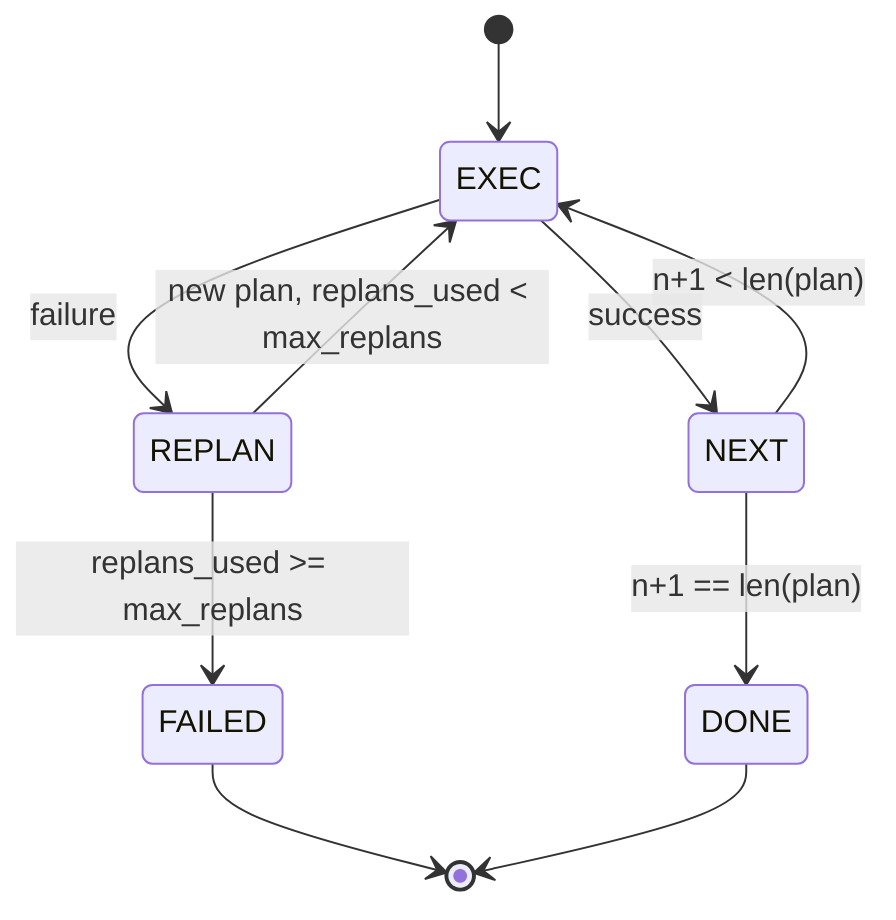

# Plan-Execute 控制流

> 一个无法从失败中恢复的计划只是脚本。一个能够重新规划的脚本才是智能体。先把重新规划器做好。

**类型：** Build
**语言：** Python
**前置要求：** Phase 13 第 01-07 课，Phase 14 第 01 课
**所需时间：** 约 90 分钟

## 学习目标
- 将计划表示为有序的类型化步骤列表，使执行器能够推理进度和结果。
- 按顺序执行步骤，并在失败时将控制权交还给规划器进行受控的故障交接。
- 从当前游标位置重新规划，并在上下文中包含先前的错误信息，以便新计划具有充分依据。
- 每次修订时发出计划差异事件，以便下游追踪器或 UI 能够展示计划变更的原因。
- 强制执行两个预算：硬性步骤上限和硬性重规划上限。

## Plan-Execute 而非 Chain-of-Thought

Chain-of-thought 智能体输出 token，让循环自行猜测工具调用在哪里结束。Plan-and-execute 智能体先输出结构化计划，再确定性地执行每个步骤。计划是框架可以内省的数据，执行是框架通过调度器运行这些数据的过程。

两个组成部分：一个生成计划的规划器，一个执行计划的执行器。核心工作在于执行器遇到失败时的处理。有三种选择：

```text
1. Abort         (返回失败，暴露错误)
2. Skip          (标记步骤失败，继续执行其余步骤)
3. Replan        (将错误交给规划器，从游标位置获取新计划)
```

Replan 是将脚本转变为智能体的关键。

## Step 的数据结构

```text
Step
  id              : int           (单个计划修订内的单调递增编号)
  tool_name       : str
  args            : dict
  expected_outcome: str           (规划器声明的成功条件)
  result          : Any | None
  error           : str | None
```

`expected_outcome` 是规划器随步骤一起输出的简短描述。执行器不会强制验证它。它有两个用途：重新规划器在修订计划时会读取它；事件流会发出它，以便追踪器展示「这个步骤本应做 X」。

## 规划器的接口

```python
def planner(goal: str, history: list[Step], last_error: str | None) -> list[Step]:
    ...
```

一个纯函数。`goal` 是用户目标。`history` 是已执行的步骤（包含结果和错误信息）。`last_error` 在首次调用时为 None，后续调用中为最近一次的失败信息。规划器返回从当前游标位置开始的下一个计划。

规划器不知道执行器的存在，不知道重试机制，也不知道超时设置。它只负责生成计划，仅此而已。

## 执行器

执行器是一个小型状态机。每个步骤通过调度器运行。结果分为三种：成功、失败可重规划、失败致命。可重规划的失败会交还给规划器。致命的失败（超出预算、达到重规划上限）返回 `FAILED` 会话结果。



## 计划修订时的差异事件

当规划器在失败后返回新计划时，执行器会发出 `plan.diff` 事件，包含三个字段。

```text
removed: 旧计划中存在但新计划中不再包含的步骤 id 列表
added  : 新计划中存在但旧计划中没有的步骤 id 列表
revised: tool_name 或 args 发生变化的步骤 id 列表
```

追踪器或 UI 可以将移除的步骤渲染为删除线，将新增的步骤高亮显示。重点不在于差异格式本身，而在于修订是一个可见的事件，而非静默的重写。

## 两个硬性预算

`max_steps` 限制整个会话中步骤执行的总次数，包括重规划。默认值为十二。一个线性的五步计划如果重规划两次并每次新增三步，就会达到十六次执行，超出预算。执行器将拒绝重规划并返回 FAILED。

`max_replans` 限制首次计划之后规划器被调用的次数。默认值为五。这是更重要的限制。如果规划器连续五次返回相同的错误计划，没有这个限制就会一直循环直到步骤预算耗尽。限制重规划次数使失败更快发生，原因更清晰。

## 本课的确定性规划器

本课不调用模型。本课提供一个确定性规划器，根据 `last_error` 选择计划。

```text
last_error is None    -> 发出四步计划
last_error matches X  -> 发出绕过 X 的三步计划
last_error matches Y  -> 发出优雅放弃的两步计划
otherwise             -> 返回 []（表示没有可重规划的内容）
```

这足以测试执行器在每条转换路径上的行为：成功、重规划一次、重规划两次、重规划耗尽、以及步骤预算耗尽。

## 结果数据结构

```text
SessionResult
  status      : "completed" | "failed"
  reason      : str     ("goal_met" | "step_budget" | "replan_budget" | "no_plan")
  history     : list[Step]
  revisions   : list[PlanDiff]
  events      : list[Event]
```

第二十课的框架循环可以直接读取这个结果。第二十三课的调度器负责执行每个步骤。第二十一课的注册表验证每个步骤的参数。第二十二课的传输层会将整个流程通过 JSON-RPC 暴露给模型客户端。

## 代码阅读指南

`code/main.py` 定义了 `PlanExecuteAgent`、`Step`、`PlanDiff`、`SessionResult` 以及确定性规划器。执行器是一个单独的 `run(goal)` 方法，返回 `SessionResult`。计划差异通过比较步骤 id 和 `(tool_name, args)` 元组来计算。

`code/tests/test_agent.py` 覆盖了线性成功、中途失败后重规划一次、重规划耗尽返回 `failed:replan_budget`、步骤预算耗尽、以及计划差异事件格式等场景。

## 进阶拓展

将本课接入真实模型后，你会需要两个扩展。第一，部分计划缓存：当一个六步计划的前三步成功、第四步失败时，你不希望重新执行前三步。执行器已经保留了历史记录；规划器只需读取它即可。第二，并行分支：当前执行器是严格顺序执行的。规划器可以发出独立分支（使用 `gather_step` 而非 `next_step`），通过调度器并发运行两个工具调用。

两者都会增加真实的复杂度。两者都在线性执行器固定之后更容易添加。这正是本课所做的。
