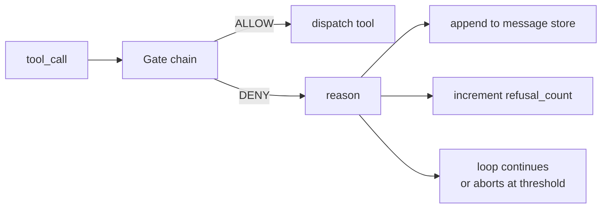
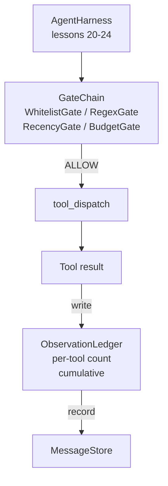

# 毕业课 25：验证门控与观察预算

> 没有验证层的智能体框架不过是一厢情愿。本课构建确定性的门控链，用于决定工具调用是否被允许执行、智能体能看到多少输出、以及循环何时因读取过多而必须停止。门控链由一系列小型命名门控和一个观察账本组成，账本跟踪模型看到的每一个 token。

**类型：** Build
**语言：** Python（标准库）
**前置要求：** Phase 19 第 20-24 课（Track A1：智能体循环、工具注册表、消息存储、提示构建器、模型路由器），Phase 14 第 33 课（指令即约束），Phase 14 第 36 课（作用域合约），Phase 14 第 38 课（验证门控）
**所需时间：** 约 90 分钟

## 学习目标

- 构建一个具有确定性 `evaluate(call)` 方法的 `VerificationGate` 协议。
- 将预算、时效、白名单和正则表达式门控组合成具有短路语义的门控链。
- 通过 `ObservationLedger` 按工具和轮次跟踪每一次观察。
- 当累计观察预算将被超出时，拒绝工具调用。
- 输出结构化的 `GateDecision` 记录，供下游可观测性系统消费。

## 问题所在

当智能体框架允许模型自由调用工具时，在实际使用的第一个小时内就会出现三类问题。

第一类是无限制的观察。对一个 20 万行的代码仓库执行 grep，会将五十万个 token 的输出倾泻到下一轮对话中。模型每千字节看到一个匹配项，其余上下文全部浪费。token 开销巨大，智能体在任务上的表现反而更差。

第二类是过时的时效性。一个长时间运行的任务积累了五十次工具调用。模型重新读取第三轮的第一次 `read_file` 结果，就好像它是实时状态一样。第四十七轮所做的编辑永远不会被看到，因为提示构建器将最早的观察结果序列化在前面。

第三类是权限蔓延。一个研究任务开始时调用 `web_search`，最终却莫名其妙地运行了 `shell`，因为模型编造了一个工具名称，而框架默认采取了宽松策略。等有人查看追踪记录时，`/tmp` 里已经多了一个垃圾文件，`curl` 已经访问了私有 API。

验证门控是框架中说「不」的组件。它不是模型，也不是裁判。它是一个确定性函数 `(call, history, ledger)`，返回 ALLOW 或 DENY 并附带原因。原因会被记录日志，模型会收到通知，循环继续或中止。

## 概念说明



门控是任何具有 `evaluate(call, ctx) -> GateDecision` 方法的东西。门控链是一个有序列表。评估在第一个拒绝时短路终止。顺序很重要：廉价的结构性门控在昂贵的 token 计数门控之前运行。

本课提供四个门控：

- `WhitelistGate`。允许的工具名称是一个显式集合。不在集合中的都被拒绝。这是最廉价的门控，最先运行。
- `RegexGate`。工具参数与正则表达式匹配。用于拒绝包含 `rm -rf` 的 shell 调用，或对内部 IP 的 HTTP 调用。对调用载荷进行纯函数判断。
- `RecencyGate`。模型只能看到最近 N 轮的观察结果。更早的观察结果被遮蔽。该门控拒绝那些结果会扩展已过期观察窗口的工具调用。
- `BudgetGate`。模型在整个会话中读取的累计 token 数量有上限。当账本表示已达到上限时，后续所有工具调用都被拒绝。

观察账本是簿记机制。每次成功的工具调用写入一行：工具名称、轮次、发出的 token 数、累计值。账本回答两个问题：模型总共看到了多少，以及它看到了工具 X 的多少。预算门控读取第一个值。按工具预算门控（你将在练习中编写）读取第二个值。

## 架构



框架询问门控链。门控链要么批准，要么拒绝。如果批准，工具运行，账本记录，结果追加到消息存储。如果拒绝，模型会收到一条系统消息形式的拒绝通知，循环决定是重试还是中止。

## 你将构建的内容

实现是一个单独的 `main.py` 加测试。

1. `Observation` 和 `ToolCall` 数据类定义线路格式。
2. `ObservationLedger` 记录 `(turn, tool, tokens)` 行，并回答 `cumulative()` 和 `per_tool(name)` 查询。
3. `GateDecision` 携带 `(allow, reason, gate_name)`。
4. `VerificationGate` 是协议。每个门控实现 `evaluate(call, ctx)`。
5. `GateChain` 包装一个有序列表。它调用每个门控，返回第一个拒绝，或者在所有门控通过时返回允许。
6. 演示运行一个小型合成智能体循环。三轮。第三轮触发预算门控，循环报告一个带有非零拒绝计数的干净拒绝。

token 计数器故意使用简陋的 `len(text) // 4` 启发式。本课的重点是门控管道，而非分词器。生产环境中请替换为真正的分词器。

## 为什么门控链顺序很重要

拒绝比允许更廉价。`WhitelistGate` 以 O(1) 哈希查找运行。`RegexGate` 以 O(pattern * argv) 运行。`RecencyGate` 读取消息存储的一小部分。`BudgetGate` 读取整个账本。按代价递增排列，使被拒绝的调用在执行昂贵操作之前就短路退出。

你还要按爆炸半径排列。白名单是最强的断言：这个工具不在合约中。正则门控次之：这个参数不在合约中。时效门控再次之：框架仍然关心但调用在结构上是合法的。预算门控排在最后，因为根据定义，它只在其他所有门控都通过时才触发。

## 如何与 Track A 其余部分组合

前面的课程为你提供了循环、工具注册表、消息存储、提示构建器和模型路由器。本课添加了模型与工具之间的层。第二十六课提供门控链批准后调度器将工具调用交给的沙箱。第二十七课提供将拒绝计数作为质量信号记录的评估框架。第二十八课将门控决策接入 OpenTelemetry span。第二十九课将所有部分缝合为一个可工作的编码智能体。

## 运行方式

```bash
cd phases/19-capstone-projects/25-verification-gates-observation-budget
python3 code/main.py
python3 -m pytest code/tests/ -v
```

演示逐轮打印追踪记录，包括每个门控决策，然后以零退出码结束。测试覆盖了账本、每个门控的独立测试、门控链短路测试、以及合成循环的端到端测试。
