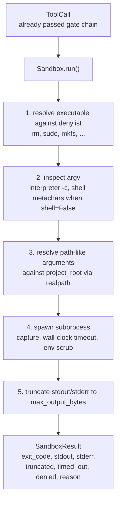
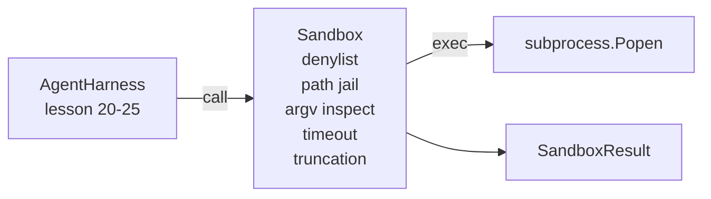

# 毕业课 26：沙箱运行器与拒绝列表

> 验证门控决定工具调用是否应该运行。沙箱决定运行时会发生什么。本课提供一个子进程运行器，拒绝危险的可执行文件、拒绝危险的 argv 模式、将每个文件路径限制在项目根目录内、截断过大的输出、并在超时时杀死失控进程。它是模型与操作系统之间的两层防御中的第二层。

**类型：** 构建
**语言：** Python（标准库）
**前置要求：** Phase 19 第 25 课（验证门控与观察预算），Phase 14 第 33 课（指令即约束），Phase 14 第 38 课（验证门控）
**所需时间：** 约 90 分钟

## 学习目标

- 构建一个包装 `subprocess.run` 的 `Sandbox` 类，支持超时、输出捕获和截断。
- 通过名称拒绝列表和 argv 结构检查器拒绝命令。
- 拒绝任何解析后超出声明的项目根目录的路径参数。
- 在未启用 shell 模式时拒绝 shell 元字符。
- 返回结构化的 `SandboxResult`，供下游可观测性和评估框架消费。

## 问题所在

一个能执行 shell 命令的编码智能体可以在一轮对话中安装后门、泄露密钥、让开发者的笔记本变砖、或者刷爆云账单。最低成本的防御是不给它 shell。第二低成本的是一个对精确模式列表说「不」的沙箱。

在智能体追踪记录中有三类反复出现的故障。

第一类是危险的可执行文件。一个在压力下试图修复路径问题的模型会尝试 `sudo`、`chmod -R 777`、`rm -rf`、`mkfs`、`dd`。这些都不应该出现在智能体运行中。拒绝列表通过名称和别名来捕获它们。

第二类是 argv 技巧。被告知不能使用 shell 的模型会通过解释器管道传递攻击：`python3 -c "import os; os.system('rm -rf /')"`、`bash -c '...'`、`node -e '...'`、`perl -e '...'`。沙箱需要知道，任何解释器以 `-c` 类标志运行时，本质上只是多了几个步骤的 shell 调用。

第三类是路径逃逸。模型被告知读取 `./src/main.py`，却读取了 `../../etc/passwd`。沙箱通过 `os.path.realpath` 解析每个路径参数并断言前缀来限制路径。

沙箱不是操作系统意义上的安全边界。一个拥有代码执行权限的蓄意攻击者仍然可以突破。沙箱是开发时的护栏：它让常见的失败模式显而易见，防止智能体因纯粹的无能造成损害。

## 概念说明



沙箱有四个拒绝维度：名称、argv、路径、结构。每个维度都是对调用的纯函数判断，尚未涉及子进程。子进程只有在所有维度都通过后才会启动。

`SandboxResult` 的退出码采用惯例值：0 表示成功，非零表示失败，另外有三个哨兵码分别表示拒绝（-100）、超时（-101）和截断（退出码为真实值，同时设置标志位）。后续课程读取这个结构化结果，而不是解析 stderr。

## 架构



拒绝列表是可执行文件基名的 frozenset。别名（`/bin/rm`、`/usr/bin/rm`）都会解析到同一个基名。argv 检查器了解解释器的模式：任何 argv[0] 是解释器且后续参数以 `-c` 或 `-e` 开头的调用都会被拒绝。Shell 元字符（`;`、`|`、`&`、`>`、`<`、反引号、`$()`）在调用未显式请求 shell 时会导致拒绝。

路径限制是最微妙的部分。沙箱在构造时接受一个 `project_root`。任何看起来像路径的参数（包含 `/` 或匹配现有文件）都会通过 `os.path.realpath` 进行规范化，然后与项目根目录的 realpath 进行比较。如果解析后的目标不在根目录下，则拒绝。符号链接逃逸尝试（项目根目录中指向外部的符号链接）通过检查 realpath 而非字面路径来阻止。

## 你将构建的内容

实现是 `main.py` 加一个测试目录。

1. `SandboxResult` 数据类：exit_code、stdout、stderr、truncated、timed_out、denied、reason、duration_ms。
2. `SandboxConfig` 数据类：project_root、max_output_bytes、timeout_seconds、denylist、interpreter_block。
3. `Sandbox` 类：`run(argv, *, shell=False, cwd=None)` 返回 `SandboxResult`。
4. 内部拒绝辅助函数：`_check_executable_denylist`、`_check_argv_interpreter`、`_check_shell_metachars`、`_check_path_jail`。
5. 输出截断，带有明确的 `truncated` 标志和捕获流中的标记行。
6. 底部的演示：一系列合法和对抗性调用。每个调用都展示其结果。

沙箱默认使用 `subprocess.run` 并设置 `shell=False` 和 `capture_output=True`。超时使用 `timeout` 参数；在 `TimeoutExpired` 时，沙箱杀死进程组并合成一个 SandboxResult。

## 为什么这不是真正的沙箱

本课的沙箱不使用命名空间、cgroups、seccomp、gVisor、Firecracker 或任何内核级隔离。子进程能做的任何事，沙箱都能做。保护是结构性的：智能体被拒绝了最常见的危险调用，响亮的拒绝被送入可观测性系统而不是静默运行。

对于生产环境的智能体，你需要在此基础上叠加更多层：在非特权 Docker 容器中运行、在微虚拟机中运行、丢弃能力、将项目根目录以只读方式挂载、将临时目录以读写方式挂载、对内存和 CPU 设置 ulimit、将环境变量清理为已知安全的白名单。第二十九课会做其中一部分。操作系统级隔离不在本课范围内。

## 运行方式

```bash
cd phases/19-capstone-projects/26-sandbox-runner-denylist
python3 code/main.py
python3 -m pytest code/tests/ -v
```

演示创建一个临时目录，放入一个干净文件，然后运行一系列调用。合法调用成功。被拒绝的调用返回 `denied=True` 并附带原因的 SandboxResult。超时返回 `timed_out=True`。截断设置 `truncated=True`。演示打印一个 JSON 格式的结果表并以零退出码结束。

## 如何与 Track A 其余部分组合

第二十五课产生了门控链。第二十六课是门控 ALLOW 后运行的执行器。第二十七课的评估框架将沙箱结果与每个任务的预期退出码进行比较。第二十八课在每次 `Sandbox.run` 调用周围发出 `gen_ai.tool.execution` span。第二十九课的端到端演示将一个真实的编码智能体接入两层防御。
