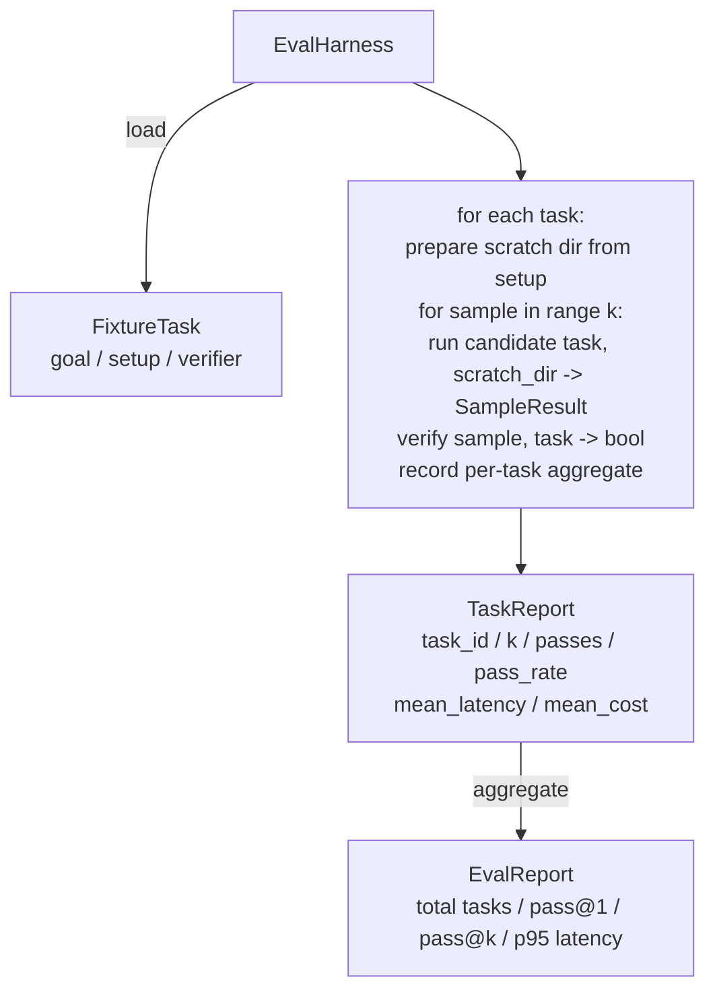

# 毕业课 27：评估框架与夹具任务

> 一个编码智能体的好坏取决于你用来衡量它的任务集。本课构建一个评估框架，从一个夹具任务文件夹中读取任务，通过候选智能体运行每个任务，通过确定性验证器判定通过或失败，并将结果聚合为 pass@1、pass@k、平均延迟和平均成本。这个框架是区分回归与重构的权威来源。

**类型：** 构建
**语言：** Python（标准库）
**前置要求：** Phase 19 第 25 课（验证门控），Phase 19 第 26 课（沙箱运行器），Phase 14 第 30 课（评估驱动的智能体开发），Phase 14 第 19 课（SWE-bench 和 GAIA 基准测试）
**所需时间：** 约 90 分钟

## 学习目标

- 将夹具任务定义为目标、设置和验证器的三元组。
- 对每个任务运行多次采样并计算 pass@1 和 pass@k。
- 将延迟和成本聚合为平均值和第 95 百分位指标。
- 将确定性验证器（文件差异、退出码、正则匹配）封装为可复用函数。
- 输出结构化的 JSON 报告，供回归跟踪脚本消费。

## 问题所在

没有评估框架的智能体基准测试会被三种失败模式困扰。

第一类是未验证的通过。智能体说它修复了 bug，人工扫一眼 diff，测试套件标记为绿色，三周后回归测试又浮现出同一个 bug。智能体只是推理得看起来合理，并没有真正修复任何东西。

第二类是未检测到的回归。对提示模板的修改使智能体在显眼任务上提高了 4%，却在不起眼的任务上下降了 14%。没有标准集和逐任务评分，回归被合入主分支，直到客户投诉才浮出水面。

第三类是逐任务漂移。周一用 100 个任务运行评估，周五只用了 95 个，因为有人重命名了五个夹具。通过率看起来提高了 5%，但实际上并非如此。

这个框架就是将这些失败转化为事实的程序。它每次都以可复现的顺序运行每个夹具，对验证器执行确定性的 true 或 false 检查。

## 概念说明

```mermaid
flowchart LR
  F1[fixtures/task_001/<br/>task.json + expected/] --> Harness
  F2[fixtures/task_002/<br/>...] --> Harness
  Harness[Harness<br/>for each task:<br/>setup / run agent k samples /<br/>verify each sample /<br/>record latency, cost]
  Harness --> Report[EvalReport<br/>pass@1 / pass@k<br/>mean ms / p95 ms<br/>mean cost]
```

`FixtureTask` 是一个小的 JSON 文件加上一个可选的 `expected/` 目录。JSON 声明一个 `id`、一个 `goal`（提供给智能体的提示）、一个 `setup` 块（放入临时目录的文件）和一个 `verifier` 块。验证器块命名框架验证器注册表中的一个函数并提供其参数。

三种验证器类型覆盖了大多数实用任务。

第一种是 `file_equals`。智能体运行后，将指定文件与预期内容进行比较。这适用于「以这种确切方式修复此 bug」的任务。

第二种是 `regex_match`。将指定文件的内容与正则表达式匹配。这适用于「函数必须存在并返回 X」的任务，其中有多种可接受的解决方案。

第三种是 `shell_exit_zero`。框架运行一个 shell 命令（通过第二十六课的沙箱），仅在命令退出码为零时判定任务通过。这适用于「测试必须通过」的任务。

框架对每个任务运行 `k` 次。Pass@k 为 `1 - (1 - p)^k`，其中 p 是经验通过率；框架也报告原始计数以便发现方差。延迟是每个采样的墙钟时间。成本是智能体自行报告的值（token 数、美元或两者）；框架跨采样求和并呈现逐任务和聚合数据。

```figure
pass-at-k
```

## 架构



候选者是一个可调用对象：`Callable[[FixtureTask, str], SampleResult]`。框架通过 `tempfile.mkdtemp()` 创建临时目录，并将其路径作为普通字符串传入。框架不关心候选者如何工作。候选者可以是确定性的补丁应用器（用于框架自测试）、真实的 LLM 智能体、或模糊测试器。契约就是 SampleResult。

## 你将构建的内容

`main.py` 提供：

1. `FixtureTask` 数据类。
2. `SampleResult` 数据类：success_self_reported、latency_ms、cost_units、edits。
3. `TaskReport`、`EvalReport` 数据类，带 `to_dict()` 方法。
4. `VerifierRegistry` 将验证器名称映射到函数。内置验证器：file_equals、regex_match、shell_exit_zero。
5. `EvalHarness` 类。对一个目录的任务运行候选者。返回 EvalReport。
6. `tasks/` 中捆绑的五个夹具任务：
   - `fizzbuzz` 中的差一错误
   - `factorial` 中缺失的 return
   - 错误信息中的拼写错误
   - 空的函数体
   - 链表遍历中的差一错误
7. 一个确定性的参考候选者（`apply_known_fixes`），框架用它来演示 pass@1 = 1.0 的完美通过。
8. 演示打印 EvalReport JSON 并以零退出码结束。

夹具任务以 JSON 文件形式捆绑在 `tasks/` 中，配对的源文件在 `tasks/<id>/buggy/` 和 `tasks/<id>/expected/` 中。框架将 buggy 文件复制到临时目录，交给候选者，并与 expected 进行验证。

## 为什么用 pass@k 而不只是 pass@1

真实的 LLM 智能体是随机的。pass@1 为 0.6 看起来像失败。pass@5 为 0.95 说明智能体大部分时间能给出正确答案，但在早期采样中选择了错误的路径。解决方案是采样和排序，而不是更多的训练。Pass@k 使这一点可见。

Pass@k 与 pass@1 一起报告，因为 pass@k 会掩盖真正的失败：如果模型在二十次尝试中只有一次给出正确答案，你并没有一个有用的智能体。框架同时展示两者。

## 如何与 Track A 其余部分组合

第二十五课产生了门控链。第二十六课产生了沙箱。框架对任何 `shell_exit_zero` 验证器使用沙箱。第二十八课将每次框架运行包装在 OTel trace 中。第二十九课对捆绑的夹具之一运行端到端演示，并断言参考候选者的 pass@1 = 1.0。

## 运行方式

```bash
cd phases/19-capstone-projects/27-eval-harness-fixture-tasks
python3 code/main.py
python3 -m pytest code/tests/ -v
```

演示以 JSON 格式打印 EvalReport，包括 pass@1、pass@5、平均延迟和逐任务分解。退出码为零。测试覆盖了验证器函数、pass@k 数学计算、夹具加载、以及框架对捆绑参考候选者的端到端测试。
