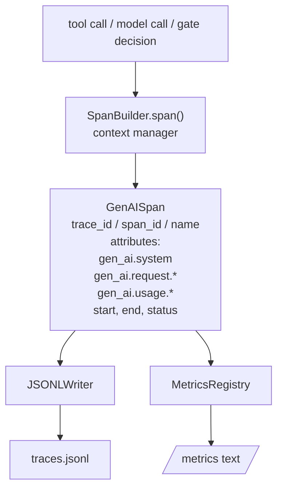
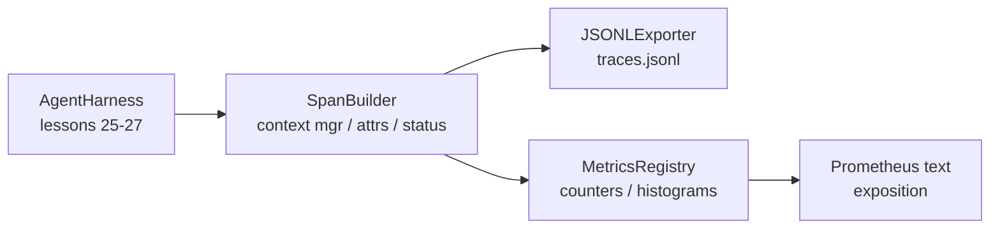

# 毕业课 28：基于 OTel GenAI Spans 和 Prometheus 指标的可观测性

> 没有可观测性的智能体框架只是一个花钱的黑箱。本课手工构建一个 span 构建器，发出符合 OpenTelemetry GenAI 语义约定的记录，以每行一个 span 的格式写入 JSON-Lines 文件，并以 Prometheus 文本格式暴露计数器和直方图。全部使用 Python 标准库，离线运行。

**类型：** 构建
**语言：** Python（标准库）
**前置要求：** Phase 19 第 25 课（验证门控），Phase 19 第 26 课（沙箱），Phase 19 第 27 课（评估框架），Phase 13 第 20 课（OpenTelemetry GenAI），Phase 14 第 23 课（OTel GenAI 约定）
**所需时间：** 约 90 分钟

## 学习目标

- 构建一个符合 OpenTelemetry GenAI 语义约定的 span 数据类。
- 实现一个 JSONL 导出器，每行写入一个自包含的 span。
- 构建带有标签和 Prometheus 文本格式输出的计数器和直方图。
- 将任何可调用对象包装在 span 上下文管理器中，记录持续时间、状态和异常。
- 验证发出的 span 能够通过 `json.loads` 往返转换并符合规范结构。

## 问题所在

生产环境中的编码智能体每轮对话产生三类工件：模型调用、工具执行和验证门控决策。没有结构化的遥测数据，这些都无法发挥作用。

第一种失败模式是缺失的追踪。周二出了问题，但唯一的记录是一个 500 行的聊天日志。没有记录哪个工具运行了、花了多长时间、有多少 token 进入了提示、或者门控是否拒绝了什么。智能体作者只能靠猜。

第二种失败模式是不可解析的追踪。框架写了 span，但使用了自己的临时字段名。Grafana、Honeycomb、Jaeger 或本地 CLI 都无法读取它们。团队技术栈中的现有工具全部浪费，因为 span 是非标准的。

第三种失败模式是未聚合的指标。你可以在追踪中看到一个慢的工具调用，但无法回答「最近一小时内 read_file 调用的 p95 延迟是多少？」因为只有追踪，没有指标。

OpenTelemetry GenAI 语义约定正是为此而存在的。它们定义了一小组标准属性，供跨 LLM 框架的 span 发出者共享。如果你的框架写入这些属性，每个兼容 OTel 的后端都能读取它们。

## 概念说明



框架中的每个操作都会产生一个 span。一个 span 有一个 trace id（整个智能体调用）、一个 span id（这一个操作）、一个名称（如 `gen_ai.chat`、`gen_ai.tool.execution`）、遵循 GenAI 约定的属性、开始和结束时间、以及状态。

GenAI 约定标准化了这些属性键：`gen_ai.system`（提供商，如 `anthropic`、`openai`）、`gen_ai.request.model`（模型 id）、`gen_ai.request.max_tokens`、`gen_ai.usage.input_tokens`、`gen_ai.usage.output_tokens`、`gen_ai.response.model`、`gen_ai.response.id`、`gen_ai.operation.name`，以及工具特定的键 `gen_ai.tool.name` 和 `gen_ai.tool.call.id`。

导出器写入 JSONL。每行一个 JSON 对象。这是下游工具能够流式处理、grep 和导入的最简单格式。真正的 OTel 导出器会使用 OTLP gRPC；本课的 JSONL 导出器是离线等价物，在任何工作站上都能以零退出码运行。

指标与追踪并存。每次工具调用时计数器递增：`tools_called_total{tool="read_file"}`。直方图记录观察到的延迟：`tool_latency_ms{tool="read_file"}`。两者都序列化为 Prometheus 文本输出格式，这是基于拉取的指标的事实标准。

```figure
trace-spans
```

## 架构



span 构建器是一个小类，具有 `span(name, attrs)` 方法，返回一个上下文管理器。上下文管理器在进入时记录开始时间，在退出时记录结束时间，附加异常信息（如果有的话），并将最终的 span 推送给导出器。

指标注册表是两个字典。计数器为 `{(name, frozen_labels): int}`。直方图将原始采样存储在列表中，在输出时序列化为 Prometheus 直方图桶。

## 你将构建的内容

`main.py` 提供：

1. `GenAISpan` 数据类：trace_id、span_id、parent_span_id、name、attributes、start_unix_nano、end_unix_nano、status、status_message、events。
2. `SpanBuilder` 类，带 `span(name, attrs, parent=None)` 上下文管理器。
3. `JSONLExporter` 类，带 `export(span)` 方法，追加一行。
4. `Counter` 和 `Histogram` 类加 `MetricsRegistry`。
5. `prometheus_exposition(registry)` 生成文本格式输出。
6. `wrap_tool_call(name)` 装饰器，发出 span 并更新指标。
7. 演示：合成一个完整的智能体调用（在工具 span 外围包裹 gen_ai.chat span），写入 traces.jsonl，打印 Prometheus 输出，以零退出码结束。

span id 和 trace id 是 16 字节的十六进制字符串，由 `os.urandom` 生成。这与 OTel 的 W3C trace context 一致。导出器不会抛出异常；IO 错误会被报告但框架继续运行。

直方图有一个固定的桶集合（OTel 默认的毫秒级延迟桶：5、10、25、50、100、250、500、1000、2500、5000、10000、+Inf）。采样存储为列表；输出时按需计算每个桶的计数。

## 为什么手工构建而不使用 opentelemetry-sdk

OTel Python SDK 是一个真正的依赖项。它也是数千行代码、OTLP 导出器的多进程架构、以及超出课程预算的运行时开销。手工构建版本教授的是线路格式。在生产环境中，你将相同的属性接入真正的 SDK，就能免费获得 OTLP 导出器、批处理和资源检测。

约定是稳定的。本课发出的线路格式在 2030 年仍然可以解析，因为 OTel 从不破坏 GenAI 属性名称；它们只增不改。

## 如何与 Track A 其余部分组合

第二十五课产生了门控链。第二十六课产生了沙箱。第二十七课产生了评估框架。第二十八课使三者都可观测。第二十九课将端到端演示的每一步都包装在 span 中，并在最后打印 Prometheus 文本。

## 运行方式

```bash
cd phases/19-capstone-projects/28-observability-otel-traces
python3 code/main.py
python3 -m pytest code/tests/ -v
```

演示在课程工作目录中生成一个 `traces.jsonl`（最后清理），然后打印三个 span 的样本，再打印计数器和直方图的 Prometheus 输出。测试验证 span 能够往返序列化、标准 GenAI 属性存在、计数器正确递增、以及直方图输出包含预期的桶计数。
