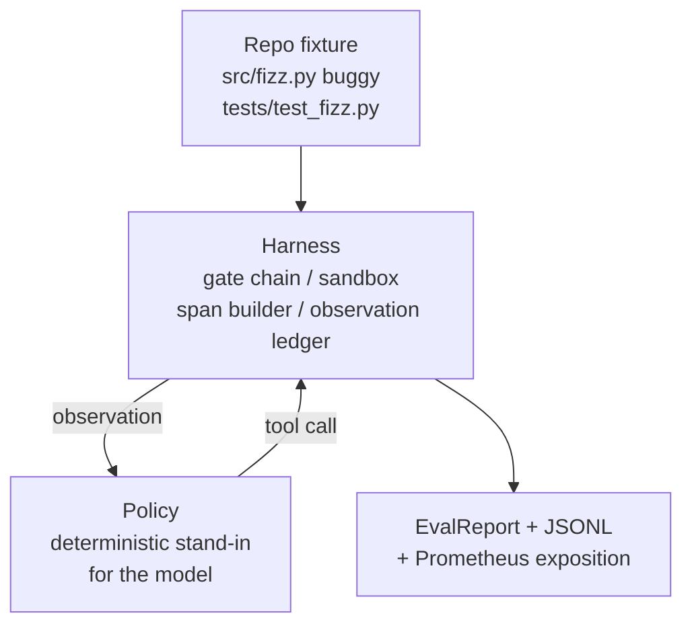
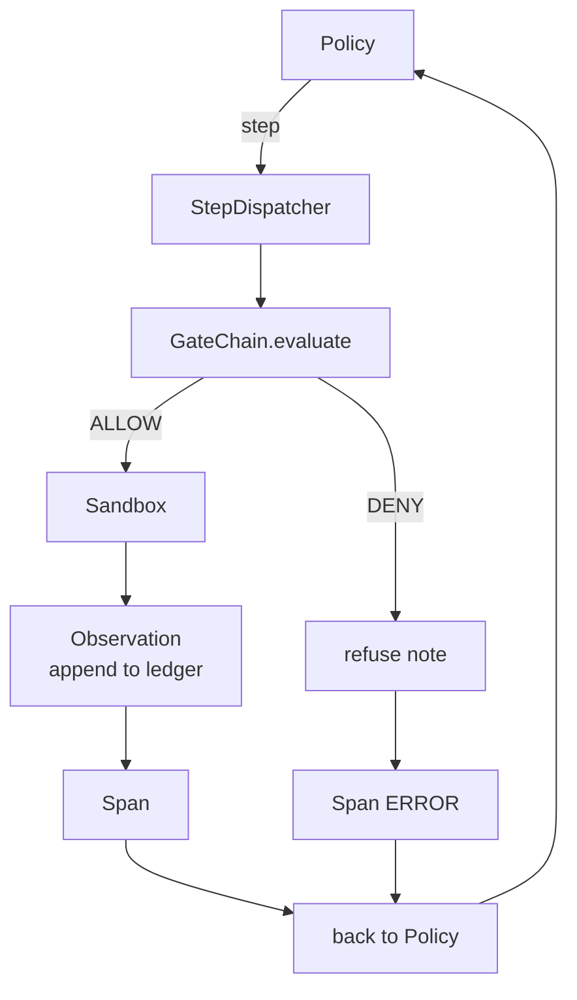

# 毕业课 29：基于框架的端到端编码智能体

> Track A 的最终成果。本课将门控链、沙箱、评估框架和 OTel span 缝合为一个可工作的编码智能体，在一个多文件 Python 项目中修复一个真实的（小型的、夹具级别的）bug。智能体是一个确定性策略，而不是 LLM；这种替换使课程可复现，并表明框架本身才是有趣的那部分。契约完全相同：真正的模型可以无缝接入策略接口。

**类型：** 构建
**语言：** Python（标准库）
**前置要求：** Phase 19 第 25 课（验证门控），Phase 19 第 26 课（沙箱），Phase 19 第 27 课（评估框架），Phase 19 第 28 课（可观测性），Phase 14 第 38 课（验证门控），Phase 14 第 41 课（真实仓库工作台），Phase 14 第 42 课（智能体工作台毕业项目）
**所需时间：** 约 90 分钟

## 学习目标

- 将门控链、沙箱、评估框架和 span 构建器组合成一个单一的智能体循环。
- 实现一个确定性策略，使用 read_file、run_tests 和 write_file 修复夹具 bug。
- 在端到端运行中强制执行全局步骤预算和观察 token 预算。
- 为完整运行发出 OTel GenAI 追踪和 Prometheus 指标。
- 验证智能体在 12 步以内解决夹具，且对合法工具的门控触发次数为零。

## 问题所在

大多数智能体演示都是孤立运行的：沙箱单独运行，评估框架单独运行，span 发出器单独运行。它们看起来没问题。一旦组合起来，接缝就暴露了。

门控链说 ALLOW，但沙箱以门控链未预料到的原因拒绝了。评估框架记录了通过，但 OTel span 表示门控拒绝了智能体声称使用的工具。Prometheus 计数器本应递增一次却递增了两次。观察预算被超出，但智能体继续运行，因为预算在门控链中跟踪而沙箱并不知道。

本课是整个 Track A 的集成测试。智能体必须按顺序完成四件事：读取项目、运行测试、从测试失败中识别 bug、编写修复、重新运行测试、然后停止。每个操作都经过门控链。每个工具执行都经过沙箱。每一步都被 span 包裹。评估框架在最后对整体进行评分。

## 概念说明



智能体的策略是一个状态机，包含五个状态。

`SURVEY`：智能体读取项目目录列表。下一个状态是 RUN_TESTS。

`RUN_TESTS`：智能体运行测试命令。如果测试通过，状态机以成功终止。否则下一个状态是 INSPECT。

`INSPECT`：智能体读取失败的源文件。下一个状态是 FIX。

`FIX`：智能体写入修正后的文件。下一个状态是 VERIFY。

`VERIFY`：智能体再次运行测试命令。如果测试通过，以成功终止。否则以失败终止。

每个状态对应一个工具调用。每个工具调用都经过门控链。如果工具调用被拒绝，智能体在追踪中报告拒绝并终止。

夹具 bug 是 `fizz.py` 中的一个差一错误。确定性策略通过正则表达式从测试失败信息中检测到 bug 并发出修正后的文件。将策略替换为 LLM 不会改变框架的契约。

## 架构



本课是自包含的。前面课程的每个原语都在 `main.py` 中以最小规模重新实现（门控、沙箱、账本、span），因此本课无需导入其他课程的代码。名称与第二十五至二十八课完全一致，使概念映射毫无歧义。

## 你将构建的内容

`main.py` 提供：

1. 最小化的框架原语，与第二十五至二十八课同名：`GateChain`、`Sandbox`、`ObservationLedger`、`SpanBuilder`、`MetricsRegistry`。
2. `CodingAgentPolicy` 类：具有五个状态的状态机。
3. `Repo` 辅助类：准备一个包含捆绑的有 bug 夹具的临时目录。
4. `AgentRun` 类：驱动策略，通过框架进行调度，返回 `AgentRunReport`。
5. 捆绑的夹具（`fixture_repo/`），包含 src/fizz.py、tests/test_fizz.py 和评估框架用的 expected/ 目录。
6. 演示：端到端运行策略，打印逐步追踪，断言通过，打印指标。

捆绑的夹具与第二十七课的任务结构相同：一个有 bug 的文件和一个测试文件。测试失败信息包含足够的信息，使确定性策略能够识别修复方案。真正的 LLM 会做同样的工作，更慢但召回更广，但它不会改变框架的期望。

## 为什么策略不是 LLM

真正的 LLM 需要 API 密钥、网络调用和不可验证的随机性。框架才是本课关注的部分。用确定性策略替代使课程可以在任何开发者的笔记本上零外部依赖运行，并且测试套件可以断言精确的步骤数。

本课的策略是 LLM 智能体所做工作的严格子集。策略读取仓库、看到失败的测试、识别出问题行、发出修复。LLM 经过相同的循环，遵循相同的框架契约；簿记完全相同。

## 演示断言了什么

端到端演示在退出时断言五件事，测试套件以编程方式重新断言它们。

策略在 12 步以内解决了夹具。

观察预算从未被超出。

对合法工具的门控拒绝次数为零。（智能体从未编造被拒绝的工具名称。）

每一步在 traces.jsonl 中都有对应的 span。

Prometheus 输出包含 `tools_called_total{tool="read_file"}` 条目和 `tool_latency_ms` 直方图。

## 如何与 Track A 其余部分组合

本课是集成。第二十五课编写了门控链。第二十六课编写了沙箱。第二十七课编写了评估框架。第二十八课编写了可观测性。第二十九课证明它们作为一个系统协同工作。真正的智能体框架从这里开始扩展：将确定性策略替换为模型，将捆绑的夹具替换为真实仓库任务，将 JSONL 导出器替换为 OTLP。

## 运行方式

```bash
cd phases/19-capstone-projects/29-end-to-end-coding-task-demo
python3 code/main.py
python3 -m pytest code/tests/ -v
```

演示打印逐步追踪、最终评估报告和 Prometheus 输出。退出码为零。测试覆盖了策略状态转换、对合成工具调用的门控拒绝、捆绑夹具的端到端运行、以及步骤预算不变量。
