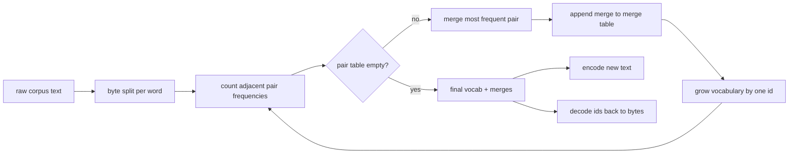
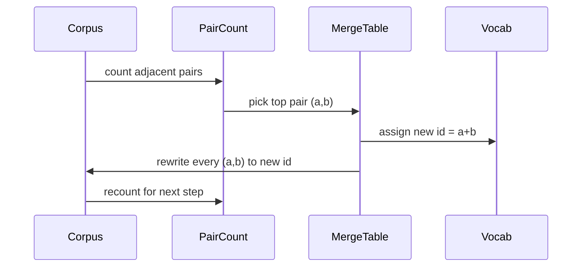

# 从零构建 BPE 分词器

> 字节进，id 出，id 还原为相同的字节。构建每个现代文本模型至今仍在使用的分词器。

**类型：** Build
**语言：** Python
**前置要求：** Phase 04 课程，Phase 07 Transformer 课程
**所需时间：** 约 90 分钟

## 学习目标
- 通过反复合并最频繁的相邻符号对，从原始文本语料库训练字节对编码（BPE）词表。
- 实现确定性合并表，将其应用于新文本以生成子词 id 流。
- 将任意 UTF-8 输入往返转换为 id 并还原，无信息损失。
- 保留并保护特殊 token（endoftext 和 pad），使其在训练和解码过程中不受影响。
- 理解为什么字节级字母表是通用分词器的正确基础。

## 框架说明

语言模型从不直接看到文本。它看到的是整数。字符串到整数列表的映射及其反向映射就是分词器。如果这一层出错，训练运行中的每条损失曲线都在衡量错误的东西。

通用文本模型的主流子词分词器家族是字节对编码（BPE）。思路很简单：从一个已知字母表开始；在训练语料库中找到出现频率最高的相邻符号对；将其合并为一个新符号；重复此过程直到词表达到目标大小。编码新文本时，按相同顺序复用合并列表。

我们将构建字节级变体。字母表是 256 个原始字节，而非 Unicode 码点。正是这一选择使得分词器能够处理任何 UTF-8 输入，而无需回退到未知 token。

## 流水线

训练端和推理端共享合并表。这一共享就是契约。如果在推理时改变合并顺序，你解码出来的 id 流就会不同。

## 字节字母表

前 256 个 id 保留给原始字节 0x00 到 0xFF。这保证了在任何合并发生之前，每个输入字符串都可以在词表中表达。在字节块之后，我们保留一小段范围给特殊 token。训练循环永远不会将这些 id 提出为合并目标，因为我们完全将它们排除在预分词流之外。

预分词器在训练之前将语料库按空白和标点边界进行分割。没有这个分割，BPE 合并步骤会很乐意学习跨越词边界的合并，词表会被常见短语填满。有了这个分割，合并保持在词内，结果更具泛化能力。

## 训练循环

每个训练步骤做三件事。遍历语料库中的每个词，统计每对相邻符号的出现频率（按词本身的出现频率加权）。选择计数最高的那对。将该对的每次出现重写为一个新符号，其 id 是词表中下一个空闲位置。然后记录这次合并。

每一步的成本与语料库的符号序列列表大小成线性关系。对于一百万个词和一万个 id 的目标词表，循环在几秒内即可完成，因为符号序列会随着合并的进行而缩短。

## 编码新文本

推理时不会调用合并计数器。它按学习时的相同顺序应用合并表。对于一个新词，编码器从字节分割开始。它扫描当前序列，找到排名最低的（最早可应用的）合并。执行该合并。再次扫描。当表中没有合并可应用于当前序列时，循环结束。

按排名排序的特性使得编码具有确定性，并与训练时在相同输入上的行为一致。先学到的合并排在表的前面，首先被应用。如果两个合并可以在同一位置应用，排名更低的那个优先。

## 特殊 token

特殊 token 是字节流永远无法产生的 id。我们手动保留它们。两个对本课来说就够了。

- `<|endoftext|>` 在预训练期间分隔文档。它告诉模型新文档从这里开始，不要让前一个文档的上下文泄漏进来。
- `<|pad|>` 填充短序列，使批次可以成为矩形张量。损失掩码在训练期间将其隐藏。

编码器接受一个标志来允许输入中的特殊 token。关闭标志时，字符串会被当作拼写它们的字节进行分词。开启标志时，字面字符串会被映射到它们的保留 id，不受任何合并影响。

## 往返保证

编码后解码必须精确返回输入字节。解码器按顺序拼接每个 id 的字节展开。由于每个 id 要么是原始字节，要么是两个已知 id 的拼接，递归展开总是终止于原始字节。解码随后返回这些字节拼写的 UTF-8 字符串。

本课的测试套件在未见过的句子、包含 Unicode 表情符号的句子，以及包含字面特殊 endoftext token 的句子上检查这一属性。

## 本课不涉及的内容

本课不构建以最大生产分词器风格的正则驱动预分词器。这里的预分词器是一个简单的空白和标点分割。它足以在小型训练语料库上产生合理的合并，与课程链其余部分的契约保持不变。下一课将分词器视为黑盒，在其上构建滑动窗口数据集。

本课不对配对计数器进行并行化。Python 循环遍历几千个词的语料库在远不到一秒内完成。对于更大的语料库，显而易见的做法是并行统计每个词中的配对然后归约。

## 代码阅读指南

`main.py` 定义了四个对象。`BPETokenizer` 持有词表、合并表和特殊 token 表。`train` 是训练循环。`encode` 是推理路径。`decode` 是字节拼接。底部的演示在内置语料库上训练一个小分词器，编码一个留出句子，将 id 解码回来，并打印两者。`code/tests/test_bpe.py` 中的测试固定了往返属性、特殊 token 保留和合并排序。

运行演示。然后将演示中的目标词表大小从 300 改为 600，观察留出句子的编码长度如何下降。这条曲线就是 BPE 压缩曲线。
