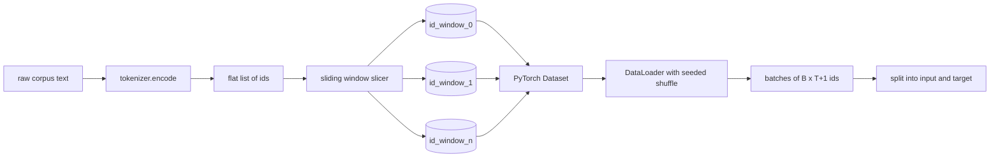
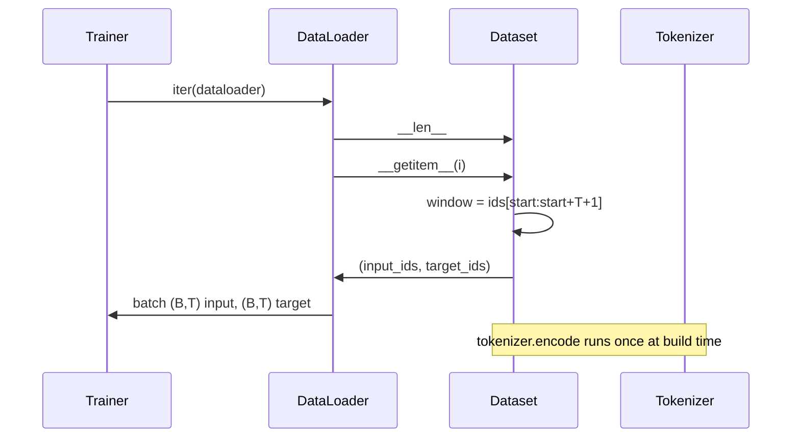

# 滑动窗口分词数据集

> 预训练运行的本质，是一个从 token id 到梯度的函数。本课构建的就是输送 id 的传送带。

**类型：** 构建
**语言：** Python
**前置要求：** Phase 04 课程，Phase 07 Transformer 课程，本阶段第 30 课
**所需时间：** 约 90 分钟

## 学习目标
- 通过一次分词器调用，将原始语料转换为 token id 流。
- 以可配置的重叠步幅将 id 流切分为固定长度的窗口。
- 构建一个 PyTorch Dataset，返回用于下一个 token 预测的输入和目标张量。
- 将数据集封装到带有每轮确定性随机种子的 DataLoader 中。
- 理解步幅、冗余度与有效数据集大小之间的权衡关系。

## 框架说明

预训练运行每次读取一批 token id 并更新模型。每批数据的形状由训练契约固定。对于因果语言模型，批次包含 `(B, T)` 个输入 id 和 `(B, T)` 个目标 id，其中目标是输入左移一位的结果。数据管道的任务就是按需、以确定性和可复现的方式，从可能达数 GB 的原始文本语料中产出这个契约。

本课构建这条流水线。上一课的分词器将文本转换为一个长而扁平的 id 列表。滑动窗口将该列表切分为训练样本。自定义 Dataset 将样本暴露为张量。DataLoader 将它们组装成批次，并使用已知种子进行打乱。

## 形状约定

因果语言模型消费形状为 `(B, T)` 的 id，其中 `B` 是批次大小，`T` 是上下文长度。位置 `t` 处的目标是位置 `t+1` 处的输入。这意味着每个训练样本覆盖 `T+1` 个原始 id。窗口步幅控制着相邻样本之间的重叠程度。

切分器不会跨越语料的边界。如果最后一个窗口没有足够的 id 填满 `T+1` 个位置，切分器会将其丢弃。用 `<|pad|>` 填充尾部也是可行的做法，但会使损失掩码变得复杂。本课选择丢弃。

## 为什么用滑动窗口

预训练语料是一条很长的 id 流。如果模型只看到不重叠的窗口，每个训练样本都会教它相同的 `T` 个边界。调整步幅可以让这些边界位置变化，从而使模型看到更多样化的"预测下一个 token"任务。

步幅为 `T` 产生不重叠的窗口。步幅为 `T // 2` 产生百分之五十的重叠，有效数据集加倍。步幅为 `1` 产生最大重叠，数据集扩大 `T` 倍。代价是每轮计算量更大。收益是更多边界多样性。大多数预训练运行使用等于上下文长度的步幅，因为语料已经远大于模型一轮能处理的量，所以边界多样性的论点较弱。

## Dataset 类

PyTorch Dataset 有两个必需方法。`__len__` 返回样本数量。`__getitem__` 返回一个样本作为张量对。我们的 Dataset 存储编码后的 id 流和步幅。索引时动态计算窗口起始位置，因此无论步幅产生多少样本，内存开销始终只有一份 id 流的拷贝。

移位操作在 `__getitem__` 内部完成。Dataset 返回 `(input, target)`，其中 `input = window[:-1]`，`target = window[1:]`。两者都是 PyTorch 长整型张量。训练循环将它们视为真实标签。

## 确定性打乱

设置 `shuffle=True` 的 DataLoader 从 PyTorch 随机生成器中读取。通过传入一个显式的 `torch.Generator` 并按轮次设置种子，我们可以在每次重新运行时获得相同的打乱顺序。当你想比较仅在单个超参数上不同的两次运行时，这个特性很重要。没有种子，两次运行的数据顺序不同，损失曲线会因与改动无关的原因而发散。

本课的种子契约很简单：`epoch_seed = base_seed + epoch_index`。基本种子在构造时传入。轮次索引由训练器在每轮开始时递增。使用相同基本种子的重新运行，每一轮都会看到相同的顺序。

## 批次采样器

PyTorch 的默认采样器以均匀随机方式（不放回）选取索引。这正是预训练所需要的。在小数据集上微调时契约相同。DataLoader 通过调用 `B` 次 `__getitem__` 并堆叠结果来组装一个批次。由于每个样本长度一致（由构造决定），不需要填充逻辑。

本课为了简洁将 `num_workers` 设为 0。在生产运行中，工作进程会并行化 `__getitem__` 调用。对于我们的流水线，这基本是空操作，因为工作只是对内存中张量的切片，但同样的 Dataset API 可以干净地支持多进程。

## 样本计数

对于长度为 `N` 的 id 流，上下文长度 `T`，步幅 `S`，样本数量为 `max(0, 1 + (N - (T + 1)) // S)`。本课将此计算作为 Dataset 的静态方法暴露出来，这样训练器无需遍历即可计算每轮的总步数。

## 本课不涉及的内容

本课不涉及磁盘流式加载。语料在内存中完整编码并保存为单个张量。对于几百万个 id 的语料，这远低于一百 MB，适合本课的教学目的。磁盘流式加载是一个独立的关注点，只需替换存储层即可接入，同时保持 Dataset 契约不变。

本课不涉及多文档处理。语料被视为一条连续的 id 流。当语料由多个文档构建时，通过插入 `document` id 来编码文档边界。模型学会围绕边界进行预测。

## 代码阅读指南

`main.py` 定义了两个类和一个辅助函数。`SlidingWindowDataset` 是 PyTorch Dataset。`make_dataloader` 返回一个配置好的、带有种子生成器的 DataLoader。`_encode_corpus_to_ids` 是一次性的分词器调用。底部的演示在进程内构建一个小型分词器，编码内置语料，构造数据集和数据加载器，打印一个批次，并断言形状约定。`code/tests/test_dataset.py` 中的测试锁定了窗口计数公式、移位一位的特性、确定性打乱和步幅权衡。

运行演示。然后将上下文长度从 16 改为 32，观察每轮样本数量如何下降。这个数字就是你的每轮步数预算。
