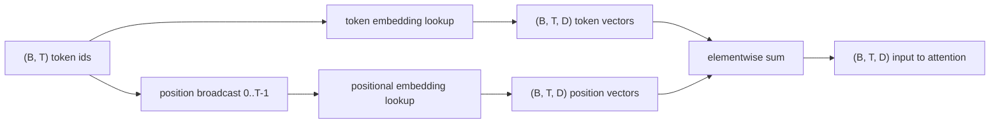
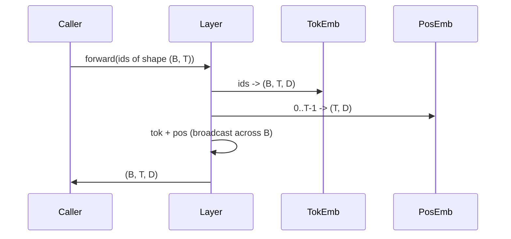

# Token 与位置嵌入

> id 是整数，模型需要的是向量。两张查找表介于两者之间，而位置表的选择决定了模型能学到什么。

**类型：** 构建
**语言：** Python
**前置要求：** Phase 04 课程，Phase 07 Transformer 课程，本阶段第 30 和 31 课
**所需时间：** 约 90 分钟

## 学习目标
- 构建一个 token 嵌入查找表，将词汇 id 映射到稠密向量。
- 构建一个可学习的位置嵌入查找表，按位置索引。
- 构建一个固定的正弦位置嵌入，按位置索引且无参数。
- 将 token 嵌入和位置嵌入组合为 Transformer 块的单一输入。
- 对比可学习嵌入和正弦嵌入在长度泛化和参数量上的差异。

## 框架说明

模型与 token id 的第一次接触是在 token 嵌入矩阵中进行行查找。矩阵的每一行对应一个词汇 id，每一列对应一个模型维度。查找返回一个向量，模型的其余部分将其视为该 id 的含义。反向传播更新前向传播中使用过的行。在训练过程中，这些行的几何结构逐渐学会了在方向上编码相似性。

token id 本身没有顺序。模型需要第二个信号来告知位置一与位置十七不同。该信号的两种主流选择是可学习的位置嵌入（第二张查找表，每个位置一行）和固定的正弦位置嵌入（无参数的数学公式）。这个选择有其后果。可学习表是一个参数，受限于模型训练时的最大上下文长度。正弦表理论上无参数，且公式可以扩展到任意位置，但本课的 `SinusoidalPositionalEmbedding` 在 `max_context_length` 处预计算了一张固定表，其 `forward` 在超出该边界时会报错；因此两个模块都强制了最大上下文长度。即使表足够大可以索引，模型在超出训练长度后仍可能表现不佳。

本课构建两者，并将它们与 token 嵌入组合为下一课注意力块的单一输入。

## 形状约定

嵌入阶段的输入是一个形状为 `(B, T)` 的 token id 批次。输出是一个形状为 `(B, T, D)` 的张量，其中 `D` 是模型维度。每个批次元素具有相同的上下文长度 `T`。每个位置具有相同的向量维度 `D`。



组合方式是求和，而非拼接。求和使 `D` 在整个网络中保持不变，并让模型在每个特征维度上自行决定在每一层中 token 含义和位置信息哪个占主导。

## Token 嵌入矩阵

token 嵌入是一个形状为 `(V, D)` 的参数张量，其中 `V` 是词汇表大小。PyTorch 通过 `nn.Embedding(V, D)` 暴露它。初始化时，条目从一个小高斯分布中采样，对于 Transformer 规模的模型，传统上均值为零、标准差约为 `0.02`。具体初始化方式不如跨运行保持一致来得重要。

前向传播是一次索引操作。PyTorch 通过行收集将 `(B, T)` 个 int64 id 映射为 `(B, T, D)` 个浮点数。反向传播仅将梯度累积到前向传播中触及的行。在该步中从未出现在批次中的两行收到零梯度。

一个微妙的细节。token 嵌入和模型末端的输出投影通常共享权重（权重绑定）。当这种情况发生时，每次反向传播都会通过输出侧触及嵌入的每一行。本课将两者作为独立模块暴露，但在完整模型中同一矩阵可以同时扮演两个角色。

## 可学习位置嵌入

可学习的位置嵌入是第二个形状为 `(max_context_length, D)` 的 `nn.Embedding`。查找按键为位置 id `0, 1, 2, ..., T-1`。前向传播将该位置向量沿批次维度广播。

可学习表的缺点在于，如果模型只训练到位置 `T-1`，则无法在位置 `T` 处查询——该行不存在。使用此方案的生产级仅解码器模型将最大上下文长度硬编码到架构中，拒绝处理更长的输入。

## 正弦位置嵌入

正弦位置嵌入是一个从位置到向量的函数。位置 `p` 和特征 `i` 产生

```python
angle = p / (10000 ** (2 * (i // 2) / D))
emb[p, 2k]     = sin(angle)
emb[p, 2k + 1] = cos(angle)
```

该函数没有参数。每个位置都有一个唯一的向量。波长在特征维度上呈几何变化，因此低维度编码粗略位置，高维度编码精细位置。

由 `sin` 和 `cos` 共同选择所决定的特性是：位置 `p + k` 处的向量是位置 `p` 处向量的线性函数。这为注意力层学习相对位置偏移提供了一条简单路径。模型不需要单独的参数来表达"回看五个 token"。

本课在构造时计算完整的正弦表，在前向传播时索引查找。

## 组合方式

输入流水线按顺序做三件事：读取 token id，查找 token 向量，加上位置向量，返回求和结果。



求和步骤中的广播将 `(T, D)` 的位置张量沿批次维度复制。PyTorch 自动处理这一点，因为位置张量在 unsqueeze 后形状为 `(1, T, D)`。

## 对比分析

本课在相同输入上运行两种变体并打印两项诊断指标。

第一项是参数量。可学习变体在 token 嵌入之上额外增加了 `max_context_length * D` 个参数。正弦变体增加零个参数。

第二项是相邻位置嵌入之间的余弦相似度。正弦变体具有平滑且可预测的衰减，因为该函数是连续的。可学习变体在初始化时相似度接近随机，因为各行是独立采样的。经过训练后，可学习变体通常会发展出类似的平滑结构，但它必须从数据中发现这一结构。

## 本课不涉及的内容

本课不构建旋转位置编码（RoPE）或 AliBi。它们是生产级 Transformer 中的现代选择。两者都遵循与本课嵌入相同的形状约定（对形状为 `(B, T, D)` 的向量施加与位置相关的变换），但它们在注意力投影步骤而非输入步骤中应用。下一课构建注意力块，其中一个可选扩展就是在查询-键投影中融入旋转编码。

本课不训练嵌入。训练需要损失函数，损失函数需要模型输出，模型输出需要注意力和 LM 头。那是下一课和再下一课的内容。

## 代码阅读指南

`main.py` 定义了三个模块。`TokenEmbedding` 封装了 `nn.Embedding(V, D)`。`LearnedPositionalEmbedding` 封装了 `nn.Embedding(L, D)`。`SinusoidalPositionalEmbedding` 预计算表格并将其作为缓冲区暴露。`EmbeddingComposer` 将 token 嵌入和位置嵌入组合在一起。底部的演示打印形状、参数量和相邻位置相似度诊断。`code/tests/test_embeddings.py` 中的测试锁定了形状、广播行为、参数量和正弦公式。

运行演示。然后将模型维度 `D` 从 64 改为 32，观察正弦波长带如何变化。
