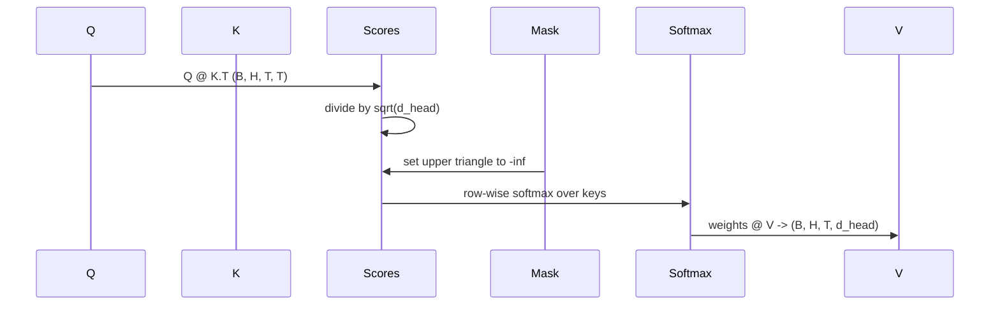

# 多头自注意力

> 一次线性投影，三个视角，H 个并行头，一个掩码。这就是模型实际使用的注意力块。

**类型：** 构建
**语言：** Python
**前置要求：** Phase 04 课程，Phase 07 Transformer 课程，本阶段第 30 至 32 课
**所需时间：** 约 90 分钟

## 学习目标
- 实现一个批量的查询/键/值投影，作为单个线性层拆分为 H 个头。
- 以正确的归一化和数据类型处理计算缩放点积注意力。
- 应用因果掩码，阻止位置关注未来位置。
- 检查固定输入下每个头的注意力权重，分析每个头关注的内容。
- 在一个玩具任务上训练小型注意力块，观察随着头部专业化损失下降。

## 框架说明

注意力是一种让某个 token 的表示从同一序列中其他 token 提取信息的函数。自注意力意味着查询、键和值都来自同一输入。多头意味着投影被拆分为 H 个并行的注意力问题，其输出被拼接后重新投影。

高效的实现模式是：一个线性层从 `D` 投影到 `3 * D`，然后切分为三个视图，再重塑为 H 个头，每个头的大小为 `D // H`。矩阵乘法、softmax 和加权求和作为批量张量运算执行，因此各头在加速器上并行运行。

本课构建这个块。同时加入因果掩码，使同一代码可以作为仅解码器语言模型中的注意力层使用。下一课将该块堆叠为完整的 Transformer，再下一课对其进行训练。

## 形状约定

输入为 `(B, T, D)`。输出为 `(B, T, D)`。掩码为 `(T, T)` 或可广播到该形状。块内部的中间张量形状为 `(B, H, T, d_head)`，其中 `d_head = D // H`。约束条件是 `D % H == 0`。

```mermaid
flowchart LR
    A["(B, T, D) input"] --> B[Linear D -> 3D]
    B --> C["split into Q, K, V"]
    C --> D["reshape to (B, H, T, d_head)"]
    D --> E["scores = Q @ K.T / sqrt(d_head)"]
    E --> F[apply causal mask]
    F --> G[softmax over keys]
    G --> H["context = weights @ V"]
    H --> I["reshape to (B, T, D)"]
    I --> J[output Linear D -> D]
    J --> K["(B, T, D) output"]
```

两个线性层（QKV 投影和输出投影）是块中唯一的参数。掩码、softmax、矩阵乘法和重塑都是无参数操作。

## QKV 拆分

朴素实现使用三个独立的线性层，分别对应 Q、K、V。高效实现使用一个输出 `3 * D` 个特征的单层，然后拆分结果。两者在数学上等价，因为三个分别乘以 `(D, D)` 权重的矩阵乘法，恰好等同于一个乘以由它们堆叠而成的 `(3D, D)` 权重的矩阵乘法。

高效版本更快，因为加速器只启动一次矩阵乘法而非三次。初始化也更简单，因为三个子矩阵位于同一参数张量中，可以一起初始化。

## 头部重塑

拆分后，Q、K、V 各为 `(B, T, D)`。为了将它们变成 H 个并行的注意力问题，我们重塑为 `(B, T, H, d_head)` 并转置为 `(B, H, T, d_head)`。头维度现在紧邻批次维度，因此 PyTorch 将每个头的注意力视为跨 `B * H` 个独立实例的批量操作。

d_head 维度保持在最后，这样分数矩阵乘法 `Q @ K.transpose(-2, -1)` 会将其收缩。结果是每个头的注意力分数 `(B, H, T, T)`。

## 缩放

分数在 softmax 之前除以 `sqrt(d_head)`。如果没有这个缩放，点积会随着 `d_head` 的增长而增长，将 softmax 推入一个极端区域——其中一个条目几乎占据全部概率质量，其余的趋近于零。该区域的梯度很小，学习会停滞。除以 `sqrt(d_head)` 可以使分数的方差在不同头大小下大致保持恒定。

## 因果掩码

仅解码器的语言模型在预测下一个 token 时只能基于过去的信息。掩码强制执行这一点。具体来说，在 softmax 之前，`(T, T)` 分数矩阵对角线以上的每个条目都被替换为负无穷。经过 softmax 后，这些位置的权重为零。

我们在构造时将掩码注册为缓冲区，使其与模型在同一设备上且不属于梯度图。掩码覆盖该块将看到的最大上下文长度。前向传播时，我们切取左上角的 `(T, T)` 部分。

## 输出投影

在获得每个头的上下文向量 `(B, H, T, d_head)` 后，我们转置回 `(B, T, H, d_head)`，重塑为 `(B, T, D)`，并应用最终的 `(D, D)` 线性投影。输出投影让模型能够混合各头的信息。没有它，H 个头只能通过后续层重新组合，该块会受到人为限制。

## 注意力权重检查

本课在前向传播上暴露了一个 `return_weights=True` 标志。设置后，块会返回形状为 `(B, H, T, T)` 的每个头注意力权重以及输出。演示在短输入上打印一个头的权重热力图，让你看到因果三角结构和每个位置的聚焦模式。

在训练好的模型中，不同的头学习不同的模式。有些头关注紧邻的前一个 token。有些头关注序列的开头。有些头几乎均匀分散注意力。这个检查钩子是可解释性工作的入口。

## 训练演示

`main.py` 底部的演示将注意力块连接到一个微型 LM 头，并在重复任务上训练整个模型。输入的每一行是单个随机 id 在上下文中的复制。目标是输入移位一位后的结果，因此模型必须学会下一个 token 与前一个 token 相同。损失函数是交叉熵。使用 H=4、D=32、T=12 和 64 的词汇表，在 CPU 上经过三个轮次，损失从随机水平（约 `log(64) ~ 4.16`）下降到远低于 `1.0`。

演示的目的不是训练一个有用的模型。目的是确认梯度流经块的每个部分，并且头部在一个答案显而易见的问题上学到了东西。

## 本课不涉及的内容

本课不添加前馈块。真实模型中的 Transformer 层是注意力后接一个带残差连接和层归一化的两层 MLP。下一课添加这些。

本课不实现旋转或 AliBi 位置编码。两者都在同一块的 QKV 投影步骤中应用，但它们是独立的教学单元。本课构建的块通过在矩阵乘法之前变换 Q 和 K 来兼容两者。

本课不实现推理用的 KV 缓存。跨前向传播缓存键和值是使自回归解码快速的优化。它改变了 K 和 V 张量的形状约定，但不改变 Q。它属于推理课程的内容。

## 代码阅读指南

`main.py` 定义了 `MultiHeadSelfAttention`。该类包含两个线性层和一个注册的掩码缓冲区。前向传播依次进行投影、重塑、评分、掩码、softmax、加权、重塑和再次投影。底部的演示构建了一个小型模型，将注意力与 token 嵌入、位置嵌入和 LM 头包装在一起，在复制任务上训练三个轮次，并打印损失曲线和每个头的注意力热力图。`code/tests/test_attention.py` 中的测试锁定了形状约定、因果性特性、softmax 特性、头拆分特性和梯度流。

运行演示。然后将 `n_heads` 从 4 增加到 8（保持 `d_model=32`，所以 `d_head=4`），观察热力图如何变化。
