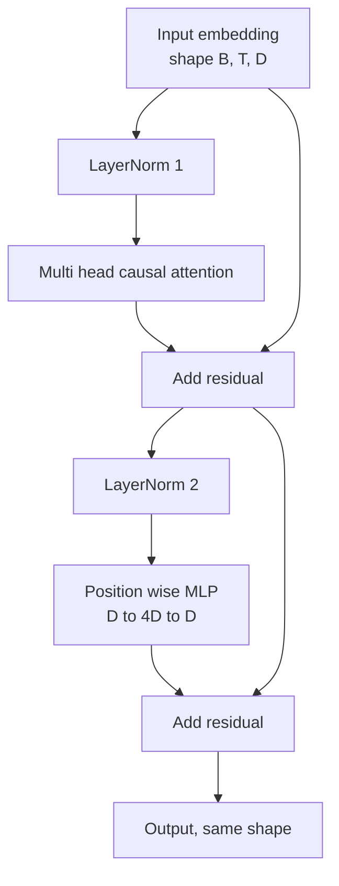
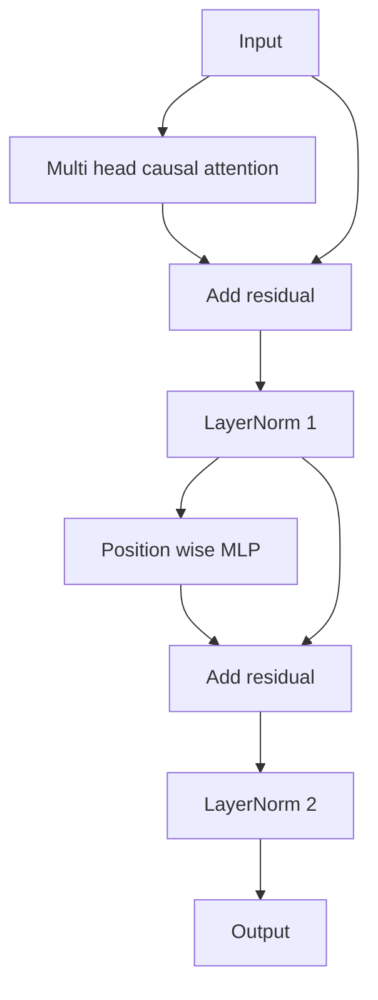

# 从零构建 Transformer 块

> 一个块是所有现代仅解码器 LLM 的基本单元。层归一化、多头注意力、残差连接、MLP、残差连接。Pre-LN 变体无需预热即可稳定训练。Post-LN 变体是原始论文所采用的方案。本课并排构建两者，并展示在常见学习率下哪一个能在 12 层堆叠中存活。

**类型：** 构建
**语言：** Python
**前置要求：** Phase 19 第 30 至 33 课（分词器、嵌入、注意力数学、批量数据加载器）
**所需时间：** 约 90 分钟

## 学习目标

- 从四个核心组件出发，在 PyTorch 中构建 Transformer 块：LayerNorm、多头因果注意力、残差连接、逐位置 MLP。
- 将 LayerNorm 放置在两种配置（pre-LN 和 post-LN）中，并解释为何其中一种无需预热即可稳定训练。
- 在多头注意力内部实现因果掩码，使 token `i` 无法看到 token `j > i`。
- 在 12 层堆叠上追踪两种变体的梯度流，并读懂结果。
- 将该块作为即插即用单元复用，供下一课组装 1.24 亿参数的 GPT。

## 问题所在

Transformer 就是一个块的重复。块搞错一次，重复十二次，你得到的模型要么在第一轮就发散，要么此后一直需要预热技巧。本课中你会看到的两种失败模式并不罕见——学习者第一次朴素堆叠块时就会遇到。一种是注意力层关注了未来。另一种是 LayerNorm 放在了无法在深度上驯服残差信号的位置。

一旦你看清问题，修复就是机械性的。块恰好有两条残差路径和两个归一化位置。选对位置，其余的堆叠只是记账工作。

## 概念说明

每个仅解码器 Transformer 块是一个函数，接受形状为 `(batch, sequence, embedding)` 的张量，返回相同形状的张量。内部有两个子层负责计算。



这是 pre-LN 变体。LayerNorm 位于残差分支内部，在子层之前。残差连接传递未归一化的信号。

post-LN 变体将 LayerNorm 移到残差加法之后。



形状相同。训练行为不同。在 post-LN 中，流经残差路径的梯度必须经过 LayerNorm。在深度为十二、学习率为 `3e-4` 时，该梯度收缩得足够快，需要预热调度。Pre-LN 让残差路径保持未归一化状态，因此梯度可以干净地传播到嵌入层。正因如此，GPT-2 及之后的模型都采用 pre-LN 配置。

### 因果多头注意力

注意力子层将输入以三种方式投影为查询、键、值张量。每个张量从 `(B, T, D)` 重塑为 `(B, H, T, D/H)`，其中 `H` 是头数。缩放点积注意力对每个头计算 `softmax(Q K^T / sqrt(d_k))`，将上三角掩码为负无穷，通过 softmax 应用掩码，然后乘以 `V`。各头拼接回单个 `(B, T, D)` 张量并再次投影。掩码是使模型具有因果性的唯一部分。忘记掩码，你就是在训练一个作弊的模型。

### MLP

逐位置 MLP 对每个 token 独立应用相同的两层网络。隐藏宽度是嵌入宽度的四倍，激活函数是 GELU，第二个线性层后跟 Dropout。MLP 内部 token 之间不交流。所有 token 混合发生在注意力中。

### 残差连接做两件事

它们使梯度路径在深度上是加性的，从而保持梯度范数在十二层中的尺度。它们还让每个块学习对运行表示的加性更新，而非完全替换。这两个效应是该块能够扩展的原因。

## 开始构建

`code/main.py` 实现了：

- `class LayerNorm`：带有可学习缩放和偏移、偏置 eps、按 token 向量应用。
- `class MultiHeadAttention`：带 `num_heads`、`head_dim = d_model // num_heads`、融合 QKV 投影、注册因果掩码、注意力和残差 Dropout。
- `class FeedForward`：两个线性层、GELU 激活、Dropout。
- `class TransformerBlock`：带 `pre_ln` 标志切换两种变体。
- 一个演示：构建 6 层 pre-LN 堆叠和 6 层 post-LN 堆叠，使用相同输入，打印（a）输出形状，（b）一次反向传播后嵌入层的梯度范数。

运行：

```bash
python3 code/main.py
```

输出：两种堆叠的形状检查，并排的梯度范数。在相同学习率下，pre-LN 堆叠的嵌入梯度比 post-LN 堆叠大一个数量级——这就是 pre-LN 无需预热即可训练的经验信号。

## 技术栈

- `torch` 用于张量数学、autograd 和 `nn.Module` 管道。
- 不使用 `transformers`，不使用预训练权重。该块从原语实现。

## 生产实践模式

三个模式将教科书块变成可发布的产品。

**融合 QKV 投影。** 三个独立的线性层需要三次内核启动和三次矩阵乘法。一个宽度为 `3 * d_model` 的线性层在一次启动中完成相同工作，然后沿最后一个轴拆分输出。融合路径在所有加速器上都更快，并且与 GPT-2、LLaMA 和 Mistral 的参考实现一致。

**注册因果掩码缓冲区。** 掩码仅依赖于最大上下文长度。在构造时用 `register_buffer` 分配一次，每次前向传播切取活跃窗口，避免每次调用时的分配。忘记这一点会使掩码成为长上下文时的分配器热点。

**两处 Dropout，而非三处。** Dropout 属于注意力 softmax 之后（注意力 Dropout）和 MLP 第二个线性层之后（残差 Dropout）。在残差本身上加 Dropout 会破坏加性恒等性，而该恒等性使梯度能在深度上流动。一些早期实现搞错了这一点，并为此付出了训练脆弱的代价。

## 使用示例

- 本课的块可以直接插入第 35 课的 GPT 组装中，无需修改。
- Pre-LN 变体是每个现代开放权重 LLM 使用的方案。Post-LN 变体是 2017 年原始注意力论文使用的方案。了解两者足以阅读你将遇到的任何仅解码器架构。
- 将 GELU 替换为 SiLU 就得到 LLaMA 系列的激活函数。将 LayerNorm 替换为 RMSNorm 就得到 LLaMA 系列的归一化。同样的骨架。

## 练习

1. 为块中的每个线性层添加 `bias=False` 标志。现代开放权重 LLM 在线性层上不使用偏置。测量在 12 层 768 维模型中节省了多少参数。
2. 用手工实现的 RMSNorm 替换 `nn.LayerNorm`，验证输出形状不变。
3. 添加一个标志，将第一个头的注意力权重作为 `(B, T, T)` 张量返回。绘制上三角以确认 softmax 后为零。
4. 构建一个健全性检查：将形状为 `(2, 16, 384)` 的张量（`H=6`）分别通过两种变体，断言前向输出不同（例如 `not torch.allclose`），条件是权重相同初始化且 Dropout 为零。

## 关键术语

| 术语 | 常见说法 | 实际含义 |
|------|----------|----------|
| Pre-LN | "Pre norm" | LayerNorm 位于残差分支内部，在每个子层之前；残差传递未归一化的信号 |
| Post-LN | "Post norm" | LayerNorm 在残差加法之后；2017 论文采用的方案，需要预热 |
| 因果掩码 | "Triangle mask" | 注意力 logits 的上三角设为负无穷，使 token i 在 j > i 时无法读取 token j |
| 融合 QKV | "Combined projection" | 一个宽度为 3D 的线性层替代三个宽度为 D 的线性层；一次内核启动，一次矩阵乘法 |
| 残差流 | "Skip connection" | 自上而下流经每个块的未归一化张量；每个块对其做加法 |

## 延伸阅读

- Phase 7 第 02 课（从零构建自注意力）——本块底层的注意力数学。
- Phase 7 第 05 课（完整 Transformer）——同一骨架的编码器-解码器版本。
- Phase 10 第 04 课（预训练 mini GPT）——本块接入的训练流程。
- Phase 19 第 35 课（本路径）——将十二个这样的块堆叠为 GPT 模型。
