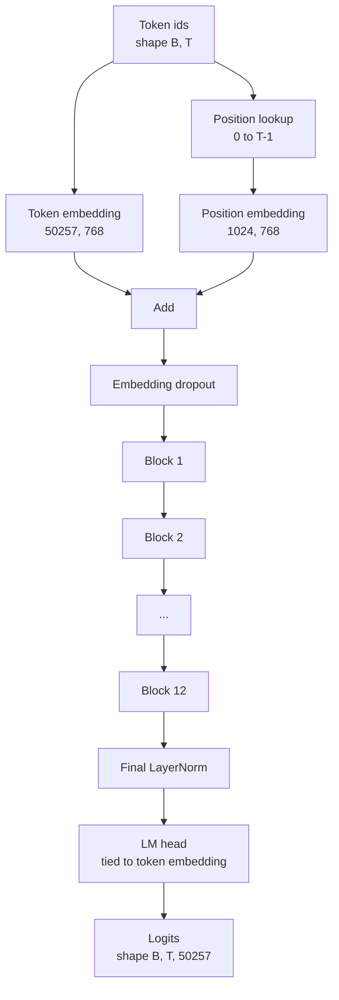
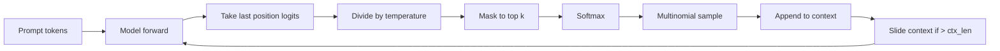

# GPT 模型组装

> 十二个块堆叠，一个 token 嵌入，一个可学习位置嵌入，一个最终 LayerNorm，以及一个绑定的语言模型头。这就是整个 1.24 亿参数的 GPT 模型。本课将这些组件组装为一个可运行的类，计算参数量以确认模型匹配参考的 124M 规模，并使用多项式采样、温度缩放和 top-k 生成文本。

**类型：** 构建
**语言：** Python
**前置要求：** Phase 19 第 30 至 34 课
**所需时间：** 约 90 分钟

## 学习目标

- 将第 34 课的 Transformer 块组装为完整的 GPT 模型：token 嵌入、位置嵌入、N 个块、最终 LayerNorm、语言模型头。
- 复现 1.24 亿参数配置：词汇量 50257、上下文长度 1024、嵌入维度 768、十二个头、十二层。
- 将语言模型头权重与 token 嵌入绑定，并解释为何在此规模下节省约 3800 万参数。
- 使用多项式采样、温度缩放和 top-k 截断从提示生成文本，并通过滑动窗口维持上下文长度。
- 对照 124M 目标测量参数量和前向传播开销。

## 问题所在

Transformer 块本身什么也做不了。你需要将 token id 转换为向量，混入位置信息，通过堆叠运行，然后投影回词汇 logits。遗漏这四个步骤中的任何一个，模型要么无法前向传播，要么位置信息漂移，要么无法输出。

模型的规模也很重要。参考的 GPT-2 small 恰好是上述配置的 1.24 亿参数。这些数字并非魔法。词汇量 50257 乘以嵌入维度 768 就是 token 表。位置 1024 乘以 768 就是位置表。十二个块每个约 700 万参数，共 8400 万。最终头通过权重绑定复用 token 表。各部分相加，恰好 1.24 亿。构建出的模型参数量与参考不符，说明接线有误。

## 概念说明



token id 变为 token 向量。位置 id 变为位置向量。两者相加后送入堆叠。最终 LayerNorm 是块之外唯一在每个现代变体中都保留的组件。LM 头复用 token 嵌入矩阵，这就是权重绑定的含义。

### 权重绑定

token 嵌入的形状为 `(vocab, d_model)`。语言模型头需要从 `d_model` 投影回 `vocab`。两者互为转置。绑定意味着字面上使用同一个参数张量，用两次。在词汇量 50257 和 d_model 768 下，该矩阵有 3800 万参数。不绑定需要付两次代价。绑定只需付一次，而且由于嵌入和头一起更新，还能获得略微更干净的梯度信号。

### 位置嵌入是可学习的，非正弦的

GPT-2 采用可学习的位置嵌入。位置表是一个形状为 `(1024, 768)` 的参数张量。模型在每次前向传播中查找位置 0 到 T-1，并将查找结果加到 token 嵌入上。这是位置方案中最简单的一种（RoPE、ALiBi、T5 相对偏置是替代方案），也是 124M 参考所使用的。

### 生成：温度、top-k、多项式采样

生成是自回归的。每一步，模型返回每个位置在整个词汇上的 logits。你只取最后一个位置，除以温度，可选地将除 top k 以外的所有 logits 掩码为负无穷，softmax 得到概率，然后从结果分布中采样一个 token。



三个旋钮，三种不同的行为。温度接近零退化为贪心。温度为一匹配模型的自然分布。Top-k 为一是贪心。Top-k 为四十过滤长尾。组合很重要；下一课的训练将生成作为定性评估信号使用。

## 开始构建

`code/main.py` 实现了：

- `class GPTConfig` 数据类，包含 124M 的默认值：`vocab_size=50257`、`context_length=1024`、`d_model=768`、`num_heads=12`、`num_layers=12`、`mlp_expansion=4`、`dropout=0.1`、`use_bias=True`、`weight_tying=True`。
- `class GPTModel`：包含 token 嵌入、位置嵌入、嵌入 Dropout、十二个 `TransformerBlock`、最终 LayerNorm，以及在标志设置时与 token 嵌入绑定的 `lm_head`。
- `count_parameters` 辅助函数，返回唯一参数量（权重绑定在计数中得到体现）。
- `generate` 函数，实现温度、top-k、多项式采样和滑动窗口上下文。
- 一个演示：构建模型，打印参数量与参考 124M 的对比，并从固定提示生成短序列以展示端到端流水线。

运行：

```bash
python3 code/main.py
```

输出：参数量与 124M 参考的对比，从随机提示生成的 token id，以及确认绑定开启时 LM 头和 token 嵌入共享存储。

为了保持演示速度，脚本还运行一个微型配置（`d_model=64`、`num_layers=2`）的端到端测试并内联打印生成的 token 序列。124M 配置被构建但仅测试其参数量和一次前向传播。

## 技术栈

- `torch` 用于张量数学、autograd 和模块管道。
- `code/main.py` 在本地重新实现了第 34 课的相同块模式。

## 生产实践模式

三个模式区分了"能跑的模型"和"能发布的模型"。

**初始化残差投影时使用较小的值。** 注意力的输出投影和 MLP 的第二个线性层都直接馈入残差加法。如果以与其他线性层相同的标准差初始化它们，残差流会随深度增长并推动最终 LayerNorm 进入高温区域。对这两个投影的标准差乘以 `1 / sqrt(2 * num_layers)` 缩放；残差流在十二层中保持在合理范围内。

**缓存位置 id 张量，不要重新计算。** `torch.arange(T)` 在每次前向传播时分配新内存。在 `__init__` 中为最大上下文分配一次，每次调用切取前 T 个条目，跳过分配器往返。

**在参数层面绑定权重，而非仅复制。** 设置 `lm_head.weight = token_embedding.weight` 会共享张量；复制则不会。优化器需要更新一个参数，autograd 图需要一次累积。如果你复制，头会逐渐偏离嵌入，权重绑定形同虚设。

## 使用示例

- 本课的模型类与下一课训练的模型形状相同。
- 将可学习位置嵌入替换为 RoPE 即可得到 LLaMA 系列，无需改动块或头。
- 将 GELU 替换为 SiLU、LayerNorm 替换为 RMSNorm 即可得到 LLaMA 系列的其余改动。
- 生成函数适用于任何 logits 来源，不限于本模型。你可以在第 37 课中从预训练的 GPT-2 文件获取 logits，并复用同一个生成循环。

## 练习

1. 解绑 LM 头与 token 嵌入，重新计算参数量。验证差值为 50257 x 768 = 3800 万。
2. 将可学习位置嵌入替换为在构造时计算的正弦表。确认模型仍能前向传播且参数量减少 786,432。
3. 为生成添加 `greedy=True` 标志，跳过采样直接取 argmax。确认序列在多次运行中是确定性的。
4. 添加 `repetition_penalty` 旋钮，在 softmax 之前将提示或生成历史中出现过的 token 的 logits 除以常数。在固定提示上展示大于一的值减少输出中的重复次数。
5. 在 `top_k` 旁添加 `top_p`（nucleus）采样。用两行代码检查保留 token 的概率之和超过 `top_p`。

## 关键术语

| 术语 | 常见说法 | 实际含义 |
|------|----------|----------|
| 权重绑定 | "Tied embeddings" | LM 头和 token 嵌入共享同一参数张量；节省 vocab 乘以 d_model 的参数量，匹配 GPT-2 参考 |
| 位置嵌入 | "Learned positions" | 形状为 (context length, d_model) 的独立表，加到 token 向量上；端到端学习 |
| 滑动窗口上下文 | "Context cap" | 当提示加上生成的 token 超过上下文长度时，丢弃最早的 token 使活跃窗口适配 |
| Top-k 采样 | "K truncation" | 保留值最大的 K 个 logits，将其余掩码为负无穷，在剩余部分上做 softmax |
| 温度 | "Sampling temperature" | 在 softmax 之前将 logits 除以 T；T 小于 1 锐化，T 等于 1 保持自然分布，T 大于 1 平坦化 |

## 延伸阅读

- Phase 19 第 34 课——本模型所堆叠的块。
- Phase 19 第 36 课——驱动本模型的训练循环（交叉熵损失）。
- Phase 19 第 37 课——将预训练的 GPT-2 权重加载到本架构中。
- Phase 7 第 07 课（GPT 因果语言建模）——下一个 token 预测的数学。
- Phase 10 第 04 课（预训练 mini GPT）——同一架构上的原始训练流程。
