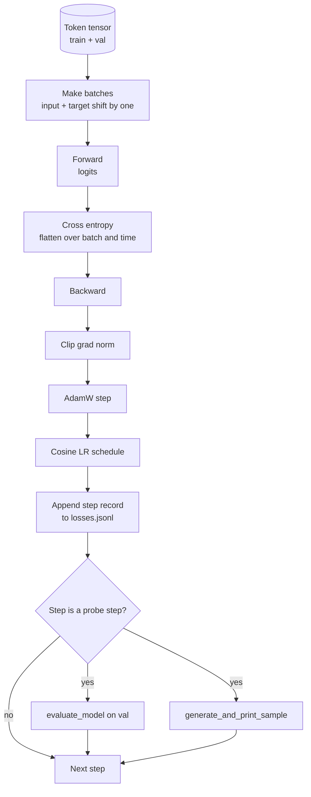

# 训练循环与评估

> 不做测量的循环，就是说谎的循环。本课构建驱动 GPT 模型的训练循环：带权重衰减分组的 AdamW、预热加余弦学习率调度、`calc_loss_batch` 辅助函数、在保留数据上的 `evaluate_model` 评估、每 K 步一次的 `generate_and_print_sample` 定性探测，以及可事后绘图的 JSONL 损失日志。同样的骨架可以训练你将来构建的每一个仅解码器 LLM。

**类型：** 构建
**语言：** Python
**前置要求：** Phase 19 第 30 至 35 课
**所需时间：** 约 90 分钟

## 学习目标

- 构建一个训练循环，以正确的输入和目标对齐计算下一个 token 预测的交叉熵损失。
- 配置 AdamW，将权重衰减应用于权重张量而非 LayerNorm 或偏置张量。
- 实现带线性预热和余弦衰减的学习率调度，并读懂随时间变化的学习率。
- 使用 `evaluate_model` 在保留集上评估，使评估损失在不同运行间可比。
- 每 K 步使用 `generate_and_print_sample` 生成定性样本，在损失曲线发散之前捕捉异常。
- 将每步损失持久化为 JSONL，以便重新加载、绘图并将训练日志作为交付物。

## 问题所在

一个只打印损失而不做其他事情的训练脚本会在三个方面失败。它无法告诉你损失是否因正确原因在下降（模型可能过拟合训练集而从未真正学习）。它无法告诉你发散是否正在开始（损失可能某一步飙升后恢复，或某一步飙升后崩溃）。它无法告诉你模型学到了什么（损失是标量；生成的样本是一段文本）。这三种失败都会被隐藏，除非循环进行测量。

本课的循环从三个方面进行测量。每步在训练批次上的损失。每 K 步在保留批次上的损失。每 K 步从固定提示生成的续写。训练日志写入 JSONL，使产物成为循环的证词。

## 概念说明



两个不太显眼的部分是损失对齐和 AdamW 衰减分组。

### 损失对齐

模型在每个位置预测下一个 token。如果输入批次是 token `[t0, t1, t2, t3]`，目标批次必须是 `[t1, t2, t3, t4]`。交叉熵在扁平形状 `(batch * seq, vocab)` 上对扁平目标 `(batch * seq,)` 计算。忘记移位，你就是在训练模型预测自身——它会在学到零损失的同时什么有用的东西都没学到。

### AdamW 衰减分组

权重衰减正则化权重张量，但不正则化归一化缩放或偏置。在 LayerNorm 缩放上加衰减会慢慢将缩放驱向零并破坏归一化。在偏置上加衰减在数学上无害但浪费算力。标准分组是：矩阵形状的张量（线性权重、嵌入表）加衰减，任何看起来像缩放或偏置的不加。

### 预热加余弦调度

预热在几百步内将学习率从零爬升到目标值，让优化器状态有时间填充。余弦衰减在剩余步数内将学习率降回接近零，使最终阶段以小步长微调权重。这个组合是开放权重 LLM 训练中最常见的调度，因为它消除了前一千步和后一千步中的大部分脆弱时刻。

### 保留集评估

`evaluate_model` 从验证集运行固定数量的批次，累积损失，除以批次数量，然后返回。无梯度，无 Dropout。给定相同的种子和相同的切分，该数字在不同运行间可复现。将保留损失与训练损失并列报告是发现过拟合的方式。

### 定性采样作为早期信号

一个训练损失下降良好但生成样本全是同一个 token 的模型是有问题的。一个损失曲线看起来平坦但生成样本逐渐锐化为连贯词语的模型在学习。定性探测比阅读完整曲线更快，并能捕捉标量遗漏的模式。

## 开始构建

`code/main.py` 实现了：

- `make_batches(token_ids, batch_size, context_length)`：将长 token 张量切分为输入和目标对。
- `calc_loss_batch(model, inputs, targets)`：前向传播、扁平化并返回标量交叉熵。
- `evaluate_model(model, val_loader, max_batches)`：无梯度下迭代固定数量的验证批次，返回平均损失。
- `generate_and_print_sample(model, prompt, max_new_tokens)`：在固定提示上运行第 35 课的生成函数并打印结果。
- `build_param_groups(model, weight_decay)`：生成两组 AdamW 参数列表。
- `cosine_with_warmup(step, warmup_steps, total_steps, max_lr, min_lr)`：返回给定步数的学习率。
- `train(...)`：运行循环，持久化 `outputs/losses.jsonl`，每 `eval_every` 步打印评估损失和一个样本。
- 一个演示：在合成数据上训练微型模型少量步数，写入 JSONL 日志，在探测点打印评估损失和样本。演示在 CPU 上远不到一分钟即可完成。

运行：

```bash
python3 code/main.py
```

输出：每步损失行、每个探测步的评估损失、每个探测步的生成样本，以及最终的 `outputs/losses.jsonl`（可按行用 `json.loads` 加载）。

## 技术栈

- `torch` 用于 autograd、优化器和模块。
- `main.py` 在本地重新实现了第 35 课的 `GPTModel` 及支持模块。

## 生产实践模式

三个模式将教科书循环变成可以通宵运行的东西。

**梯度范数裁剪是不可妥协的。** 一个坏批次（异常数据、学习率尖刺、数值边缘情况）会产生巨大梯度，抹去数小时的训练。在 `backward` 之后、`step` 之前使用 `torch.nn.utils.clip_grad_norm_(params, max_norm=1.0)` 将优化器保持在安全范围内。裁剪值是一个自由参数；一是在大多数设置下都适用的默认值。

**可恢复的 JSONL 日志，而非 pickle 状态。** 每步损失记录为 JSONL 中的 `{"step": int, "train_loss": float, "lr": float}` 行——它们是持久的：任何崩溃都会留下可读的产物，你可以 grep，可以用三十行 Python 绘图，可以通过读取最后一步来恢复训练。Pickle 状态将你绑定到产生文件时的确切模块布局，在重构面前很脆弱。

**从固定切片抽取评估批次。** 验证 token 在脚本启动时切分为批次，而非动态切分。可复现性依赖于评估批次在不同运行间完全相同；否则比较两次运行的评估损失会同时衡量批次打乱和模型本身。

## 使用示例

- 本课的循环与在真实数据上训练 124M 模型的骨架相同。将合成 token 张量替换为 `datasets` 风格的加载器，循环无需修改即可运行。
- JSONL 日志是将训练运行转化为证据的交付物。下一课用它来比较新训练的检查点与预训练的检查点。
- 定性样本探测是标量损失无法替代的兜底方案。

## 练习

1. 添加 `weight_decay_groups()` 单元测试，确认缩放和偏置参数落入无衰减组，线性层和嵌入权重落入衰减组。
2. 用小型文本文件的字节替换合成随机 token，使演示在可读内容上训练。验证生成样本使用了文件中存在的字符。
3. 在余弦调度中添加 `min_lr` 下限为 `max_lr` 的百分之十，重新绘图。
4. 除 JSONL 日志外，每 `eval_every` 步保存一个检查点。添加 `resume_from` 标志以重新加载模型状态和优化器状态。
5. 在损失旁记录每步吞吐量（每秒 token 数），确认其保持在稳定区间。

## 关键术语

| 术语 | 常见说法 | 实际含义 |
|------|----------|----------|
| 损失对齐 | "Shift by one" | 输入 token 在位置 0..T-1，目标 token 在位置 1..T；交叉熵在扁平形状上计算 |
| 衰减分组 | "Two groups" | AdamW 接收矩阵形状张量带权重衰减，缩放或偏置张量不带 |
| 预热 | "Ramp" | 学习率在固定步数内从零爬升到目标值，让优化器状态得以填充 |
| 评估批次 | "Held out batches" | 验证 token 张量的固定切片，在脚本启动时切分一次，每次探测使用完全相同的批次 |
| 定性探测 | "Sample print" | 每 K 步从固定提示打印一段短生成，捕捉仅靠损失无法发现的失败模式 |

## 延伸阅读

- Phase 19 第 35 课——循环驱动的模型。
- Phase 19 第 37 课——将预训练权重加载到同一模型中。
- Phase 10 第 04 课（预训练 mini GPT）——在真实数据上的流程。
- Phase 10 第 10 课（评估）——超越交叉熵损失的更广泛评估面。
