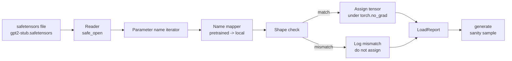

# 加载预训练权重

> 从零训练一个 1.24 亿参数的模型是预算决策；加载一个已发布的检查点不过是日常工作。本课将预训练的 GPT-2 风格权重从 safetensors 文件加载到第 35 课的精确架构中，逐段走通参数名称映射，健全性生成一段续写以证明加载成功。无需网络，无需第三方加载器，无需不透明魔法。

**类型：** 构建
**语言：** Python
**前置要求：** Phase 19 第 30 至 36 课
**所需时间：** 约 90 分钟

## 学习目标

- 使用 `safetensors` Python 库读取 safetensors 文件并检查张量名称和形状。
- 将每个预训练参数名称映射到第 35 课 GPT 模型中的参数。
- 处理已发布 GPT-2 权重与本路径模型之间不同的两种命名约定：`wte/wpe/h.N.attn.c_attn/c_proj` 和 `mlp.c_fc/c_proj` 对应本地的 `tok_embed/pos_embed/blocks.N.attn.qkv/out_proj` 和 `mlp.fc1/fc2`。
- 在任何权重赋值之前，检测形状不匹配并给出清晰错误信息拒绝加载。
- 使用加载后的权重生成一段短续写，确认 token 来自加载后的分布而非随机初始化分布。

## 问题所在

已发布的权重并非为你的架构打包。它们携带原始实现所用的名称。预训练文件有 `transformer.h.0.attn.c_attn.weight`，形状为 `(2304, 768)`；你的模型期望 `blocks.0.attn.qkv.weight`，形状为 `(2304, 768)`（同一矩阵但布局约定不同），或者你的模型使用 `nn.Linear` 以转置方式存储矩阵。同一个参数以三种微妙不同的身份出现（名称、形状、字节布局），加载器必须协调三者。

盲目复制的加载器会把正确的张量放在错误的位置，得到一个生成乱码的模型。形状不匹配时拒绝复制但不记录任何东西的加载器，让你猜不到哪个张量未能落地。本课的加载器是显式的：每次赋值都有日志，每个形状都经过检查，`LoadReport` 汇总命中、缺失和形状不匹配，让你读懂发生了什么。

## 概念说明



名称映射只是一个字符串到字符串的函数。形状检查是一个 if。赋值在 `torch.no_grad()` 内执行，使 autograd 不追踪加载过程。报告保存每个名称的结果。

### GPT-2 命名约定

已发布的 GPT-2 权重使用如下名称：

| 预训练名称 | 形状 | 含义 |
|------------|------|------|
| `wte.weight` | (50257, 768) | Token 嵌入 |
| `wpe.weight` | (1024, 768) | 位置嵌入 |
| `h.N.ln_1.weight` | (768,) | 第 N 块的 LayerNorm 1 缩放 |
| `h.N.ln_1.bias` | (768,) | 第 N 块的 LayerNorm 1 偏移 |
| `h.N.attn.c_attn.weight` | (768, 2304) | 融合 QKV 线性权重 |
| `h.N.attn.c_attn.bias` | (2304,) | 融合 QKV 线性偏置 |
| `h.N.attn.c_proj.weight` | (768, 768) | 注意力输出投影 |
| `h.N.attn.c_proj.bias` | (768,) | 注意力输出投影偏置 |
| `h.N.ln_2.weight` | (768,) | LayerNorm 2 缩放 |
| `h.N.ln_2.bias` | (768,) | LayerNorm 2 偏移 |
| `h.N.mlp.c_fc.weight` | (768, 3072) | MLP fc1 权重 |
| `h.N.mlp.c_fc.bias` | (3072,) | MLP fc1 偏置 |
| `h.N.mlp.c_proj.weight` | (3072, 768) | MLP fc2 权重 |
| `h.N.mlp.c_proj.bias` | (768,) | MLP fc2 偏置 |
| `ln_f.weight` | (768,) | 最终 LayerNorm 缩放 |
| `ln_f.bias` | (768,) | 最终 LayerNorm 偏移 |

需要注意两个意外。`c_attn`、`c_proj`、`c_fc` 线性层的矩阵存储方式与 `nn.Linear.weight` 的期望是转置关系。加载器在赋值时进行转置。LM 头完全不在文件中；模型依赖与 `wte` 的权重绑定，因此在 `wte` 加载后通过别名设置头。

### 本地命名约定

本路径的模型使用描述性名称：

| 本地名称 | 含义 |
|----------|------|
| `tok_embed.weight` | Token 嵌入 |
| `pos_embed.weight` | 位置嵌入 |
| `blocks.N.ln1.scale` | 第 N 块的 LayerNorm 1 缩放 |
| `blocks.N.ln1.shift` | LayerNorm 1 偏移 |
| `blocks.N.attn.qkv.weight` | 融合 QKV |
| `blocks.N.attn.qkv.bias` | 融合 QKV 偏置 |
| `blocks.N.attn.out_proj.weight` | 注意力输出投影 |
| `blocks.N.attn.out_proj.bias` | 输出投影偏置 |
| `blocks.N.ln2.scale` | LayerNorm 2 缩放 |
| `blocks.N.ln2.shift` | LayerNorm 2 偏移 |
| `blocks.N.mlp.fc1.weight` | MLP fc1 |
| `blocks.N.mlp.fc1.bias` | MLP fc1 偏置 |
| `blocks.N.mlp.fc2.weight` | MLP fc2 |
| `blocks.N.mlp.fc2.bias` | MLP fc2 偏置 |
| `final_ln.scale` | 最终 LayerNorm 缩放 |
| `final_ln.shift` | 最终 LayerNorm 偏移 |

映射是一个固定的函数。本课将其作为字典提供，由加载器遍历。

### 桩文件

真实的 GPT-2 权重有 0.5 GB。演示不会下载它们；它在首次运行时生成一个小型 safetensors 桩文件，使用精确的 GPT-2 命名约定和适合 12 块模型的形状（d_model 为 192 而非 768）。该桩文件具有正确的结构来覆盖加载器中的每条代码路径。将桩文件替换为真实文件，加载器无需修改即可工作。

## 开始构建

`code/main.py` 实现了：

- 第 35 课 `GPTModel` 的小型副本，使本课自包含。
- `make_pretrained_to_local(num_layers)`：展开每层的条目。
- `load_safetensors(model, path)`：遍历名称、映射、检查形状、转置 conv1d 风格的权重、在 `torch.no_grad()` 下赋值。返回 `LoadReport`。
- `make_stub_safetensors(path, cfg)`：使用精确的预训练命名约定生成桩文件。
- 一个演示：首次运行时创建 `outputs/gpt2-stub.safetensors`，构建全新模型，从随机初始化捕获一段续写，加载桩文件，捕获另一段续写，打印两者，验证两者不同（加载确实改变了模型）。

运行：

```bash
python3 code/main.py
```

输出：桩文件路径、按名称的加载日志、`LoadReport` 摘要、加载前的续写、加载后的续写，以及在桩文件中故意注入的一个坏张量产生的形状不匹配（以覆盖失败路径）。

## 技术栈

- `safetensors` 用于磁盘格式和流式读取。
- `torch` 用于模型和赋值数学。
- 不使用 `transformers`，不使用 `huggingface_hub`，不使用网络调用。

## 生产实践模式

三个模式使加载器能承受你未创建的权重。

**在任何赋值之前始终验证文件。** 打开文件，列出每个张量的名称、dtype 和形状，运行完整的映射和形状检查，仅在全部成功后才开始赋值。加载一半的模型是沉默的失败机器。

**记录每次赋值的源名称和目标名称。** 当结果看起来不对时，日志告诉你哪个张量落在了哪里；替代方案是阅读十六进制转储。本课的 `LoadReport` 数据类追踪 `loaded`、`missing`、`unexpected` 和 `shape_mismatch` 列表，并在最后打印摘要。

**LM 头是权重绑定的别名，不是独立副本。** 加载 `tok_embed` 后设置 `model.lm_head.weight = model.tok_embed.weight` 是标准模式。将嵌入矩阵复制到一个新的 `lm_head.weight` 参数中会破坏绑定，悄然使参数量翻倍。

## 使用示例

- 该加载器适用于任何使用预训练命名约定的 safetensors 文件。真实的 GPT-2 文件（small / medium / large / xl）无需修改代码即可工作；只有模型配置不同。
- 同样的模式可扩展到 LLaMA、Mistral、Qwen 权重，只需更新名称映射。形状检查和报告保持不变。
- 加载后的健全性生成是一个快速验证：如果加载后的样本看起来与加载前一样，说明加载没有改变模型——这意味着映射悄然遗漏了每个张量。

## 练习

1. 为加载器添加 `dtype` 参数，在赋值时将每个张量转换为目标 dtype（`bfloat16`、`float16`、`float32`）。确认 `float32` 模型可以降精度为 `bfloat16` 并仍然生成。
2. 添加 `expected_layers` 参数，当检查点的 `h.N` 索引与模型的 `num_layers` 不匹配时拒绝加载。
3. 将加载器接入第 35 课的生成函数，并排生成两个样本：一个来自随机初始化，一个来自加载的桩文件。
4. 添加导出路径：使用预训练命名约定将当前模型状态写入新的 safetensors 文件。往返加载器并确认报告中零形状不匹配。
5. 扩展 `NAME_MAP` 以处理 LLaMA 命名约定（无偏置、RMSNorm、融合 qkv 布局），并在你生成的 LLaMA 桩文件上重新运行加载器。

## 关键术语

| 术语 | 常见说法 | 实际含义 |
|------|----------|----------|
| 名称映射 | "Key remapping" | 从预训练张量名称到本地参数名称的函数；通常是字面字典，每层索引展开为一个条目 |
| 形状不匹配 | "Bad shape" | 预训练张量存在于映射名称下但其维度与本地参数不一致；加载器拒绝赋值并记录该对 |
| 加载时转置 | "Conv1d layout" | 已发布的 GPT-2 以转置方式存储注意力和 MLP 投影；加载器在赋值时进行转置 |
| 权重绑定别名 | "Shared LM head" | 设置 model.lm_head.weight = model.tok_embed.weight 使头和嵌入共享存储；头因此不在文件中 |
| 加载报告 | "Coverage summary" | 追踪 loaded、missing、unexpected 和 shape_mismatch 列表的小型数据类；打印它即可判断加载是否成功 |

## 延伸阅读

- Phase 19 第 35 课——接收权重的架构。
- Phase 19 第 36 课——产生相同形状检查点的训练循环。
- Phase 10 第 11 课（量化）——当内存紧张时对加载后的权重做什么。
- Phase 10 第 13 课（构建完整 LLM 流水线）——加载和推理的完整生命周期。
