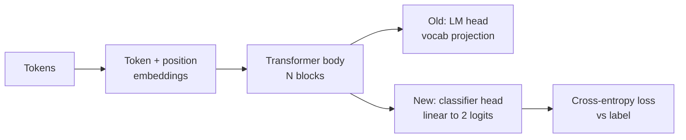
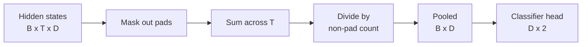
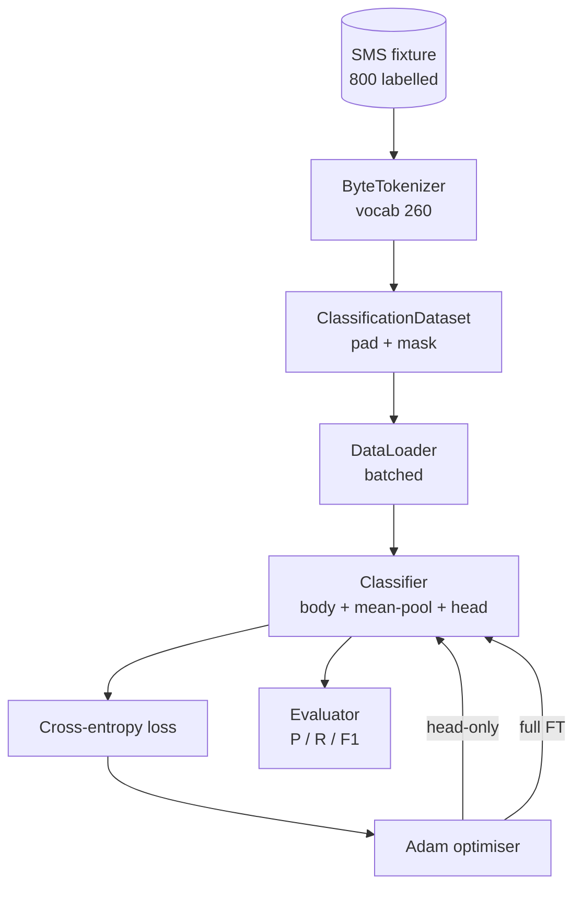

# 毕业项目第38课：通过替换分类头进行分类器微调

> 这是 B 轨道的第一个毕业项目。预训练语言模型是一组自注意力模块的堆叠，末端连接一个词元预测头。当你需要做垃圾短信分类时，预测头是错的，但模型主体基本是对的。本课会拆掉原有预测头，在池化后的表征上粘接一个二分类线性层，然后用两种方式训练分类器：仅训练最后一层和全量微调。评估指标为留出集上的精确率、召回率和 F1 值。你将了解每种策略的收益与代价。

**类型：** 构建
**语言：** Python（torch，numpy）
**前置要求：** 第19阶段第30-37课（NLP LLM 轨道：分词器、嵌入表、注意力模块、Transformer 主体、预训练循环、检查点保存、文本生成、困惑度）
**所需时间：** 约90分钟

## 学习目标

- 在不重新初始化模型主体的情况下，将语言模型头替换为分类头。
- 实现两种训练模式：冻结主体（仅训练分类头）和全量微调，两者共享同一个训练循环。
- 构建一个分词器感知的数据流水线，完成填充、填充掩码和注意力输出池化。
- 从原始 logits 计算精确率、召回率、F1 值和混淆矩阵。
- 分析参数量、训练时间和性能上限之间的权衡关系。

## 问题所在

你在一个通用语料库上预训练了一个小型 Transformer。输出头将最后的隐藏状态投影到一个1000词元的词表上。现在你有800条标注为垃圾短信或正常短信的消息，需要构建一个二分类器。有三种选择。

错误的选择是在800个样本上从零开始训练一个新的分类器。预训练模型的主体已经编码了有用的结构：词的身份、位置、简单的共现关系。丢弃这些结构等于浪费了构建它所用的算力。

两种正确的选择是：替换分类头并冻结主体，以及替换分类头并训练主体。仅训练分类头的速度快，内存开销几乎可以忽略不计，而且在这么少的数据上很少过拟合。全量微调更慢，在小数据上可能过拟合，但当下游领域偏离预训练语料时能达到更高的准确率。

本课会同时实现这两种方式，让你在相同的数据上进行对比。

## 概念说明

模型是一个函数 `f_theta(tokens) -> hidden_states`。预测头是一个函数 `g_phi(hidden) -> logits`。替换预测头意味着保留 `theta` 并替换 `g_phi`。模型主体的参数是昂贵的部分，预测头只是一个线性层。

两组可训练参数至关重要：

- `theta`（主体）：每个注意力模块有数万个权重。
- `phi`（预测头）：`hidden_dim * num_classes` 个权重加上一个偏置项。

在仅训练分类头的模式中，你对 `phi` 计算梯度，而将 `theta` 的梯度置零。PyTorch 允许你通过设置 `requires_grad=False` 来实现这一点。优化器只能看到预测头，主体保持冻结状态。

在全量微调中，你让梯度回传到整个网络。主体的权重会漂移以适应分类目标。风险在于小数据上的灾难性遗忘：主体的预训练知识会被过拟合的噪声冲刷掉。

## 池化问题

分类器需要每个序列一个向量，而不是每个词元一个向量。三种常见选择：

- **均值池化**：在序列维度上对隐藏状态取加权平均，权重由注意力掩码决定。
- **CLS 池化**：在序列前添加一个特殊词元，只使用它的输出。BERT 采用的就是这种方式。
- **末词元池化**：使用最后一个非填充词元。GPT 系列分类器采用这种方式。

本课使用带显式注意力掩码加权的均值池化。它最简单，在不同序列长度下都能给出稳定的信号，且不需要预训练一个 CLS 词元。

## 数据说明

800条短信（400条垃圾短信和400条正常短信，平衡分布）在 `code/main.py` 中确定性地生成。生成器使用固定种子，选取模板并替换槽位填充词，生成长度在5到25个词元之间的消息。真实数据集有噪声，而本测试数据没有。使用测试数据的目的是保证可复现性。

数据按80/20划分：640条训练集，160条测试集。划分采用分层抽样，使测试集保持50/50的平衡。一个已知平衡分布的留出集可以让精确率和召回率作为可信的数字来解读。

## 评估指标

二分类任务，类别1（垃圾短信）为正类。计数如下：

- `TP`：预测为垃圾短信，实际是垃圾短信。
- `FP`：预测为垃圾短信，实际是正常短信。
- `FN`：预测为正常短信，实际是垃圾短信。
- `TN`：预测为正常短信，实际是正常短信。

三个核心指标：

- `precision = TP / (TP + FP)`：被标记为垃圾短信的消息中，实际是垃圾短信的比例是多少？
- `recall = TP / (TP + FN)`：实际的垃圾短信中，被模型标记出来的比例是多少？
- `F1 = 2 * P * R / (P + R)`：两者的调和平均值。

混淆矩阵将四个计数打印为一个2x2的网格。演示程序会为两种训练模式分别输出到标准输出。

## 架构

模型主体是一个刻意设计的小型 Transformer：词表大小260，隐藏维度64，4个注意力头，2个模块，最大序列长度32。它足够小，可以在 CPU 上用90秒将两种训练模式都训练到收敛。本课中模型不是预训练的，而是由 `pretrain_quick` 辅助函数在相同文本上进行5个 epoch 的语言模型训练，给主体一个非平凡的起点。这保证了课程的自包含性。

## 你将构建的内容

实现包含一个 `main.py` 和一个测试模块（`code/tests/test_main.py`）。

1. `ByteTokenizer`：将字节映射为 id，保留一个填充 id。
2. `Block`：一个 Transformer 模块，包含多头注意力和前馈层，采用前置归一化。
3. `LMBody`：词元 + 位置嵌入加上一组模块堆叠，返回隐藏状态。
4. `MeanPool`：在序列维度上进行掩码加权平均。
5. `Classifier`：主体、池化层、线性头。主体在两种训练模式下是同一个实例。
6. `freeze_body` 和 `unfreeze_body`：切换主体参数的 `requires_grad` 设置。
7. `train_classifier`：一个共享的训练循环。接受模型和一个为当前可训练参数组配置的优化器。
8. `evaluate`：在测试集上运行并返回 `Metrics(precision, recall, f1, confusion)`。
9. `run_demo`：先短暂预训练主体，然后训练和评估仅分类头模式，再训练和评估全量微调模式，打印两份报告，最后以零退出码结束。

## 为什么对比很重要

仅训练分类头的模式通常训练更快，欠拟合也更温和。在这个测试数据上，仅分类头训练20个 epoch 后，精确率通常在0.9左右，召回率在0.85左右。全量微调大约需要三倍的训练时间，最终结果与随机种子有关，但差距在几个百分点以内。

本课不会判定哪个更好。它教你如何解读数字和成本。在800个样本和一个微小模型主体的情况下，仅训练分类头是正确的选择。在80,000个样本和更大的模型主体上，全量微调开始展现优势。你从本课获得的核心收获是 API 层面的契约：同一个 `train_classifier` 函数处理两种模式，切换只需一次调用。

## 进阶拓展

- 添加第三种模式：只解冻最后一个模块。这有时称为部分微调。它比全量微调开销更小，比仅训练分类头学到更多。
- 添加学习率调度器。分类头使用余弦调度，主体使用较小的恒定学习率，这是常见的生产配置。
- 用可学习的注意力池化替代均值池化：一个小型注意力层加上一个可学习的查询向量。这在较长序列上通常优于均值池化。

实现提供了所需的接口。测试锁定了行为契约。数字的提升就交给你了。
