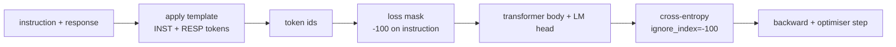
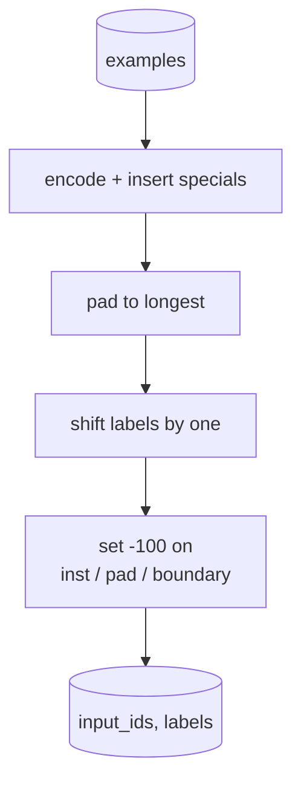
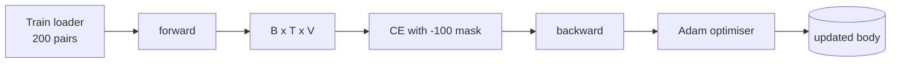

# 毕业项目第39课：通过监督微调进行指令调优

> 预训练基座模型可以续写文本，但无法遵循指令。监督微调是解决这个问题的最小改动：给模型喂入指令和期望响应的配对示例，训练模型主体去预测响应词元。关键在于你只希望损失函数计算响应部分，而非指令部分。本课构建了一个 Alpaca 风格的监督微调循环，使用自定义的 collate 函数将指令词元的标签掩码设为 `ignore_index=-100`，在200对指令-响应数据上训练，并在留出集上使用精确匹配进行评估。

**类型：** 构建
**语言：** Python（torch，numpy）
**前置要求：** 第19阶段第30-37课（NLP LLM 轨道：分词器、嵌入表、注意力模块、Transformer 主体、预训练循环、检查点保存、文本生成、困惑度）
**所需时间：** 约90分钟

## 学习目标

- 将配对的指令-响应数据格式化为带有明确边界词元的单个因果序列。
- 构建一个 collate 函数，掩码指令词元，使交叉熵仅计算响应词元的损失。
- 在监督微调目标下训练一个小型 Transformer 主体，观察评估指标的变化。
- 实现贪心解码和温度采样生成，遵循响应起始边界。
- 在生成的补全结果上计算留出集的精确匹配率。

## 问题所在

一个基于下一词元预测训练的基座模型，完全不知道什么是指令。给它输入 `"What is the capital of France?"` 这样的字符串，它会继续生成问题或者编造一个新句子。模型拥有语言能力，但缺乏格式契约。

监督微调的契约是一个字符串模板。每个训练样本变成一个包含三个区域的序列：

```text
<INST> What is the capital of France? <RESP> The capital of France is Paris.
```

边界词元是在训练时预留的特殊词元。模型学习到 `<RESP>` 之后的内容是响应，而响应才是被评估的部分。基座模型的下一词元目标仍然适用，只是训练语料中每个样本都具有这种结构。

但有一个陷阱。如果你把整个序列输入到普通的交叉熵损失中，你就是在训练模型同时预测指令词元。指令是给定的，你希望这些位置的梯度为零。解决方案就是掩码。

## 概念说明



`ignore_index` 是 `torch.nn.functional.cross_entropy` 的一个功能特性。任何等于 `ignore_index` 的目标位置对损失和梯度的贡献为零。PyTorch 中的惯例是使用 `-100`。collate 函数为每个样本构建两个张量：`input_ids`（完整序列）和 `labels`（`input_ids` 的副本，其中指令位置被覆盖为 `-100`）。

模型在前向传播时看到整个序列，注意力可以关注指令部分。损失只计算响应词元。这正是你想要的：以指令为条件，预测响应。

## 数据说明

200对指令-响应数据在 `main.py` 中确定性地生成，涵盖六种任务类型：

- 事实性单轮问答（某国的首都）
- 算术运算
- 列表提取
- 单句摘要
- 代码（打印、排序）
- 定义解释

每种任务都有模板化的指令和确定性的响应。这是有意为之的简化。精确匹配是脆弱的，本课使用的是正确答案只有一个特定字符串的测试数据。真实的监督微调数据集需要模糊匹配指标，但原理完全相同。

数据划分为160条训练集和40条测试集。测试集覆盖所有六种任务类型，因此可以报告每个类别的精确匹配率。

## 分词与填充

分词器是字节级别的，保留了三个特殊词元：

- `INST_ID = 256`：标记指令区域的开始。
- `RESP_ID = 257`：标记指令与响应之间的边界。
- `PAD_ID = 258`：用于变长批次的填充。

序列为 `[INST] inst_bytes [RESP] resp_bytes [PAD]*`。collate 函数的处理流程：

1. 对每个样本进行分词。
2. 将批次中所有样本填充到最长序列的长度。
3. 构建 `labels` = `input_ids` 向左偏移一位（因果语言模型目标），其中：
   - 指令区域替换为 `-100`。
   - 填充区域替换为 `-100`。
   - `RESP_ID` 边界位置本身也替换为 `-100`（你不训练模型预测边界词元，而是预测它之后的内容）。



偏移是标准的因果技巧：`input_ids` 的第 `i` 个位置预测第 `i+1` 个位置，因此 `labels[i] = input_ids[i+1]`（最后一个位置从输入中丢弃，第一个位置从目标中丢弃）。掩码在偏移之后应用，确保落在正确的位置上。

## 训练



训练循环是标准的 PyTorch 监督微调循环。Adam 优化器，学习率在3e-4到1e-3之间，在这个测试数据上训练10到20个 epoch，不使用调度器。模型足够小（隐藏维度96，2个模块，最大长度64），在 CPU 上两分钟内即可训练到收敛。

每隔5个 epoch，循环会在留出集上运行一次小规模评估并打印精确匹配率。看着精确匹配率从第1个 epoch 的0.0上升到大约第15个 epoch 的0.85，这就是本课的回报所在：你可以同时看到模型在学习格式和答案。

## 生成

在评估时，模型接收指令前缀 `[INST] inst_bytes [RESP]`，然后生成词元，直到以下任一条件满足：

- 序列达到 `max_len`，或
- 模型触发了特殊的停止启发式规则：连续两个句末字节（`.`、`!`、`?`）。

本课提供了贪心解码和可选的温度采样器。精确匹配使用贪心解码，因为温度采样会使指标具有随机性。真实的系统通常先采样再进行模糊判定，这套流水线在第41课中讲解。

## 精确匹配评估

精确匹配是最严格的文本指标。预测的响应字符串经过标准化处理（转小写、去除首尾空白、合并连续空格）后与参考响应进行比较，参考响应也经过相同的标准化处理。每个样本的指标要么是1要么是0，聚合结果为均值。

真实的监督微调流水线会用词元级 F1（第41课）和评判模型来补充精确匹配。精确匹配仍然有价值，因为它是明确无歧义的；如果它报告0.7，那就意味着测试集上恰好有70%的指令逐字符地生成了正确答案。

## 你将构建的内容

实现包含一个 `main.py` 加上测试文件。

1. `InstructionTokenizer`：字节级别的编码器，保留特殊词元。可以编码指令前缀或完整的配对。
2. `make_dataset`：使用固定种子生成200对数据，覆盖六种任务类型。
3. `SFTDataset`：返回每个样本的 `(input_ids, labels)`，已预先完成掩码处理。
4. `sft_collate`：动态填充，构建批次张量，在指令和填充位置设置 `-100`。
5. `TinyGPT`：Transformer 主体加上绑定或非绑定的语言模型头。
6. `train_sft`：监督微调循环，带有逐 epoch 的评估钩子。
7. `generate`：从前缀开始的因果解码，支持贪心或采样模式，带停止启发式规则。
8. `exact_match`：标准化字符串比较，返回 `[0, 1]` 范围内的浮点数。
9. `run_demo`：构建数据，训练20个 epoch，评估，打印每个类别的细分结果，成功时以零退出码结束。

## 为什么掩码很重要

如果没有掩码，损失函数会将指令词元视为目标。模型学会预测指令。这是一个不同的目标，会从两个方面产生更差的模型。首先，模型容量被浪费在重建用户总是会提供的输入上。其次，由于在大多数批次中指令词元数量多于响应词元，响应损失在梯度总和中所占比例更小，优化器在你关心的部分上的有效学习率低于你的预期。掩码不是锦上添花，它就是目标本身。

## 进阶拓展

- 添加学习率预热后接余弦衰减。监督微调对学习率比预训练更敏感。
- 添加逐词元的损失日志，绘制训练过程中的损失曲线。注意早期 epoch 主要由模板词元（`<RESP>`、常见前缀）主导，后期 epoch 由实际答案词元主导。
- 将评估扩展到 BLEU-1 或 chrF。精确匹配会低估那些产生了同义表述但答案正确的模型。
- 添加支持多轮格式的对话模板，在包含追问的测试数据上训练。

实现提供了格式契约、掩码和训练循环。从基座模型到指令跟随者的目标转变，只需一个 collate 函数。
