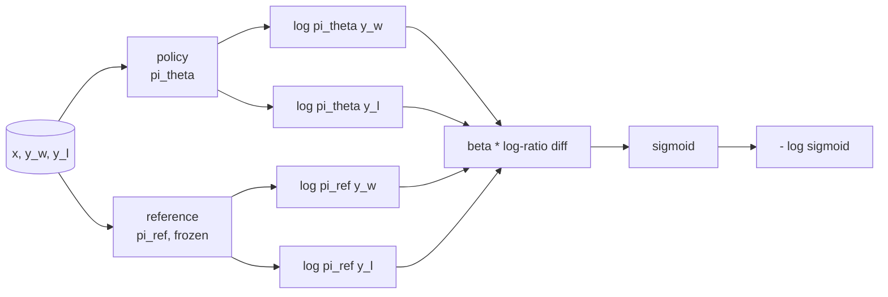
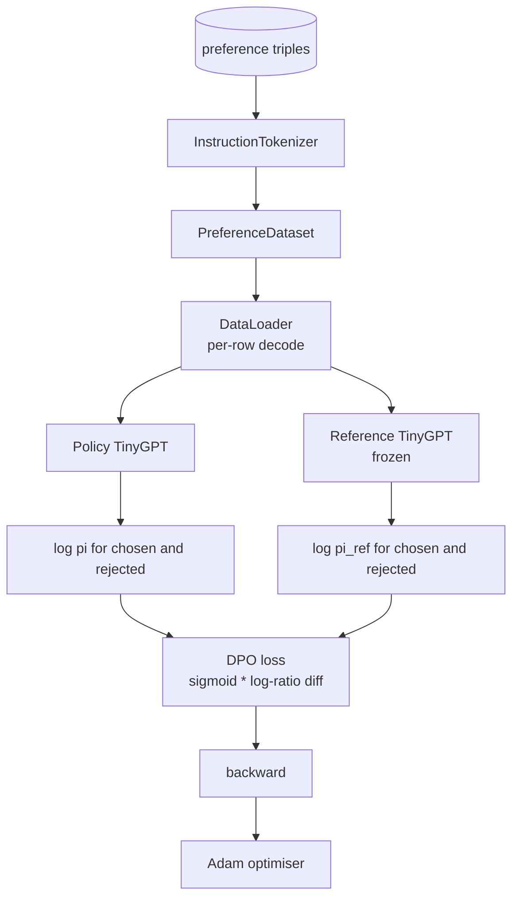

# 毕业课程 40：从零实现直接偏好优化

> 奖励模型和 PPO 是经典的 RLHF 技术栈。DPO 将这套技术栈压缩为一个单一的监督损失，直接基于偏好对来拟合策略。本课从奖励差恒等式出发推导 DPO 损失，提供可用的参考模型和策略模型，计算逐词元对数概率，并在一个由优选和劣选补全组成的偏好测试数据上训练一个小型 Transformer。测试用例锁定了损失数学和梯度方向，确保实现与论文一致。

**类型：** 构建
**语言：** Python（torch，numpy）
**前置要求：** 第 19 阶段 30-37 课（NLP LLM 轨道：分词器、嵌入表、注意力模块、Transformer 主体、预训练循环、检查点保存、文本生成、困惑度）
**所需时间：** 约 90 分钟

## 学习目标

- 将 DPO 损失推导为缩放对数比率差上的 sigmoid 函数，并将其与隐式奖励关联。
- 构建一个参考模型 + 策略模型对，其中参考模型冻结，策略模型可训练。
- 在两个模型下计算序列级对数概率，对提示词元进行掩码处理。
- 在 `(prompt, chosen, rejected)` 三元组上训练策略，观察优选的对数概率相对于劣选上升。
- 通过测试用例锁定损失数学、梯度符号和参考不变性的行为。

## 问题所在

你有一个监督微调模型。它能遵循指令，但输出质量参差不齐：有些补全清晰明了，有些冗长或错误。你还有一个小型偏好对数据集：对同一个提示，人类标注了一个补全为优选，另一个为劣选。

经典的 RLHF 方案是一个两阶段流水线。先在偏好数据上训练奖励模型，再用 PPO 根据奖励优化策略。这能奏效但代价高昂：PPO 运行时内存中需要两个模型，还需要 KL 控制来保持策略靠近参考模型，当奖励模型不够鲁棒时还会出现奖励作弊。

DPO 用一个单一的监督损失替代了这两个阶段。奖励模型从未显式存在。策略直接在偏好对上训练，同时带有朝向微调参考模型的显式 KL 惩罚。在 Bradley-Terry 偏好模型下，最优解相同，代码量却少得多。

## 概念说明

从 Bradley-Terry 模型出发。给定提示 `x` 和两个补全 `y_w`（优选）和 `y_l`（劣选），人类偏好 `y_w` 的概率为

```text
P(y_w > y_l | x) = sigmoid( r(x, y_w) - r(x, y_l) )
```

其中 `r` 是某个潜在的奖励函数。RLHF 先从偏好中拟合 `r`，然后训练策略 `pi` 以最大化 `r` 并附带 KL 锚点：

```text
max_pi   E_{x, y~pi} [ r(x, y) ] - beta * KL(pi || pi_ref)
```

DPO 的推导观察到，这个目标下的最优策略 `pi*` 关于 `r` 有闭式解：

```text
pi*(y | x) = (1/Z(x)) * pi_ref(y | x) * exp( r(x, y) / beta )
```

对 `r` 进行变换：

```text
r(x, y) = beta * ( log pi*(y | x) - log pi_ref(y | x) ) + beta * log Z(x)
```

`log Z(x)` 对 `y_w` 和 `y_l` 来说是相同的（它依赖于 `x` 而非 `y`），因此在计算偏好差值时会消去：

```text
r(x, y_w) - r(x, y_l) = beta * ( log pi_theta(y_w|x) - log pi_ref(y_w|x)
                                - log pi_theta(y_l|x) + log pi_ref(y_l|x) )
```

代入 Bradley-Terry sigmoid 并对偏好对取负对数似然：

```text
L_DPO(theta) = - E_{(x, y_w, y_l)} [
  log sigmoid( beta * ( log pi_theta(y_w|x) - log pi_ref(y_w|x)
                       - log pi_theta(y_l|x) + log pi_ref(y_l|x) ) )
]
```

这就是损失函数。它是一个对每个样本的单标量做 sigmoid 的函数，由四个对数概率计算得出。没有单独的奖励模型，没有 PPO，损失中没有 KL 项；KL 约束已经烘焙在闭式推导中。



## 梯度符号

在任何训练运行之前，这是一个有用的健全性检查。对 `log pi_theta(y_w | x)` 求梯度：

```text
d L_DPO / d log pi_theta(y_w | x) = - beta * (1 - sigmoid(z))
```

其中 `z` 是 sigmoid 的输入。这对所有 `z` 都为负值，这意味着：增大策略对优选补全的对数概率会减小损失。对称地，对 `log pi_theta(y_l | x)` 的梯度为正：增大劣选的对数概率会增加损失。训练将优选推高、将劣选压低。参考模型是冻结的，它不会移动。

## 数据说明

本课附带 12 个偏好三元组，每个为 `(prompt, chosen, rejected)`。优选的补全简短精确，劣选的冗长、偏离主题或错误。这些对覆盖了与第 39 课相同的任务类别（首都、算术、列表），因此从监督微调基座出发的策略有一个合理的起点。

测试数据是有意设置得很小的。DPO 在生产中可以处理数以万计的对；这里的核心目标是让损失数学和训练循环在小数据集上端到端地运行，并且优选与劣选的对数概率差距可以明显地观察到增长。

## 参考不变性

DPO 实现必须小心处理参考模型。参考模型是冻结在原地的监督微调模型。必须满足三个性质：

- 参考模型的参数永远不接收梯度。
- 参考模型的对数概率在各 epoch 之间永远不变。
- 策略从与参考模型相同的权重开始。（最优 `theta` 是参考模型加上一个学习到的更新；将策略初始化为参考模型的副本是定义明确的起点。）

实现通过以下方式强制执行这些性质：

- 在前向传播时用 `torch.no_grad()` 包裹参考模型。
- 对每个参考模型参数设置 `requires_grad=False`。
- 在参考模型构建完成后，通过 `policy.load_state_dict(reference.state_dict())` 构造策略模型。

## 架构



模型与第 39 课使用的 TinyGPT 相同（纯解码器、因果、字节分词器）。参考模型和策略模型共享架构；策略的权重在训练过程中偏离参考模型，而参考模型保持固定。

## 你将构建的内容

实现包含一个 `main.py` 加上测试文件。

1. `InstructionTokenizer`：带 `INST` 和 `RESP` 特殊词元的字节分词器。形状与第 39 课相同。
2. `TinyGPT`：纯解码器 Transformer。形状与第 39 课相同，即使你跳过了第 39 课，本课也是自包含的。
3. `make_preferences`：返回 12 个 `(prompt, chosen, rejected)` 三元组。
4. `sequence_log_prob`：给定模型、提示前缀和一个补全，返回该补全上所有下一词元对数概率的总和（不含提示位置的贡献）。
5. `dpo_loss`：接收四个对数概率和 `beta`，返回每个样本的损失张量和用于日志记录的隐式奖励差值。
6. `train_dpo`：逐 epoch 的循环，计算策略和参考模型下优选和劣选的对数概率，应用损失并执行 Adam 步进。
7. `evaluate_margins`：返回策略在任意时刻的优选-劣选对数概率间距的均值。
8. `run_demo`：从一个小型预热训练构建参考模型和策略模型，复制权重，训练 30 步，打印每步的损失和间距，成功时以零退出码结束。

## 为什么 DPO 有效

DPO 在 Bradley-Terry 偏好模型下与 RLHF 数学上等价，等价到奖励的参数化方式。隐式奖励 `r(x, y) = beta * (log pi(y|x) - log pi_ref(y|x))` 从偏好中可辨识，最多差一个关于 `x` 的函数，该函数在差值中消去。闭式策略让你跳过了显式奖励模型。KL 约束通过结构性方式执行：任何 `pi` 偏离 `pi_ref` 的程度都会使对数比率变大，sigmoid 趋于饱和，从而在策略偏离过远时抑制梯度。参考模型是你的安全网。

## 进阶拓展

- 在对数概率总和上添加长度归一化：除以补全长度。长度偏差是 DPO 的一个已知失效模式，模型倾向于选择更短的补全，因为它们的对数概率在绝对值上更大。
- 添加 IPO 变体的损失：用 `(z - 1)^2` 替换 sigmoid + log。在测试数据上比较收敛性。
- 添加标签平滑参数，在硬优选-劣选标签和均匀的 0.5 之间进行插值。
- 用更小更廉价的模型替换参考模型（知识蒸馏的思路）。

实现提供了损失函数、参考不变性和训练循环。数学是本课的核心，代码让数学变得具体。
