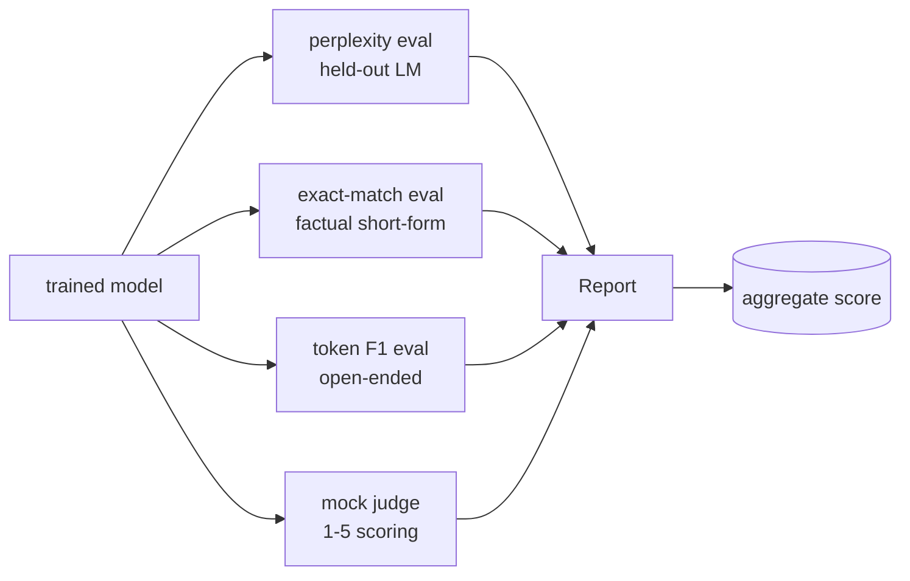
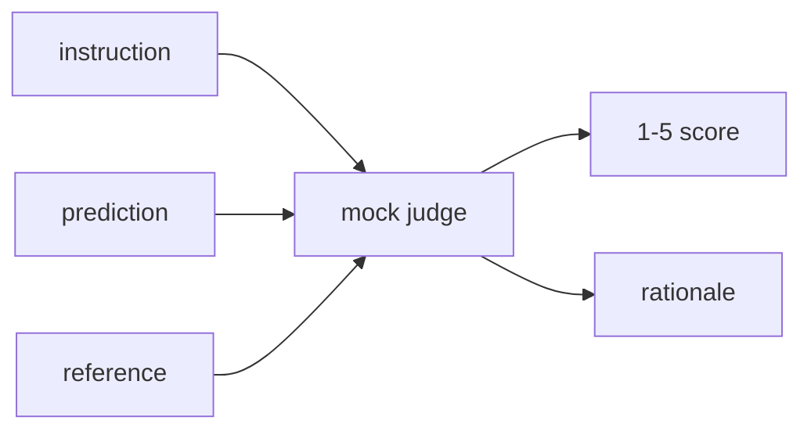
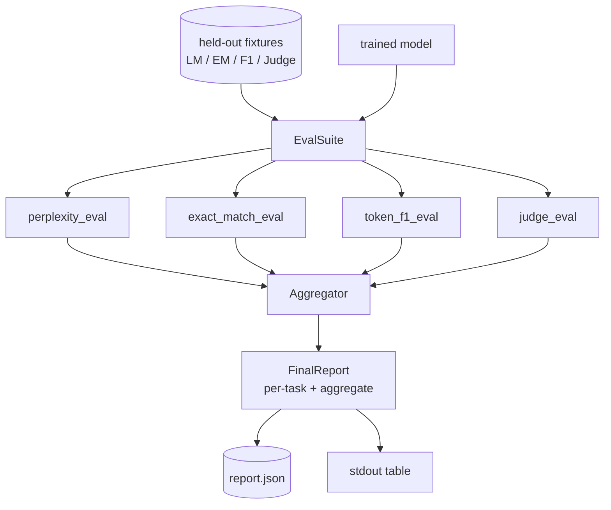

# 毕业课程 41：完整评估流水线

> 训练是可以用损失曲线监控的部分。评估是需要你自己设计的部分。本课构建了一个统一的评估流水线，接收任意已训练的语言模型，在其上运行四种异构评估，将结果汇总为按任务分列的报告，并提供一个本地的模拟 LLM 评判器，使整个流程无需网络即可运行。四种评估覆盖了每个上线模型都需要的维度：语言建模（困惑度）、短文本正确性（精确匹配）、开放式相似度（词元 F1）和定性评分（评判器）。

**类型：** 构建
**语言：** Python（torch，numpy）
**前置要求：** 第 19 阶段 30-37 课（NLP LLM 轨道：分词器、嵌入表、注意力模块、Transformer 主体、预训练循环、检查点保存、文本生成、困惑度）
**所需时间：** 约 90 分钟

## 学习目标

- 在小型 Transformer 上通过掩码词元计数计算留出集困惑度。
- 在短文本事实性提示上运行精确匹配评估。
- 带标准化处理地计算预测字符串和参考字符串之间的词元级 F1。
- 构建一个本地模拟 LLM 评判器，以 1-5 分对模型输出进行评分。
- 将四种评估汇总为一份加权报告，附带按任务分列的细分结果。

## 问题所在

单一指标永远无法描述一个语言模型。困惑度反映模型对语言分布的拟合程度，但无法说明它是否能回答问题。精确匹配反映模型是否产生了正确字符串，但会惩罚正确的同义表述。词元 F1 宽容同义表述，但会被与错误内容的词汇重叠所迷惑。LLM 评判器捕捉定性维度，但成本高且具有随机性。

你真正需要的流水线同时具备这四种评估。每种评估覆盖其他评估遗漏的维度。每种评估运行在不同形状的留出数据子集上。最终报告将各任务的数字并列展示，并附带汇总分数，审查者可以一眼看出模型在做哪些权衡。

本课在一个文件中端到端地构建这条流水线。

## 概念说明

每种评估是一个从 `(model, dataset) -> EvalResult` 的函数。结果携带指标值、用于检查的逐样本详情和用于汇总的名称。流水线通过一个配置将它们组合起来，配置指定运行哪些评估以及如何加权。

## 困惑度的正确计算

困惑度 = `exp(每个词元的平均负对数似然)`。实现中有两个陷阱：

- 均值必须在实际词元位置上计算，而不是在 批次 * 序列 上计算。填充词元必须从分母中排除，否则困惑度会看起来比实际更好。
- 模型预测下一个词元，因此第 `i` 个位置的 logits 预测的是第 `i+1` 个位置的词元。这里的一位偏移错误是静默的：损失仍然可以训练，但指标变得毫无意义。

评估计算每个批次在非填充位置上的 `-log p(token)` 总和和词元计数，最后再统一做除法。这比对每个批次的困惑度取平均（会低估短序列的权重）在数值上更安全，也与教科书定义一致。

## 带标准化的精确匹配

测试框架在比较之前对预测和参考进行标准化处理：

- 转为小写。
- 去除首尾空白。
- 将内部连续空白合并为单个空格。
- 如果双方仅在标点上有差异，则去除尾部的终止标点（`.`、`!`、`?`）。

标准化使精确匹配在实践中可用。回答 `"Paris"` 的模型是正确的；回答 `"Paris."` 的也是正确的；回答 `"  paris  "` 的也是正确的。该指标仍然要求标准化后的答案是相同的字符串。

## 正确的词元 F1

词元 F1 是基于词袋计算的精确率和召回率的调和平均值。步骤如下：

1. 标准化预测和参考（与精确匹配相同的规则）。
2. 将每个字符串拆分为词元列表（空白分词）。
3. 计算多重集交集。
4. 精确率 = `intersection_count / len(pred_tokens)`。召回率 = `intersection_count / len(ref_tokens)`。F1 = 调和平均值。

如果预测和参考都为空，F1 为 1（空匹配）。如果只有一个为空，F1 为 0。这个模式与 SQuAD 评估参考一致，在同义表述上产生稳定的数字。

## 本地模拟 LLM 评判器

真正的评判器是通过 API 调用的前沿模型。本课中评判器必须离线运行。模拟评判器是一个确定性的评分器，接收指令、模型的预测和参考，返回 `{1, 2, 3, 4, 5}` 中的分数加上一行理由。评分规则是明确的：

- 如果标准化后的预测等于标准化后的参考，得 5 分。
- 如果预测与参考之间的词元 F1 至少为 0.8，得 4 分。
- 如果词元 F1 在 `[0.5, 0.8)` 范围内，得 3 分。
- 如果词元 F1 在 `[0.2, 0.5)` 范围内，得 2 分。
- 其他情况得 1 分。

这不是真正的评判器，但它有正确的接口。之后只需替换一个函数就可以换入真正的模型。流水线不会在意。

## 汇总

汇总分数是标准化评估分数的加权平均。每种评估报告自己的 `[0, 1]` 范围内的数字：

- 困惑度：标准化为 `1 / (1 + log(perplexity))`。困惑度为 1 时映射为 1，无穷大时映射为 0。
- 精确匹配：已经在 `[0, 1]` 范围内。
- 词元 F1：已经在 `[0, 1]` 范围内。
- 评判器：除以 5。

权重可配置。默认组合为困惑度 0.2、精确匹配 0.3、词元 F1 0.2、评判器 0.2。权重的选择是产品决策；本课暴露了这个旋钮，方便你进行实验。

## 架构

`EvalSuite` 是一个轻量级的编排器。每种独立的评估是一个自由函数，接收 `(model, tokenizer, dataset, config)` 并返回 `EvalResult`。`Aggregator` 收集结果并生成最终报告。演示程序打印表格并写入一份 JSON 副本，供下游 CI 系统消费。

## 你将构建的内容

实现包含一个 `main.py` 加上测试文件。

1. `TinyGPT`：与第 38-40 课相同的纯解码器架构，包含在内以保证课程的独立性。
2. `InstructionTokenizer`：带 INST / RESP / PAD 特殊词元的字节分词器。
3. 四组测试数据：一个 LM 语料库、一个精确匹配集、一个 F1 集和一个评判集。每组 20 个样本，确定性生成。
4. `perplexity_eval`：返回包含困惑度值和逐词元损失直方图的 `EvalResult`。
5. `exact_match_eval`：返回平均精确匹配率和逐样本记录。
6. `token_f1_eval`：返回平均词元 F1 和逐样本记录。
7. `mock_judge` 和 `judge_eval`：逐样本的分数和理由，以及整个集合的平均分。
8. `Aggregator.normalise`：每种评估的标准化规则。
9. `Aggregator.aggregate`：加权平均和组装好的报告。
10. `run_demo`：短暂训练一个小型模型，运行所有四种评估，打印报告表格并写入 JSON 文件，成功时以零退出码结束。

## 阅读报告

报告有三个层次。顶层是汇总分数。下面是四种评估各自的数字。再下面是为了诊断的逐样本细分。失败的 CI 运行通常关注汇总分数，但追踪回归的审查者会查看逐样本细分，以了解模型在哪些输入上出错。

JSON 导出使用稳定的键名，方便 CI 仪表盘绘制跨版本的趋势线。格式化的表格是供训练后盯着终端看的人类使用的。

## 进阶拓展

- 添加校准评估：模型的 softmax 概率是否与准确率匹配？按置信度分桶，报告每个桶的经验准确率。
- 添加鲁棒性评估：为每个样本标注一种扰动（错别字、同义表述、干扰项），报告每种扰动下的指标下降。
- 用真正的模型通过 HTTP 调用替换模拟评判器。函数签名不变。
- 添加按任务的权重学习：不是使用固定权重，而是将权重拟合到对模型的目标偏好排序。

实现提供了四种评估、汇总器和报告。真实的评估流水线会在此基础上叠加更多维度；模式保持不变：每种评估一个函数，一个汇总器，一份报告。
