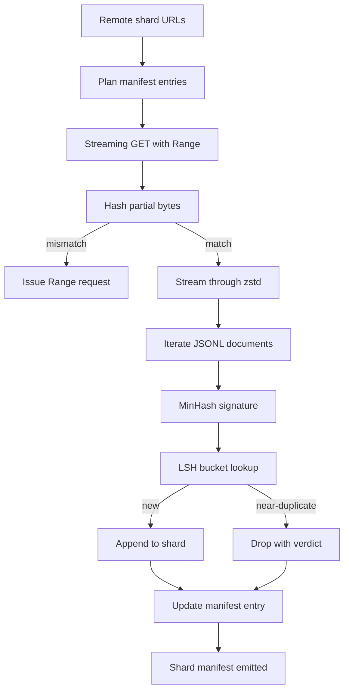

# 大规模语料下载器

> 训练语言模型的工作远在第一次前向传播之前就开始了。语料必须落地到磁盘上，完成解压、去重和可寻址，而且在网络于 4% 处断开之前，断点续传方案就必须准备就绪。本课构建了一个流式下载器，拉取压缩分片，用 Zstandard 实时解压，通过 MinHash 加局部敏感哈希对近似重复进行指纹比对，并写入一个分片清单，供后续流水线使用。

**类型：** 构建
**语言：** Python
**前置要求：** 第 19 阶段 30-37 课
**所需时间：** 约 90 分钟

## 学习目标

- 使用 `urllib` 流式拉取远程分片，使用 `zstandard` 实时解压，无需将整个文件缓冲到内存中。
- 通过向已验证的字节偏移发送 HTTP `Range` 请求来恢复中断的下载。
- 为每个文档构建 MinHash 签名，并通过 LSH 分桶使近似重复发生碰撞。
- 输出包含内容哈希、字节数、文档数和去重判定结果的分片清单。

## 问题所在

你第一次在 200 GB 语料库上训练时，网络在 41% 处断开，脚本抛出 `urllib` 异常退出。第二次在 78% 处断开。到 99% 时你已经重写了三次循环。你从一开始就必须设计的两个失败场景是：中断下载的恢复和重复文档的移除。两者都有成熟的解决方案，但两者经常被跳过，因为流水线最初只是从一行 `requests.get` 调用开始逐渐演进的。

断点续传是一个 HTTP 问题。服务器必须支持 `Range`，客户端必须根据磁盘上的记录跟踪已验证的偏移，而且已验证的偏移必须能在进程崩溃后恢复。如果偏移和文件哪怕差一个字节，恢复下载就会写入垃圾数据，语料库会以一种只在分词时才暴露的方式被损坏。

去重是一个签名问题。精确哈希去重会遗漏近似重复：同一篇维基百科文章带有三种不同的样板页脚，同一个代码文件带有不同的许可证头，同一篇博客文章的每个链接都带有跟踪参数。MinHash 加 LSH 以亚线性成本捕获这些情况。每个文档一个签名，每个签名一次桶查找。

## 概念说明



### 使用 `urllib` 进行流式传输

标准库的 `urllib.request.urlopen` 返回一个类文件对象。将其包装在 `zstandard.ZstdDecompressor().stream_reader` 中，字节就会从网络流经解压器进入文档迭代器，而不会在内存中物化压缩分片或解压后的分片。唯一的内存开销是行缓冲区、当前文档的 MinHash 签名和 LSH 索引。

### 使用 `Range` 进行断点续传

下载器为每个分片写入两个文件：分片本身和一个 `.partial.json` 检查点。检查点记录 `verified_bytes`、`expected_size`、`sha256_prefix`（基于前 `verified_bytes` 个字节计算）和源 URL。启动时，下载器读取检查点，对磁盘上的字节重新计算 `sha256_prefix`，只有在重新计算的哈希匹配时才恢复下载。如果哈希不正确，部分文件被丢弃，下载从第零字节重新开始。静默损坏是不可能的，因为已验证的字节是被检查过的，而不是被假定的。

### MinHash 加局部敏感哈希

MinHash 以固定空间估计两个集合的 Jaccard 相似度。对于一个文档，集合是其文本的 shingles（重叠 n-gram）。签名由 `k` 个最小哈希值组成，每个对应一个独立的哈希函数。两个 Jaccard 相似度为 `s` 的文档，在签名的任何单个分量上一致的概率为 `s`。

然后 LSH 将 `k` 个分量分成 `b` 个 band，每个 band 有 `r` 行，其中 `k = b * r`。两个文档在至少一个 band 中碰撞的概率为 `1 - (1 - s^r)^b`，这是一个围绕你通过调整 `(b, r)` 来设定的 `s` 值的尖锐阈值。典型语料去重的阈值是 `s = 0.8`，LSH 研究文献中用 `k = 128`、`b = 32`、`r = 4` 来达到这个阈值。

### 分片清单作为契约

下载器唯一的持久化输出是清单。清单为每个分片保存 URL、解压后的字节数、文档数、去重后的唯一文档数和最终分片文件的 sha256。下游分词读取的是清单，而不是目录列表。如果一个分片缺失或其 sha256 不正确，清单会告知下一阶段拒绝启动。清单是"数据已下载"和"数据已下载且可验证"之间的决定性边界。

## 开始构建

`code/main.py` 实现了：

- `ShardPlanner`：读取分片 URL 列表，生成计划清单条目。
- `StreamingDownloader`：用可选的 `Range` 打开 `urllib` 流，写入临时文件，在每个数据块更新 `.partial.json` 检查点，恢复时验证 sha256 前缀。
- `ZstdDocIterator`：将类文件流包装在 `zstandard.ZstdDecompressor` 中，逐行产出文档。
- `MinHasher`：使用固定的哈希种子族为字符串生成 `k` 分量签名。
- `LSHIndex`：按 band 对签名分桶并报告碰撞。
- `Dedup`：组合哈希器和索引，为每个文档标注 `keep` 或 `near_duplicate` 以及碰撞的分片 id。
- `ManifestWriter`：收集每个分片的统计信息并写入 `manifest.json`。

文件底部的演示程序在磁盘上构建一个小型合成语料库，用 `zstandard` 压缩，通过 `file://` URL 下载，去重，并打印清单。

运行方式：

```bash
python3 code/main.py
```

脚本以零退出码退出并打印清单摘要。

## 生产实践模式

四种模式将本课扩展到真实语料。

**先写检查点再写数据。** `.partial.json` 必须在字节追加到分片之前完成 `fsync`。否则断电会颠倒顺序：分片字节在磁盘上，检查点却没有记录，下次恢复时认为已验证的字节比实际少，重复的尾部字节损坏文件。先写检查点，再写数据。这与预写日志的纪律相同。

**分片 LSH 索引。** 在 200 GB 规模上，单个覆盖整个语料的 LSH 索引无法放入内存。按第一个 band 的哈希值对 LSH 索引进行分区，将分区存储在磁盘上，只查询新签名会落入的分区。代价是每个文档多一次磁盘读取；好处是 LSH 索引不再是硬性的内存上限。

**墓碑标记而非删除。** 被丢弃的重复项在清单中以 `near_duplicate` 判定结果记录，同时记录它们碰撞到的文档所在的分片 id。删除它们会丢失重复项与其保留者之间的关联。墓碑标记保留了审计记录，让下游步骤可以改变对阈值的判断。

**清单中的分片 sha256，加上清单本身的 sha256。** 清单本身也有一个内容哈希。下游阶段在信任分片条目之前先验证清单哈希。没有这一步，清单就是静默的攻击面：能编辑单个文件的攻击者可以损坏整条流水线。

## 使用示例

生产实践模式：

- **每次 CI 运行都支持断点续传。** CI 运行器是临时性的。下载器必须假设每次运行都是全新磁盘，从缓存或远程恢复。`--cache-dir` 是一等公民的标志参数。
- **在分词之前去重。** 分词是昂贵的。对同一个文档运行两次分词等于同样的损失曲线付出双倍成本。去重在分词的上游，而非下游。
- **清单作为合并关卡。** 训练运行从一个固定的 commit 读取清单的 sha256。新数据集版本需要新的清单 commit。代码和数据之间的关联是 git，而非口头约定。

## 交付成果

`outputs/skill-corpus-downloader.md` 在真实项目中会描述哪些 URL 喂给下载器、检查点目录的布局、去重使用的 shingle 宽度和 `(k, b, r)` 三元组，以及清单在版本控制中的位置。本课交付的是引擎本身。

## 练习

1. 添加 `--shingle-width` 标志，测量宽度为 3、5、9 时去重判定结果的变化。论证所选默认值的合理性。
2. 通过嗅探魔数字节添加 gzip 支持，与 zstd 并列。下载器不应要求调用者指定编解码器。
3. 添加 `--resume-only` 模式，如果未找到检查点则拒绝开始新的下载。在 CI 中可以防止一次运行意外重新拉取 200 GB。
4. 将 LSH 索引迁移到 shelf 或 sqlite 文件，测量吞吐量与内存方案的对比。
5. 添加启动时的清单 sha256 检查。如果磁盘上的清单与 `manifest.lock` 中的清单哈希不一致，下载器应安全失败。

## 关键术语

| 术语 | 人们怎么说 | 实际含义 |
|------|-----------|---------|
| 分片（Shard） | "一个文件" | 语料的一个自包含切片，有自己的 sha256，作为恢复和去重的单位 |
| MinHash 签名 | "指纹" | 集合的 `k` 分量摘要，每个分量是一个独立哈希函数在集合上的最小值 |
| LSH 带（Band） | "桶" | 一组 `r` 个签名分量，用作碰撞检测的单个桶键 |
| 已验证字节 | "恢复偏移" | 磁盘上 sha256 前缀与检查点匹配的字节；唯一安全的恢复偏移 |
| 清单 | "索引" | 下载器产出的唯一持久化记录，包含内容哈希 |

## 延伸阅读

- [RFC 7233](https://datatracker.ietf.org/doc/html/rfc7233) - HTTP Range 请求，断点续传协议
- [Zstandard 格式规范](https://datatracker.ietf.org/doc/html/rfc8478) - 使流式解压安全的帧格式
- [MinHash](https://en.wikipedia.org/wiki/MinHash) - 本课使用的签名族
- [局部敏感哈希](https://en.wikipedia.org/wiki/Locality-sensitive_hashing) - 去重阈值背后的 banding 方案
- 第 19 阶段 · 43 - 下载器喂给的 HDF5 分词语料
- 第 19 阶段 · 44 - 在语料上训练的余弦调度器
- 第 19 阶段 · 45 - 消费调度器的 AMP 训练循环
