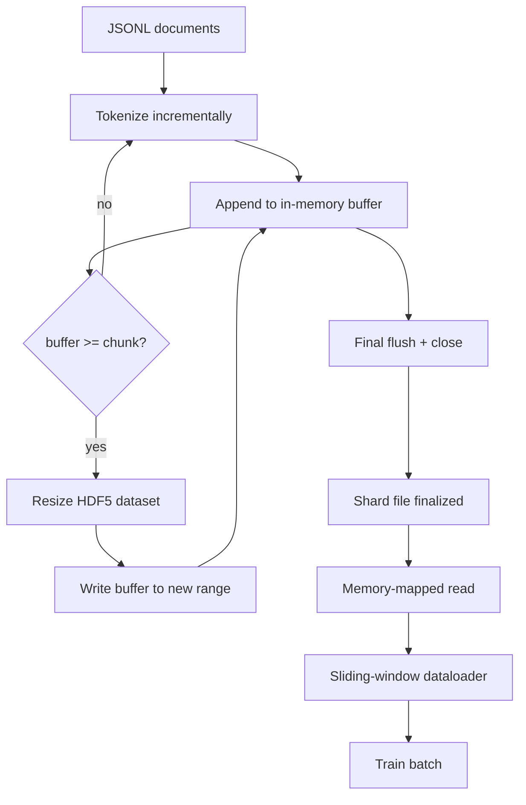

# HDF5 分词语料库

> 下载的语料库必须以训练器能够以线速流式读取的布局落地。磁盘上的 JSONL 经不住 16 个 dataloader worker 的并发访问。具有可调整大小的分块整数数据集的 HDF5 可以。本课将流式分词构建为可调整大小的 HDF5 数据集，跨多文件分片写入，训练时内存映射读取，以及生成带正确打包规则的固定长度序列的滑动窗口 dataloader。

**类型：** 构建
**语言：** Python
**前置要求：** 第 19 阶段 30-37 课
**所需时间：** 约 90 分钟

## 学习目标

- 将文档流式写入具有确定性分块的可调整大小 HDF5 整数数据集。
- 跨多个 HDF5 文件分片写入，使故障有界且可并行。
- 通过 HDF5 的页缓存支持的分块布局读回 token，使 dataloader 仅在 batch 时才复制到 batch 缓冲区。
- 实现一个滑动窗口 dataloader，产出带有显式打包规则的固定长度训练序列。

## 问题所在

现代语言模型训练在数十个 worker 上每秒读取数十万个样本的 token。磁盘上的 JSONL 在第一次冷缓存页错误时就崩溃了：JSON 解析器慢、文档边界不可寻址、定位到"样本 4,217,884"需要扫描文件。即使是压缩良好的 Parquet 也不合适，因为训练器不想要列，它想要一个具有 O(1) 随机访问的扁平 token 流。

HDF5 合适，因为它提供了分块、可调整大小的纯整数数据集，其分块在读取时对页缓存友好。训练器请求 `tokens[3,200,000 : 3,200,8192]` 的切片，HDF5 将请求的超切片从页缓存复制到新分配的 NumPy 数组中。成本是一个打开的文件句柄和每个 worker 一个分块大小的页缓存占用，与解码 JSONL 的成本相比可以忽略不计。

构建问题在于让写入端保持诚实。可调整大小的数据集容易被误用：逐文档写入会导致 HDF5 文件碎片化到不可用。一次 resize 写入所有文档，进程死亡会丢失整个分片。正确的纪律是先缓冲再扩展，缓冲区大小与分块大小匹配，分片写入将工作负载分散到多个文件上，使崩溃最多丢失一个分片。

## 概念说明



### 正确使用可调整大小的 HDF5

token 数据集以 `maxshape=(None,)` 和固定的 `chunks=(chunk_size,)` 创建。写入过程将 token 缓冲在长度为 `chunk_size` 的 NumPy 数组中。当缓冲区填满时，数据集恰好扩展 `chunk_size`，缓冲区写入新范围。在分片末尾，剩余缓冲区写入最后的部分范围。除最后一次外，每次写入都是连续且分块对齐的，读取器根据分片的 HDF5 属性中记录的 `token_count` 进行截断。

### 分片写入

单个 HDF5 文件是单点故障。流水线并行写入分片：来自第 19 阶段第 42 课的每个输入分片产出一个 HDF5 输出分片。`shards.json` 索引记录每个分片的文件路径、token 数量、文档数以及 token 的 sha256。训练器读取 `shards.json` 来计算全局偏移量和验证语料库。

### 内存映射读取

训练时每个 worker 以 `swmr=True` 模式打开其共享的 HDF5 文件，请求 `tokens[start:stop]`。HDF5 的分块布局使这成为页缓存支持的读取（一旦分块变热）。worker 永远不会具体化整个文件：切片被复制到 dataloader 的 batch 缓冲区，然后 dataloader 在 batch 时将其复制到固定内存的训练张量中。热路径每次分块转换有一次系统调用；其余都是 RAM 访问。

### 滑动窗口 dataloader

dataloader 是唯一了解训练序列长度的阶段。它在全局 token 流中随机选取一个起始索引，读取 `window_size + 1` 个 token，返回 `(input, target) = (tokens[:-1], tokens[1:])`。不强制文档边界：窗口可能横跨两个文档，中间有显式的 `boundary_token_id`，使模型学习使用分隔符。这是标准的打包规则；也是初学者容易忘记的规则，最终导致语料库 8% 是训练边界 token，92% 是自然文本。

## 开始构建

`code/main.py` 实现了：

- `Tokenizer` - 一个字节级确定性分词器，对演示足够。接口为 `encode(text) -> list[int]` 和 `vocab_size`。
- `HDF5ShardWriter` - 打开可调整大小的整数数据集，将 token 缓冲到分块大小，以固定步长 resize 和写入，关闭时记录 `token_count` 和 `sha256` 作为 HDF5 属性。
- `ShardedTokenizationPipeline` - 遍历输入文档，将其路由到写入器，输出 `shards.json` 索引。
- `MmapTokenStore` - 打开分片文件进行内存映射读取，计算全局偏移量，暴露单一的 `get_slice(start, stop)` API。
- `SlidingWindowDataloader` - 从全局流中随机选取窗口，产出 `(input_ids, target_ids)` NumPy 数组。

文件底部的演示构建一个小型内存语料库，分词为两个分片，通过内存映射打开，运行 dataloader 10 个 batch，打印每个 batch 的形状和校验和。

运行：

```bash
python3 code/main.py
```

脚本退出码为零并打印 batch 校验和。

## 生产模式

四种模式将本课扩展到真实训练。

**分块大小等于典型读取量。** 训练器每个样本读取 `window_size + 1` 个 token。将 HDF5 分块设为 `window_size` 的倍数，读取就是页缓存对齐的。不匹配的分块使吞吐量减半，因为每个样本都触及两个分块。

**token 计数在属性中，不在数据集中。** 数据集的尾部切片可能未满，因为分块大小不能整除文档边界。将真实的 `token_count` 存储为数据集上的 HDF5 属性，让读取器在该值处截断。没有这个，读取器会读到末尾之后的零填充 token，模型学会预测零。

**分片 sha256 加并行验证。** 每个分片有自己的 token 字节 sha256。训练器可以在训练开始前并行验证所有分片。错误的 sha256 会让运行提前失败，而不是在三轮之后、十六小时之后。

**两端都使用 `swmr=True`，写入端使用 `libver="latest"`。** 单写多读模式要求写入端以 `libver="latest"` 打开，预先创建每个数据集，然后设置 `file.swmr_mode = True`。之后写入端必须在每次 resize 后调用 `dataset.flush()`，这样读取器 worker（以 `swmr=True` 打开）才能看到一致的数据。跳过 `libver="latest"` 或在结构更改后启用 SWMR 是"文件已锁定"错误的常见来源。

## 使用它

生产模式：

- **每个源分片一个 HDF5。** 下载器（第 42 课）每个 URL 输出一个分片；分词（本课）每个源分片输出一个 HDF5。1:1 映射使恢复和部分故障恢复变得简单。
- **边界 token id。** 边界 token 是分词器词表的一部分，是 dataloader 唯一注入的 token。如果模型应该忽略它，训练损失会屏蔽边界 token；否则模型会学习将其用作序列分隔符。
- **`shards.json` 作为真实来源。** 添加新分片意味着写入 HDF5、计算其 sha256 并追加一个条目。训练器在启动时读取一次文件，永不接触目录列表。

## 交付

`outputs/skill-hdf5-tokenized-corpus.md` 在真实项目中会描述哪个分词器供给流水线、什么分块大小匹配训练器的窗口、`shards.json` 在版本控制中的位置，以及 dataloader worker 如何跨文件分片。本课交付引擎。

## 练习

1. 向 HDF5 写入器添加 `--compression gzip` 标志，测量演示语料库上的吞吐量成本。论证默认值的选择。
2. 向滑动窗口 dataloader 添加确定性种子，验证两次相同种子的运行产生相同的 batch。
3. 添加 `--validate` 模式，读取每个分片，重新计算其 token 的 sha256，并与 `shards.json` 比较。CI 应在训练开始前运行此项。
4. 在分块大小等于、一半和两倍窗口大小时比较 dataloader 吞吐量。报告页缓存效应。
5. 添加 `--max-document-tokens` 标志，在写入时截断超长文档。论证在写入时决定与在读取时决定的权衡。

## 关键术语

| 术语 | 常见说法 | 实际含义 |
|------|---------|---------|
| 可调整大小的数据集 | "追加写入" | 具有 `maxshape=(None,)` 的 HDF5 数据集，通过 `resize` 调用以分块大小步长增长 |
| 分块布局 | "HDF5 的存储方式" | 固定大小的磁盘页，内核可以内存映射，dataloader 可以连续读取 |
| `swmr` 模式 | "边读边写" | 单写多读模式，使 dataloader worker 可以安全共享文件 |
| 分片索引 | "shards.json" | 包含偏移量和内容哈希的所有 token 分片的持久化索引 |
| 滑动窗口 | "训练样本" | 全局 token 流的固定长度切片，训练器将其与偏移一位的目标配对 |

## 延伸阅读

- [HDF5 分块文档](https://docs.hdfgroup.org/hdf5/v1_14/) - 本课使用的分块可调整大小数据集布局
- [h5py 用户指南](https://docs.h5py.org/en/stable/) - HDF5 的 Python 绑定
- [NumPy 内存映射](https://numpy.org/doc/stable/reference/generated/numpy.memmap.html) - HDF5 通过 h5py 暴露的读取端原语
- 第 19 阶段 · 42 - 本课分词其输出的下载器
- 第 19 阶段 · 44 - 消费本 dataloader 的余弦调度
- 第 19 阶段 · 45 - 包裹训练步骤的 AMP 循环
