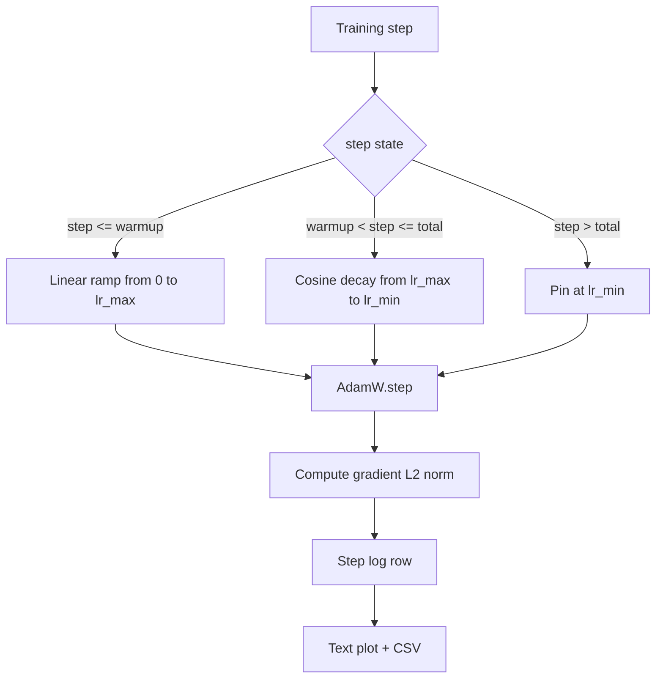

# 余弦学习率与线性预热

> 学习率调度是仅次于损失函数的最重要决策。AdamW 搭配余弦衰减和线性预热是语言模型训练的现代默认方案，因为它让模型在脆弱的前一千次更新中看到较小的有效步长，逐步上升到配置的峰值，然后平滑衰减回零。本课构建该调度，在训练步数上绘制曲线，在调度旁记录梯度范数，并证明调度遵守预热、峰值和衰减边界。

**类型：** 构建
**语言：** Python
**前置要求：** 第 19 阶段 30-37 课
**所需时间：** 约 90 分钟

## 学习目标

- 实现一个 AdamW 优化器，连接到带线性预热的余弦学习率调度。
- 在任意步数精确计算调度的值，跨运行无浮点漂移。
- 在学习率旁记录梯度 L2 范数，使训练健康状况可观测。
- 将调度渲染为人眼可读的文本图和任何工具可消费的 CSV。

## 问题所在

前一千次训练更新是最嘈杂的。模型的权重仍接近初始化。优化器的运行二阶矩估计尚未稳定。梯度范数大且噪声多。如果学习率在这些更新期间处于峰值，模型要么直接发散，要么陷入永远无法逃脱的损失平台。两种已知的修复方法是梯度裁剪（第 19 阶段第 45 课的主题）和一个从小值逐步上升的学习率调度。

余弦预热调度有三个区域。从步 0 到步 `warmup_steps`，学习率从零线性上升到配置的峰值 `lr_max`。从步 `warmup_steps` 到步 `total_steps`，学习率遵循余弦曲线的上半部分，从 `lr_max` 衰减到 `lr_min`。`total_steps` 之后，学习率固定在 `lr_min`，这样配置错误的训练器超调时不会静默退出调度。

构建问题在于调度很容易差一出错。差一错误会在训练运行六小时后表现为学习率在模型开始过拟合的时刻偏高或偏低 1%，除非在边界上对调度进行详尽测试，否则不可见。

## 概念说明



### 预热公式

对于 `step` 在 `[0, warmup_steps]` 范围内且 `warmup_steps > 0`，学习率为 `lr_max * step / warmup_steps`。退化的 `warmup_steps = 0` 情况被视为"无预热"：调度在步 0 直接从 `lr_max` 开始，立即进入余弦衰减。一些测试工具传入 `warmup_steps = 0` 来检查调度是否仍产生可用曲线。

### 余弦公式

对于 `step` 在 `(warmup_steps, total_steps]` 范围内，学习率为 `lr_min + 0.5 * (lr_max - lr_min) * (1 + cos(pi * progress))`，其中 `progress = (step - warmup_steps) / max(1, total_steps - warmup_steps)`。在 `step = warmup_steps` 时，余弦求值为 `cos(0) = 1`，得到 `lr_max`，精确匹配预热终点。在 `step = total_steps` 时，余弦求值为 `cos(pi) = -1`，得到 `lr_min`，精确匹配衰减终点。

两个端点的连续性不是巧合。这正是调度被实现为关于 `step` 的单一函数，而不是三个不同函数粘合在一起的原因。粘合的调度在第一次修改 `lr_max` 时就会丢失一个边界。

### 超过总步数后的下限

对于 `step > total_steps`，学习率保持在 `lr_min`。契约是明确的：调度不会报错，也不会外推；它固定在下限并让训练器记录警告。需要延长训练的训练器更改调度的 `total_steps`，而非循环本身。

### 在学习率旁记录梯度范数

调度是训练健康的一半。梯度范数是另一半。训练循环每步记录两者。发散的训练运行会在损失之前显示梯度范数飙升；良好的预热使范数随学习率线性上升；过于激激进的峰值表现为预热后范数持续居高。磁盘上的数据是 `step, lr, grad_l2_norm, loss`。CSV 是唯一的持久化记录。

## 开始构建

`code/main.py` 实现了：

- `CosineWithWarmup` - 一个无状态函数 `lr(step) -> float`，覆盖配置的调度。
- `TrainState` - 将模型、`AdamW` 优化器和调度包装为单一的步进函数。
- `TrainState.step` - 运行一次前向传播、一次反向传播，记录梯度 L2 范数，并将 `lr(step)` 应用到优化器。
- `plot_schedule_ascii` - 将调度渲染为人眼可读的文本图。
- `write_schedule_csv` - 每步输出一行，包含学习率。

文件底部的演示构建一个小型 `nn.Linear` 模型，在固定输入 batch 上训练 20 步，打印每步的学习率、梯度范数和损失。调度也渲染为文本图用于视觉健全性检查。

运行：

```bash
python3 code/main.py
```

脚本退出码为零，打印逐步训练日志和调度图。

## 生产模式

四种模式将调度提升为生产制品。

**调度存在于配置中，而非代码中。** 训练器从 YAML 或 JSON 配置中读取 `warmup_steps`、`total_steps`、`lr_max`、`lr_min`，该配置提交到 git。调度可复现，因为配置是内容寻址的；调度可审计，因为配置是 PR diff 的一部分。

**步数计数器单调且与轮次解耦。** 某些框架在数据集分片或 dataloader 重启时混淆步和轮次。调度从训练器的检查点读取 `global_step`，而非本地计数器。恢复的运行在正确的调度位置继续，因为步数计数器是持久化的轴。

**调度图在运行目录中。** 每次训练运行将 `outputs/lr_schedule.png`（或本课中的文本图）写入其运行目录。浏览目录的审阅者无需重新运行即可检查调度。这在 PR 阶段捕获配置错误的调度类 bug。

**日志行 schema 固定。** `step, lr, grad_l2_norm, loss` 按此顺序。下游 notebook 或仪表板读取该 schema；不升级版本就重命名列会使所有现有仪表板失效。

## 使用它

生产模式：

- **先扫峰值再扫其他。** `lr_max` 是最敏感的旋钮。先在小模型上扫描；最优的 `lr_max` 与模型大小弱相关，因此小模型扫描是强先验。
- **预热是总步数的比例，而非绝对数量。** 2 亿步的训练用 2000 步预热几乎立即达到峰值；20000 步的训练用相同数量预热了 10%。将预热配置为比例（典型：1-3%），使调度随训练时长缩放。
- **`lr_min` 非零是有意的。** 为 `lr_max` 10% 的下限让优化器在长尾期间继续学习。`lr_min = 0` 的调度产生一个在图表上看起来很好但模型实际上并未完成训练的训练曲线。

## 交付

`outputs/skill-cosine-warmup.md` 在真实项目中会描述哪个配置携带调度、从训练器的哪个步骤读取全局计数器，以及什么 `lr_max` 扫描产出了部署值。本课交付引擎。

## 练习

1. 添加调度的平方根倒数变体，在 200 步的玩具训练上比较。哪条曲线产生更低的最终损失？
2. 添加 `--restart` 标志，在 `total_steps / 2` 处添加第二次预热。论证热重启在玩具运行上是改善还是损害。
3. 添加一个单元测试验证调度连续性：对于 `[0, total_steps]` 中的每一步，`|lr(step+1) - lr(step)|` 的差值受 `lr_max / warmup_steps` 约束。
4. 将调度接入 `torch.optim.lr_scheduler.LambdaLR` 以便与框架代码组合。本课使用纯步进函数；包装器改变了什么？
5. 添加 `--plot-png` 标志，通过 `matplotlib` 写入真正的图表。论证本课的文本图和 PNG 哪个是 CI 运行的更好默认。

## 关键术语

| 术语 | 常见说法 | 实际含义 |
|------|---------|---------|
| 预热（Warmup） | "慢启动" | 在前 `warmup_steps` 次更新中从零线性上升到 `lr_max` |
| 余弦衰减 | "平滑下降" | 在剩余步数上从 `lr_max` 到 `lr_min` 的上半余弦曲线 |
| 下限（Floor） | "训练之后" | 超过 `total_steps` 后调度固定的 `lr_min` 值 |
| 梯度范数 | "梯度的 L2" | 拼接梯度向量的欧几里得范数，每步记录 |
| 全局步数 | "调度轴" | 在重启中存活的单调步计数器，驱动调度 |

## 延伸阅读

- [Loshchilov and Hutter, SGDR: Stochastic Gradient Descent with Warm Restarts (arXiv 1608.03983)](https://arxiv.org/abs/1608.03983) - 余弦调度的参考论文
- [Loshchilov and Hutter, Decoupled Weight Decay Regularization (arXiv 1711.05101)](https://arxiv.org/abs/1711.05101) - AdamW 的参考论文
- [PyTorch torch.optim.lr_scheduler](https://docs.pytorch.org/docs/stable/optim.html#how-to-adjust-learning-rate) - 步进函数如何与框架调度器组合
- 第 19 阶段 · 42 - 本调度消费其语料库的下载器
- 第 19 阶段 · 43 - 本调度协同演化的 dataloader
- 第 19 阶段 · 45 - 梯度裁剪和 AMP，循环中的下一层
