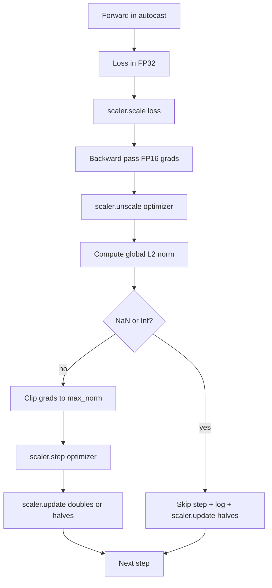

# 梯度裁剪与混合精度

> 上一课的优化器和调度假设梯度是正常的。它们通常不是。一个糟糕的 batch 就能让梯度范数飙升三个数量级。混合精度训练通过在损失端引入 FP16 溢出进一步放大了这个问题。本课构建生产训练不可或缺的两条安全带：将梯度裁剪到配置的全局 L2 范数，以及带有 autocast 和 GradScaler 的混合精度循环，能检测 NaN 和 Inf、干净地跳过该步并记录缩放因子以便事后分析。

**类型：** 构建
**语言：** Python
**前置要求：** 第 19 阶段 30-37 课
**所需时间：** 约 90 分钟

## 学习目标

- 计算所有参数梯度的全局 L2 范数，当其超过配置的阈值时就地裁剪。
- 用 autocast 加 GradScaler 包裹训练步骤，使 FP16 的前向和反向传播能存活溢出。
- 检测损失或梯度中的 NaN 和 Inf，跳过优化器步骤，并记录跳过。
- 每步报告 GradScaler 的缩放因子，使连续跳过立即可见。

## 问题所在

昨天运行正常的训练在第 8,217 步产生了竖直上升的损失曲线。罪魁祸首是一个梯度范数为 4200 的 batch，是之前峰值的 20 倍。没有裁剪的话，优化器施加的一步会重置模型在过去一小时学到的所有东西。有全局 L2 裁剪阈值 1.0，同一个 batch 贡献一个单位范数的更新；损失保持在趋势线上；运行存活下来。

混合精度训练通过在 FP16 中计算前向传播和大部分反向传播来将吞吐量提升 2-3 倍。代价是 FP16 的指数范围很窄。在 FP16 中溢出的典型梯度求值为 Inf，随后在后续层中传播为 NaN，在下一次优化器步骤时将每个权重设为 NaN。PyTorch 的 GradScaler 通过在反向传播前将损失乘以一个大的缩放因子、在优化器步骤前将梯度除以同一因子来解决这个问题。如果在 unscale 时任何梯度是 Inf 或 NaN，scaler 跳过该步并将缩放因子减半；如果前 N 步都是干净的，scaler 将因子加倍。在训练过程中，因子会找到 FP16 范围允许的最高值。

构建问题在于正确连接两者。在 unscale 之前裁剪，阈值作用在缩放后的梯度上；在 unscale 之后裁剪，操作顺序对 GradScaler 很重要。正确的顺序是：`scaler.scale(loss).backward()`，然后 `scaler.unscale_(optimizer)`，然后 `clip_grad_norm_`，然后 `scaler.step(optimizer)`，然后 `scaler.update()`。任何其他顺序都会产生静默损坏的循环。

## 概念说明



### 全局 L2 范数

全局 L2 范数是拼接梯度向量的欧几里得范数，而非逐参数范数。PyTorch 通过 `torch.nn.utils.clip_grad_norm_(parameters, max_norm)` 实现。该函数返回裁剪前的范数，这样本课可以同时记录自然值和裁剪后的值，这对于"我们在每步都在裁剪"的诊断是必要的。

### autocast 和 GradScaler

`torch.amp.autocast(device_type)` 是选择性地在 FP16 中运行合格操作（大多数矩阵乘法类操作）的上下文管理器。`torch.amp.GradScaler(device_type)` 是在反向传播前缩放损失、在优化器步骤前反缩放梯度的辅助器。两者是协同设计的；只用其一是配置错误，测试应能捕获。

本课使用 CPU autocast，因为这是在 CI 中运行的；同样的模式通过将 `device_type="cpu"` 改为 `device_type="cuda"` 即可原样迁移到 GPU。CPU 上的 GradScaler 是一个桩实现（CPU autocast 默认已在 BF16 中操作，不需要损失缩放），但本课包含了调用点，使连接与 GPU 循环相同。

### NaN 和 Inf 检测

检测发生在两个地方。首先，损失本身在反向传播前用 `torch.isfinite` 检查；Inf 或 NaN 损失不会产生有用的梯度，会跳过而不进入优化器。其次，在 `scaler.unscale_(optimizer)` 之后，本课用 `has_non_finite_grad(...)` 扫描未缩放的梯度，将任何 Inf 或 NaN 视为跳过。两项检查一起覆盖了前向传播和反向传播的失败模式。

### 缩放因子诊断

缩放因子是 GradScaler 的内部状态。每步本课读取 `scaler.get_scale()` 并将其记录在学习率和梯度范数旁。健康的运行显示缩放因子以 2 的幂攀升直到在 `2^17` 或 `2^18` 附近饱和。异常的运行显示因子在高低值之间振荡，这表明模型的梯度有时在范围内有时不在。不记录日志则诊断不可见。

## 开始构建

`code/main.py` 实现了：

- `clip_global_l2_norm` - `torch.nn.utils.clip_grad_norm_` 的包装器，返回裁剪前和裁剪后的范数。
- `has_non_finite_grad` - 扫描梯度中 NaN 和 Inf 的辅助器。
- `AmpTrainState` - 包裹模型、`AdamW` 优化器、GradScaler 和 autocast 设备。暴露一个 `step(inputs, targets)` 方法，运行完整的裁剪、缩放和 NaN 跳过流水线。
- `StepLog` 和 `SkipLog` - 结构化的逐步记录。
- 一个演示，训练小型 `nn.Linear` 模型 20 步，在第 5 步注入 Inf 以演练跳过路径，并打印结果日志。

运行：

```bash
python3 code/main.py
```

脚本退出码为零并打印逐步日志，每行标记为 `STEP` 或 `SKIP`；至少有一行是 `SKIP`。

## 生产模式

四种模式将循环提升为生产训练步骤。

**跳过计数器是告警，而非日志行。** 每次训练运行少量跳过是健康的。每轮数百次跳过是硬告警：模型处于 FP16 无法容纳的状态，循环在静默失败。本课跟踪 1000 步的滚动跳过率，在生产中会以超过 5% 的比率告警。

**裁剪阈值在配置中。** `max_norm = 1.0` 是语言模型训练的现代默认值。先在小模型上扫描；较大的阈值让模型从真正困难的 batch 中恢复；较小的阈值以更嘈杂的损失曲线为代价约束最坏情况。阈值应与第 44 课的调度放在同一个 YAML 或 JSON 配置中。

**范数日志与调度一起写入 CSV。** CSV 列为 `step, lr, grad_l2_pre_clip, grad_l2_post_clip, loss, skipped, skip_reason, scaler_scale`。打开文件的审阅者在一行中看到调度、梯度故事、缩放因子和跳过结果（含原因）。将列分散到多个文件是错位分析的根源。

**`scaler.update()` 每步运行，即使跳过时也运行。** 在干净步骤中，scaler 读取其无 Inf 计数器，递增，可能将因子加倍。在跳过步骤中，scaler 将因子减半并重置计数器。在跳过路径上忘记 `update()` 是产生"缩放因子从未改变"的 bug。

## 使用它

生产模式：

- **Autocast 设备与优化器设备匹配。** GPU 训练用 `torch.amp.autocast(device_type="cuda")`；CPU 用 `torch.amp.autocast(device_type="cpu")`。混用设备会产生静默类型错误，表面看损失曲线正常但模型没有在学习。
- **反向传播前检查损失。** `torch.isfinite(loss).all()` 是一次张量归约；成本可忽略，在 NaN 损失上节省的是整个训练步骤。务必执行。
- **`zero_grad` 中使用 `set_to_none=True`。** 将梯度设为 `None` 而非零，让优化器跳过未受影响参数组的计算。该设置是免费的吞吐量提升和轻微的 bug 表面缩减。

## 交付

`outputs/skill-clip-amp.md` 在真实项目中会描述训练步骤使用什么裁剪阈值和 autocast 设备、逐步 CSV 在版本控制中的位置，以及生产跳过率告警阈值。本课交付引擎。

## 练习

1. 用真实的损失尖峰（将一个 batch 的目标乘以 1e8）替换合成的 Inf 注入，验证跳过路径被触发。
2. 添加 `--bf16` 模式，将 autocast 切换为 BF16 而非 FP16。BF16 比 FP16 有更宽的指数范围，很少需要损失缩放；验证在同一演示上跳过率降为零。
3. 添加单元测试，在不发生裁剪时验证梯度裁剪包装器正确返回裁剪前和裁剪后的范数。
4. 添加滚动窗口跳过率计算和 CLI 标志，当速率在连续 100 步超过配置阈值时使运行失败。
5. 连接循环以写入规范 CSV（`step, lr, grad_l2_pre_clip, grad_l2_post_clip, loss, skipped, skip_reason, scaler_scale`），并通过每行后刷新确认文件在 Ctrl-C 后存活。

## 关键术语

| 术语 | 常见说法 | 实际含义 |
|------|---------|---------|
| 全局 L2 范数 | "裁剪目标" | 所有可训练参数拼接梯度向量的欧几里得范数 |
| autocast | "混合精度" | 在 `with` 块内选择性执行 FP16（或 BF16）的合格操作 |
| GradScaler | "损失缩放器" | 在反向传播前乘以损失、在优化器步骤前反缩放梯度的辅助器 |
| 跳过（Skip） | "坏步骤" | 因梯度或损失非有限而被拒绝的优化器步骤；scaler 将因子减半 |
| 缩放因子 | "Scaler 状态" | GradScaler 的当前乘数；在连续干净步骤后加倍，每次跳过时减半 |

## 延伸阅读

- [Micikevicius et al., Mixed Precision Training (arXiv 1710.03740)](https://arxiv.org/abs/1710.03740) - 原始的损失缩放提案
- [Pascanu, Mikolov, Bengio, On the difficulty of training recurrent neural networks (arXiv 1211.5063)](https://arxiv.org/abs/1211.5063) - 梯度裁剪的参考论文
- [PyTorch torch.amp.GradScaler](https://docs.pytorch.org/docs/stable/amp.html) - 本课包装的 scaler API
- [PyTorch torch.nn.utils.clip_grad_norm_](https://docs.pytorch.org/docs/stable/generated/torch.nn.utils.clip_grad_norm_.html) - 本课使用的裁剪原语
- 第 19 阶段 · 42 - 本循环消费其语料库的下载器
- 第 19 阶段 · 43 - 本循环消费的 dataloader
- 第 19 阶段 · 44 - 本循环组合的调度
