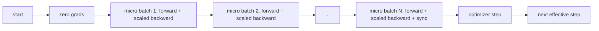
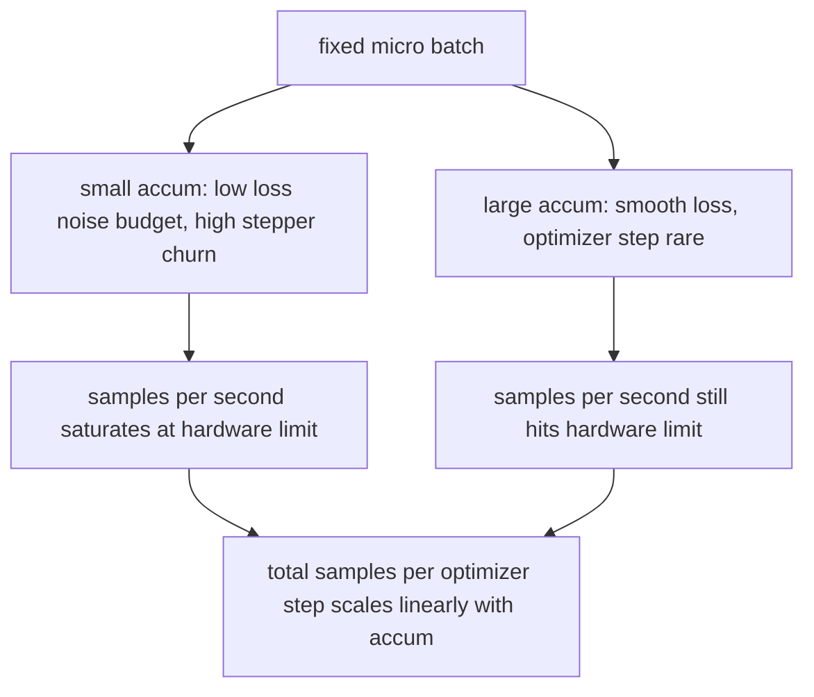

# 梯度累积

> 用你负担不起的有效 batch 大小来训练，一次一个 micro-batch。缩放损失，暂不执行优化器步骤，让梯度堆积起来。

**类型：** 构建
**语言：** Python
**前置要求：** 第 19 阶段 42-45 课
**所需时间：** 约 90 分钟

## 学习目标

- 推导有效 batch 恒等式：`effective_batch = micro_batch * accum_steps`。
- 实现逐 micro-batch 的损失缩放，使累积梯度与单次完整 batch 反向传播匹配。
- 在最后一个 micro-batch 之前跳过优化器同步（sync-on-last-step）。
- 阅读吞吐量与有效 batch 的曲线，解释收益递减。

## 问题所在

你想以有效 batch 大小 512 来训练，因为损失曲线更平滑，优化器步进在那个尺度上更有意义。桌上的加速器在内存耗尽前只能放下 32 个样本。翻倍 batch 不可行。减半模型也不可行。这个领域在 2017 年就采用且从未停止使用的技巧是运行 16 次反向传播，让梯度在参数缓冲区中累积，当计数达到目标时才执行优化器步骤。

风险在于损失不再是大 batch 下的那个数字。朴素求和的 16 个 mini-batch 的交叉熵是一个完整 batch 损失的 16 倍。不缩放的话，梯度方向正确但幅度错误，优化器步骤大了 16 倍。修复方法是一次除法。这个修复也很容易忘记。

## 概念说明



契约很简短：

- 每个 micro-batch 的损失在 `backward()` 之前除以 `accum_steps`。PyTorch 默认将梯度求和到 `param.grad`；除法将运行中的总和推回正确的尺度。
- 优化器步骤每个有效 batch 触发一次，在最后一个 micro-batch 的反向传播之后。在累积中途执行步骤会偏移运行依赖的每个参数。
- 优化器的状态（动量缓冲、Adam 矩）每个有效步进一次，而非每个 micro-batch 一次。否则指数移动平均会看到错误的频率并烧穿调度。
- 在单设备上这是记账工作。在多 rank 集群上，同样的模式将非最后一个 micro-batch 包裹在 `no_sync` 上下文中跳过梯度 all-reduce；最后一个 micro-batch 一次减少完整累积的梯度，而不是支付 N 次网络成本。

### 代码中的等价性证明

```python
loss = criterion(model(x_full), y_full)
loss.backward()
opt.step()
```

等价于

```python
for x, y in chunks(x_full, y_full, n):
    scaled = criterion(model(x), y) / n
    scaled.backward()
opt.step()
```

误差在浮点求和顺序范围内。循环结束时累积的梯度缓冲区与单次完整 batch 反向传播产生的张量相同。本课代码通过 `equivalence_check` 中最大绝对差小于 1e-4 的断言来验证这一点。

### 成本去向

每个 micro-batch 的成本是一次前向和一次反向传播。通过累积，你用时间换空间。`outputs/accum-curve.json` 中的吞吐量曲线展示了在固定 micro-batch 下随着有效 batch 增大发生的情况：



天下没有免费的午餐。翻倍 `accum_steps` 翻倍每个优化器步骤的挂钟时间。变化的是梯度估计的方差：在相同的挂钟预算下，你执行了更少的优化器步骤，但每个步骤在更多样本上平均。文献将大 batch 和小 batch 视为不同的优化问题；本课是机械的，不是统计的。

## 开始构建

`code/main.py` 是可运行的制品。它做三件事。

### 第 1 步：等价性检查

`equivalence_check()` 用相同种子构建同一网络的两个副本。一个在一次前向传播中看到 16 个样本的 batch。另一个看到四个 4 样本的 chunk，损失除以四。函数在优化器步骤前比较梯度缓冲区，以及步骤后的参数。断言为 `max_abs_diff < 1e-4`。

### 第 2 步：sync-on-last-step 模式

`train_one_optimizer_step` 遍历 micro-batch。对于除最后一个外的每个 micro-batch，它进入 `no_sync_context(model)`。在单进程上该上下文是空操作；在 DDP 上这是跳过梯度 all-reduce 的地方。无论哪种情况，记账是相同的。`sync_counter` 记录我们离开 no_sync 范围的次数；对于 N 个 micro-batch，每个有效步计数一次，而非 N 次。

### 第 3 步：吞吐量曲线

`sweep_effective_batches` 用固定 micro-batch 和一组累积步数运行同一模型。对每种设置记录：

- `samples_per_sec`：总样本数除以挂钟时间
- `median_step_ms`：每个有效步的第 50 百分位
- `sync_calls`：执行的集合点
- `avg_loss`：扫描中优化器步骤的平均值

输出落在 `outputs/accum-curve.json` 中，可从 notebook 复用。

运行：

```bash
python3 code/main.py
```

脚本打印等价性差异，然后是扫描表，然后是 JSON 路径。退出码为零。

## 使用它

在生产训练中，梯度累积位于一个旋钮后面。PyTorch 的模式是 `accumulation_steps = effective_batch // (micro_batch * world_size)`。你不允许在此使用的框架包装了同样的循环，但步骤相同：缩放损失、在非最终 micro 上跳过同步、累积、执行一次步骤。

三种常见模式：

- micro-batch 大小选择为充分利用设备内存。更小浪费加速器周期。更大则崩溃。
- 有效 batch 从学习率调度中选择。大有效 batch 需要缩放的学习率和预热；这就是自 2017 年以来讨论的线性缩放规则。
- 累积计数是两者之间的桥梁，也是你在运行时无需重写 dataloader 就可以自由调整的唯一旋钮。

## 交付

`outputs/skill-gradient-accumulation.md` 捕获了配方，方便同事将其放入新仓库：损失除以 `accum_steps`、在非最终 micro 上跳过优化器同步、每个有效 batch 执行一次优化器步骤、将吞吐量与有效 batch 的关系以 JSON 记录，使权衡可见。

## 练习

1. 用 `--num-steps 100` 重新运行扫描，绘制每秒样本数与有效 batch 的关系曲线。曲线在哪里变平？
2. 添加错误缩放变体（不除法），在第 1 步展示与参考的参数差异。
3. 将 SGD 换成 AdamW，确认优化器状态每个有效步进一次，而非每个 micro-batch。
4. 引入真正的 `DistributedDataParallel` 包装器，将 `no_sync_context` 路由到其方法。确认 sync_calls 每个有效 batch 减少 N-1。
5. 修改等价性检查以比较两种不同的 micro 分割（2x8 对 4x4），解释你需要放宽的任何容差。

## 关键术语

| 术语 | 常见说法 | 实际含义 |
|------|---------|---------|
| Micro batch | "你前向传播的 batch" | 在单次前向传播中能放入内存的切片 |
| 累积步数（Accum steps） | "每步的反向传播次数" | 在一次优化器步骤前累加的反向传播次数 |
| 有效 batch（Effective batch） | "batch" | micro batch 乘以累积步数乘以数据并行 world size |
| 损失缩放（Loss scaling） | "除以 N" | 逐 micro-batch 除法，使累加的梯度与完整 batch 匹配 |
| 最后一步同步（Sync on last） | "跳过其余" | 只在窗口中最后一次反向传播上运行梯度集合 |

## 延伸阅读

- PyTorch 关于 `DistributedDataParallel.no_sync` 的文档，sync-on-last-step 技巧的生产版本。
- Goyal et al., 2017，关于大 batch 训练的线性缩放，关注有效 batch 的经典原因。
- PyTorch issue tracker 关于梯度累积与混合精度 unscaling 的交互。
- 第 19 阶段 42-45 课涵盖模型、dataloader、优化器和训练器脚手架，本课假设已了解。
- 第 19 阶段第 47 课涵盖检查点和恢复，使长时间累积运行能存活挂钟限制。
