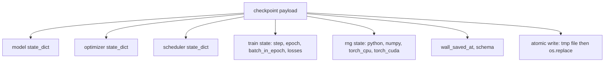
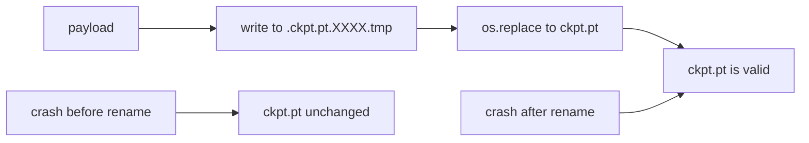
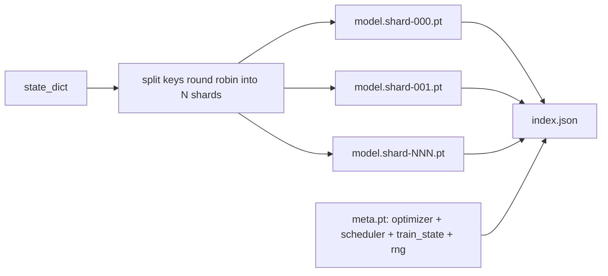

# 检查点保存与恢复

> 训练中断会杀死运行；检查点让它们继续。原子性地保存模型、优化器、调度器、损失历史、步计数器和 RNG 状态，这样在任何时刻的 kill 都会在磁盘上留下一个有效文件。

**类型：** 构建
**语言：** Python
**前置要求：** 第 19 阶段 42-45 课
**所需时间：** 约 90 分钟

## 学习目标

- 将完整训练状态捕获到单一载荷中，可重新加载到全新进程。
- 通过先写临时文件再重命名实现原子保存，使崩溃永远不会留下半写文件。
- 恢复 Python、NumPy 和 PyTorch 的 RNG 状态，使恢复后的损失与未中断的基线匹配。
- 为不再能放入单文件的模型构建分片检查点布局，带有哈希验证的分片和 JSON 索引。

## 问题所在

你设置了一个 18 小时的训练任务。挂钟限制是 4 小时。集群在第 11 小时重启，因为某个比你级别高的人批准了内核升级。没有检查点你就得从头开始。没有恢复你还会丢失前 11 小时学到的优化器状态，因此即使模型权重幸存了，AdamW 矩也没了，下一步会朝训练轨迹已经走过的一个方向猛冲。

正确的制品是一个包含继续所需一切的单一文件：模型参数、优化器状态、调度器状态、用于绘图的损失历史、当前步数和轮次及轮内 batch 计数器，以及每个随机性来源的 RNG 状态。没有 RNG 状态，恢复后的损失曲线是另一条曲线。相同的模型、相同的数据、不同的 shuffle、不同的 dropout 掩码、仪表板上的不同数字。

原子保存是契约的另一半。写入最终文件名意味着写到一半崩溃会留下损坏的文件；恢复读到的是垃圾。写入同一目录中的临时文件然后重命名意味着写到一半崩溃时之前的完好文件不受影响。在 POSIX 文件系统上重命名是原子的。

## 概念说明



### 五个状态桶

| 桶 | 为什么重要 |
|---|-----------|
| 模型 | 权重和缓冲区；模型是什么。 |
| 优化器 | 动量和自适应矩；没有这些，下一步是一个不同的优化问题。 |
| 调度器 | 学习率在曲线上的位置；余弦调度尤其关心。 |
| 训练计数器 | 步数、轮次、轮内 batch，加上绘制仪表板的损失历史。 |
| RNG 状态 | dropout、数据 shuffle 和模型内任何采样的确定性。 |

### 原子保存



两条规则。首先，临时文件必须与目标在同一目录中，这样重命名保持在同一文件系统内；跨设备重命名不是原子的。其次，临时名称每次尝试都是唯一的，这样两个写入器不会冲突。

### 分片检查点

当模型变大时，单一文件的载荷变得太大无法快速加载、太大无法检查、网络共享读取中途出问题时太痛苦。修复方法是将参数状态拆分成多个分片并写入一个将它们联系在一起的小索引。



索引记录分片数量、每个分片的 sha256 以及 meta 文件的 sha256。加载器在任何哈希不匹配时大声失败。分片可以落在不同的物理磁盘上；meta 体积小且首先读取。

### 从轮次中间恢复

对齐到下一轮开始的恢复会浪费从几分钟到一整天不等的时间。修复方法是 `(epoch, batch_in_epoch)` 加上 RNG 状态。加载后，训练循环快速推进随机数生成器跳过当前轮次中已消费的 batch，从 `batch_in_epoch` 继续。本课代码精确实现了这一点；断言是恢复后的损失轨迹与未中断基线在 1e-4 以内匹配。

## 开始构建

`code/main.py` 提供四个原语和一个演示驱动器。

### 第 1 步：捕获和恢复 RNG 状态

`capture_rng_state` 返回一个包含 Python 的 `random.getstate`、NumPy 的 `np.random.get_state` 和 PyTorch CPU 及 CUDA RNG 字节的字典。`restore_rng_state` 逆转它。CPU 张量是 PyTorch RNG 知道如何消费的 uint8 字节缓冲区。

### 第 2 步：原子保存

`atomic_save` 将载荷写入目标目录中的临时文件，然后 `os.replace` 将其交换到最终名称。`atomic_write_json` 对分片索引做同样的事。

### 第 3 步：完整的检查点往返

`save_checkpoint` 将模型、优化器、调度器、训练状态和 RNG 打包成一个字典。`load_checkpoint` 逆转它并返回 `TrainState`。schema 字段是升级钩子：未来的格式更改提升版本字符串，加载器分派处理。

### 第 4 步：分片变体

`save_sharded_checkpoint` 将参数键以轮询方式分配到 N 个分片中，通过各自的原子保存写入每个分片，写入包含优化器、调度器和训练状态的 meta 文件，并写入包含分片 sha256 的 JSON 索引。`load_sharded_checkpoint` 在合并前验证每个分片。

### 第 5 步：恢复演示

`run_resume_demo` 训练一个小模型 `total_steps` 步，在 `interrupt_at` 处保存检查点，然后继续。第二个进程恢复检查点并运行剩余步骤。函数返回中断点后两条损失轨迹之间的最大绝对差。恢复 RNG 后，差值为零或浮点噪声。

运行：

```bash
python3 code/main.py
```

单文件和分片演示都断言最大差异在 1e-4 以内。摘要落在 `outputs/resume-demo.json` 中。

## 使用它

生产训练技术栈将检查点作为训练器的一部分。形状相同：模型 + 优化器 + 调度器 + 计数器 + RNG，原子写入，按步命名以便找到最新的。分片布局用并行读取支持大模型加载；index.json 使之可行。

三种强制执行的模式：

- **Schema 是载荷中的字符串。** 迁移基于它分支。没有它你就无法演进格式而不破坏旧运行。
- **每个分片 sha256。** 静默截断的下载是最糟糕的 bug；加载器要么快速失败要么晚失败。
- **保持检查点节奏诚实。** 每 N 步和每挂钟分钟保存一次，以较短者为准。否则崩溃的长步会浪费一整窗的工作。

## 交付

`outputs/skill-checkpoint-save-resume.md` 是任何新训练脚本的配方：载荷形状、原子写入、RNG 捕获、分片索引。将技能放入仓库，在定期保存处连接 `save_checkpoint`，在启动处连接 `load_checkpoint`，运行就能存活 kill。

## 练习

1. 用按参数组分片（以 `.weight` 结尾的层 vs `.bias`）替换轮询分片。每种布局在什么情况下更优？
2. 扩展保存循环以保留最后 K 个检查点并修剪旧的。磁盘小时合适的 K 是多少？
3. 添加 `--ckpt-every-seconds` 标志，按挂钟间隔触发保存，而非仅步数。
4. 添加校验和验证路径，在启动时运行，扫描目录中的每个检查点并报告哪些已损坏。
5. 实现 `migrate_v1_to_v2` 函数，向载荷添加新字段并提升 schema 字符串。使加载兼容两个版本。

## 关键术语

| 术语 | 常见说法 | 实际含义 |
|------|---------|---------|
| 原子保存（Atomic save） | "写了就祈祷" | 写入同一目录中的临时文件，然后 `os.replace` 到目标名称 |
| 状态字典（State dict） | "权重" | 模型参数和缓冲区，按参数名键控 |
| 分片检查点（Sharded checkpoint） | "大模型文件" | 多个文件，每个分片一个，加上 meta 文件和带 sha256 的 JSON 索引 |
| RNG 状态 | "随机种子" | python random、numpy、torch CPU、torch CUDA 的捕获状态；不只是种子 |
| 轮次中间恢复 | "重启" | 快速推进 RNG，从同一轮次的下一个 batch 继续 |

## 延伸阅读

- POSIX `rename` 语义，`os.replace` 依赖的原子性声明。
- PyTorch 关于 `torch.save` 和 `torch.load` 的文档，包括跨设备恢复的 `map_location`。
- 第 19 阶段第 46 课涵盖梯度累积，本课的检查点载荷跨其存活。
- 第 19 阶段第 48 课涵盖分布式包装器，本方案适配其 state dict 格式。
- Linux 内核 `fsync` 文档，原子重命名背后的持久性保证。
