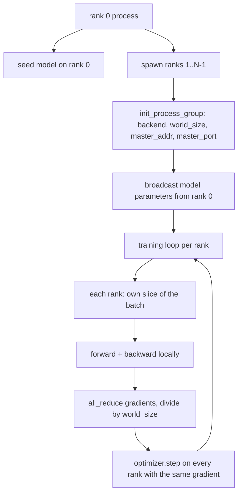
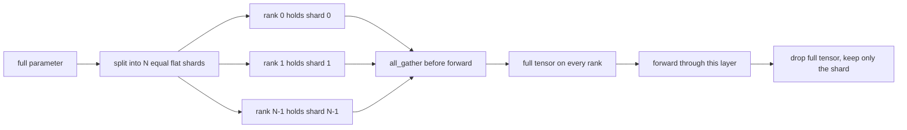

# 从零实现分布式数据并行与 FSDP

> 多 rank 训练就是两次集合操作加一条规则。启动时广播参数，反向传播后平均梯度，永远不要让各 rank 在步数上产生分歧。

**类型：** 构建
**语言：** Python
**前置要求：** 第 19 阶段 42-45 课
**所需时间：** 约 90 分钟

## 学习目标

- 使用 `gloo` 后端在 N 个 rank 上启动进程组，无需特殊硬件。
- 实现一个最小的 DDP 包装器，在构造时广播参数，反向传播后 all-reduce 梯度。
- 证明逐 rank 梯度的 all-reduce 与单进程在拼接输入上的梯度一致。
- 概述 FSDP 参数分片：每个 rank 持有一个切片，前向传播时收集完整张量，之后释放。

## 问题所在

模型能放进一个设备。数据集放不下。优化预算说你想在每挂钟秒看到 N 倍的样本。第一个杠杆是数据并行：每个 rank 在 batch 的不同切片上运行相同的模型，然后在优化器步骤前平均梯度。第二个杠杆是 FSDP：模型也放不进一个设备，因此每个 rank 持有每个参数的一小部分，在前向传播时逐层重建完整张量。

痛苦在于记账。如果参数在各 rank 间漂移，运行就静默损坏。如果你平均梯度但不平均损失，仪表板就在撒谎。如果集合后端无法就拓扑达成一致，运行就永远挂起。修复方法是手动编写一次集合操作，永远不要信任你无法复现的包装器。

本课在 CPU 上运行。不假设 CUDA。`gloo` 后端随每个 PyTorch 构建分发，接受 `torch.multiprocessing` worker；同样的代码切换到 `nccl` 即可在多 GPU 节点上使用，无需更改结构。

## 概念说明



### 两个关键集合操作

| 集合操作 | 作用 | 时机 |
|---------|------|------|
| `broadcast` | 将张量从一个 rank 复制到所有其他 rank | 参数初始化、调度器状态、任何一对多同步 |
| `all_reduce` | 对所有 rank 的张量求和（或求平均、求最大值），每个 rank 都得到结果 | 反向传播后的梯度平均 |
| `all_gather` | 每个 rank 贡献一个张量，每个 rank 得到拼接结果 | logits 收集、FSDP 参数 unshard |

DDP 的契约是在构造时 `broadcast`，反向传播后 `all_reduce`。FSDP 的概述增加了每层前向传播前的 `all_gather`。

### 梯度平均与单进程梯度一致

在 N 个 rank 上用 B 个样本的 batch 训练的模型，必须产生与单进程在 N*B 个样本的 batch 上训练相同的梯度。技巧是对逐 rank 梯度求和再除以 N，得到平均损失梯度，这正是带均值归约的交叉熵在整个 batch 上产生的结果。本课代码通过 `max-abs-diff < 1e-3` 的断言验证手动 all-reduce 梯度与参考单进程梯度的一致性。

### FSDP 概述



内存节省是精确的：每个 rank 的参数内存降为 1/N。代价是 gather，每次前向传播都要付出。生产级 FSDP 将 gather 与上一层的计算重叠，因此挂钟成本远小于朴素计算的预测。本课对每个参数进行往返操作，断言重建与原始值逐位相等。

### CPU 和 gloo 后端

CUDA 是生产目标，但同样的代码路径在 CPU 上也存在。`gloo` 是 CPU 集合后端。它在 GPU 上比 `nccl` 慢几个数量级，但 API 接口完全相同。本课的进程组以 `backend="gloo"` 初始化，rank 通过 `torch.multiprocessing` 而非 `torchrun` 启动；两者最终都调用相同的 `torch.distributed` 接口。在多 GPU 节点上，唯一的改动是 `backend="nccl"`、设备张量和用 `torchrun` 启动。

## 开始构建

`code/main.py` 是可运行的制品。

### 第 1 步：启动进程组

```python
os.environ["MASTER_ADDR"] = "127.0.0.1"
os.environ["MASTER_PORT"] = str(port)
dist.init_process_group(backend="gloo", rank=rank, world_size=world_size)
```

`MASTER_ADDR` 和 `MASTER_PORT` 是会合点：每个 rank 拨打同一主机上的同一端口。本课通过绑定后关闭的技巧选取空闲端口，避免多个运行共享同一台机器时的冲突。

### 第 2 步：构造时广播

`MinimalDDP.__init__` 遍历每个参数和缓冲区，调用 `dist.broadcast(tensor, src=0)`。Rank 0 的值成为规范初始化。没有这一步，每个 rank 用自己的种子初始化，从第一步开始就产生分歧。

### 第 3 步：反向传播后 all-reduce 梯度

```python
def all_reduce_grads_(module, world_size):
    for p in module.parameters():
        if p.grad is None:
            p.grad = torch.zeros_like(p.data)
        dist.all_reduce(p.grad.data, op=dist.ReduceOp.SUM)
        p.grad.data.div_(world_size)
```

每个 rank 最终拥有相同的平均梯度。优化器步骤现在是相同输入在每个 rank 上的函数，这就是参数在整个运行中保持同步的原因。

### 第 4 步：证明等价性

`manual_all_reduce_matches_single_process` 在 rank 0 上构建相同的模型，将 all-reduce 后的梯度与单进程在拼接输入上计算的梯度进行比较。最大绝对差约为 1e-8。

### 第 5 步：FSDP 往返

`fsdp_round_trip_sketch` 将每个参数展平，填充到 `world_size` 的倍数，切片，all-gather，然后反填充。每个 rank 的重建都等于原始值。这是 unshard 步骤；逆操作（前向传播后的 re-shard）是从收集到的张量中取一个切片。

运行：

```bash
python3 code/main.py
```

默认 world size 为 2。两个 CPU 进程启动，通过 `gloo` 通信，退出码为零。输出 `outputs/ddp-demo.json` 捕获每个 rank 的参数之和、all-reduce 后的梯度范数、FSDP 往返结果以及手动与参考梯度的差异。

## 使用它

生产训练技术栈调用相同的原语。PyTorch 的 `DistributedDataParallel` 增加了：将 all-reduce 与反向传播重叠的后向梯度钩子、将多个小梯度组合成一次集合操作的分桶 all-reduce，以及第 46 课使用的 `no_sync` 上下文。

PyTorch 的 FSDP 增加了：每层的扁平参数视图使每个 rank 持有一个连续缓冲区、下一层 unshard 与当前层计算的重叠，以及可选的分片 CPU 卸载。

形状保持不变：启动时广播，反向传播后 reduce，当参数放不下时分片。

## 交付

`outputs/skill-distributed-fsdp-ddp.md` 为新训练脚本携带配方：用 `gloo` 启动进程组用于 CPU，`nccl` 用于 GPU，将模型包装在构造时广播、反向传播后 reduce 的 DDP 壳中，可选地用 FSDP 概述中的 all_gather 模式对参数进行分片。

## 练习

1. 用 `--world-size 4` 运行，确认参数分布在运行过程中保持在 1e-3 以内。
2. 用 `dist.all_reduce(op=dist.ReduceOp.AVG)` 替换手动平均，计时差异。
3. 向 DDP 包装器添加后向钩子，使 all-reduce 与反向传播的其余部分重叠；测量挂钟改善。
4. 实现 FSDP re-shard 步骤：前向传播后，再次用本地切片替换完整张量。确认每个 rank 的内存下降。
5. 在 CUDA 机器上将后端切换为 `nccl`。记录哪些环境变量改变，哪些保持不变。

## 关键术语

| 术语 | 常见说法 | 实际含义 |
|------|---------|---------|
| 后端（Backend） | "gloo 或 nccl" | 实现集合操作的库；gloo 是 CPU，nccl 是 GPU |
| World size | "总 rank 数" | 组中的进程数；组是集合操作的单位 |
| Rank | "Worker id" | 组内的进程标识符，从零开始 |
| All-reduce | "梯度求和" | 对所有 rank 的张量求和，每个 rank 得到相同结果 |
| Unshard | "收集参数" | 通过 all_gather 从逐 rank 切片重建完整张量 |

## 延伸阅读

- PyTorch `torch.distributed` 文档，本课依赖的集合语义。
- `gloo` 库的集合操作列表，与 CUDA 支持的 `nccl` 原语形状相同。
- 第 19 阶段第 46 课涵盖梯度累积模式，将 DDP all-reduce 包裹在 `no_sync` 中。
- 第 19 阶段第 47 课涵盖能存活 DDP 和 FSDP 运行的检查点布局。
- PyTorch FSDP 文档，本概述中参数分片的生产实现。
