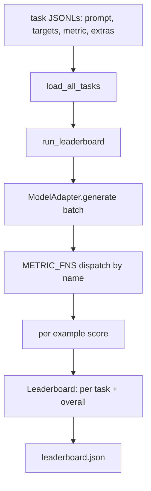
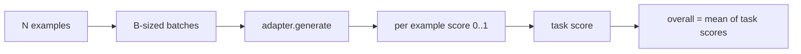

# 语言模型评估工具

> 一个在你无法定义的任务上表现出色的模型，只是碰巧表现好而已。评估工具就是任务定义、指标、运行器和排行榜，封装在一个简洁、可替换的形状中。

**类型：** 构建
**语言：** Python
**前置要求：** 第 19 阶段 42-45 课
**所需时间：** 约 90 分钟

## 学习目标

- 将任务定义为每行包含 `prompt`、`targets`、`metric` 和可选 `extras` 的 JSONL 文件。
- 实现五种指标：精确匹配、rouge-l F1、可执行检查、多选和子串包含。
- 构建一个按任务批量化样本并分派到可替换模型适配器的运行器。
- 输出带有按任务分数、延迟和可复现总体平均值的排行榜 JSON。

## 问题所在

每周都有新的语言模型问世。营销声称它表现出色。诚实的问题是：在什么上表现出色？诚实的答案是你自己编写的排行榜，因为供应商的排行榜是他们调优过的。

你的仓库中没有评估工具，你就凭感觉比较两个模型。有了评估工具，你用固定任务集和固定指标下的分数比较它们，输出是可 diff 的 JSON。评估工具是昨天的运行和今天的运行之间的契约。没有它，回归就会上线。

陷阱是让评估工具过度适配单个模型。修复方法是反过来做：评估工具小到十五分钟就能读完，任务小到可以随仓库分发，指标从零编写以便同事审计，适配器是唯一存放模型特定代码的地方。换适配器，排行榜就变；换任务，排行榜就变。其他都不应改变。

## 概念说明



### 任务规范

每个样本是一行 JSONL：

```json
{"id": "arith-00", "prompt": "compute: 2 + 2", "targets": ["4"], "metric": "exact_match"}
```

对于需要评分辅助的指标，`extras` 携带辅助载荷：

```json
{
  "id": "code-00",
  "prompt": "python: write a function f that doubles its input",
  "targets": ["ok"],
  "metric": "code_exec",
  "extras": {"io_pairs": [[1, 2], [3, 6]]}
}
```

一个任务是 `outputs/tasks/` 下的 `.jsonl` 文件。文件名就是任务名。一个文件中的所有样本共享同一指标。

### 五个内置任务

| 任务 | 指标 | 测试内容 |
|------|------|---------|
| arithmetic | exact_match | 确定性答案的 token 级正确性 |
| summary | rouge_l | 与单行参考摘要的最长公共子序列 F1 |
| code-exec | code_exec | 可执行测试：预测函数必须满足输入-输出对列表 |
| multiple-choice | multiple_choice | 预测的首字母必须匹配允许的字母 |
| generation | substring_contains | 自由形式文本必须包含至少一个目标子串 |

### 指标契约

每个指标是从 `(prediction, targets, extras) -> float in [0.0, 1.0]` 的函数。评估工具对逐样本分数取平均得到任务分数，再对任务分数取平均得到总体分数。指标函数很小巧：

- `exact_match`：小写、合并空白、相等比较。
- `substring_contains`：相同的归一化、子串测试。
- `multiple_choice`：首字母大写。
- `rouge_l`：LCS 长度除以预测和参考的长度，精确率和召回率的 F1。
- `code_exec`：在受限命名空间中执行预测，在每个输入-输出对上调用 `f(x)`，统计匹配数。

code_exec 指标在精简的 builtins 命名空间中执行预测。本课的测试断言 `import os` 会报错，因为 `os` 不在命名空间中；你无法从代码预测访问文件系统。

### 模型适配器

```python
class ModelAdapter(Protocol):
    def generate(self, prompts: Sequence[str]) -> List[str]: ...
    @property
    def name(self) -> str: ...
```

适配器是接缝。本课附带 `ToyAdapter`，一个确定性的模式匹配器，对五个内置任务中的每个提示返回正确答案。真正的适配器调用模型并返回其输出。评估工具不关心具体实现。

### 运行器

`run_task` 每次批量化 `batch_size` 个提示并分派到指标函数。`run_leaderboard` 遍历所有任务并取平均。`write_leaderboard` 输出带有 schema 字符串的 JSON，使未来的格式更改不会静默破坏仪表板。



```figure
eval-harness-matrix
```

## 开始构建

`code/main.py` 是可运行的制品。

### 第 1 步：生成内置任务

`seed_fixture_tasks(target_dir)` 写入五个 `.jsonl` 文件。`main.py` 首次运行时在目录为空时生成它们。

### 第 2 步：加载任务

`load_all_tasks(task_dir)` 读取每个 `.jsonl`，返回从任务名到 `Example` 记录列表的字典。以 `#` 开头的注释行和空行被跳过，以便贡献者在文件中添加注释。

### 第 3 步：实现指标

每个指标是一个带单元测试的小函数。本课的测试套件包含 13 个用例，覆盖归一化、部分重叠、代码执行和不安全代码拒绝。

### 第 4 步：编写运行器

`run_task` 遍历 batch 并产出包含分数、正确数、总数和延迟的 `TaskResult`。`run_leaderboard` 遍历所有任务并产出带有总体平均值的 `Leaderboard`。

### 第 5 步：输出 JSON

`write_leaderboard` 序列化排行榜。`--include-per-example` 标志转储逐样本记录，这样当分数变化时你可以 diff 预测结果。

运行：

```bash
python3 code/main.py
```

脚本在首次运行时生成内置数据，用玩具适配器（正确回答所有内置任务）评分，并写入 `outputs/leaderboard.json`。玩具适配器的总体分数为 1.0；`test_main.py` 中的桩适配器测试展示了当适配器无法回答时同一评估工具产出 0.0。

## 使用它

接入真正的模型，编写一个适配器。形状如下：

```python
class HttpAdapter:
    name = "vendor.v1"

    def __init__(self, endpoint, api_key):
        self.endpoint = endpoint
        self.api_key = api_key

    def generate(self, prompts):
        out = []
        for prompt in prompts:
            response = http_post(self.endpoint, prompt, self.api_key)
            out.append(response["text"])
        return out
```

在 `main()` 顶部将 `ToyAdapter` 换成 `HttpAdapter`。评估工具、任务、指标和排行榜保持不变。

在真实项目中分发评估工具时强制执行的三种模式：

- **固定任务文件。** leaderboard.json 携带哈希固定的任务内容或随附 JSONL；否则任务文件变化时分数也变，你无法分辨原因。
- **Diff 预测结果，不仅仅是分数。** `--include-per-example` 标志让你看到分数下降那天模型说了什么。
- **限制 batch 大小。** 真正的适配器有速率限制。小 batch 大小使评估工具兼容各供应商。

## 交付

`outputs/skill-lm-eval-harness.md` 携带配方：JSONL 任务规范、五种指标、可替换适配器、批量化运行器、带 schema 字符串的排行榜 JSON。`outputs/tasks/` 中的任务文件是内置数据；将它们复制到真实项目中作为起始。

## 练习

1. 添加第六个任务，编写自定义指标（类 BLEU 重叠、类 BLEURT 参考评分，任何有清晰契约的指标）。
2. 扩展 `code_exec` 以捕获 stdout，并接受预期 stdout 列表作为 targets。
3. 添加排行榜 diff 命令：给定两个 `leaderboard.json` 文件，打印哪些任务变化了以及变化了多少。
4. 限制每个样本的延迟。用超时包裹适配器调用；在排行榜中显示单独的 `timeouts` 列。
5. 用 sha256 在排行榜中固定任务内容，以便未来的读者可以验证他们评分的是相同的任务。

## 关键术语

| 术语 | 常见说法 | 实际含义 |
|------|---------|---------|
| 任务规范 | "评估格式" | 每行包含 prompt、targets、metric、可选 extras 的 JSONL 文件 |
| 指标 | "评分方式" | 从 (prediction, targets, extras) 到 [0, 1] 浮点数的函数 |
| 适配器 | "模型客户端" | 带有 `generate(prompts) -> list[str]` 方法的对象；唯一的模型特定代码 |
| 排行榜 | "记分板" | 包含按任务分数、总计数、延迟和总体平均值的 JSON |
| Code exec 指标 | "运行并检查" | 在受限命名空间中执行预测，与输入-输出对比较 |

## 延伸阅读

- 原始 lm-evaluation-harness，生产参考，大得多但形状相同。
- HuggingFace 的 lighteval，同一契约的替代实现。
- 第 19 阶段第 46 课涵盖评估工具评分的训练技术栈中使用的梯度累积模式。
- 第 19 阶段第 47 课涵盖你评分的检查点格式；在排行榜中固定检查点哈希。
- 第 19 阶段第 48 课涵盖产出被测模型的分布式训练技术栈。
