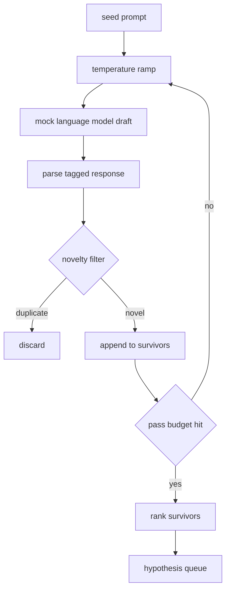

# 假设生成器

> 一个研究智能体问两次同样的问题就是浪费 token。关键是让每次草稿都落到新的地方。

**类型：** 构建
**语言：** Python
**前置要求：** 第 19 阶段 A 路线 20-29 课
**所需时间：** 约 90 分钟

## 学习目标

- 从种子提示驱动采样器，将其输出转换为类型化的假设记录。
- 每次通过时提高采样器温度，使后续草稿偏离前一次更远。
- 用小型嵌入模型和余弦距离阈值过滤近似重复。
- 用融合新颖性、具体性和可测试性的评分函数对幸存者排序。
- 保持每步确定性，使相同种子总是产生相同的队列。

## 为什么先生成再过滤

向一个模型问一次的规划器得到一个假设。对于教学示例这没问题。对于研究循环来说这个形状不对。循环需要一个有深度的排序队列，这样当第一个假设失败时，运行器无需再付一次完整采样的代价就有下一个可用。

两个想法结合产生这个队列。第一个是温度递增：每次通过采样器提高一档温度，鼓励后续草稿更发散。第二个是新颖性过滤：每次草稿后，生成器测量与每个先前幸存者的嵌入距离，拒绝任何在聚类内的草稿。

本课附带一个模拟语言模型，对固定提示返回脚本化的 token 序列。模拟足以演练完整路径：种子提示输入、温度递增应用、候选解析、新颖性过滤运行、排序队列输出。

## 假设的形状

```text
Hypothesis
  id             : int           (monotonic within a run)
  text           : str           (the claim)
  variables      : list[str]     (what changes between conditions)
  metric         : str           (what the runner will measure)
  baseline_ref   : str | None    (which paper or run the comparison cites)
  draft_pass     : int           (which sampler pass produced this)
  temperature    : float         (the sampler setting at draft time)
  novelty_score  : float         (distance from prior survivors, 0..1)
  rank_score     : float         (weighted sum used for ordering)
```

`variables` 和 `metric` 不是自由文本。解析器从标记化的响应中提取它们。第 52 课的运行器在构建实验配置时直接读取这些字段。

`baseline_ref` 是可选的但建议填写。第 53 课的评估器需要基线来比较。如果假设省略了它，评估器会回退到同一指标上的上一次运行。

## 架构



循环很直观。有趣的部分是每个方框都有严格的契约。

## 温度递增

从 `t_min` 开始，到 `t_max` 结束，步长为 `(t_max - t_min) / (n_passes - 1)`。每次通过在当前温度下调用采样器，从 `GeneratorConfig.schedule()` 产出 `n_passes` 个均匀间隔的值。模拟模型通过在 `(prompt, temp_bucket)` 键控的一小组脚本化响应之间切换来响应温度。桶是开区间，因此温度的微小变化会选取不同的桶并产出不同的草稿。生产中的采样器会是带 `temperature=t` 传递的真正模型。

默认调度是从 `0.2` 到 `1.2` 的六次通过。六次足以填满队列而无需为新颖性过滤器反正会拒绝的样本付费。低于 `0.2` 模型会复述种子。高于 `1.2` 响应倾向于偏离主题并被解析器拒绝。

## 新颖性过滤

每次草稿解析后，生成器嵌入其文本并与每个已接受的假设比较。嵌入是一个哈希化的词 token 包，归一化为单位长度。两个单位向量之间的余弦距离为 `1 - dot(a, b)`。如果草稿与任何先前幸存者的最小距离高于 `novelty_threshold`，则通过。默认值为 `0.25`。

哈希嵌入并不花哨。它是确定性的、零依赖的，足以捕获明显情况：两个共享大部分名词的草稿。生产部署会换成小型句子模型。接口保持不变。

## 排序分数

```text
rank_score = w_novelty * novelty_score
           + w_specificity * specificity_score
           + w_testability * testability_score
```

三个子分数。`novelty_score` 是与先前幸存者的最小嵌入距离。`specificity_score` 是假设中具体变量数除以目标数。`testability_score` 在假设同时指定了指标和基线时为 1，只有指标时为一半，否则为零。

默认权重为 `0.4`、`0.3`、`0.3`。权重位于生成器配置中，下游课程可以不 fork 代码就调整它们。

## 模拟语言模型

```python
class MockLLM:
    def sample(self, prompt: str, temperature: float, seed: int) -> str:
        ...
```

给定 `(prompt, temperature, seed)` 三元组，采样器是确定性的。模拟维护一个按 `(prompt_signature, temperature_bucket)` 键控的脚本化响应表。如果表中没有该键的条目，采样器返回一个会让解析器失败的回退。回退路径由其中一个测试演练。

种子混入响应中，因此相同的 `(prompt, temperature)` 对配合不同种子产出不同草稿。测试中我们固定种子以保持结果可复现。在真正的部署中种子来自系统时钟或计数器。

## 输出队列

输出是按 `rank_score` 降序排列的 `Hypothesis` 记录列表。第 52 课的运行器弹出队首，运行实验，第 53 课的评估器写回判定。如果判定说假设是错的，运行器弹出下一个。

队列是有限的。当它为空时，编排器可以拓宽种子提示并再次运行生成器，或者停止并报告预算已耗尽。

## 如何阅读代码

`code/main.py` 定义了 `Hypothesis`、`MockLLM`、`HypothesisGenerator` 和一个确定性演示。生成器暴露单一的 `run(seed_prompt)` 方法返回排序队列；通过次数从 `GeneratorConfig.n_passes` 读取而非作为参数传入。嵌入是哈希化的 token 包。新颖性过滤器是一个函数。排序分数是一个函数。不依赖 `numpy`；嵌入数学是纯标准库，使课程保持可移植性。

`code/tests/test_generator.py` 覆盖了正常路径、重复拒绝路径、解析器失败路径、温度递增边界和排序顺序。

## 课程定位

第 50 课产出队列。第 51 课取队首运行文献检索以确认或反驳。第 52 课取同一队首运行实际实验。第 53 课读取两个输出并写入判定。四课组合成一个无人参与的研究循环；人类可以在任何边界介入。
