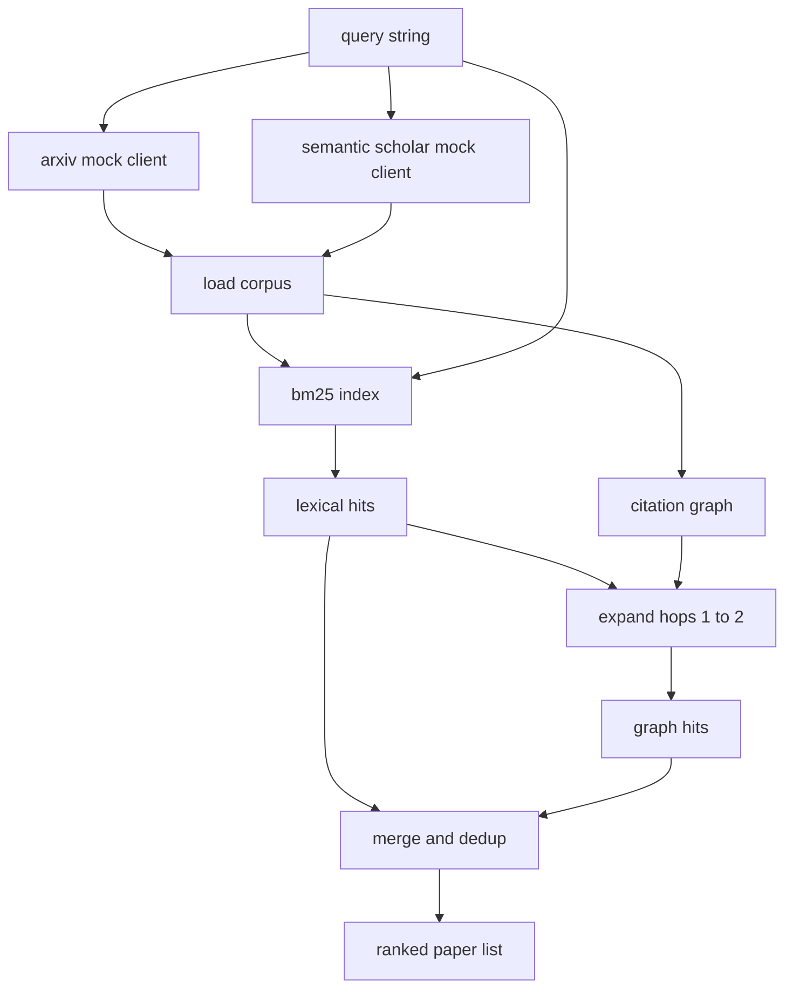

# 文献检索

> 假设很便宜。知道是否有人已经证明了它才是昂贵的部分。在运行器启动沙箱之前，构建能回答这个问题的检索层。

**类型：** 构建
**语言：** Python
**前置要求：** 第 19 阶段 A 路线 20-29 课
**所需时间：** 约 90 分钟

## 学习目标

- 用循环下游会读取的字段建模小型论文记录。
- 用纯标准库数据结构在摘要上构建 BM25 索引。
- 遍历引用图以发现词汇搜索遗漏的论文。
- 按稳定的论文 id 对词汇和图两趟的结果进行去重。
- 将两个模拟外部 API 包装在单一客户端后面，使上游调用点在真正端点上线时保持不变。

## 为什么需要两趟检索

关键词搜索返回与查询共享词汇的论文。这覆盖了大部分表面。它遗漏两种情况。第一种是基础论文使用了不同的词汇；例如查询"sparse attention"会遗漏标题为"block selection in transformer routing"的论文。第二种是相关论文是引用了已知锚点的后续工作；找到锚点向前遍历比暴力搜索摘要池更高效。

本课构建了两趟。在摘要上的 BM25 捕获词汇命中。引用图遍历将种子集向前和向后扩展一到两跳。合并后按论文 id 去重，按小型综合分数排序。

## 论文的形状

```text
Paper
  id          : str           (stable identifier, "p001" for the mock corpus)
  title       : str
  abstract    : str
  year        : int
  authors     : list[str]
  references  : list[str]     (paper ids this paper cites)
  citations   : list[str]     (paper ids that cite this paper)
  source      : str           (which mock api supplied it, "arxiv" or "s2")
```

references 和 citations 字段构成有向引用图。两个模拟 API 返回重叠但不完全相同的字段，因此语料库加载器在 `id` 上进行合并。

## 架构



检索客户端拥有两趟和合并操作。调用者传入查询，返回排序列表，每个条目携带解释排序的分数字段（`bm25_score`、`graph_distance`、`recency_score`、`final_score`）。

## 从零实现 BM25

实现是标准的 Okapi BM25，默认参数 `k1=1.5`、`b=0.75`。索引是两个字典：`term -> doc_frequency` 和 `term -> list of (doc_id, term_count)`。文档长度是摘要的 token 数。平均文档长度在索引构建时计算一次。对查询评分是对查询词的 `idf * tf_norm` 求和，其中 `tf_norm` 是标准的 BM25 长度归一化词频。

分词器是先 `lower` 再按非字母数字字符分割。没有词干提取。生产系统会换成小型词干提取器。接口保持不变。

```text
idf(t)      = log((N - df + 0.5) / (df + 0.5) + 1.0)
tf_norm(t)  = (f * (k1 + 1)) / (f + k1 * (1 - b + b * dl / avgdl))
score(d, q) = sum over t in q of idf(t) * tf_norm(t)
```

## 引用图遍历

图从语料库中一次性构建。前向边从论文指向其引用。后向边从论文指向其引用者。遍历是以 BM25 前几命中为种子的广度优先搜索，上限为两跳。

两跳是刻意设置的上限。一跳太浅；智能体通常需要直接的祖先或后代。三跳在连通图上使结果规模爆炸且容易偏离主题。本课将跳数限制暴露为配置旋钮，下游循环可以收紧。

## 去重和排序

两趟返回重叠集合。合并以论文 id 为键。每篇论文的最终分数是加权混合。

```text
final_score = w_bm25 * bm25_score_norm
            + w_graph * graph_score
            + w_recency * recency_score
```

`bm25_score_norm` 是 BM25 分数除以合并集中最大 BM25 分数（使该字段在 0 到 1 之间）。`graph_score` 对直接词汇命中为 1，一跳为 `0.6`，两跳为 `0.3`，否则为零。`recency_score` 从语料库最小年份的零线性上升到最大年份的一。

默认权重为 `0.5`、`0.3`、`0.2`。权重是可配置的；过时的主题可能调低 recency，快速发展的主题则调高。

## 模拟语料库

语料库是一百篇论文，由 `build_corpus()` 生成。每篇论文有手写的标题和摘要，涵盖五个主题：注意力稀疏性、检索增强、低秩适配器、数据集蒸馏和评估工具。引用和引用者被连接起来，使每个主题形成连通子图，并有少量跨主题边。

两个模拟 API 客户端（`ArxivMockClient`、`SemanticScholarMockClient`）从同一语料库读取但暴露不同字段。Arxiv 返回标题、摘要、年份、作者。Semantic Scholar 增加引用和引用者。检索客户端在 id 上合并；跨客户端字段不一致的处理推迟到后续课程。

## 第 52 和 53 课读取的内容

第 52 课的运行器读取 `paper.id`、`paper.title` 和摘要的前三句作为实验上下文。第 53 课的评估器读取 `paper.year` 和 `paper.references` 以将基线归因到特定论文。

检索客户端返回 `RetrievalResult`，包含排序列表和逐查询指标：命中数、平均分数、最高分数、总挂钟时间。运行器记录这些，以便下游可观测性通道绘制质量随时间的变化。

## 如何阅读代码

`code/main.py` 定义了 `Paper`、`ArxivMockClient`、`SemanticScholarMockClient`、`BM25Index`、`CitationGraph`、`RetrievalClient` 和一个确定性演示。模拟客户端和语料库在同一文件中，使课程保持可移植性。BM25 实现是一个类，六十行。图遍历是一个方法。

`code/tests/test_retrieval.py` 覆盖了词汇路径、图路径、合并、去重和空查询。

## 课程定位

第 50 课产出假设。第 51 课搜索文献以查看假设是否已有定论。第 52 课在没有定论时运行实验。第 53 课读取检索结果和实验指标以写入判定。检索客户端是四个阶段中最廉价的，在编排器中最先运行。
