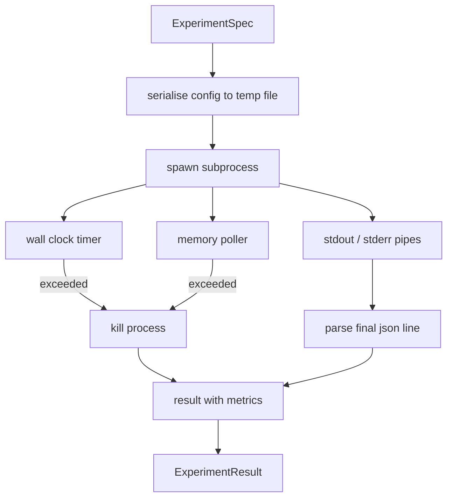

# 实验运行器

> 循环的诚实度取决于它的测量。构建接收规范、在沙箱子进程中执行并输出评估器可信赖的 JSON 指标 blob 的运行器。

**类型：** 构建
**语言：** Python
**前置要求：** 第 19 阶段 A 路线 20-29 课
**所需时间：** 约 90 分钟

## 学习目标

- 将实验编码为运行器可以序列化到子进程的类型化规范。
- 带硬挂钟超时和软内存上限启动子进程，并将两者作为终止条件暴露。
- 将 stdout、stderr 和结构化指标 blob 捕获到单一结果记录中。
- 构建消融表，每次在一个固定基础规范上扫描一个配置旋钮。
- 保持给定种子下每步确定性，使评估器跨运行看到相同的数字。

## 为什么用子进程

研究循环运行不可信代码。假设来自采样器，实验脚本来自同一路径；将任一视为进程内安全就是在自找崩溃，会拖垮编排器。子进程是语言提供的最简单隔离：独立进程、独立地址空间、父端的信号句柄。

这里的运行器不实现完整的沙箱。没有 cgroup、没有 seccomp 过滤器、没有命名空间重映射。它有的是挂钟超时、内存增长的轮询循环和在任一限制上终止进程的 kill 路径。这是每一个更精细的沙箱扩展的运行时契约。本课将契约保持得足够小，可以一口气读完。

## ExperimentSpec 的形状

```text
ExperimentSpec
  spec_id        : str            (stable id, "exp_001")
  hypothesis_id  : int            (link back to the queue from lesson 50)
  script_path    : str            (path to the python script to run)
  config         : dict           (passed to the script as one json arg)
  seed           : int            (deterministic seed for the experiment)
  wall_timeout_s : float          (hard timeout, killed on exceed)
  memory_cap_mb  : int            (soft cap, polled; killed on exceed)
  metric_keys    : list[str]      (which fields the evaluator will read)
```

脚本位于磁盘上；运行器将配置写入临时文件路径供脚本读取。脚本预期在 stdout 上打印一行 JSON，其键是 `metric_keys` 的超集。stdout 上的其他内容被捕获但被指标解析器忽略。

## 架构



运行器是一个带主方法的类。轮询器是一个小线程，每隔轮询间隔唤醒一次，在可用时从 proc 文件系统读取子进程的 `psutil` 等效信息，在平台不暴露时回退为空操作。

## 为什么用软内存上限

硬内存上限需要 `resource.setrlimit`，仅在 POSIX 上有效。本课附带一个可移植的方法：从平台轮询驻留集大小，如果超过上限则杀死子进程。上限是软的，因为轮询器有非零间隔；进程可能在轮询之间飙升到上限之上然后回落。运行器记录观察到的最大 RSS，以便评估器看到运行离限制有多近。

在没有进程检查支持的系统上，轮询器记录一次警告并自行禁用。挂钟超时仍然适用。本课测试覆盖了两条路径。

## 捕获 stdout 和 stderr

运行器在完成时读取两个管道的排空内容。Stdout 逐行扫描；最后一行解析为 JSON 且包含所有必需 `metric_keys` 的行被作为指标 blob。更早的 JSON 行作为 `intermediate_metrics` 保存在结果中；评估器可用于绘制学习曲线。

Stderr 逐字捕获到结果中。运行器永远不会在非零退出码时抛出异常；而是将码记录在结果中。任何非零退出都标记为 `"crash"`，即使脚本打印了指标，因此评估器默认将部分运行视为失败。

## 消融表

```python
def ablate(base: ExperimentSpec, knob: str, values: list[Any]) -> list[ExperimentSpec]:
    ...
```

给定基础规范和旋钮名称，辅助器返回每个值一个规范，`config[knob]` 被覆盖。每个规范获得一个派生的 `spec_id`（`f"{base.spec_id}_{knob}_{value}"`）。运行器附带 `AblationRunner`，按顺序运行它们并返回按旋钮值键控的 `AblationTable`。

为什么每次只扫描一个旋钮。全因子扫描呈指数爆炸，产出评估器无法解读的结果。每次一个旋钮产出清晰的轴供评估器绘图。本课将多旋钮扫描仅支持为重复的单旋钮消融，由调用者组合。

## 确定性

每个规范携带种子。运行器通过配置字典将种子转发给脚本（`config["__seed"] = spec.seed`）。`code/experiments/` 中的模拟实验脚本遵守种子，跨运行产出相同的指标。第 53 课的评估器依赖于此；没有确定性，"回归"可能只是不同的随机初始化。

## 模拟实验脚本

本课附带一个实验脚本：`code/experiments/sparsity_experiment.py`。它是一个真正的脚本，读取配置文件，用 numpy 随机通过模拟一次小型训练运行，并打印 JSON 指标 blob。脚本遵守 `sleep_s` 旋钮用于测试超时和 `allocate_mb` 旋钮用于测试内存轮询器。

模拟不是在训练任何真实的东西。它是一个模仿训练循环形状的数值计算：损失曲线、最终困惑度、挂钟时间。本课的重点是运行器，而非模拟。真正的实验脚本会导入模型。

## 结果形状

```text
ExperimentResult
  spec_id              : str
  hypothesis_id        : int
  exit_code            : int
  terminal             : "ok" | "timeout" | "oom" | "crash"
  wall_time_s          : float
  peak_rss_mb          : float | None
  metrics              : dict
  intermediate_metrics : list[dict]
  stdout_tail          : str
  stderr_tail          : str
```

评估器首先读取 `metrics` 和 `terminal`。如果 terminal 不是 `"ok"`，实验计为失败运行，评估器的判定是自动的。否则指标通过显著性检验。

## 如何阅读代码

`code/main.py` 定义了 `ExperimentSpec`、`ExperimentResult`、`ExperimentRunner`、`AblationRunner` 和一个确定性演示。子进程管理是一个类。内存轮询器是一个小线程。消融辅助器是一个函数。

`code/experiments/sparsity_experiment.py` 是测试中使用的模拟实验。它从 argv 读取配置文件路径，完成后写入一行 JSON 指标。

`code/tests/test_runner.py` 覆盖了成功路径、超时路径、崩溃路径、消融表和两次运行之间的确定性检查。

## 课程定位

第 50 课生成假设。第 51 课过滤掉文献已有定论的。第 52 课为剩下的运行实验。第 53 课读取结果，运行显著性检验，写入编排器按假设 id 存储的判定。
