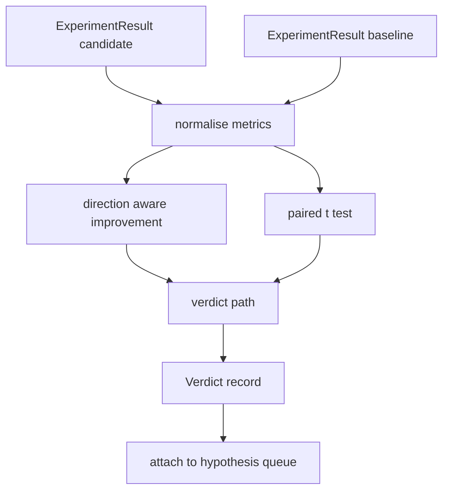

# 结果评估器

> 运行器产出了数字。评估器判断这些数字是改进、回归还是噪声。构建将指标转换为一行结论的判定路径。

**类型：** 构建
**语言：** Python
**前置要求：** 第 19 阶段 A 路线 20-29 课
**所需时间：** 约 90 分钟

## 学习目标

- 使用方向感知的改进和固定阈值将候选运行与基线比较。
- 从零实现在逐种子指标上的配对 t 检验并解读所得 p 值。
- 对对数尺度指标进行归一化，使下游报告能将其与线性指标混合。
- 输出每个假设的判定，编排器可将其附着到第 50 课的队列上。
- 保持每步纯净，使相同输入总是产生相同判定。

## 为什么用配对检验

运行器的一个数字不能说明变化是否真实。相同配置不同种子给出不同困惑度。变化可能是噪声。正确的比较是配对的：相同种子相同数据，分别用候选和基线运行一次。每个种子贡献一个差值。这些差值的均值就是效应。这些差值的标准误就是噪声底。

本课从零实现了该检验。没有 `scipy.stats`。数学小到一个屏幕就能看完。

```text
diffs    = [a_i - b_i for i in seeds]
mean     = sum(diffs) / n
variance = sum((d - mean) ** 2 for d in diffs) / (n - 1)
t_stat   = mean / sqrt(variance / n)
df       = n - 1
p_value  = two_sided_p(t_stat, df)
```

双侧 p 值使用正则化不完全 beta 函数。本课附带一个使用 Lentz 连分数的小型实现。全部六十行纯标准库数学。

## 方向感知改进

某些指标上升时改善（准确率、吞吐量）。其他指标下降时改善（损失、困惑度、挂钟时间）。评估器在每个指标上携带 `direction` 字段。

```text
if direction == "higher_is_better":
    improvement = (candidate - baseline) / abs(baseline)
elif direction == "lower_is_better":
    improvement = (baseline - candidate) / abs(baseline)
```

改进是有符号的。higher_is_better 指标上的负改进意味着候选更差。判定路径同时读取符号和幅度。

平坦阈值（`improvement_threshold=0.02`，百分之二）决定变化是否大到足以判断。低于该值无论 p 值如何判定都是"噪声"；循环对用户无法测量的变化不感兴趣。

## 架构



评估器运行三个独立计算并在判定路径中合并。每个计算是没有共享状态的纯净函数。

## 对数归一化

困惑度是损失的指数。损失下降 0.1 对应困惑度下降大得多。直接跨两个配置比较困惑度没问题，但将其与线性指标混合在单一报告中需要归一化。

本课对 `scale` 字段为 `"log"` 的任何指标在计算改进前取自然对数。阈值然后在对数空间中应用。困惑度从 32 降到 28 在 lower_is_better 指标上是 `log(28) - log(32) = -0.133`，远高于百分之二的阈值。

```text
if scale == "log":
    a = log(candidate)
    b = log(baseline)
else:
    a = candidate
    b = baseline
```

`scale="linear"`（默认）的指标跳过变换。同一代码路径处理两者。

## 逐种子配对检验

第 52 课的运行器每次运行产出一个最终指标 blob。对于配对检验，评估器需要每个种子一个 blob 用于候选，每个种子一个 blob 用于基线。编排器在种子列表上用两种配置运行同一实验，交给评估器两个 `ExperimentResult` 记录列表。

评估器按种子配对（种子在 `result.metrics["seed"]` 中）并遍历请求的指标。如果两个列表的种子不匹配，评估器抛出 `PairingError`。编排器应重新运行。

## Verdict 的形状

```text
Verdict
  hypothesis_id          : int
  metric                 : str
  direction              : "higher_is_better" | "lower_is_better"
  scale                  : "linear" | "log"
  candidate_mean         : float
  baseline_mean          : float
  improvement            : float       (signed, fraction; see direction rules)
  p_value                : float | None  (None if n < 2)
  significance_threshold : float
  improvement_threshold  : float
  verdict                : "improved" | "regressed" | "noise" | "failed"
  rationale              : str
```

判定路径是一个小型决策表：

```text
1. If any candidate result has terminal != "ok": verdict = "failed"
2. else if |improvement| < improvement_threshold:  verdict = "noise"
3. else if p_value is None or p_value > significance: verdict = "noise"
4. else if improvement > 0:                          verdict = "improved"
5. else:                                             verdict = "regressed"
```

Rationale 是一行人类可读的句子，编排器可以按假设 id 记录。

## 如何阅读代码

`code/main.py` 定义了 `MetricSpec`、`Verdict`、`Evaluator`、t 统计量和不完全 beta 辅助器，以及一个确定性演示。t 检验用纯标准库数学实现；numpy 仅用于读取指标列表和计算均值及方差。

`code/tests/test_evaluator.py` 覆盖了改进路径、回归路径、噪声路径（小改进）、噪声路径（低 n）、失败终端路径、对数归一化路径、已知参考值的 t 检验和配对错误。

## 课程定位

第 50 课产出了假设队列。第 51 课过滤掉了文献已有定论的。第 52 课在候选和基线配置下跨种子运行了实验。第 53 课读取这些运行并写入判定。编排器将四课拼接在一起：

```text
for hypothesis in queue:
    literature = retrieval.search(hypothesis.text)
    if literature_settles(hypothesis, literature):
        attach(hypothesis, verdict="settled")
        continue
    candidates = runner.run_all(specs_for(hypothesis))
    baselines  = runner.run_all(baseline_specs_for(hypothesis))
    metric_spec = MetricSpec("perplexity", direction=LOWER, scale=LOG)
    verdict = evaluator.evaluate(hypothesis.id, metric_spec, candidates, baselines)
    attach(hypothesis, verdict)
```

那个编排器不在本课中；四课组合成它，除了每课定义的数据类之外无需任何粘合代码。
