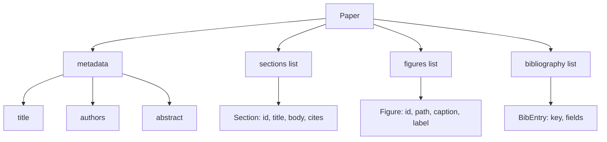
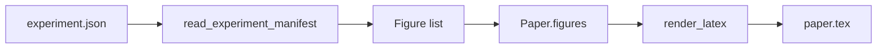
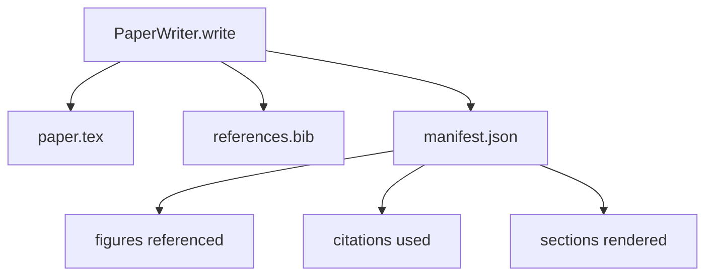

# 论文写手

> LaTeX 骨架是研究者与排版器之间的契约。契约被打破文档就无法编译，而且失败是大声的。先构建骨架，再填充内容。

**类型：** 构建
**语言：** Python
**前置要求：** 第 19 阶段 50-53 课
**所需时间：** 约 90 分钟

## 学习目标

- 将研究论文视为具有已知章节图的结构化制品，而非自由形式的文档。
- 生成声明了摘要、章节、图表插槽和参考文献键的 LaTeX 骨架，在任何正文撰写之前。
- 通过确定性插槽机制将实验输出的图表（路径和标题）注入骨架。
- 连接一个模拟正文生成器，从结构化大纲填充每个章节，使测试工具无需模型即可测试。
- 输出单个 `paper.tex` 加 `references.bib` 加清单，列出引用的每个图表和使用的每个引用。

## 为什么先建骨架

从正文开始的草稿会积累结构债务。引言多出三段应该在相关工作里的内容。图表在定义之前就被引用了。参考文献最终对同一篇论文有三个键。等作者注意到时，重写成本高于写作成本。

骨架将其反转。结构作为数据预先声明。章节是带名称和顺序的插槽。图表是带 id 和标题的插槽。参考文献键在顶部声明并指向其条目。正文逐个生成到这些插槽中。测试工具可以在任何正文撰写之前验证每个图表都有插槽、每个引用都有条目、每个章节都出现在目录中。

这与前面课程应用于计划、工具调用和追踪的纪律相同。结构即契约。

## 论文的形状

每个字段都是纯 Python 数据。渲染器是从 `Paper` 到 LaTeX 字符串的纯净函数。测试工具可以在渲染前自省论文：统计章节、列出缺失的图表文件、检查每个 `\cite{key}` 是否有匹配的 `BibEntry`。

## 渲染契约

渲染器保证三个性质。首先，骨架中的每个图表插槽输出一个带稳定标签 `fig:<id>` 的 `\begin{figure}` 块。其次，每个章节输出一个带稳定标签 `sec:<id>` 的 `\section{}`，使交叉引用可用。第三，参考文献输出一个 `\bibliography` 块，其 `references.bib` 恰好包含论文声明的条目，不多不少。

违反任何一条都是渲染错误，而非警告。骨架即契约；静默丢弃图表的渲染是契约违约。

## 从实验注入图表

本路线的前几课将实验输出产出为 JSON 清单。每个清单携带带路径和简短标题的制品列表。论文写手读取该清单并产出 `Figure` 记录。

注入是确定性的。图表 id 从实验名称加单调计数器派生。标题来自清单。路径相对于论文输出目录归一化，即使实验输出在磁盘其他位置 LaTeX 也能编译。

## 模拟正文生成器

本课不调用模型。`MockProseGenerator` 读取大纲形状并确定性地产出正文。大纲形状是每个章节一个短字符串。生成器将该字符串扩展为两段短段落，编织进章节标题。生成的正文在大纲声明的地方精确提及图表和引用。

这足以测试写手的每种行为。真正的实现会将生成器换成模型调用。周围的测试工具不会改变。这就是将正文生成器声明为可调用的价值：测试替换成确定性的，生产替换成模型的，流水线其余部分完全相同。

## 清单输出

写手向输出目录输出三个文件。

清单是下游评估器或批评循环读取的内容。它不解析 LaTeX；它读取清单。下一课批评循环接收此清单作为输入并产出反馈列表。这就是清单是契约的一部分而 LaTeX 不是的原因。

## 验证门控

写手在写入任何文件之前运行四个门控。

1. 论文内每个图表 id 唯一。
2. 每个章节的 `cites` 字段引用的参考文献键在论文上有声明。
3. 摘要非空。
4. 标题非空。

门控失败抛出带有精确原因的 `PaperValidationError`。测试工具将原因作为失败模式暴露。没有部分写入：要么三个文件都输出，要么都不输出。

## 如何阅读代码

`code/main.py` 定义了 `Paper`、`Section`、`Figure`、`BibEntry`、`PaperValidationError`、`MockProseGenerator`、`PaperWriter` 和 `render_latex` 函数。`write` 方法接收输出目录并输出 `paper.tex`、`references.bib` 和 `manifest.json`。`read_experiment_manifest` 辅助器将实验清单列表转换为 `Figure` 记录。

`code/tests/test_paper_writer.py` 覆盖了：无章节的骨架渲染、带两个章节和两个图表的完整渲染、缺失引用门控、重复图表 id 门控、清单内容和 LaTeX 字符串契约（每个章节输出 `\section{}`，每个图表输出 `\begin{figure}`）。

## 拓展方向

真正的实现会想要两个扩展。第一，多格式渲染：相同的 `Paper` 形状可编译为 Markdown 用于博客文章和 HTML 用于预览。渲染器成为 `Paper` 上的策略。第二，引用增强：写手从引用键获取 BibTeX 条目，给定本地 DOI 缓存。两者都增加价值，两者都可以在不触及骨架契约的情况下添加。

骨架是赌注。章节、图表和引用作为数据声明，正文生成到插槽中，清单随 LaTeX 输出。其他所有改进都在其上组合。
