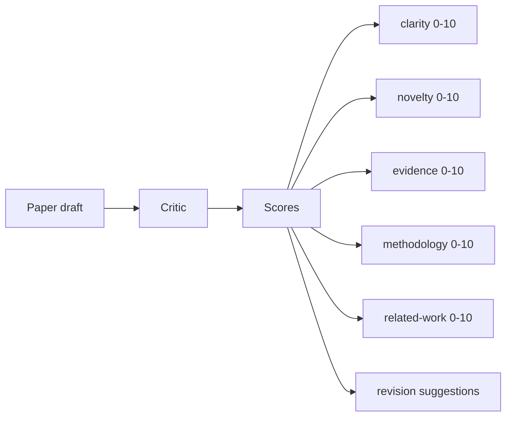
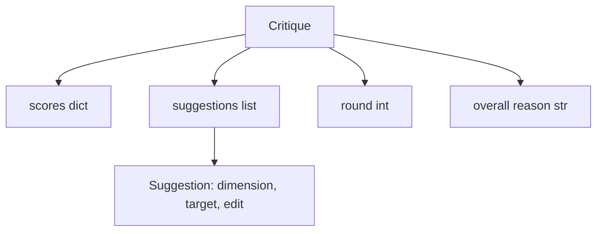
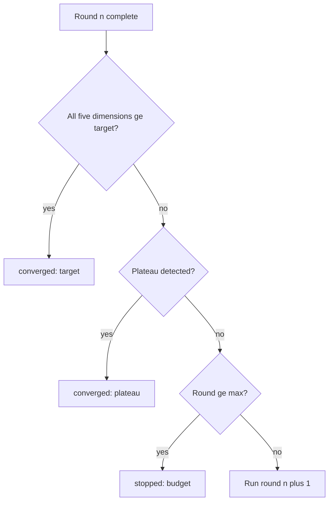
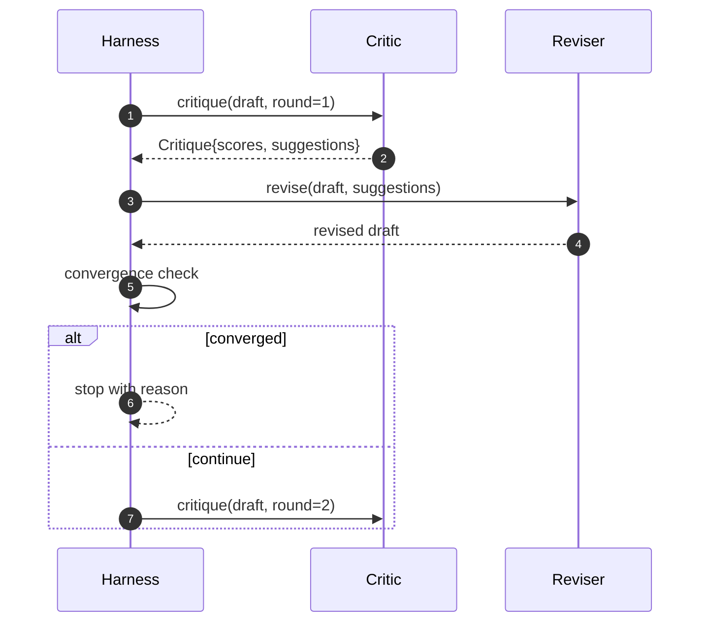

# 批评循环

> 第一次就返回"看起来不错"的批评器是坏的。总是返回"需要改进"的批评器也是坏的。有趣的批评器是会收敛的那个，而你必须工程化收敛。

**类型：** 构建
**语言：** Python
**前置要求：** 第 19 阶段 50-53 课
**所需时间：** 约 90 分钟

## 学习目标

- 在五个固定维度上对论文草稿评分：清晰度、新颖性、证据、方法论、相关工作。
- 将每轮的批评作为结构化的修订 diff 而非自由形式的重写来应用。
- 通过比较各轮分数检测收敛；在平台期、达到目标或预算耗尽时停止。
- 用最大迭代预算限制轮次，使不收敛的批评器不会永远运行。
- 输出每轮追踪，以便仪表板或下一阶段渲染分数轨迹。

## 为什么用五个固定维度

自由形式批评器是返回一段建议的模型。下一轮的修订将该段落视为环境上下文。重写是否回应了批评是不可验证的，因为批评从未有过结构。

五个维度给了测试工具一个契约。



分数是一个向量。测试工具跨轮次观察每个维度。提高了清晰度但拉低了证据的修订在证据上是回归，收敛检查能看到。仅模型的批评器无法提供这种保证。

## Critique 的形状



每个建议携带它改进的维度、目标章节以及修订器可以应用的 `edit` 指令。修订器也是一个可调用对象。本课附带一个确定性修订器，将 edit 指令解释为追加到章节的操作。模型驱动的修订器会将同一字段解释为提示。契约不变。

## 收敛规则，按优先级

批评循环在三个条件之一触发时终止。



目标是最严格的情况：五个维度（clarity、novelty、evidence、methodology、related_work）中的每一个都必须达到 `>= target_score`（默认 `8.0`），循环才返回成功。高均值加一个弱维度不够。平台期检测将当前轮的均值与前一轮的均值比较。如果连续两轮改进低于 `plateau_epsilon`（默认 `0.1`），循环以 `platform` 退出。预算是轮次的硬上限（默认 `5`），以 `budget` 退出。

顺序很重要。目标优先于平台期优先于预算。如果第三轮在同一迭代中达到了目标且也会触发平台期，结果是 `target` 而非 `platform`。

## 为什么平台期检测跨两轮运行

一轮平台期是噪声。真正的批评器即使对固定草稿每轮也会返回略有不同的分数，因为确定性评分仍然取决于哪些建议被应用以及什么顺序。要求连续两轮平台期过滤掉该噪声。如果测试工具报告平台期，草稿确实停止了改善。

## 本课的确定性批评器

本课不调用模型。附带的批评器是一个可调用对象，基于三个信号对草稿评分：平均章节正文长度（清晰度）、图表数和引用数（证据），以及论文元数据上的 `originality_tag` 字段（新颖性）。修订器知道如何将每个分数向上推。

```text
clarity      grows when the average section body length increases
novelty      grows when originality_tag is set to "high"
evidence     grows when a section's figure_refs is non-empty
methodology  grows when a section titled "Method" exists with body
related-work grows when a section titled "Related Work" exists with body
```

修订器将每个建议解释为有针对性的追加。第一轮之后，测试工具可以观察到分数上升。测试利用此属性断言循环缩小了差距。

## 完整循环契约



测试工具拥有轮计数器、追踪和收敛检查。批评器拥有分数。修订器拥有 diff。三者都不触及彼此的状态。

## 追踪输出

每轮输出一个追踪事件，包含轮次、分数向量、建议数和收敛判定。完整追踪随最终草稿返回。下游仪表板可以渲染逐轮分数图表。下一课迭代调度器读取追踪以判断分支是否值得保留。

## 保护免受坏批评器的预算

产出建议但从不改善分数的批评器会将循环锁定在最大迭代上限。追踪使其可见：五轮、分数持平、判定 `budget`。用户将其解读为批评器 bug，而非草稿 bug。只暴露最终草稿的替代方案隐藏了诊断。追踪优先设计暴露了它。

## 如何阅读代码

`code/main.py` 定义了 `Critique`、`Suggestion`、`Critic` 协议、`Reviser` 协议、`CriticLoop` 和 `make_deterministic_critic_pair` 工厂，返回确定性批评器和匹配的修订器。包含一个最小的 `Paper` 形状以便课程独立。

`code/tests/test_critic_loop.py` 覆盖了：第一轮后的单调改善、调优草稿上的目标收敛、两轮持平后的平台期检测、无建议改善时的预算耗尽、修订器的建议应用和追踪形状。

## 拓展方向

真正的实现会想要两个扩展。第一，维度权重：研讨会的论文比方法论更重新颖性；期刊则反过来。收敛检查变成加权均值。第二，配对批评器：一个批评器评分，第二个批评器在修订器看到建议之前裁决。两者都增加价值，都在相同的 `Critique` 形状上组合。

赌注是分数向量。一旦批评被结构化，其他所有改进——收敛规则、仪表板、配对批评器——都无需更改循环即可嵌入。
