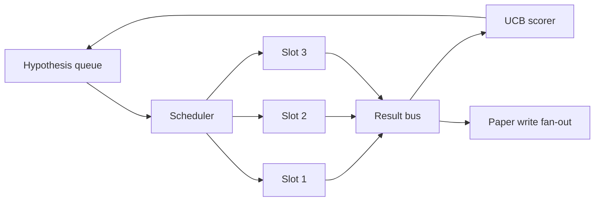
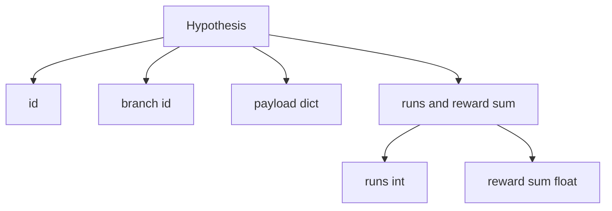
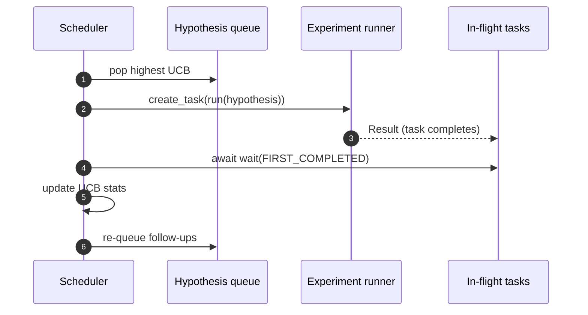

# 迭代调度器

> 没有调度器的研究循环是有妄想的队列。调度器是循环决定停止探索什么的地方，而这个决定就是全部。

**类型：** 构建
**语言：** Python
**前置要求：** 第 19 阶段 50-53 课
**所需时间：** 约 90 分钟

## 学习目标

- 将研究工作流建模为假设队列供给并行实验槽，结果扇入回流。
- 使用 asyncio 并发运行多个实验，使调度器能保持所有槽忙碌。
- 用 UCB 对每个假设分支评分，使调度器能剪枝低收益分支而不放弃探索。
- 将完成的结果扇出到论文撰写阶段和重新排队阶段，使高收益分支产生后续假设。
- 暴露带有分支分数、槽占用率和剪枝决策的逐迭代追踪。

## 为什么用调度器而非工作列表

扁平工作列表按提交顺序运行作业。当每个作业独立时这没问题。研究不是独立的：实验三的发现改变了实验四和五的优先级。读取结果扇入并重新排序队列的调度器能在每单位计算中完成更多有用的工作。

有趣的设计选择是评分规则。贪心评分器总是选择当前领先者，从不探索。均匀评分器从不利用。UCB（置信上界）是中间路径：利用领先者，同时为尝试较少的分支保留容量。

## 系统形状



队列持有假设。调度器在槽空闲时选取最高 UCB 的假设。每个槽异步运行一个实验。完成的实验将结果扇出到总线。总线更新产出分支的 UCB 统计信息，当分支收益超过阈值时扇出到论文撰写阶段。

## 假设的形状



`branch` 是 UCB 统计信息的键。多个假设可以共享一个分支（分支是研究方向；假设是其中的一次试验）。`runs` 是该分支完成的实验计数，`reward_sum` 是累积奖励。UCB 读取两者。

## UCB 评分

本课使用的 UCB 公式是经典的 UCB1。

```text
ucb(branch) = mean_reward(branch) + c * sqrt( ln(total_runs) / runs(branch) )
```

`total_runs` 是所有分支完成的实验总数。`c` 是探索权重；本课默认为 `sqrt(2)`。零运行的分支得到 `+inf`，因此未尝试的分支总是被优先调度。高均值奖励的分支保持高分直到其他分支赶上；运行多次但奖励不多的分支被运行较少的替代品超越。

剪枝门控与选取器分离。当分支的均值奖励在至少 `prune_after_runs` 次试验（默认 `3`）后低于绝对下限（默认 `0.2`）时，剪枝将其从未来调度中移除。这保持了队列的有界性。

## asyncio 并行槽

调度器用 `asyncio.create_task` 驱动实验。每个任务运行实验运行器（一个 `async def` 可调用对象），返回 `Result`。主循环用 `asyncio.wait(..., return_when=asyncio.FIRST_COMPLETED)` 等待在飞任务集，每次完成时触发评分更新。



三个槽并发运行。主循环永远不会阻塞在单个实验上。调度器在槽空闲时立即开始新任务，直到队列为空且没有在飞任务。

## 扇出：论文触发器

当分支的均值奖励超过 `paper_threshold`（默认 `0.7`）且该分支尚未产出论文时，调度器扇出 `paper.trigger` 事件到输出列表。下游的第 54 课论文写手会接收它。本课中触发器作为列表捕获以便测试可以断言。

## 扇出：后续假设

当高收益结果到达时，调度器可以调用用户提供的 `expander` 在同一分支上产出一个或多个后续假设。expander 是从 `Result` 到 `list[Hypothesis]` 的纯净函数。本课附带一个确定性 expander，对奖励超过论文阈值的任何结果产出两个后续。

## 预算

两个预算保护调度器免受失控循环。

```text
max_experiments    : total count of experiments run across all branches
max_seconds        : wall-clock cap (asyncio time)
```

当任一触发时，调度器停止调度新任务，等待在飞任务，并返回最终追踪。追踪包含 `stop_reason`。

## 追踪和最终报告

每个调度决策（选取、分派、结果、剪枝、扇出）输出一个事件。最终报告总结每个分支的统计信息、总运行次数、总挂钟时间和触发的论文触发器。下一课端到端演示读取此报告以驱动论文写手。

## 如何阅读代码

`code/main.py` 定义了 `Hypothesis`、`Result`、`BranchStats`、`IterationScheduler` 和 `make_deterministic_runner` 工厂，返回具有可预测奖励的 asyncio 实验运行器。运行器休眠固定的 `delay_ms`（默认 `5ms`），使并发可观测。

`code/tests/test_scheduler.py` 覆盖了：UCB 优先选取未尝试的分支、并行槽占用率、超过阈值时的论文触发器、低收益试验后的分支剪枝、扇出后续假设和预算退出（实验计数和挂钟时间）。

## 拓展方向

真正的实现会想要三个扩展。第一，跨会话的持久化 UCB 统计：当前统计信息存在于内存中；真正的调度器会检查点保存它们，使重启保留已花费的探索预算。第二，多目标评分：每个结果产出一个向量而非标量奖励，UCB 变成帕累托式选取器。第三，上下文赌博机：选取器基于假设特征（长度、复杂度）进行条件选择，使相似假设共享探索。

调度器是研究超越工作列表的地方。一旦 UCB 被连接且槽并行运行，其他所有改进都在其上组合。
