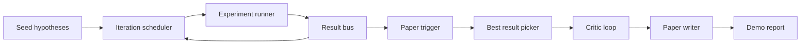
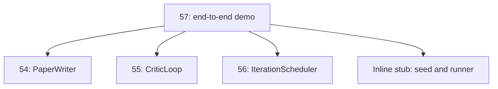
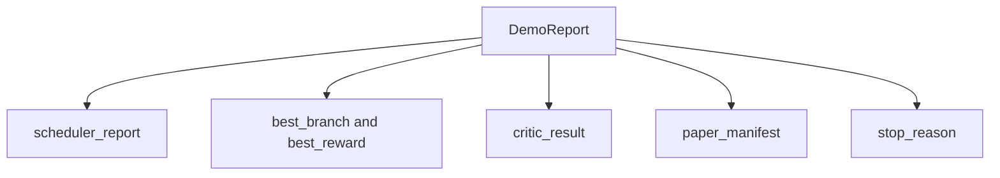

# 端到端研究演示

> 演示是所有你之前编写的契约必须协同工作的地方。如果其中任何一个泄漏了，演示就是捕获问题的那一课。

**类型：** 构建
**语言：** Python
**前置要求：** 第19阶段 课程50-53
**所需时间：** 约90分钟

## 学习目标

- 将自动研究循环端到端串联：假设种子、实验运行器、调度器、评审循环、论文撰写器。
- 通过普通的 Python 导入（而非框架）组合前面四节 Track D 课程的基础组件。
- 运行循环直到自行终止，并输出一份包含每个阶段输出的演示报告。
- 保持演示的确定性，使测试套件可以断言最终输出的形状。
- 当任何阶段的契约被破坏时，清晰地暴露失败模式，避免下一阶段使用损坏的输入继续运行。

## 组合结构



五个阶段。种子是一个包含三个假设的列表。调度器在三个并行槽位上运行六个实验。总线报告一个或多个论文触发器。选择器选出最佳结果。评审循环基于该结果构建的草稿进行迭代。论文撰写器输出最终的 LaTeX、BibTeX 和清单。

## 为什么导入而不是复制

每个早期课程都提供了一个 `main.py`，其中包含公开的数据类和函数。演示通过调整 `sys.path` 指向每个课程的父目录来导入它们。这不是框架级的组装；这与早期课程中测试文件使用的导入方式完全相同。



内联桩代码替代了第五十到五十三课的内容：一个小型的种子假设生成器和一个同步奖励函数。用户可以通过调整两个导入，将内联桩代码替换为这些课程中的真实基础组件。

## 确定性保证

演示在构造上是确定性的。实验运行器使用固定种子的 numpy。评审循环的修订器按固定顺序遍历固定维度。论文撰写器的文本生成器来自第五十四课的模拟版本。调度器的 UCB 选择器按迭代顺序打破平局，而非随机选择。

给定相同的种子，演示会输出相同的报告。测试通过运行两次演示并比较清单来断言这一特性。

## 演示报告的形状



每个字段直接来自上游阶段的输出。演示不会转换任何输出；它只负责组合。这正是演示所要测试的。

## 失败模式处理

每个阶段要么成功，要么抛出类型化的错误。

```text
Scheduler ........ returns SchedulerReport with stop_reason
                   in {queue_empty, max_experiments, deadline}
Best-result pick . raises NoTriggerError if no paper trigger fired
Critic loop ...... returns LoopResult with status converged or stopped
Paper writer ..... raises PaperValidationError on contract break
```

任何阶段的失败都会以类型化异常的方式短路整个演示。测试固定了这些契约：`test_no_triggers_raises_typed_error` 和 `test_best_picker_raises_when_no_triggers` 断言当没有分支触发触发器时，选择器会抛出 `NoTriggerError` / `BestResultError`，并且撰写器永远不会被调用。

## 最佳结果选择器

调度器为每个分支发出论文触发器。选择器选择在所有触发器中平均奖励最高的分支。平局按分支 ID 的字母顺序打破，以确保演示的确定性。选择器是一个小型纯函数；测试在固定的调度器报告上进行断言。

## 组装评审循环

第五十五课的评审循环操作 `MiniPaper`。演示从被选中的分支构建一个 `MiniPaper`：用分支 ID 填充摘要，初始化两个章节（引言和结果），并根据分支的平均奖励设置 `originality_tag`（如果 `>= 0.8` 则为高，`>= 0.6` 则为中，否则为低）。

修订器随后迭代草稿直到收敛。输出传入论文撰写器。

## 组装论文撰写器

第五十四课的论文撰写器操作完整的 `Paper` 结构，包含图表和参考文献。演示通过 `mini_to_full_paper` 将收敛的 `MiniPaper` 升级为完整论文，为选定分支附加一张图表，并根据评审建议的引用键构建一个小的合成参考文献列表。演示添加的每个引用都会被加入参考文献列表，以通过验证。

## 如何阅读代码

`code/main.py` 定义了 `BestResultError`、`NoTriggerError`、`DemoReport`、`pick_best_branch`、`build_mini_paper`、`mini_to_full_paper` 和 `run_demo`。顶部的导入一次性调整 `sys.path`，并从各自的课程中导入 `PaperWriter`、`CriticLoop` 和 `IterationScheduler`。

`code/tests/test_e2e.py` 覆盖：演示端到端运行并输出包含所有五个字段的报告；两次运行之间的确定性；当没有分支超过阈值时抛出 NoTriggerError；当撰写器契约被破坏时抛出 PaperValidationError；论文清单包含被选中分支的图表；调度器停止原因是预期值之一。

## 延伸阅读

三个值得在演示通过后尝试的扩展。第一，持久化状态：每个阶段的结果写入一个小型 JSON 存储，以便重启时可以从断点恢复，而无需重新运行低成本阶段。第二，仪表板：调度器和评审循环的追踪事件渲染为单一时间线。第三，真实模型调用：将模拟的文本生成器和确定性评审替换为模型驱动的版本；组装方式不变。

演示的目标是证明组合即架构。五节课，四个导入，一份报告。下次你添加一个阶段时，组装代码只需增加一行。
