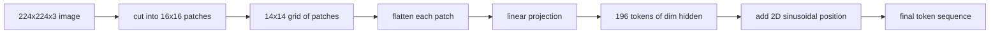

# 视觉编码器补丁

> 一个读取像素的视觉模型需要一个像素级别的分词器。补丁嵌入就是那个分词器。将图像切割成正方形网格，展平每个正方形，通过一个线性层进行投影，然后添加二维位置信号，使 Transformer 知道每个正方形在原始图像中的位置。

**类型：** 构建
**语言：** Python
**前置要求：** 第19阶段 课程30-37（Track B 基础）
**所需时间：** 约90分钟

## 学习目标

- 将图像分词为固定长度的补丁嵌入序列。
- 实现基于 `Conv2d` 的补丁投影，使其与展开后线性投影的数学等价。
- 构建确定性的二维正弦位置嵌入，使 token 顺序编码空间位置。
- 在合成测试数据上验证补丁数量、嵌入形状以及 `Conv2d`/展开的等价性。

## 问题所在

Transformer 接收一个向量序列作为输入。图像是一个三通道网格。将每个像素作为一个 token 读取会使序列长度爆炸：一个 224x224 的 RGB 图像有 150,528 个 token，一个 12 层的 Transformer 在注意力计算中无法承受。将图像作为一个巨大的扁平向量读取会丢弃局部性，而注意力层无法恢复它。编码器前端的任务是将像素网格压缩为几百个 token，每个 token 汇总一个正方形区域。

补丁嵌入通过一个线性投影解决了这个问题。一个 224x224 的图像被切割成 16x16 的补丁，产生一个 14x14 的网格，共 196 个补丁。每个补丁从 `(3, 16, 16) = 768` 个像素值展平为一个向量，然后通过一个线性层映射到模型的隐藏维度。Transformer 看到 196 个维度为 `hidden`（通常为 768）的 token 加上一个 CLS token。这就是网络其余部分可以处理的序列。

## 概念说明



### 为什么使用补丁而不是像素

注意力计算的复杂度与序列长度成二次关系。一个 196 token 的序列在每层每个注意力头需要 `196 * 196 = 38,416` 次注意力分数计算；而一个 150,528 token 的序列需要 `150,528 * 150,528 = 22.6 亿` 次。补丁将注意力计算量降低了 59 万倍，而一个 16x16 的区域携带的信号足以完成高级视觉任务。代价是单个补丁内部丢失了细粒度的空间细节，这就是为什么下游多模态模型在需要精确定位时，通常会运行第二个高分辨率分支。

### 为什么线性投影就够了

每个补丁被视为独立向量。投影学习一组基：边缘检测器、颜色过滤器、简单纹理。单个线性层很小（ViT-Base 的参数量为 `768 * 768 = 589,824`），训练速度快。更深的卷积干网络（"混合" ViT）也存在，但平坦的线性投影是标准方案，大多数现代开源编码器都采用这种确切的形状。

### `Conv2d` 技巧

一个 `Conv2d(in_channels=3, out_channels=hidden, kernel_size=patch_size, stride=patch_size)` 且无填充的卷积，其数值结果与展开后线性投影完全相同，因为每个输出位置都将补丁像素与一个滤波器进行点积。卷积就是补丁投影，大多数生产代码库都采用这种方式，因为它在 GPU 上更快，并且少了一次 reshape 操作。

### 位置嵌入

token 在投影之后不携带任何顺序信息。二维正弦嵌入为每个 token 提供一个固定信号，编码其 `(row, col)` 位置。嵌入维度的一半用于编码行位置，使用多个频率的 sin/cos；另一半编码列位置。编码是确定性的，因此你可以在不重新训练的情况下切换分辨率，并且它能干净地插值到模型在训练时从未见过的网格。

| 组件 | 形状 | 参数量 |
|------|------|--------|
| 补丁投影（`Conv2d`） | `(hidden, 3, patch, patch)` | `3 * P * P * hidden + hidden` |
| 位置嵌入（固定） | `(num_patches, hidden)` | 0（计算得到，非学习） |
| CLS token（学习） | `(1, hidden)` | `hidden` |

对于 224 分辨率的 ViT-Base/16：投影层 590,592 个参数，CLS token 768 个参数，正弦位置嵌入为零。下一课（59）将在此前端之上堆叠一个 12 层的 Transformer。

### 等价性作为健全性检查

补丁步骤有两种写法：`Conv2d` 投影和显式的展开后线性投影。它们必须在相同权重下产生相同的输出。如果不一致，说明展开的数学有问题，编码器的其余部分就建立在沙堆之上。本课的测试验证了这种等价性。

## 开始构建

`code/main.py` 实现了：

- `PatchEmbed`，一个封装 `Conv2d` 进行补丁投影的 `nn.Module`。
- `sinusoidal_2d(grid_h, grid_w, dim)`，一个无状态函数，构建二维位置表。
- `VisionFrontEnd`，将补丁嵌入、CLS 前置和位置相加组合为一次前向传播。
- 一个 `synthesize_image(seed)` 辅助函数，从 `numpy.random` 构建确定性的 224x224x3 测试数据。
- 一个演示，将一张测试图像通过前端，打印输出形状、CLS token 的范数以及位置嵌入的一行。

运行：

```bash
python3 code/main.py
```

输出：224x224 的测试图像被分词为形状 `(1, 197, 768)` 的序列。第一个 token 是 CLS；接下来的 196 个是补丁 token。位置嵌入的范数在一行内是均匀的，这是正弦信号的特征。

## 实际应用

同样的补丁前端出现在每一个现代视觉语言模型中：CLIP ViT-L/14、SigLIP、DINOv2、Qwen-VL 系列和 InternVL 堆栈都以 `Conv2d` 补丁投影加位置信号作为起点。不同系列之间的差异在于下游（CLS 池化 vs 无 CLS 池化、寄存器 token、不同的补丁尺寸 14 vs 16、通过插值位置实现的动态分辨率）。本课的前端是所有这些模型所依赖的基础。

## 测试

`code/test_main.py` 覆盖：

- 补丁数量匹配 `(image_size / patch_size) ** 2`
- 输出形状匹配 `(batch, num_patches + 1, hidden)`
- `Conv2d` 投影在小型测试数据上与手动展开后线性投影的结果相等
- 正弦位置表在多次调用之间是确定性的
- CLS token 在批次维度上广播且无泄漏

运行测试：

```bash
python3 -m unittest code/test_main.py
```

## 练习

1. 将正弦位置替换为可学习的 `nn.Parameter`，并在一个小型合成分类任务上比较第一个 epoch 的损失。可学习位置在固定分辨率下表现更好；正弦位置在训练后更改分辨率时表现更好。

2. 将 `Conv2d` 替换为显式的 `nn.Unfold` 加 `nn.Linear`，并断言输出在浮点容差范围内一致。相同的数学，两种写法。

3. 添加对非正方形补丁尺寸的支持（例如，宽高比输入的 32x16），并验证位置表能处理非正方形网格。

4. 在批次大小 1、8、64 下对补丁步骤进行性能分析。补丁投影很少是瓶颈；下游的注意力层占主导地位。

5. 在一个四类合成形状数据集（圆形、正方形、三角形、星形）上将前端作为冻结的特征提取器进行训练。CLS token 输出应该能线性分离。

## 关键术语

| 术语 | 含义 |
|------|------|
| 补丁 | 图像的一个正方形子区域，通常为 14x14 或 16x16 |
| 补丁嵌入 | 将一个展平的补丁线性投影到隐藏维度 |
| 序列长度 | 补丁分词后的 token 数量，通常加上 CLS |
| 正弦位置 | 编码二维网格坐标的固定 sin/cos 信号 |
| CLS token | 前置到序列中的可学习向量，作为池化头 |

## 延伸阅读

- An Image is Worth 16x16 Words（ViT，2021），了解原始的补丁嵌入框架。
- Attention Is All You Need（2017），了解本文改编为二维的正弦位置公式。
- DINOv2 论文，了解寄存器 token，这是一个可以作为练习 6 添加的扩展。
