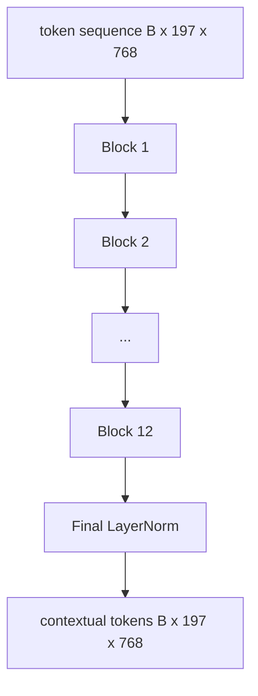
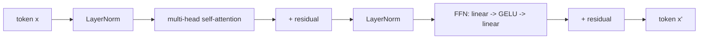

# Vision Transformer 编码器

> 仅有补丁是看不见的。一个 12 层的 pre-LN Transformer，配合 12 个注意力头，将补丁 token 序列转化为上下文化 token 序列，其中 CLS token 在最终隐藏状态中汇聚整幅图像的特征。本课是每个现代视觉语言模型的引擎室。

**类型：** 构建
**语言：** Python
**前置要求：** 第19阶段 课程30-37（Track B 基础）
**所需时间：** 约90分钟

## 学习目标

- 实现一个带有前馈子层的 pre-LN Transformer 块，包含多头自注意力。
- 堆叠 12 个块、12 个头，构成 ViT-Base 编码器。
- 将第 58 课的补丁前端连接到编码器，运行一次前向传播。
- 验证 CLS token 汇聚了来自每个补丁的信息。

## 问题所在

补丁嵌入产生 197 个 token 的序列，每个 token 都是一个对其他补丁没有任何感知的向量。一张猫的图片需要每个补丁知道哪些补丁包含胡须、哪些包含背景、哪些包含眼睛。Transformer 就是构建这种感知的机制，一次一个注意力层。没有它，补丁前端只是一个聪明的分词器，没有任何理解能力。

标准配方是十二层深、十二个头宽，采用 pre-LayerNorm 布局、GELU 激活函数和 4 倍的前馈扩展。这个配方是 CLIP ViT-L、SigLIP、DINOv2、Qwen-VL 系列、InternVL 以及 2025-2026 年所有其他开源视觉编码器的脊梁。这个配方足够稳定，你可以阅读其中任何一篇论文，并假设它们使用这种块形状，除非它们明确说明其他情况。

## 概念说明





### Pre-LN 与 post-LN

原始 Transformer 将 LayerNorm 放在残差之后。Pre-LN（在每个子层之前放置 LayerNorm）是每个现代视觉语言模型使用的版本，因为它无需学习率预热技巧就能稳定训练。区别仅在前向传播中的一行代码，但在 12 层以上的深度下，梯度流动有着天壤之别。

### 多头自注意力

每个头将 token 向量投影到自己的 `(query, key, value)` 三元组，维度为 `head_dim = hidden / num_heads`。当 `hidden = 768` 且 `heads = 12` 时，每个头的 `dim = 64`。12 个头并行执行注意力计算，然后它们的输出拼接回维度 768 并通过输出投影。多头的意义在于，一个头可以学习"关注猫眼"，而另一个头学习"关注背景渐变"，两者互不干扰。

### 为什么使用 4 倍前馈扩展

FFN 的结构是 `hidden -> 4 * hidden -> hidden`，中间使用 GELU。因子 4 是经验性的，自 2017 年以来在语言和视觉 Transformer 中一直适用。更小的（2倍）会欠拟合；更大的（8倍）在固定数据预算下会过拟合。MLP 是模型存储大部分已学习知识的地方，更宽的中间层就是这些知识的存储空间。

| 组件 | ViT-Base 规模下的参数量 |
|------|------------------------|
| 每个块的 qkv 投影 | `3 * 768 * 768 = 1.77M` |
| 每个块的输出投影 | `768 * 768 = 590K` |
| 每个块的 FFN（4倍扩展） | `2 * 768 * 4 * 768 = 4.72M` |
| 每个块的 LayerNorm | `4 * 768 = 3K` |
| 每个块总计 | 约 7.1M |
| 12 个块 | 约 85M |
| 加上前端 | 总计约 86M |

ViT-Base 是一个 86M 参数的编码器。按 2026 年的标准来看这很小（SigLIP-So400M 是 400M，Qwen-VL 的 ViT 是 675M），但架构在宽度和深度之外是相同的。

### 是否使用因果掩码？

Vision Transformer 是仅编码器的、双向的：token `i` 可以关注 token `j`，无论它们的位置关系如何。没有掩码。第 61 课中的解码器侧交叉注意力会使用因果掩码，但在视觉编码器内部，注意力是全连接的。

### CLS token 学到了什么

CLS token 一开始是一个可学习的参数，自身没有补丁内容，通过每一层的跨补丁注意力逐步汇聚信息。到最后一层，CLS 行就是整幅图像的向量摘要；下游头部将这个单一向量投影为分类 logits、对比嵌入或文本解码器的交叉注意力键。

## 开始构建

`code/main.py` 实现了：

- `MultiHeadSelfAttention`，包含 `qkv` 和输出投影、缩放点积注意力数学以及形状断言。
- `FeedForward`，4 倍扩展的 GELU MLP。
- `Block`，一个 pre-LN 块，组合注意力和前馈子层并带有残差。
- `ViT`，12 个块的堆叠，带有最终 LayerNorm。
- `VisionEncoder`，将第 58 课的 `VisionFrontEnd` 连接到 `ViT` 堆栈，并暴露一个 `forward()` 方法，返回上下文化序列和汇聚的 CLS 向量。
- 一个演示，将合成的 224x224 测试图像通过完整编码器，打印输入形状、输出形状、参数量以及每隔一层的 CLS 范数。

运行：

```bash
python3 code/main.py
```

输出：测试图像被编码为 `(1, 197, 768)` 的张量。随着层的组合，CLS 范数向上漂移，然后在最终 LayerNorm 处稳定下来。总参数量报告约为 86M。

## 实际应用

这里定义的编码器，在宽度和深度之外，与 2025-2026 年每个开源 VLM 中使用的块堆栈相同。差异在于：

- **宽度和深度。** ViT-Large 是 `hidden=1024, depth=24, heads=16`；SigLIP So400M 是 `hidden=1152, depth=27, heads=16`。相同的块。
- **池化头。** CLS 池化（本课）vs 平均池化（SigLIP）vs 注意力池化（后续 VLM）。
- **位置处理。** 固定正弦（第 58 课）vs 可学习一维 vs ALiBi vs 2D RoPE。块的数学不变。
- **寄存器 token。** DINOv2 前置 4 个额外的可学习 token。一行代码的事。

这个块堆栈是基础。接下来的课程（60-63）都建立在它之上。

## 测试

`code/test_main.py` 覆盖：

- 单个块保持形状且对输入批次大小不变
- 注意力分数沿键轴求和为一（softmax 健全性检查）
- 残差路径已连接（零输入仍然通过 CLS token 产生非零输出）
- 4 层堆叠的前向传播产生正确的形状
- 梯度从 CLS 输出流向补丁投影

运行测试：

```bash
python3 -m unittest code/test_main.py
```

## 练习

1. 添加寄存器 token（CLS 之后前置 4 个可学习向量）并重新运行。通过最后一层 softmax 分布的熵比较注意力图的平滑度。

2. 将 pre-LN 替换为 post-LN，在一个合成形状分类器上训练一个 epoch。观察哪个在没有学习率预热的情况下能稳定训练。

3. 实现因果掩码作为 `attn_mask` 参数，使同一个块可以复用为解码器块。掩码形状为 `(seq, seq)`，下三角矩阵。

4. 在批次大小 1、8、64 下使用 `torch.profiler` 对前向传播进行性能分析。MLP 层占主导时间，而不是注意力。

5. 将一个注意力头的 q-k-v 投影替换为低秩 LoRA 适配器，冻结其余部分，验证梯度只流向你期望的位置。

## 关键术语

| 术语 | 含义 |
|------|------|
| Pre-LN | 在每个子层之前而非之后应用 LayerNorm |
| 自注意力 | 每个 token 关注同一序列中的所有其他 token |
| 多头 | 隐藏维度被分割到 `H` 个独立的注意力头中 |
| FFN 扩展 | 前馈层先扩展到 `4 * hidden`，再收缩回来 |
| CLS 池化 | 使用第一个 token 的最终隐藏状态作为图像摘要 |

## 延伸阅读

- An Image is Worth 16x16 Words（ViT，2021），了解编码器配方。
- DINOv2（2023），了解寄存器 token 和自监督预训练目标。
- SigLIP（2023），了解平均池化变体和第 62 课使用的 sigmoid 对比损失。
