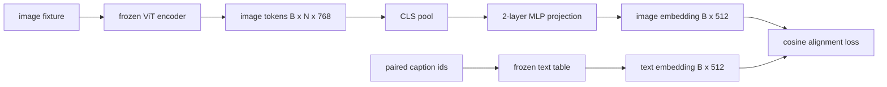

# 用于模态对齐的投影层

> 视觉编码器产生图像 token。文本解码器消费文本 token。两者处于不同的向量空间。一个小型的两层 MLP 将图像 token 投影到文本嵌入空间，通过与配对标题的余弦对齐损失将两个空间拉向一致。这个投影是视觉语言模型中最小的部分，也是对迁移最重要的部分。

**类型：** 构建
**语言：** Python
**前置要求：** 第19阶段 课程30-37（Track B 基础）
**所需时间：** 约90分钟

## 学习目标

- 构建一个两层 MLP 投影，将图像特征映射到文本嵌入空间。
- 构建一个模拟文本嵌入表（无预训练分词器，无真实语料库）。
- 计算投影后的图像 token 与配对标题嵌入之间的余弦对齐损失。
- 在冻结视觉编码器和冻结文本表的情况下，单独训练投影层。

## 问题所在

你有一个视觉编码器（课程 58-59），产生维度为 `vision_hidden = 768` 的 token。你想在上面连接一个文本解码器，其嵌入维度为 `text_hidden = 512`（任何其他数字同样合理）。解码器期望文本形状的 token。图像 token 不是文本形状的：它们存在于编码器在纯视觉预训练期间学习的基中，与解码器的词向量没有任何关系。

两层 MLP 投影（线性、GELU、线性）弥合了这个差距。它足够小（约 `768 * 1024 + 1024 * 512 = 1.3M` 参数），可以在单 GPU 上几分钟内训练完成，并且它是对齐阶段唯一需要学习的部分。视觉编码器保持冻结。文本嵌入表保持冻结。只有投影在移动。这是 LLaVA 在 2023 年发布的配方，BLIP-2 将其重新定义为 Q-Former，此后每个开源 VLM 都以某种形式采用了它。

## 概念说明



### 投影前的池化

视觉编码器输出 197 个 token。文本端有一个标题级别的嵌入。为了对齐它们，你需要每个样本一个图像级别的向量。CLS 池化是最简单的：取编码器的第一个 token 并投影它。对所有 197 个 token 进行平均池化是另一种选择，SigLIP 就采用了这种方式。两种方式都将 197 个向量汇聚为一个。

### 为什么是两层而不是一层

单个线性投影可以旋转和缩放，但如果两个空间存在曲率不匹配，它无法修复基的问题。两个线性层之间的 GELU 给投影提供了一次非线性弯曲，经验证明这足以将 CLIP 风格的特征与语言模型嵌入对齐。更深层的投影（LLaVA-NeXT 使用了 GLU；Qwen-VL 使用了注意力层堆栈）是扩展；两层 MLP 是经典基线，也是 BLIP-2 的 Q-Former 投影头在底层实际使用的结构。

| 层 | 形状 | 参数量 |
|----|------|--------|
| fc1 | `(vision_hidden, projection_hidden)` | `768 * 1024 + 1024` |
| 激活 | GELU | 0 |
| fc2 | `(projection_hidden, text_hidden)` | `1024 * 512 + 512` |

对于 `768 -> 1024 -> 512` 的头部，约 1.3M 参数。

### 余弦对齐损失

对齐不意味着 `image_emb == text_emb`。对齐意味着 `image_emb` 在联合空间中与 `text_emb` 指向相同方向。余弦损失是 `1 - cos_sim(image, text)`，范围从 0（完美对齐）到 2（相反方向）。训练将每对的损失推向零。第 62 课将其推广为对比批次（InfoNCE），其中每张图像必须比批次中的任何其他标题更接近自己的标题；本课使用逐对版本，以便动态过程可见。

### 冻结编码器是关键技巧

视觉编码器有 86M 参数。文本表还有几百万。从模拟语料库训练所有这些参数是不现实的。冻结两者意味着投影的 1.3M 参数是唯一变化的部分，在合成配对上几百步就足以将损失降下来。这正是每个基于适配器的 VLM 的运行模式：重型部分保持冻结，轻量级桥梁进行训练。

## 开始构建

`code/main.py` 实现了：

- `MLPProjector(in_dim, hidden_dim, out_dim)`，两层线性 MLP，带有 GELU 激活。
- `MockTextEmbedding(vocab_size, dim)`，一个冻结的嵌入表，从种子进行确定性初始化。
- `make_pair(seed, vocab_size)`，合成一个配对的（图像，标题）样本。标题是短 ID 序列；标题嵌入是对 token 嵌入的平均池化。
- `cosine_alignment_loss(image_emb, text_emb)`，逐对的 `1 - cos_sim` 目标。
- 一个训练循环，在 32 个合成配对（循环使用）上运行投影 200 步，视觉编码器和文本表保持冻结，每 25 步打印一次损失。

运行：

```bash
python3 code/main.py
```

输出：训练报告显示损失从初始约 1.07 在 200 步内下降到约 0.80，证明仅靠投影就能将图像 token 拉向文本空间。每对的最终余弦相似度也会打印出来。

## 实际应用

同样的模式出现在每个开源 VLM 中：

- **LLaVA 1.5。** 两层 GELU MLP 投影，从 CLIP-ViT-L 隐藏维度到 LLaMA 嵌入维度。冻结视觉编码器，冻结 LLM，仅训练投影（然后在第二阶段解冻 LLM）。
- **BLIP-2。** Q-Former 通过交叉注意力将 32 个可学习查询 token 与图像 token 进行交互，然后投影到 LLM 嵌入维度。Q-Former 最末端的投影头就是本课 MLP 的类似物。
- **MiniGPT-4。** 从 BLIP-2 Q-Former 输出到 Vicuna 嵌入维度的单线性投影。
- **Qwen-VL。** 带有若干层的交叉注意力适配器，但最终部分同样是到 LM 嵌入维度的投影。

形状各异，但角色相同：汇聚图像 token，投影到文本嵌入维度，单独训练。

## 测试

`code/test_main.py` 覆盖：

- 投影器输出形状匹配配置的 `out_dim`
- 冻结的文本嵌入表的 `requires_grad` 参数为零
- 余弦损失在相同向量上为 0，在反平行向量上为 2
- 一次反向传播后投影器梯度正常流动
- 训练循环在第 0 步和第 200 步之间降低了损失

运行测试：

```bash
python3 -m unittest code/test_main.py
```

## 练习

1. 将 CLS 池化替换为对 196 个补丁 token 的平均池化，比较 200 步后的最终损失。平均池化在合成数据上通常训练更快；CLS 在自然图像上更高效。

2. 在余弦损失中添加一个可学习的标量温度（`cos / tau`），观察当 `tau` 太小（梯度噪声）或太大（损失高位平台）时会发生什么。

3. 将两层 MLP 替换为单线性层，量化损失差距。非线性在自然图像特征上更重要，在合成数据上影响较小。

4. 在投影器权重上添加一个小的 L2 惩罚，观察它与余弦对齐的交互（余弦是尺度不变的，因此惩罚主要收缩未使用的方向）。

5. 持久化投影器权重，然后重新加载并在没有视觉编码器反向传播的情况下运行推理，验证部署时只需要投影器。

## 关键术语

| 术语 | 含义 |
|------|------|
| 模态对齐 | 使图像和文本嵌入在一个共享空间中可比较的行为 |
| 投影头 | 将一个空间映射到另一个空间的小型模块，通常是 2 层 MLP |
| 余弦相似度 | 点积除以 L2 范数的乘积 |
| 冻结编码器 | 视觉（或文本）模型的所有参数都设置为 `requires_grad=False` |
| 模拟语料库 | 用于训练的合成配对，避免数据集下载依赖 |

## 延伸阅读

- LLaVA 论文，了解两阶段训练（投影，然后解冻 LM）。
- BLIP-2 论文，了解 Q-Former 作为可学习投影替代方案。
- Qwen-VL 技术报告，了解交叉注意力适配器作为更深层投影头。
