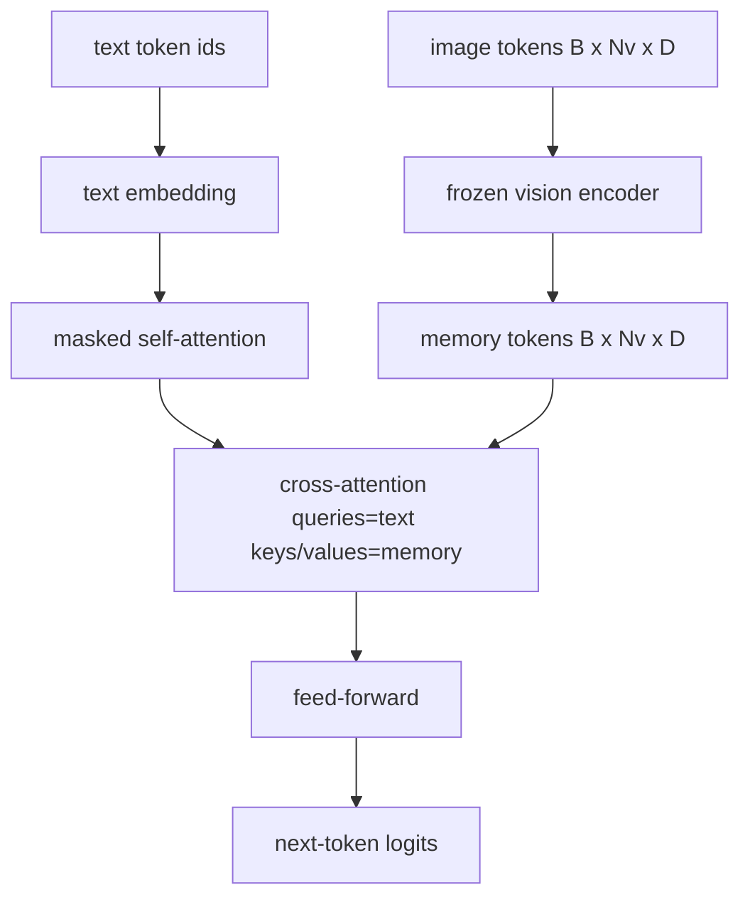
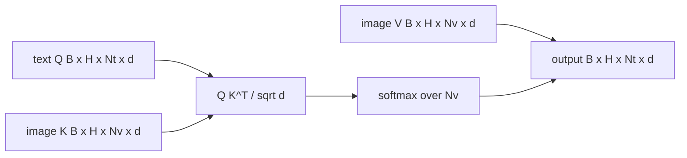

# 交叉注意力融合

> 投影层将一个图像向量与一个标题向量对齐。一个真正的视觉语言解码器需要每个文本 token 关注每个补丁 token，这样模型才能将每个词根植到一个区域。交叉注意力就是实现这种根植的方式。文本查询；视觉的键和值应答。本课构建交叉注意力块、因果文本自注意力，以及使两者都合法的掩码形状。

**类型：** 构建
**语言：** Python
**前置要求：** 第19阶段 课程30-37（Track B 基础）
**所需时间：** 约90分钟

## 学习目标

- 实现多头交叉注意力，其中查询流是文本，键/值流是视觉。
- 组合一个解码器块：因果自注意力 + 交叉注意力 + 前馈。
- 正确设置掩码形状：自注意力使用因果掩码，交叉注意力不使用掩码。
- 使用批量文本 token 和固定图像 token 池运行一次前向传播。

## 问题所在

将图像 token 和文本 token 拼接成一个序列是一种融合选项（早期融合，Chameleon 和 Emu3 采用的路径）。交叉注意力是另一种（后期融合，Flamingo 引入的路径，此后每个 Flamingo 风格的解码器都在复制）。在后期融合中，文本解码器仅在文本 token 上运行，并在每一层通过交叉注意力访问图像流。

后期融合有两个优势。首先，文本流保持干净，模型保留纯文本能力。其次，图像流每张图像只计算一次，并在每个解码步骤中复用，因此即使对于长标题，生成也很廉价。代价是每个块多一个注意力子层。

## 概念说明





### 掩码形状

解码器块内的两种注意力需要不同的掩码：

| 注意力 | 查询长度 | 键长度 | 掩码 | 原因 |
|--------|----------|--------|------|------|
| 自注意力 | `Nt`（文本） | `Nt`（文本） | 因果：下三角 `(Nt, Nt)` | 自回归期间文本 token 不能看到未来 |
| 交叉注意力 | `Nt`（文本） | `Nv`（视觉） | 无掩码 | 整幅图像对每个文本位置都可见 |

本课包含一个形状验证函数，以确保混淆两者时会抛出 `ValueError`，而不是静默地产生损坏的损失曲线。

### 为什么交叉注意力不需要掩码

图像在任何文本生成之前就已经被完全观测。标题的 token `t` 可以关注图像的任何补丁；图像补丁没有时间顺序。一些 Flamingo 变体在交错多个图像和文本段时添加了按样本的掩码模式，但对于单张图像加一个标题，交叉注意力能看到所有内容。

### 键/值缓存

图像的键和值在解码开始时计算一次并保存在缓存中。每个新的文本 token 使用缓存而无需重新计算。这就是标题生成在推理时高效的原因：重型 ViT 只运行一次；交叉注意力在每个步骤复用其键和值。本课暴露了缓存并测试了缓存命中路径。

### 块组合

解码器块的运行流程：pre-LN -> 自注意力 -> 残差 -> pre-LN -> 交叉注意力 -> 残差 -> pre-LN -> 前馈 -> 残差。三个子层，每个有自己的 LayerNorm。Flamingo 论文在交叉注意力上添加了一个可学习门控，使模型在训练时稳定性代价下可以选择退出图像路径；经典基线（本文采用的）没有门控。

```python
class DecoderBlock:
  def forward(self, text_tokens, image_tokens, text_mask, cross_mask):
      text_tokens = text_tokens + self.self_attn(self.ln1(text_tokens),
                                                 mask=text_mask)
      text_tokens = text_tokens + self.cross_attn(self.ln2(text_tokens),
                                                  image_tokens,
                                                  mask=cross_mask)
      text_tokens = text_tokens + self.ffn(self.ln3(text_tokens))
      return text_tokens
```

## 开始构建

`code/main.py` 实现了：

- `CrossAttention(hidden, heads)`，多头交叉注意力，带有独立的 `q` 和 `kv` 投影。
- `CausalSelfAttention(hidden, heads)`，标准解码器中的掩码自注意力。
- `DecoderBlock`，使用 pre-LN 残差组合三个子层。
- `VisionLanguageDecoder`，四层解码器，由模拟视觉编码器输出和小型文本嵌入表驱动。
- `causal_mask(length)`，返回一个 `(length, length)` 的下三角布尔张量。
- 一个演示，输入两个长度为 10 的文本序列批次和长度为 197 的图像记忆，打印输出形状、自注意力掩码形状以及每个位置的交叉注意力输出范数。

运行：

```bash
python3 code/main.py
```

输出：解码器产生一个 `(2, 10, text_vocab)` 的 logits 张量。掩码形状为 `(10, 10)`。KV 缓存复用检查确认缓存路径和非缓存路径的 logits 一致。

## 实际应用

交叉注意力出现在两个生产级系列中：

- **Flamingo 和 IDEFICS。** 每 K 个语言模型块插入一个交叉注意力子层，使用冻结的 LM。视觉语言适配器就是交叉注意力块加上其门控。
- **BLIP-2。** Q-Former 使用来自固定 32 个查询 token 集合的交叉注意力，与图像特征交互，然后将查询投影到 LM 嵌入空间。

本课的块形状直接映射到两者。掩码规则（自注意力用因果掩码，交叉注意力不用）是相同的。

## 测试

`code/test_main.py` 覆盖：

- 因果掩码是下三角的，且匹配预期的布尔形状
- 交叉注意力输出形状为 `(B, Nt, hidden)`，与键长度无关
- KV 缓存路径与非缓存路径在浮点容差范围内一致
- 文本和视觉流之间的形状不匹配会抛出明确的 `ValueError`
- 完整的解码器前向传播产生正确的批次和序列形状

运行测试：

```bash
python3 -m unittest code/test_main.py
```

## 练习

1. 在交叉注意力残差上添加一个可学习的 tanh 门控（Flamingo 技巧），验证训练从接近零的初始门控值开始收敛。门控初始为 0；模型在混合图像流之前恢复纯文本行为。

2. 实现交错注意力，使同一个解码器处理多张图像和多个文本段。构建按样本的交叉注意力掩码，防止文本段 2 关注图像 1。

3. 在 `Nt=64, Nv=576`（更高分辨率的 24x24 网格）下对交叉注意力和自注意力层进行性能分析。交叉注意力的成本是 `Nt * Nv`，在高图像分辨率下占主导地位。

4. 在交叉注意力图上添加查询侧的 dropout，测量演示中标题的多样性（交叉图中的 dropout 增加会使标题样本方差增大）。

5. 将交叉注意力层替换为 Q-Former 风格的注意力块，其中固定的 32 token 查询池在每层只关注图像特征一次。

## 关键术语

| 术语 | 含义 |
|------|------|
| 后期融合 | 文本和视觉保持独立流；交叉注意力在每个块处桥接它们 |
| 交叉注意力 | Q 来自一个流，K 和 V 来自另一个流 |
| 因果掩码 | 下三角布尔掩码，防止自回归时看到未来 |
| KV 缓存 | 图像键和值存储一次，在每个解码步骤中复用 |
| 记忆 token | 解码器访问的冻结图像 token |

## 延伸阅读

- Flamingo（2022），了解带门控交叉注意力的经典后期融合设计。
- BLIP-2（2023），了解 Q-Former，它是一个伪装成可学习查询池的交叉注意力块。
- IDEFICS（2023），了解 Flamingo 配方的开源复现。
